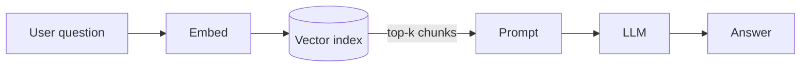

# Fast Reading Companion — pattern recipe

This is a **recipe** Claude can follow whenever the user asks for a "fast reading companion", "reading brief", "jargon card", or any phrasing meaning *"help me read this notebook faster as a beginner."*

**Trigger phrases** (any of these means: build this pattern):
- *"Make a Fast Reading Companion for `<notebook>`."*
- *"Build a Jargon Card + Reading Brief for this notebook."*
- *"Do the same thing as the CV/CNN one for `<notebook>`."*
- *"This notebook is too long — make me a pre-read."*

**Reference implementation** (the gold-standard example):
- `5.ML Coding (CV)/1.Intro to CV and CNN Fundamentals/CV_CNN_Jargon_Card.md`
- `5.ML Coding (CV)/1.Intro to CV and CNN Fundamentals/CV_CNN_Reading_Brief.md`

When in doubt about format or tone, **read those two files** before writing new ones.

**Required companion read:** [`architect-context.md`](./architect-context.md). That file defines the
**Staff / Principal Systems Architect lens** — system design, performance and bottlenecks, low-level
runtime mechanics, architectural trade-offs, and interview-evaluation framing. Every Reading Brief
must end with a section written through that lens (see *The four-rung ladder* below). Read
`architect-context.md` **before** writing the 🏛️ Staff-engineer lens section, every time — it is the
source of truth for what "staff-level" means in this repo, and it carries running context from prior
deep dives (React Fiber internals, hybrid retrieval, virtualisation layers) that your lens section
should connect to wherever the topic genuinely overlaps.

---

## The four-rung ladder — beginner to staff engineer

The pack's job is no longer just "get me through this notebook faster." It is to walk one reader up
**four rungs** in a single sitting. Every pack must land all four, in this order, and each rung must
be *visibly* present as its own surface in the files:

| Rung | You can… | Where it lives | Voice |
|---|---|---|---|
| **1. Name it** | recognise the word and not stall on it | 📚 Jargon Card | dictionary |
| **2. Explain it** | say what it does, why it exists, and give an example | 📖 Brief §§ big idea + primers | teacher |
| **3. Use it** | run it, modify it, predict what breaks | 📖 Brief §§ formulas + reading map + gotchas | practitioner |
| **4. Judge it** | reason about trade-offs, failure modes, cost and latency budgets, and defend the choice under interview pressure | 📖 Brief § 🏛️ Staff-engineer lens | architect |

**Why the fourth rung is new and non-negotiable.** Rungs 1–3 make you *competent with this notebook*.
They do not make you able to answer "would you actually ship this, and what breaks at 1000× the
data?" — which is the question that separates a mid-level engineer from a staff engineer, and the
question every senior interview loop is really asking. A pack that stops at rung 3 has taught a tool
and skipped the judgement.

**The tension to manage honestly.** `architect-context.md` instructs the reader to *"completely
bypass entry-level syntax, baseline definitions, setup tutorials."* This file instructs the
opposite: the repo owner is a beginner (per `MEMORY.md`) and definitions must be guided and full.
**Both are right, for different rungs.** Resolve it by *sequencing*, never by blending:

- Rungs 1–3 are beginner-first. Plain English, nothing assumed, every term defined on first use.
- Rung 4 is architect-voice and is **clearly fenced off** in its own section, after the beginner
  material has done its work. Inside that fence you may assume everything rungs 1–3 just taught —
  and only that.
- ❌ Never sprinkle staff-level jargon through the primers to "raise the level." That produces a
  document that serves neither reader. The ladder is *sequential*, not *mixed*.

---

## What this pattern is

A **two-file pack** that lives in the same folder as the notebook, designed to be read **before** the notebook so the actual notebook read becomes much faster.

The user is an **ML beginner** (per `MEMORY.md`). Their biggest cost is hitting unknown AI/CV jargon mid-notebook and breaking flow to Google it. This pattern **front-loads** every term and the big-picture lesson so by the time they open the notebook, nothing is new.

This pattern is **NOT the same as a deep-dive guide** (per `CLAUDE.md`'s "Per-notebook deep-dive pattern"). A deep-dive is comprehensive (full Concept Definition Template per concept, cell-by-cell walkthrough, ≥10 Q&A items). The Fast Reading Companion is **tight, pre-read, beginner-onboarding-only**. Don't conflate them.

| | Deep-dive guide | Fast Reading Companion |
|---|---|---|
| File count | 1 | 2 |
| Length | ~5,000-10,000 words | ~4,000-6,000 words total |
| Read time | 60-120 min | 25-35 min |
| When read | After notebook (for revision) | Before notebook (for prep) |
| Concept format | Full Concept Definition Template | Condensed primer (mental model + plain English + **worked example**) |
| Code coverage | Cell-by-cell | None — code lives in the notebook |
| Visuals | optional | **≥1 mermaid diagram required** |
| Ladder reached | rung 3 (use it) | **rung 4 (judge it)** |
| Q&A | ≥10 items, ≥5 sourced | 5-question self-check + 3 staff-level, original |

---

## The two files

### File A — `<Topic>_Jargon_Card.md`

**Role:** Alphabetical jargon dictionary. Skimmed once (~5 min), then kept open as a side reference while reading the notebook.

**Structure:**
```
<a id="top"></a>
# <Topic> Jargon Card

> [intro: how to use this file, link to the Reading Brief]

## A
**Term** — 2-4 sentence plain-English definition. Why it matters in this notebook.

## B
...

[🔝 Back to top](#top)
```

**Entry rules:**
- Bold term + 2-4 sentence definition.
- **Plain English first**, formal term / Greek / acronym expansion second.
- **All acronyms expanded** on first use (CNN → Convolutional Neural Network).
- **Every entry is anchored to something concrete.** No entry may be pure abstraction. Anchor it with
  one of: a real number from this notebook, the exact call signature, or a one-clause example. This is
  the Jargon Card's version of the example rule below. *Good:* "**IDF** — how rare a term is corpus-wide.
  `INC-2847` appears in 1 of 20 documents here, so its weight dominates the BM25 score (4.501 vs 1.553
  for the runner-up)." *Bad:* "**IDF** — a weighting scheme based on term frequency."
- **Disambiguate famous twins** when the term has one (max pool vs avg pool, sigmoid vs softmax, kernel vs filter — actually same thing, say so).
- **No formulas or code blocks.** Those live in the Brief. A bare call signature inline is fine.
- Alphabetical, grouped by first letter under `##` headers.

**Coverage rule:** Every AI/ML/domain term the notebook uses must have an entry. After writing, scan the notebook's markdown cells one more time — if you find a term that's not in the card, add it.

**Length target:** 1,500-2,000 words (~30-50 entries, depending on notebook size).

### File B — `<Topic>_Reading_Brief.md`

**Role:** The pre-read brief. User reads it **once, top-to-bottom, before opening the notebook**. After this they know the punchline, the agenda, and every concept at the "I get what it does" level.

**Required sections, in this exact order:**

1. **🎯 30-second TL;DR** — the punchline. The single most important number or insight the notebook proves. Quote the notebook's own conclusion language where possible.

2. **🗺️ Agenda — what the notebook teaches, in order** — numbered list of ~8-12 items mirroring the notebook's section flow. This is the "table of contents" the user gets BEFORE entering the notebook.

3. **🧠 The big idea** — the core insight in plain English with **one transferable analogy**. Pick one analogy; don't mix two. The analogy should survive interview pressure.

4. **🖼️ The picture — one diagram that holds the whole notebook** — *(REQUIRED, see "Visual explainers" below)*. A mermaid diagram showing the actual mechanism: the data path, the state machine, or the loop. Immediately under it, a 2-4 sentence caption reading the diagram aloud in plain English — never leave a diagram to speak for itself.

5. **📖 Core concept primers** — 4-7 entries covering the heart of the notebook. Each primer = mental model + plain-English what + **a worked example with real numbers from the notebook** + "why it matters in this notebook." These are **condensed** — NOT the full Concept Definition Template from CLAUDE.md. Aim for ~250-350 words per primer. Every primer obeys the example rule below.

6. **🔥 The headline experiment / takeaway — at a glance** — a small comparison table or summary block highlighting the notebook's main result. Use **real numbers from the notebook**, not hypothetical ones. If the notebook's prose contradicts its own recorded output, say so here and trust the output.

7. **🧮 Formulas to memorise** — only the 2-4 most load-bearing ones. Each formula gets:
   - The formula itself, in a code fence.
   - **A word-by-word translation** ("output side = input side + twice padding − filter size, divided by stride, plus one").
   - One worked numeric example.
   - *If the notebook genuinely has no mathematics*, retitle this **🧮 Shapes to memorise** and use the 2-4 load-bearing **code shapes** instead, with the same word-by-word translation and worked example. Say plainly that the notebook has no maths — never invent a formula to fill the slot.

8. **🗺️ Notebook reading map** — cell-range table telling the user where to skim/focus/skip. Columns: `Cells | What it teaches | How to read`.

9. **⚠️ Gotchas** — numbered list of notebook-specific traps, each leading with the trap in bold. Include **every place the notebook's narration disagrees with its own output** — those are the highest-value items in the whole pack, and smoothing them over is a correctness failure.

10. **🏛️ Staff-engineer lens** — *(REQUIRED, rung 4, see below)*. Written in the voice and priorities of [`architect-context.md`](./architect-context.md), which you must re-read before writing this section. Five fixed sub-headings, in this order:
    - **Where this breaks at scale** — what fails when the data, traffic, or corpus grows 100-1000×. Name the specific resource that runs out first.
    - **Latency & cost budget** — real numbers. What each stage costs in milliseconds and in dollars/tokens, and which stage dominates. Use the notebook's measured numbers where it has any; clearly label any estimate as an estimate.
    - **The trade-off you're actually making** — state it as a sentence of the form "you are buying X by paying Y." Name the alternative design and what it would buy instead.
    - **Failure modes to forecast** — the 2-4 ways this fails *silently* in production. Silent failures rank above loud ones: a crash is a ticket, a confidently wrong answer is an incident.
    - **Why an interviewer asks this** — per `architect-context.md`'s interview-evaluation framing: what technical maturity is this question a litmus test for, and what does a weak answer reveal?
    
    **Length: 400-600 words.** This section may assume everything rungs 1-3 just taught, and nothing more. It may *not* introduce a new undefined acronym — if rung 4 needs a term rungs 1-3 didn't cover, add it to the Jargon Card.

11. **✅ Walk-away checklist** — 5-7 checkboxes of "after the notebook, you should be able to say in your own words...". At least **two** must be rung-4 statements (trade-offs, failure modes, scale).

12. **🎯 Self-check** — **5 beginner questions + 3 staff-level questions.** The beginner five mix conceptual (2) + formula/shape-based (2) + synthesis (1), all answerable using only the Brief. The staff three are design-judgement questions of the form "you are asked to run this at N×, what breaks and what do you change?" — answerable from the 🏛️ section. **All answers in a `<details>` collapsible at the bottom** so they're not visible by accident.

**Length target:** 3,000-4,000 words (~22-28 min read at beginner technical pace, ~150-170 wpm). **Hard ceiling 4,500** — beyond that, cut primers before you cut the 🏛️ section.

---

## Visual explainers — the "add a GIF" rule

**Intent:** a beginner should be able to *see* the mechanism, not only read about it. A loop, a data
path, or a state machine is understood 10× faster as a picture than as a paragraph.

**Every Reading Brief must carry at least one diagram** (§4, 🖼️ The picture), and any primer
describing a multi-step process should carry one too.

### Preference order — use the first one that fits

**1. Mermaid diagram — the default, and what "GIF" should almost always become here.**

Mermaid is plain text inside a ```` ```mermaid ```` fence. It renders natively on GitHub, in Colab
markdown previews, and in published Artifacts. Being text, it **diffs, reviews, and edits like
code** — an actual `.gif` is an opaque binary blob that rots the moment the notebook changes.



Pick the diagram type by what you are explaining:
- `flowchart` — a data path or pipeline (most common).
- `sequenceDiagram` — who calls whom, in what order, over time. Best for agent loops and tool calls.
- `stateDiagram-v2` — a thing that moves between named states (retry loops, task lifecycles).
- `graph` with labelled edges — a knowledge graph or a dependency structure.

**2. ASCII frame-by-frame — the honest substitute for an animation.**

When the thing you want to show is genuinely *motion* — a pointer walking a list, a buffer filling,
a loop converging — a GIF's real content is "the same picture N times with one thing changed." Write
that as labelled frames in a code fence. It carries the identical information, reads in any viewer,
and costs nothing:

```
frame 1   evidence = {}                      q1 (vector) runs
frame 2   evidence = {projects: [G, S]}      q2 (graph) runs, reads projects
frame 3   evidence = {projects: […],         q3 (graph) filters to engineering
                      managers: [Elena]}
```

**3. A real image file — allowed, never generated by Claude.**

Claude cannot author binary `.gif`/`.png` content, so **Claude must never claim to have added one.**
If the user supplies an animation or screenshot, the convention is:

- Put it in a sibling `images/` folder next to the notebook: `<lecture folder>/images/<name>.gif`.
- Link it relatively: ``.
- **Never base64-inline it** — `CLAUDE.md` bans this, and it is what pushes notebooks past GitHub's
  1 MB render limit.
- Always pair it with a text caption that survives the image failing to load.

If a concept would genuinely be clearer as a supplied animation than as mermaid, leave a marked
placeholder so the user knows exactly what to drop in, rather than silently omitting it:

```markdown
> 🎞️ **Animation slot:** a 5-second loop of the evidence buffer filling across the three
> subquestions would land this faster than the frames above.
> Drop it at `./images/evidence-buffer.gif` and replace this block.
```

### Diagram style guards

- **Caption every diagram.** 2-4 sentences reading it aloud in plain English, directly underneath.
  An uncaptioned diagram is decoration.
- **Show the real mechanism, not a generic box-and-arrow.** Label edges with what actually flows
  (`top-k chunks`, `tool_calls`, `429 retry`), and put the notebook's real names in the nodes.
- **One diagram, one idea.** If it needs a legend to be readable, split it.
- **8-12 nodes maximum.** Past that, nobody reads it.
- Keep node labels short enough to survive a phone screen.

---

## The example rule — no claim without a concrete instance

**Every explanatory claim in either file must be immediately followed by a concrete instance.** This
is the single highest-leverage rule in this document: abstraction is what makes beginners re-search a
term elsewhere, and a worked instance is what stops them.

An acceptable instance is one of:
- **a real number from this notebook** (best — "0.503 vs 0.466, almost a coin flip");
- **a 1-4 line code snippet** with the actual call and its actual arguments;
- **a named, specific scenario** ("a user pastes an order ID and gets the wrong postmortem").

Not acceptable: "used in many ML applications", "this can be useful for various tasks", "consider a
large corpus". If you cannot produce an instance, you do not yet understand the claim well enough to
write it down.

**The shape to follow — claim, then instance, then consequence:**

> **Claim.** BM25 weights rare terms heavily via IDF.
> **Instance.** `INC-2847` appears in exactly 1 of the 20 documents, so BM25 scores the right
> postmortem **4.501** while the next two sit at **1.553**.
> **Consequence.** Exact identifiers are the query type dense retrieval reliably loses.

**Where the rule binds hardest:**

| Surface | What the instance must be |
|---|---|
| 📖 primer | real numbers from *this* notebook, in the primer body |
| 🧮 formula/shape | one fully worked numeric substitution, not just the symbols |
| ⚠️ gotcha | the exact cell, the exact message, or the exact wrong output |
| 🏛️ staff lens | a measured latency/cost figure, or a labelled estimate |
| 📚 jargon entry | one number, one signature, or one clause of example |

**Verification pass:** before declaring the pack done, grep your own draft for the weasel phrases
`can be used`, `is useful for`, `various`, `many applications`, `in general`. Each hit is a missing
example.

---

## Workflow — how to build the pack

### Step 1: Extract notebook text (don't read the .ipynb directly)

Notebooks contain base64 images that burn context. Always extract text first:

```python
import json
path = "<path-to-notebook>.ipynb"
with open(path) as f: nb = json.load(f)
for i, cell in enumerate(nb['cells']):
    src = ''.join(cell.get('source', []))
    print(f"--- Cell {i} ({cell['cell_type']}) ---")
    print(src[:2000])
```

Run via Bash. Optionally save to a `.txt` file for repeated reference.

### Step 2: Scope the notebook

Either yourself (if small) or by dispatching an `Explore` agent (if large), produce:
- **Agenda** — ordered list of topics taught.
- **Headline concepts** — every distinct concept introduced.
- **Code experiments** — what's actually demoed.
- **Jargon list** — every term a beginner would need to look up.
- **Approximate length** — word count, cell count.
- **Headline takeaway** — the ONE big lesson. Quote the notebook's conclusion text if it has one.

### Step 3: Verify numeric facts

If the notebook quotes accuracies, parameter counts, or specific architecture details, **extract them and verify**. Don't trust agent summaries on numbers — re-grep the cells. The reference implementation got bitten by mixing a hypothetical 921,600 number (1280×720 example) with the actual experiment numbers (128×128 input) — they're different scenarios. Be precise about which number applies where.

### Step 4: Write File A (Jargon Card)

- One pass for the structure, then one pass to fill entries.
- Cross-check against the jargon list from Step 2 — every term must have an entry.
- Tone: plain English first. The user is a beginner.

### Step 5: Write File B (Reading Brief)

- Follow the required section order exactly — all **12** sections.
- For each concept primer, include a **worked example** with real numbers from the notebook (see
  *The example rule*).
- Draw the §4 mermaid diagram **from the notebook's actual data path**, not from a generic template
  for the topic. Caption it.
- For the reading map, scan the notebook's section breaks to pick the cell ranges.
- For the self-check, make sure every beginner question is answerable using only the Brief — if a
  question requires the notebook, either fix the question or add to the Brief.

### Step 5b: Write the 🏛️ Staff-engineer lens (rung 4)

Do this as a **separate pass, after the beginner material is finished** — mixing the two voices while
drafting is what produces mush.

1. **Re-read [`architect-context.md`](./architect-context.md).** Every time. It defines the persona,
   the four analytic priorities, and the interview-evaluation framing, and it carries running context
   from prior deep dives you should connect to when the topic genuinely overlaps.
2. Fill the five fixed sub-headings in order: scale / latency-and-cost / trade-off / failure modes /
   why-an-interviewer-asks.
3. **Ground it in measured numbers wherever the notebook has any** (rerank latency, token counts,
   model sizes, row counts). Where you must estimate, say "estimate" in the sentence.
4. **Forecast silent failures over loud ones.** A crash is a ticket; a confidently wrong answer is an
   incident. Rank accordingly.
5. Re-read it asking: *would a staff engineer find this obvious, or useful?* If every line is
   obvious, you have written a summary, not a lens. Push into the specific resource that runs out
   first, the specific number that blows the budget, the specific design you'd choose instead.

### Step 6: Verify

Run these checks before declaring done:

```bash
wc -w <Topic>_Jargon_Card.md <Topic>_Reading_Brief.md
```

- File A: 1,000-2,000 words (broader vocab notebooks → upper end).
- File B: 3,000-4,000 words. **Hard ceiling 4,500** — past that, cut primers, never the 🏛️ section.
- **Jargon coverage check:** scan the notebook's markdown cells; every AI term must be in File A.
- **Self-contained check:** read File B cold (without the notebook). Every primer should be at least "I get what it does" level.
- **Self-check answerable:** the 5 beginner questions must be solvable using only the Brief; the 3 staff questions from the 🏛️ section.
- **Example-rule grep:** search the draft for `can be used`, `is useful for`, `various`, `many applications`, `in general`. Every hit is a missing example — fix or delete.
- **Diagram check:** ≥1 mermaid block, every diagram captioned, no base64, no claimed-but-absent GIF.
- **Ratio check — measured in reading time, not raw words.** The pack must be the *faster* read.
  Compute the notebook's burden as **prose words + (code words × 2.5)** — unfamiliar code reads at
  roughly 2.5× the cost of prose for a beginner — and require the combined pack to be **≤ 60% of that
  burden**. Raw `wc -w` on a `.ipynb` badly understates a code-dense notebook and will push you to
  cut explanation that is genuinely earning its place.

  ```python
  # rough burden estimate; run from the repo root
  import json
  nb = json.load(open(path))
  prose = sum(len(''.join(c['source']).split()) for c in nb['cells'] if c['cell_type']=='markdown')
  code  = sum(len(''.join(c['source']).split()) for c in nb['cells'] if c['cell_type']=='code')
  burden = prose + code * 2.5
  ```

  **If a small, code-dense notebook makes 60% impossible without dropping a required section: keep
  the sections, and say so in the handoff.** The section list is the floor; the ratio is a guide.

---

## Style guards (apply to both files)

Per `MEMORY.md` (`feedback_beginner_definitions.md`) and `CLAUDE.md` (the project standard for beginner-friendly explanation):

- **Plain English first, formal term second.** First use of any term: plain meaning, then bold formal name.
- **All acronyms expanded on first use.** CNN → Convolutional Neural Network. MLP → Multi-Layer Perceptron. RGB → Red, Green, Blue. Etc.
- **One analogy per concept.** Pick one; commit. Mixing two confuses more than it clarifies.
- **All formulas get a word-by-word translation.** Example: `o = (n+2p-f)/s + 1` is followed by "output side length equals input side plus twice padding minus filter size, divided by stride, plus one."
- **"Where it's used" must reference THIS notebook concretely** — name the dataset, quote the actual numbers, point at the actual experiment. Never "used in many ML applications."
- **No tutorial fluff** — no "as we've seen above", no hype, no motivational filler.
- **Reuse canonical mental models** from `CLAUDE.md`'s mental-models section (tea-room, right-align shapes, etc.) where they apply.
- **No base64 images.** Diagrams are mermaid (see *Visual explainers*); supplied image files live in a sibling `images/` folder and are linked relatively.
- **No code dumps.** The notebook has the code. Tiny code examples (1-4 lines) are OK when they make a formula concrete.
- **Every claim carries an instance.** See *The example rule* — this is the guard that matters most.
- **Keep the voices separated.** Beginner voice for rungs 1-3, architect voice inside 🏛️ only. Never blend.

---

## File locations

- Files go in the **same folder as the notebook**, not at the module root.
- Naming: `<Topic>_Jargon_Card.md` and `<Topic>_Reading_Brief.md` where `<Topic>` is short and matches the notebook's theme (e.g., `CV_CNN`, `RNN_LSTM`, `Transformer_Attention`).
- Cross-link the two files at the top of each.

---

## What NOT to do

- ❌ Don't auto-create the standard deep-dive guide (per `CLAUDE.md`: "Do not auto-create new per-notebook deep-dive guides unless asked"). The Fast Reading Companion is a **separate** deliverable; don't merge the two.
- ❌ Don't use the **full** Concept Definition Template (mental model → what → why → how → where → related → code → gotcha) for every concept here. That's the deep-dive standard. The Brief uses **condensed primers** (mental model + plain-English what + tiny example + "why in this notebook"). Mixing them blows the time budget.
- ❌ Don't paraphrase the notebook section-by-section — the goal is to front-load understanding, not to re-tell.
- ❌ Don't pad with code. The notebook has the code.
- ❌ Don't trust agent summaries on numeric facts. Re-extract and verify.
- ❌ Don't skip the self-check section — it's how the user validates comprehension before/after the notebook.
- ❌ Don't write entries longer than necessary in the Jargon Card. 2-4 sentences is the sweet spot. Anything longer belongs in a primer.
- ❌ **Don't ship a Brief without the 🏛️ Staff-engineer lens.** A pack that stops at rung 3 teaches a tool and skips the judgement — it is the single most common way this pattern gets under-delivered.
- ❌ **Don't write the 🏛️ section from memory of what "staff-level" sounds like.** Re-read `architect-context.md` first, every time.
- ❌ **Don't blend architect voice into the beginner primers.** Sequence the rungs; never mix them.
- ❌ **Don't claim to have added a GIF.** Claude cannot author binary image content. Use mermaid, use ASCII frames, or leave a marked animation slot — and say which you did.
- ❌ **Don't ship an uncaptioned diagram**, and don't ship a generic one that would fit any notebook on the topic. It must show *this* notebook's real data path, with real names on the nodes.
- ❌ **Don't smooth over a contradiction between the notebook's prose and its own output.** Those are the most valuable paragraphs you will write. Trust the output, and say plainly that the text disagrees.

---

## Reusing the Jargon Card across notebooks

The Jargon Card is **reusable**. When building a companion for the **next** notebook in the same module:

1. Start from the previous notebook's Jargon Card as a base.
2. Add new terms that appear in the new notebook.
3. Update existing entries if the new notebook adds nuance (e.g., a new context for "kernel" in a different CV setting).
4. Save as a new file in the new notebook's folder (don't share files across folders — keep each notebook self-contained).

This is how the user builds a permanent, ever-growing CV / ML dictionary over time.

---

## Quick checklist before declaring done

**Structure**
- [ ] File A and File B both created in the notebook's folder
- [ ] File A has `<a id="top"></a>`, alphabetical headers, ≥30 entries (for a typical notebook)
- [ ] File B has all **12** required sections in order
- [ ] Self-check answers are inside a `<details>` collapsible
- [ ] Both files cross-link to each other

**The four rungs**
- [ ] Rung 1 — every AI term in the notebook has an entry in File A
- [ ] Rung 2 — every headline concept has a primer with a mental model
- [ ] Rung 3 — formulas/shapes translated word-by-word; reading map covers every cell range; gotchas present
- [ ] Rung 4 — **🏛️ Staff-engineer lens present**, with all five sub-headings filled
- [ ] `architect-context.md` was re-read before writing the 🏛️ section
- [ ] ≥2 walk-away items and 3 self-check questions are rung-4

**The example rule**
- [ ] Every primer carries a worked example with real numbers from the notebook
- [ ] Every formula/shape has one fully worked numeric substitution
- [ ] Weasel-phrase grep is clean (`can be used`, `is useful for`, `various`, `many applications`, `in general`)
- [ ] All examples use **real numbers from the notebook**, not hypothetical ones (or are clearly labelled as hypothetical)

**Visuals**
- [ ] ≥1 mermaid diagram, showing this notebook's real data path with real node names
- [ ] Every diagram has a 2-4 sentence plain-English caption underneath
- [ ] No base64; any supplied image lives in `./images/` and is linked relatively
- [ ] No GIF was *claimed* that does not exist — animation slots are marked as slots

**Honesty & fit**
- [ ] Every notebook-prose-vs-output contradiction is documented in ⚠️ Gotchas
- [ ] Hardcoded credentials found in the notebook are flagged (and never copied into the pack)
- [ ] Ratio check run on **reading burden** (prose + 2.5 × code), or the exception stated in the handoff
- [ ] Tone is beginner-friendly per `MEMORY.md`'s `feedback_beginner_definitions.md` for rungs 1-3
