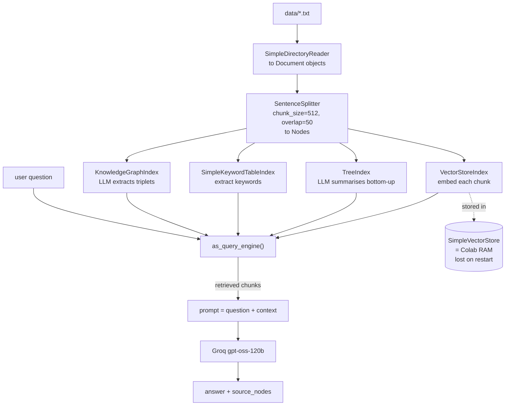

<a id="top"></a>
# LlamaIndex & Advanced RAG — Reading Brief

> **Read once, end to end, before the notebook.** ~15 min.
>
> **Side reference:** [`LlamaIndex_RAG_Jargon_Card.md`](./LlamaIndex_RAG_Jargon_Card.md).
>
> **Notebook:** `Llamaindex_class.ipynb` — 82 cells (many empty or image-only). Needs `GROQ_API_KEY` in Colab Secrets; the final Agno section also needs a Google API key. Embeddings run locally on CPU, so only the LLM calls cost anything.

---

## 🎯 30-second TL;DR

**A working RAG pipeline is five lines. Everything after that is choosing the *right kind* of index for the question you're asking.**

The five lines:
```python
Settings.llm = Groq(model="openai/gpt-oss-120b")
Settings.embed_model = HuggingFaceEmbedding(model_name="BAAI/bge-small-en-v1.5")
documents = SimpleDirectoryReader("data").load_data()
index = VectorStoreIndex.from_documents(documents)
index.as_query_engine().query("What is LlamaIndex?")
```

The rest of the notebook is the interesting part: it builds **four different index types over the same documents** — vector (similarity), tree (hierarchical summaries), keyword (exact terms), knowledge graph (entities and relationships) — and lets each one visibly succeed *and* visibly fail. The keyword index returns a flat `Empty Response`. The tree index correctly refuses a question about data it doesn't have. Those failures are the lesson: **there is no universal index; there is a match between question shape and index shape.**

It closes with two steps beyond plain RAG: wrapping query engines as **tools** an agent can choose between, and **persistent memory** with Agno + SQLite.

---

## 🗺️ Agenda — what the notebook teaches, in order

| # | Cells | Topic | The one idea |
|--:|------|-------|--------------|
| 1 | 5–8 | Install, Groq key, write a sample document | everything starts from a folder of text |
| 2 | 10–16 | `Settings.llm` and `Settings.embed_model` | configure once, globally |
| 3 | 17–24 | Load documents → `VectorStoreIndex` | two lines to a searchable index |
| 4 | 25–27 | *Which* vector DB? | it's `SimpleVectorStore` — **in RAM**, lost on restart |
| 5 | 30–33 | Query engine + `source_nodes` | retrieve → stuff into prompt → generate |
| 6 | 34–36 | Chat engine | same index, now with conversation memory |
| 7 | 38–41 | Chunking with `SentenceSplitter` | `chunk_size=512`, `chunk_overlap=50` |
| 8 | 42–44 | **TreeIndex** | LLM summarises bottom-up; great at summaries |
| 9 | 48–52 | **SimpleKeywordTableIndex** | exact terms; fails on synonyms |
| 10 | 56–61 | **KnowledgeGraphIndex** | LLM extracts triplets; slow but relational |
| 11 | 62–66 | Multiple sources + `QueryEngineTool` | the step toward agentic RAG |
| 12 | 73–80 | **Agno + SQLite** persistent memory | memory that survives a restart |

---

## 🧠 The big idea — four ways to organise a library

You have a shelf of company documents. Four librarians could organise them, and each is brilliant at one kind of request and useless at another.

- The **vector librarian** groups books by *what they're about*, so "something on shipping delays" lands you in the right area even though you never used the word "logistics". Ask for an exact invoice number and you get the general vicinity.
- The **tree librarian** has written a summary of each shelf, then a summary of those summaries, up to a one-page overview of the whole library. Perfect for "what's in here, broadly?"; hopeless for "what's the return window?" — that detail got summarised away three levels down.
- The **keyword librarian** keeps a card index of exact words. Ask for "INC-2847" and it's instant. Ask about "reward points" when every document says "loyalty points" and it hands you nothing at all.
- The **graph librarian** doesn't track topics — it tracks *who relates to whom*: Andy Jassy **succeeded** Jeff Bezos; Amazon **acquired** Whole Foods. Ask "how are these two connected?" and it's the only one that can answer.

Real systems hire several and put a receptionist out front to route each question to the right one. That receptionist is the **`QueryEngineTool`** section — and the reason its `description` field matters so much is that the description is all the receptionist gets to read.

---

## 🖼️ The picture — one diagram that holds the whole notebook

The pipeline, with the four index types branching off the same documents:



**Reading it aloud.** Everything left of `as_query_engine()` happens **once, at build time**; everything
right of it happens **per question**. The four branches all consume the same nodes and differ only in
how they organise them — which is why you can build all four over one corpus and route between them.
The dotted line is the trap cells 25-27 exist to warn about: the default vector store lives in the
runtime's RAM, so a Colab restart silently destroys the index. And note `source_nodes` coming back
attached to the answer — that's the debugging handle, and reading it is the habit this notebook is
really trying to install.

---

## 📖 Core concept primers

### 1. The RAG pipeline — five stages

> **🪜 Mental model:** an open-book exam where a research assistant finds the right pages before you start writing.

```
Documents → Chunks (nodes) → Embeddings → Index → Query engine
                                                      ↓
        question → embed → retrieve top chunks → stuff into prompt → LLM → answer
```

Each stage is one LlamaIndex object: `SimpleDirectoryReader` loads, `SentenceSplitter` chunks, `HuggingFaceEmbedding` embeds, `VectorStoreIndex` indexes, `as_query_engine()` queries.

**Why RAG exists:** an LLM's knowledge is frozen at training time and has never seen your internal documents. RAG fixes both by supplying the relevant text at question time.

**The debugging habit to build now:** `response.source_nodes` shows you *which chunks were retrieved*. Bad answer from good chunks = a generation problem (fix the prompt). Bad answer from irrelevant chunks = a retrieval problem (fix chunking, embeddings, or the index type). Most beginners only look at the answer and therefore debug the wrong half.

### 2. `Settings` — global configuration

> **🪜 Mental model:** house rules posted on the wall. Everyone who walks in *after* they're posted follows them.

```python
Settings.llm = Groq(model="openai/gpt-oss-120b")
Settings.embed_model = HuggingFaceEmbedding(model_name="BAAI/bge-small-en-v1.5")
Settings.node_parser = SentenceSplitter(chunk_size=512, chunk_overlap=50)
```

Set these once and every index and engine built afterwards uses them — no plumbing through constructors.

**The trap:** `Settings` applies at *construction* time. The notebook sets `node_parser` in cell 39 — **after** building the first `VectorStoreIndex` in cell 23. That first index used the defaults. Change a global setting and you must rebuild anything that depended on it.

**Note on cost:** the embedding model is a 133 MB download that runs locally on CPU. Your documents never leave the machine to be embedded, and embedding is free. Only Groq calls cost money.

### 3. Chunking — the highest-leverage knob

> **🪜 Mental model:** tearing a book into index cards. Card too small and you lose the context; too big and it's about five things at once, so it matches nothing sharply.

`SentenceSplitter(chunk_size=512, chunk_overlap=50)` cuts on sentence boundaries, targeting 512 characters, repeating 50 characters of the previous chunk at the start of the next.

**Why overlap exists:** a fact stated across a boundary ("Refunds are issued to… the original payment method") would otherwise be truncated in both chunks and retrievable from neither. Overlap costs a little storage and buys robustness at the seams.

**Why it's the biggest lever:** chunks are the *atoms* of retrieval. If the answer spans three chunks, no amount of clever retrieval assembles it. Get chunking wrong and everything downstream inherits the damage.

### 4. Four index types, four question shapes

> **🪜 Mental model:** the four librarians above.

| Index | Built by | Strong at | Fails at | Cost to build |
|---|---|---|---|---|
| `VectorStoreIndex` | embedding each chunk | "what does it say about X?" | exact identifiers | cheap (local embeddings) |
| `TreeIndex` | LLM summarising bottom-up | "summarise everything" | pinpoint detail | LLM call per summary node |
| `SimpleKeywordTableIndex` | keyword extraction | exact terms, acronyms, IDs | synonyms, paraphrases | cheap |
| `KnowledgeGraphIndex` | LLM extracting triplets | "how is X related to Y?" | general topical questions | **LLM call per chunk** |

Two failures the notebook shows honestly, and you should read rather than skim:

- **TreeIndex** is asked for "an executive summary of NimbusCloud's policies and roadmap" and answers *"I'm sorry, but I don't have the information needed."* That's the **right** answer — NimbusCloud was never loaded. Ask it about LlamaIndex instead and it summarises fine.
- **Keyword index** is asked "what does the policy say about reward points?" and returns `Empty Response`. The membership document exists, but its extracted keywords don't include "reward". Exact-match retrieval has no notion of "close enough".

### 5. Query engine vs chat engine

> **🪜 Mental model:** a search box versus a conversation.

`index.as_query_engine()` treats every question independently — no memory. `index.as_chat_engine()` keeps history, so "and what about the second one?" resolves. Same index underneath; the difference is entirely in what gets carried between turns.

The notebook wraps the chat engine in a `while True:` loop with an `exit` check — which means **it blocks the notebook until you type `exit`**.

### 6. From RAG to agentic RAG — `QueryEngineTool`

> **🪜 Mental model:** a receptionist with a directory of specialists.

Once you have several corpora — Tesla docs, Netflix docs, OpenAI docs — each gets its own index and query engine. Wrap each as a `QueryEngineTool` with a `name` and a `description`:

```
Tool Name:   tesla_docs
Purpose:     Answer questions about Tesla
```

Now a planner LLM can decide **which knowledge source answers which part of a compound question** — and it decides using nothing but the descriptions. The notebook states the rule plainly: *"Good tool descriptions improve tool selection."* This is the hinge from "RAG pipeline" to "agent with retrieval tools", and it's exactly where the Agentic RAG lecture picks up.

### 7. Persistent memory — Agno + SQLite

> **🪜 Mental model:** a notebook your assistant keeps, versus what they happen to remember from this meeting.

```python
db = SqliteDb(db_file="agent_memory.db")
agent = Agent(model=Gemini(id="gemini-3.5-flash"), db=db, update_memory_on_run=True)
agent.print_response("My name is Rahul. I prefer Python over Java. "
                     "I like learning through hands-on labs.", user_id="rahul")
```

The agent extracts **three separate memories** from that one sentence — name, language preference, learning style — each with its own id, topics list, `user_id` and timestamps. Ask "what programming language do I prefer?" in a later turn and it retrieves rather than guesses.

Two things to notice. **`user_id` is the isolation key** — it's what stops Rahul's preferences leaking into another user's session. And this is *disk-backed*, which puts it in a different class from the in-RAM `SimpleVectorStore` used for the RAG index earlier in the same notebook.

---

## 🔥 The headline experiment — at a glance

Same corpus, four indexes, real outputs:

| Index | Question asked | What came back |
|---|---|---|
| Vector | "What is LlamaIndex?" | Correct, grounded summary — plus `source_nodes` you can inspect |
| Tree | "Executive summary of **NimbusCloud**'s policies?" | *"I don't have the information needed"* — **correct refusal**, wrong corpus |
| Tree | "One-line summary about LlamaIndex" | *"…an open-source framework that links LLMs to external data sources."* |
| Keyword | "What does the policy say about **reward points**?" | **`Empty Response`** — vocabulary mismatch |
| Knowledge graph | (inspect `rel_map`) | `Andy jassy --[Succeeded]--> Jeff bezos` |

The table in one sentence: **three of these four "failures" are actually the index behaving exactly as designed — and knowing which failure you're looking at is the skill.**

---

## 🧮 Shapes to memorise

**1. The whole pipeline, in five lines**
```python
Settings.llm = Groq(model="openai/gpt-oss-120b")
Settings.embed_model = HuggingFaceEmbedding(model_name="BAAI/bge-small-en-v1.5")
documents = SimpleDirectoryReader("data").load_data()
index = VectorStoreIndex.from_documents(documents)
response = index.as_query_engine().query("…")
```
*In words:* pick a generator, pick an embedder, load a folder, build the index, ask. Everything else in LlamaIndex is a variation on this.

**2. The chunking parameters**
```python
SentenceSplitter(chunk_size=512, chunk_overlap=50)
```
*In words:* cut on sentence boundaries into ~512-character pieces, and start each piece by repeating the last 50 characters of the one before. Worked example: a 1,200-character document yields roughly 1200 ÷ (512 − 50) ≈ **3 chunks**, each sharing a 50-character seam with its neighbour.

**3. The retrieval debug loop**
```python
response = query_engine.query(q)
response.response        # what the LLM said
response.source_nodes    # what it was given to say it with
```
*In words:* always read the second line before blaming the first. Wrong answer + right chunks = prompt problem. Wrong answer + wrong chunks = retrieval problem.

---

## 🗺️ Notebook reading map

| Cells | What it teaches | How to read |
|---|---|---|
| 0–4 | Title images | Skip (images only) |
| 5–8 | Install, Groq key, write `data/llamaindex.txt` | **Skim** |
| 10–16 | `Settings.llm`, embeddings intro, `Settings.embed_model` | **Focus.** Note the embed model downloads locally |
| 17–24 | Load documents, build `VectorStoreIndex` | **Read normally** — it really is two lines |
| 25–27 | "Which vector DB are we using?" | **Focus.** `SimpleVectorStore`, in RAM, lost on restart |
| 30–33 | Query engine, `source_nodes`, four sample questions | **Focus on cell 32** — inspecting sources is the habit to build |
| 34–36 | Chat engine | **Read, don't run** unless you want the blocking input loop |
| 38–41 | `SentenceSplitter` chunking | **Focus.** Note it's set *after* the first index was built |
| 42–44 | TreeIndex + two queries | **Read both outputs.** One refusal, one good summary |
| 48–52 | ShopSphere corpus + keyword index | **Focus on cell 52** — the `Empty Response` |
| 55–61 | Amazon doc + KnowledgeGraphIndex + `rel_map` | **Read normally.** Note the "this took longer" warning |
| 62–66 | Multiple sources, `QueryEngineTool` | **Focus on the prose** — the code cells are empty |
| 73–80 | Agno + Gemini + SQLite memory | **Focus on cell 80's output** — one sentence became three memories |

---

## ⚠️ Gotchas

1. **There is a hardcoded Google API key in cell 75** (`os.environ["GOOGLE_API_KEY"] = "AQ..."`). Replace it with `userdata.get(...)` and **rotate that key** — it is a live credential sitting in a file that's about to be committed.
2. **Your index lives in RAM.** `SimpleVectorStore` is the default, not Pinecone/Chroma/FAISS. Restart the Colab runtime and everything you indexed is gone. The notebook spells this out in cells 25–27 — it's the single most common surprise for newcomers.
3. **The sample documents are polluted with auto-generated comments.** Lines like *"# This line performs the operation shown below…"* are embedded *inside* the document text, so they get chunked, embedded, and retrieved — you can see them in cell 32's `source_nodes` output. Garbage in the source is garbage in every chunk. Clean your corpus first.
4. **`Settings.node_parser` was set after the first index was built**, so that index used default chunking. Global settings apply at construction; rebuild after changing them.
5. **The chat engine cell blocks** on `input()` until you type `exit`. "Run all" will appear to hang.
6. **`Empty Response` is a retrieval failure, not a crash.** The keyword index genuinely found nothing for "reward points". A vector index would likely have found the membership document.
7. **`KnowledgeGraphIndex` costs one LLM call per chunk.** Fine for one Amazon article, expensive on a real corpus — budget before you build.
8. **Cells 63–70 are empty.** The multi-source / `QueryEngineTool` section is taught in prose only; the implementation is left to you.
9. **`llama-index-readers-file` isn't installed**, so `SimpleDirectoryReader` warns and handles only plain text. Fine here (`.txt` only), a blocker the moment you add a PDF.

---

## 🏛️ Staff-engineer lens

*Rung 4. Everything below assumes the beginner material above; nothing more.*

### Where this breaks at scale

**`SimpleVectorStore` is a Python list, and search over it is a linear scan.** At 1 document it's
instant; at 1 million chunks every query embeds then compares against every vector — O(N) per query,
with the whole index resident in RAM. Real systems replace this with an **approximate nearest
neighbour** index (HNSW in FAISS, Chroma, Weaviate, pgvector), trading exact recall for sublinear
search. The migration is the single biggest architectural step between this notebook and production,
and `StorageContext` is the seam where it plugs in.

`KnowledgeGraphIndex` breaks earlier and more expensively: **one LLM call per chunk** at build time.
A 10,000-chunk corpus is 10,000 completions to build the graph once — and again on every re-ingest,
because nothing here is incremental. The notebook prints its own warning ("this took longer") on a
single Amazon article.

The third limit is **ingestion, not query**. Nothing in this pipeline updates. A changed policy
document means rebuilding, and at scale that becomes a Change Data Capture problem — a decoupled
pipeline that re-chunks and re-embeds only what changed, rather than an application-loop rebuild.

### Latency & cost budget

Split build-time from query-time, because they have completely different shapes:

| | Build (once) | Query (every request) |
|---|---|---|
| Vector | embed each chunk — **free here** (local CPU BGE) | 1 embed + linear scan + 1 LLM call |
| Tree | 1 LLM call per summary node | tree traversal + 1 LLM call |
| Keyword | keyword extraction — cheap | lookup + 1 LLM call |
| Graph | **1 LLM call per chunk** | traversal + 1 LLM call |

The notebook's choice of a **local** embedding model is a real architectural decision hiding in one
line: `HuggingFaceEmbedding` runs the 133 MB BGE model on CPU, so embedding costs nothing and no
document text leaves the machine. That matters twice — it's the cheap option, and it's the
data-residency-compliant option. Query latency is then dominated by the single Groq completion, not
by retrieval, which is why chasing retrieval speed on a small corpus optimises the wrong thing.

### The trade-off you're actually making

**A local small embedding model buys you zero marginal cost and data residency by paying retrieval
quality.** `bge-small-en-v1.5` is 384-dimensional and English-only; a larger or hosted model scores
measurably better on hard retrieval, at per-token cost and with your documents crossing a network
boundary.

The second trade-off is the index-type choice itself, and it's the notebook's real lesson: **you are
choosing which question shape to be good at.** Tree summarises and loses detail; keyword nails exact
terms and dies on synonyms; vector generalises and fuzzes identifiers; graph traverses and costs a
call per chunk. There is no universal index, so the mature design builds two or three and routes —
which is exactly what `QueryEngineTool` is for, and exactly where the next two lectures go.

### Failure modes to forecast

Ranked by how quietly they fail:

1. **Garbage in the corpus becomes garbage in every chunk.** This notebook demonstrates it
   accidentally: auto-generated `# This line performs the operation…` comments are embedded *inside*
   the source documents, so they get chunked, embedded and retrieved — visible in cell 32's
   `source_nodes`. No error, just quietly degraded retrieval for the life of the index.
2. **Stale index.** The corpus changed; nothing re-ingested; the system answers confidently from
   last month's policy.
3. **Silent config drift.** `Settings` applies at construction, so changing `node_parser` after
   building leaves you querying an index chunked by the old rules — the notebook does exactly this
   between cells 23 and 39.
4. **`Empty Response` treated as "no such policy".** It means *retrieval* found nothing, which is a
   very different claim from *the corpus* containing nothing.
5. **Index lost on restart**, rebuilt automatically, and now subtly different.

### Why an interviewer asks this

"Build a RAG system" is a litmus test for **whether you debug retrieval or blame the model.** The
weak answer responds to a bad output by changing the prompt or the model. The strong answer reaches
for `source_nodes` first and splits the problem in two: right chunks + wrong answer is a generation
problem; wrong chunks + wrong answer is a retrieval problem. Volunteering that split unprompted is
the single clearest signal of having actually operated a RAG system.

The follow-up that separates senior from staff is chunking: *"how did you pick 512 and 50?"* There is
no defensible answer that isn't empirical — you pick by measuring against a labelled eval set, which
is precisely the machinery lecture 12 builds. The third probe is usually freshness: if you can
describe the index but not how it gets updated, you've built a demo.

[🔝 Back to top](#top)

---

## ✅ Walk-away checklist

- [ ] The five stages of a RAG pipeline, and which LlamaIndex object owns each.
- [ ] Why `source_nodes` is the first thing to check when an answer is wrong.
- [ ] What `chunk_size` and `chunk_overlap` trade off, and why overlap exists at all.
- [ ] The four index types, and one question each is uniquely good and uniquely bad at.
- [ ] Why the keyword index returned `Empty Response`, and which index would have answered.
- [ ] Why `SimpleVectorStore` disappears on restart, and what you'd swap in for production.
- [ ] What a `QueryEngineTool`'s `description` is for, and why it's the hinge to agentic RAG.
- [ ] **(staff)** Why `SimpleVectorStore` is O(N) per query, and what replaces it.
- [ ] **(staff)** Why `source_nodes` splits every RAG bug into exactly two classes.

---

## 🎯 Self-check — 5 beginner + 3 staff

1. Your RAG system confidently answers a question wrongly. What's the first object you inspect, and how does its content split the diagnosis in two?
2. You set `Settings.node_parser = SentenceSplitter(chunk_size=256)` after building an index, then query it. Which chunk size is in effect, and why?
3. A user searches your policy corpus for "reward points" and gets nothing, though a membership document mentions "loyalty points". Which index type is in use, and which would you switch to?
4. You need "summarise all 5,000 of our documents in one paragraph" *and* "what's the exact refund window for electronics?" Why does no single index serve both well?
5. Your Colab runtime restarts and every query now returns nothing. What happened, and what's the production fix?

**Staff-level (answerable from the 🏛️ section):**

6. Your RAG demo runs on 20 documents. Legal now wants it over 2 million. Name the three things that break first and what each is replaced by.
7. Your corpus is a mix of policy documents and incident tickets. Users ask both "summarise our security posture" and "what exactly happened in INC-2847?" Why does one index not serve both, and what do you build?
8. A stakeholder reports the assistant gave a confidently wrong answer. Walk through your first five minutes of debugging.

<details>
<summary><strong>Answers</strong></summary>

1. **`response.source_nodes`** — the chunks the engine actually retrieved and handed to the LLM. If those chunks contain the correct information and the answer is still wrong, it's a **generation** problem (prompt, model, or context-stuffing). If the chunks are irrelevant, it's a **retrieval** problem (chunking, embedding model, or the wrong index type). Without looking, you'll spend your time fixing the wrong half.

2. **512** — or whatever the index was built with. `Settings` is read at construction time; changing it afterwards has no retroactive effect on an already-built index. The notebook demonstrates this accidentally: it sets `node_parser` in cell 39, long after building the index in cell 23. To apply the new size you must rebuild from the documents.

3. A **keyword index** (`SimpleKeywordTableIndex`) — exact-term matching with no notion of "close enough", so "reward" simply isn't in the extracted keyword set. Switch to a **`VectorStoreIndex`**: embeddings place "reward points" and "loyalty points" near each other in vector space, so semantic similarity finds the document. (The strongest answer runs both and fuses the results — which is exactly the hybrid search lecture.)

4. They're opposite question shapes. The summary question needs a **TreeIndex**, which builds hierarchical LLM summaries — but that same summarisation *discards* the specific detail, so it can't tell you the electronics refund window. The exact-detail question needs a **VectorStoreIndex** (or keyword) retrieving the specific chunk — but pulling a handful of chunks from 5,000 documents can never summarise the whole corpus. Real systems build both over the same documents and route by question type, which is what `QueryEngineTool` enables.

5. The default `SimpleVectorStore` holds everything **in the runtime's RAM**, so a restart wipes the documents, embeddings and index together. The production fix is a persistent vector store — Chroma, FAISS with a saved file, Pinecone, Weaviate — attached via a `StorageContext`, so the index survives the process and can be reloaded rather than re-embedded.

**Staff answers**

6. **(a) `SimpleVectorStore`** — a Python list scanned linearly, held entirely in RAM. Replaced by an approximate-nearest-neighbour store (FAISS/HNSW, Chroma, Weaviate, pgvector) attached through `StorageContext`, trading exact recall for sublinear search and giving you persistence for free. **(b) The build being in-process and all-or-nothing** — 2 million chunks can't be re-embedded in a notebook cell on every change. Replaced by a decoupled ingestion pipeline that processes incrementally, ideally driven by change data capture so only modified documents are re-chunked. **(c) `KnowledgeGraphIndex`, if you're using it** — one LLM call per chunk means 2 million completions to build, which is economically absurd; replaced by rule-based or model-distilled entity extraction, or dropped in favour of graph-only-where-needed. Worth noting what *doesn't* break: local CPU embedding still costs nothing per document, though you'd batch it on a GPU for throughput.

7. **Because they are opposite question shapes.** "Summarise our security posture" needs synthesis across the *whole* corpus — that's `TreeIndex`, which builds hierarchical LLM summaries bottom-up. But that same summarisation discards specifics, so it cannot tell you what happened in INC-2847. Conversely, retrieving a handful of chunks (vector or keyword) nails the specific incident but can never summarise 2 million documents, because top-k by definition reads almost none of them. **What you build:** both indexes over the same nodes, plus a routing layer — wrap each as a `QueryEngineTool` with a `name` and a `description`, and let a planner LLM pick per question. The description is the only thing the router reads, so it carries the whole routing quality. (And for the identifier case specifically, add keyword/BM25 alongside vector — `INC-2847` is exactly the query type dense retrieval loses, which is lecture 12's opening demo.)

8. **Minute 1: read `response.source_nodes`, not the answer.** That single object splits the problem in two and everything else follows from it. **Minutes 2-3, if the chunks are relevant:** it's a *generation* problem — check whether the answer actually contradicts the retrieved text, inspect the assembled prompt for truncation, check whether conflicting chunks were retrieved together, and look at the model/temperature. **Minutes 2-3, if the chunks are irrelevant or empty:** it's a *retrieval* problem — check the index type against the question shape (an `Empty Response` from a keyword index on a synonym query is a vocabulary mismatch, not a missing document), check whether chunking split the answer across a boundary, and check the embedding model. **Minutes 4-5, either way:** confirm the index is current — was it rebuilt after the source changed, and were `Settings` altered after construction? Then write the failing question into a labelled eval set so the fix is measurable and the regression is caught next time.

</details>

[🔝 Back to top](#top)
