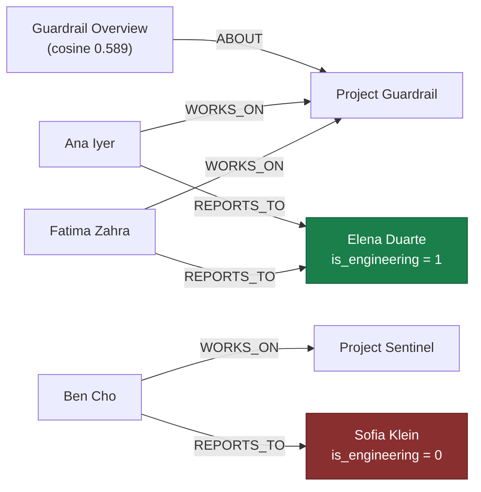

<a id="top"></a>
# Agentic RAG & GraphRAG — Reading Brief

> **Read once, end to end, before the notebook.** ~14 min.
>
> **Side reference:** [`AgenticRAG_GraphRAG_Jargon_Card.md`](./AgenticRAG_GraphRAG_Jargon_Card.md).
>
> **Notebook:** `classroom_agentic_rag_and_graph_rag.ipynb` — 37 cells. Every credential prompt can be skipped: no Groq key → deterministic canned responses; no Neo4j → an in-memory NetworkX graph. **The notebook runs end to end with zero credentials** — useful, and worth knowing before you start hunting for keys.

---

## 🎯 30-second TL;DR

**One question breaks plain RAG, and the whole notebook is the repair.**

The question: *"Which engineering managers have team members working on projects involving LLM security?"*

Pure vector search does its job perfectly and still fails. It returns the three most semantically similar documents — `Guardrail Overview` (0.589), `Sentinel Overview` (0.522), `Model Input Security Policy` (0.448) — all genuinely about LLM security. But **not one of them contains the answer**, because the answer isn't written anywhere. It has to be *computed* by walking a chain: Document → Project → Employee → Manager → Department.

The fix has two halves. **Agentic RAG**: an LLM planner decomposes the question into subquestions and picks a tool for each (`vector`, `graph`, or `sql`), then a loop routes, executes, reflects and synthesises. **GraphRAG**: give it a tool that can actually traverse relationships — a property graph of employees, managers, projects and skills. Run it, and the answer comes back correct: **Elena Duarte**, with Sofia Klein explicitly excluded because she leads Security, not Engineering.

---

## 🗺️ Agenda — what the notebook teaches, in order

| # | Cells | Topic | The one idea |
|--:|------|-------|--------------|
| 1 | 0–4 | Limits of traditional RAG | RAG fails when the answer must be *computed* |
| 2 | 5–7 | Install + optional credentials | everything degrades gracefully |
| 3 | 11 | `LLM` wrapper + canned fallbacks | reproducible without an API key |
| 4 | 13 | Embedding utilities | normalise once, then similarity is a dot product |
| 5 | 15–16 | Neo4j helper + fallback | real graph DB optional |
| 6 | 17–19 | The shared org dataset | one dataset, three retrieval mechanisms |
| 7 | 21–22 | In-memory property graph (NetworkX) | nodes, typed edges, node properties |
| 8 | 23–26 | **Pure semantic search demo** | it retrieves well and still can't answer |
| 9 | 27–29 | Why we need Agentic RAG | the architecture shift, spelled out |
| 10 | 30 | **Step 1: the planner** | decompose into subquestions + tool labels |
| 11 | 31 | **Step 2: Route → Execute → Reflect → Synthesize** | the loop that runs the plan |

---

## 🧠 The big idea — the org chart on the wall

Imagine asking a new joiner: *"which engineering managers have people working on LLM security?"*

They could search the company wiki. Searching is what vector RAG does, and it works — they'd surface the Guardrail and Sentinel pages, both unmistakably about LLM security. But no page says *"Elena Duarte manages people on LLM security projects."* Nobody ever wrote that sentence. It's a fact that only exists as a **path**:

```
Document (Guardrail Overview)
   └── ABOUT ──→ Project Guardrail
                    ↑ WORKS_ON ── Ana Iyer, Fatima Zahra
                                     └── REPORTS_TO ──→ Elena Duarte
                                                          └── is_engineering = 1  ✓
```

A wiki search can't walk that. **The org chart on the wall can** — and that's what a graph is: the org chart, machine-readable.

The second half of the insight: knowing you *need* the org chart is itself a decision, and someone has to make it. In plain RAG, that decision is hardcoded ("always vector search"). In **agentic RAG, an LLM makes it per question** — decomposing the question and choosing, for each piece, whether to search text (vector), walk relationships (graph), or compute over rows (SQL).

---

## 🖼️ The picture — one diagram that holds the whole notebook

**Why vector search cannot answer the question** — the answer is a path, and embeddings have no edges:



**Reading it aloud.** Vector search gets you as far as the leftmost box and stops — it can score
`Guardrail Overview` at 0.589 because the *text* is about LLM security, but there is no edge inside
an embedding to follow from a document to the people who work on it. Everything to the right of that
first arrow is graph traversal. The green node is the answer; the red one is the trap — Sofia Klein
manages people on these very projects, and the *only* thing excluding her is the `is_engineering = 0`
property on her node. Delete that one field and the system returns a confidently wrong answer.

And here is the agentic loop that drives it, as frames rather than prose:

```
frame 1   plan = [q1 vector, q2 graph, q3 graph]      nothing executed yet
frame 2   evidence = {}                               q1 runs
frame 3   evidence = {projects: [Atlas, Guardrail, Sentinel]}   q2 reads projects
frame 4   evidence = {projects: [...], managers: [Elena Duarte]}  q3 filters
frame 5   reflect -> sufficient = True                synthesize
```

---

## 📖 Core concept primers

### 1. Why traditional RAG fails here

> **🪜 Mental model:** a library catalogue can find you books *about* a topic; it can't tell you who reports to whom.

The notebook's diagnosis, verbatim and worth memorising: *"Traditional RAG works when the answer is already written somewhere in the documents. It starts struggling when the answer has to be calculated by **joining** information, **filtering** it, **traversing** relationships, and **aggregating** results."*

Those four verbs are your diagnostic checklist. Run them against any question before choosing an architecture:

| Question | Verbs needed | RAG enough? |
|---|---|---|
| "What does Guardrail do?" | none — it's written down | ✅ yes |
| "Which engineering managers…?" | traverse + filter | ❌ needs a graph |
| "Which projects have budgets over $500k?" | filter + aggregate | ❌ needs SQL |
| "Summarise our security posture" | none — but across many docs | ⚠️ RAG, with care |

**The demo makes it concrete:** the vector search *succeeds* at its own job — its top-3 are all correctly about LLM security — and the notebook's own note lands the point: *"It has not yet figured out the managers — that requires the graph relationships."* A retrieval system can be working perfectly and still be the wrong tool.

### 2. Embeddings — normalise once, then it's a dot product

> **🪜 Mental model:** point every arrow to length 1, and "how similar?" becomes "how much do they overlap?"

```python
vectors = model.encode(list(texts), normalize_embeddings=True)   # every vector length 1
scores  = matrix @ query_vec                                     # cosine == dot product
order   = np.argsort(-scores)[:k]                                # descending, keep top k
```

Cosine similarity is normally `(a·b) / (|a||b|)`. **In words:** the dot product of the two vectors, divided by both their lengths. Force every length to 1 at encode time and the denominator becomes 1, so similarity *is* the dot product — and scoring an entire corpus is one matrix multiply against a (20 × 384) matrix.

`np.argsort(-scores)` is the idiom for "sort descending": NumPy sorts ascending, so negating flips it.

**In this notebook:** `all-MiniLM-L6-v2`, 384 dimensions, loaded **lazily** — the model only downloads the first time you actually embed something.

### 3. The property graph

> **🪜 Mental model:** the org chart, but every arrow is labelled and every box has fields.

`InMemoryOrgGraph` holds five node types (Employee, Department, Skill, Project, Document) and six edge types (`REPORTS_TO`, `PART_OF`, `HAS_SKILL`, `OWNED_BY`, `WORKS_ON`, `ABOUT`). Nodes carry properties — an employee has `name`, `title`, `department`, `manager_id`, `is_engineering`.

The dataset is a deliberately shaped nine-person org: Nadia Osei (CEO) → Priya Raman (CTO) → Marco Silva (VP Engineering) → **Elena Duarte (Engineering Manager)**, with **Sofia Klein (Security Manager)** and Tomas Berg (Data Manager) also reporting to the CTO. That shape is the trap: Sofia also manages people on LLM security projects, but `is_engineering = 0`. **The question asks for engineering managers, so she must be excluded** — and a system that returns her is subtly, confidently wrong.

**Neo4j vs NetworkX:** the concepts are identical — nodes, typed edges, properties. Neo4j adds persistence, concurrency, indexing and **Cypher** (`MATCH (e:Employee)-[:REPORTS_TO]->(m)`). NetworkX gives you the model for free with plain Python traversal. Learn the model here; swap the backend later.

### 4. The planner — decompose first, execute never

> **🪜 Mental model:** a project manager writing the task list before anyone starts work.

```
PLANNER_SYSTEM = "You are a retrieval planner. Decompose the user question into an ordered
list of subquestions. For each subquestion choose exactly one tool from sql, vector, or
graph. Return only JSON …"
```

The plan it produced:

| id | tool | subquestion |
|---|---|---|
| q1 | `vector` | Identify projects whose documents describe LLM security work. |
| q2 | `graph` | Find employees assigned to those projects and the managers they report to. |
| q3 | `graph` | Keep only managers who belong to engineering. |

**The detail to internalise:** at this stage `"vector"` and `"graph"` are **just strings in a JSON object**. Nothing has been retrieved. The notebook is emphatic about this, and it's the cleanest available illustration of *separating planning from execution* — you can inspect, log, validate or override a plan before a single expensive call is made.

### 5. Route → Execute → Reflect → Synthesize

> **🪜 Mental model:** dispatch each task to the right specialist, collect the results on one desk, check the desk is complete, then write the report.

```
Retrieval Plan → Router → Execute Tool → Evidence Buffer → Reflection → LLM Synthesis → Answer
```

- **Route** — map each subquestion's tool label to an actual Python function.
- **Execute** — run it. Each tool reads the **evidence buffer** for what earlier steps deposited (`evidence.get("projects", [])`) and writes its own results back. That buffer is how q2 knows which projects q1 found.
- **Reflect** — ask "is this enough to answer?" Here: `sufficient = True`.
- **Synthesize** — one LLM call turning the evidence into prose.

The graph tool is the one to read closely. It does exactly the traversal the mental model describes: scan `WORKS_ON` edges to find employees on the target projects → follow each one's `REPORTS_TO` edge to a manager → keep only managers whose `is_engineering` property is set → sort for determinism.

---

## 🔥 The headline experiment — at a glance

Same question, two architectures, real outputs:

| | Pure vector search | Agentic RAG + graph |
|---|---|---|
| What ran | one embed + top-3 cosine | plan (3 subquestions) → 3 tool calls → reflect → synthesize |
| Result | `Guardrail Overview` 0.589 · `Sentinel Overview` 0.522 · `Model Input Security Policy` 0.448 | q1 → `['Atlas', 'Guardrail', 'Sentinel']` · q2 → `['Elena Duarte']` · q3 → `['Elena Duarte']` |
| Answers the question? | **No** — relevant documents, no manager named | **Yes** — Elena Duarte |
| Cost | 1 embedding, 0 LLM calls | 1 planning call + tool execution + 1 synthesis call |

The synthesised answer is worth reading in full for one reason — it says *why* someone was excluded:

> *"…the engineering manager whose direct reports work on LLM security projects is **Elena Duarte**. Her reports Ana Iyer and Fatima Zahra work on Project Guardrail, and Ben Cho works on Project Sentinel… **Sofia Klein also manages people on these projects, but she leads Security rather than Engineering and is therefore excluded** by the engineering-manager constraint."*

That exclusion is the whole notebook in one sentence. Getting Elena is easy; knowing to leave Sofia out requires the `is_engineering` property and a filter that reads it.

---

## 🧮 Shapes to memorise

**1. Cosine similarity, and why the code doesn't look like the formula**
```
cos(a, b) = (a · b) / (|a| × |b|)
```
*In words:* the dot product of two vectors divided by both their lengths. With `normalize_embeddings=True` every length is 1, so the denominator vanishes and `cos(a,b) = a · b` — hence `scores = matrix @ query_vec` scores the whole corpus in one multiply. Worked example: a (20 × 384) document matrix times a (384,) query vector gives 20 scores; `np.argsort(-scores)[:3]` picks the best three.

**2. The four-verb test**
```
join · filter · traverse · aggregate
```
*In words:* if answering the question needs any of these four operations, plain top-k RAG cannot do it — the answer isn't written in any single chunk. Traverse → graph. Filter/aggregate over rows → SQL. Neither → vector is fine.

**3. The agentic loop**
```
Plan → (Route → Execute → Evidence)* → Reflect → Synthesize
```
*In words:* decide the steps first, run each with the right tool while accumulating evidence, check whether the evidence is sufficient, then write the answer. Worked example: 3 subquestions → 3 tool calls → `sufficient = True` → one synthesis call.

---

## 🗺️ Notebook reading map

| Cells | What it teaches | How to read |
|---|---|---|
| 0–4 | Agenda + the "RAG struggles when…" framing | **Focus on cell 3.** One sentence, four verbs |
| 5–7 | Install, optional credential prompts | **Skim.** Press Enter to skip any prompt |
| 9–11 | `LLM` wrapper + canned fallbacks | **Skim the fallback strings**, note *that* they exist |
| 13 | Embedding utilities | **Focus.** The normalise → dot-product trick |
| 15–16 | Neo4j helper + fallback | **Skim** unless you're wiring up Aura |
| 17–19 | The shared org dataset | **Focus on the employee table.** Elena vs Sofia is the trap |
| 21–22 | `InMemoryOrgGraph` (NetworkX) | **Read normally.** Learn the six edge types |
| 23–26 | Pure semantic search demo | **Focus.** Read the three scores, then cell 26's one-line diagnosis |
| 27 | Why we need agentic RAG | **Focus — the single densest cell.** The architecture shift in prose |
| 30 | The planner | **Focus.** Note: plan only, nothing executed |
| 31 | Route → Execute → Reflect → Synthesize | **Focus.** Trace the graph tool's traversal by hand |
| 34–36 | *(empty)* | Skip |

---

## ⚠️ Gotchas

1. **q1 returned `['Atlas', 'Guardrail', 'Sentinel']` — and Atlas is the data platform, not a security project.** The vector-style tool over-retrieved. It happened to be harmless because no Atlas worker reported to an engineering manager not already found, but a false positive at step 1 silently propagates through every later step. Always inspect intermediate evidence, not just the final answer.
2. **q2 and q3 returned the identical result** (`['Elena Duarte']`). The engineering filter was already applied inside the q2 tool, so q3 was a no-op. Plans can contain redundant steps — each one costs a call.
3. **Skipping the Groq key gives you canned answers, not generated ones.** `_FALLBACK_PLAN` and `_FALLBACK_ANSWER` are hardcoded strings that happen to match this exact question. The pipeline "works" offline but proves nothing about planning quality. Check `LLM mode: live (Groq)` in the output before drawing conclusions.
4. **Neo4j Aura's password is shown once.** Lose it and you recreate the instance. The username is often the instance id, not `neo4j`.
5. **The `is_engineering` flag is a data-modelling choice, and it's load-bearing.** Sofia Klein is a manager on LLM security projects — she is excluded purely by that property. A corpus without that field could not answer the question correctly at all.
6. **The in-memory graph has no persistence.** Restart the runtime and it's gone, same as the notebook's vector matrix.
7. **This notebook's "SQL tool" is mostly canned.** The `_FALLBACK_SQL_*` constants cover three specific question shapes plus a default. Real Text2SQL needs validation, read-only connections and row limits (which is exactly what document RFC-008 in the *next* lecture's corpus describes).
8. **Reflection said `sufficient = True` on the first pass**, so the retry path never executed. As with the ReAct/Reflection lecture, you've seen the loop's structure, not its recovery behaviour.

---

## 🏛️ Staff-engineer lens

*Rung 4. Everything below assumes the beginner material above; nothing more.*

### Where this breaks at scale

**The planner is a single point of failure with no schema enforcement.** It returns free-form JSON
parsed by `parse_json`; a malformed plan, a hallucinated tool name, or a subquestion that references
evidence no earlier step produced all fail at execution time, not at plan time. At scale you
constrain the planner with a strict schema (tool names as an enum), validate the plan as a DAG
before executing a single step, and reject plans that reference undefined evidence keys.

The graph itself breaks differently. `InMemoryOrgGraph` holds every node and edge in Python memory
and traversal is a full scan over `ORG.g.edges(data=True)` — O(E) per hop. Nine employees is
instant; ten million edges is not, and the whole structure must fit in one process. Neo4j exists for
exactly this: indexed adjacency, so a `REPORTS_TO` hop is a pointer chase rather than a scan, plus
persistence and concurrent access.

The third limit is **plan depth**. Each subquestion is at least one tool call and the synthesis
prompt accumulates every step's evidence, so a 10-step plan means 10 executions plus a prompt
carrying all ten results. Deep plans blow the context window and the latency budget together.

### Latency & cost budget

One run of the notebook's question:

| Stage | Cost | Dominates? |
|---|---|---|
| planning | 1 LLM call | no, but it's on the critical path and blocks everything |
| q1 vector | 1 embed + 20-row dot product | no — microseconds |
| q2/q3 graph | in-memory edge scans | no — microseconds |
| reflection | 1 LLM call | no |
| synthesis | 1 LLM call, carries all evidence | **yes on tokens** |

**Two LLM calls bracket a pipeline whose actual retrieval is free.** That shape matters: it means
optimising the graph traversal is optimising the wrong thing, and the real levers are (a) don't
re-plan for query shapes you've seen before — cache plans by question template — and (b) trim what
enters the synthesis prompt. Note also that planning is strictly serial ahead of execution, so it
sits on the critical path for every single request.

The one genuine parallelism win is unexploited here: `q2` depends on `q1`'s output, but independent
subquestions in a plan could be dispatched concurrently. A DAG-aware executor would do this; this
one runs the list in order.

### The trade-off you're actually making

**You are buying multi-hop correctness by paying two LLM calls and a hard dependency on graph data
that someone has to build and maintain.** The alternative is a bigger, better single retrieval —
larger chunks, better embeddings, hybrid search — which is cheaper and simpler and still cannot
answer this question, because no amount of retrieval quality invents an edge that isn't in the text.

The cost that doesn't show up in the latency table is **the graph itself**. Somebody must define the
entity types, extract or maintain the relationships, and keep `is_engineering` accurate as people
change roles. That's an ongoing data-engineering commitment, and it's why GraphRAG is worth it only
when relationship questions are a recurring workload rather than an occasional one.

### Failure modes to forecast

Ranked by how quietly they fail:

1. **Over-retrieval at step 1 silently poisoning every later step.** `q1` returned
   `['Atlas', 'Guardrail', 'Sentinel']` — and Atlas is the data platform, not a security project.
   Here it was harmless; in general a false positive at the first hop propagates through every
   traversal and the final answer looks perfectly well-formed.
2. **Stale graph properties.** Sofia's `is_engineering` flag is the entire basis of the exclusion. If
   someone transfers teams and the graph isn't updated, the system returns a wrong name with full
   confidence and a fluent justification.
3. **Reflection rubber-stamping.** `sufficient = True` on the first pass means the retry path never
   ran. An always-sufficient reflector is indistinguishable from no reflector.
4. **Fallback mode read as live mode.** With no Groq key the notebook returns hardcoded
   `_FALLBACK_PLAN` and `_FALLBACK_ANSWER` that happen to match this exact question. It "works"
   while proving nothing — check for `LLM mode: live (Groq)` before believing any result.
5. **Redundant plan steps** (`q3` re-filtered what `q2` already filtered) — pure cost, no signal.

### Why an interviewer asks this

"When does RAG stop working?" is a litmus test for **whether you can classify a question before
choosing an architecture.** The weak answer reaches for better embeddings. The strong answer runs the
four verbs — join, filter, traverse, aggregate — and observes that none of them are operations a
top-k similarity search performs, so the fix is a different retrieval *modality*, not a better one.

The follow-up that separates senior from staff is data ownership: *"where does the graph come from,
and who keeps it correct?"* An architecture that depends on a property like `is_engineering` has
quietly acquired a data-quality SLA, and candidates who don't surface that have designed a demo. The
third probe is the planner: an LLM emitting free-form JSON that drives tool execution is an injection
surface and a reliability risk, and constraining it with a schema and a DAG validation pass is the
expected answer.

[🔝 Back to top](#top)

---

## ✅ Walk-away checklist

- [ ] The four verbs (join, filter, traverse, aggregate) and why any of them breaks plain RAG.
- [ ] Why the vector search "succeeded" yet failed to answer the question.
- [ ] What a property graph is, and which questions only it can answer.
- [ ] The difference between planning and execution, and why separating them is useful.
- [ ] The four stages of the execution loop, and what the evidence buffer is for.
- [ ] Why Sofia Klein is excluded, and what data made that possible.
- [ ] When to reach for vector, graph, or SQL — and that a real system has all three.
- [ ] **(staff)** Why two LLM calls bracket a pipeline whose retrieval is essentially free — and what that means for optimisation.
- [ ] **(staff)** What data-freshness SLA the graph quietly imposes, and who owns it.

---

## 🎯 Self-check — 5 beginner + 3 staff

1. The vector search returned three documents all genuinely about LLM security. Why is that a *failure*, and what exactly was missing?
2. `normalize_embeddings=True` is set at encode time. What does that let the similarity code skip, and how does the code end up as `matrix @ query_vec`?
3. The planner tags q2 as `graph`. What has actually happened to the graph database at the moment the plan is printed?
4. Sofia Klein manages people working on Guardrail and Sentinel. Why is she correctly absent from the answer, and which piece of data makes that possible?
5. You're asked: *"Which projects have budgets over $500,000, and who are their engineering leads?"* How would the planner decompose it, and why can't one tool do the job?

**Staff-level (answerable from the 🏛️ section):**

6. Your agentic RAG system is 100× larger: 5,000 documents, 50,000 employees, 200 queries/minute. Name what breaks and what replaces each piece.
7. The planner emits a subquestion tagged `graph` that references evidence no earlier step produced. Where does this fail today, and where should it fail?
8. Six months after launch, the system names a manager who moved to another team last quarter. Whose bug is it, and what SLA did the architecture quietly acquire?

<details>
<summary><strong>Answers</strong></summary>

1. The question asked for **engineering managers**, and no document names one — that fact exists only as a path through relationships (Document → Project → Employee → Manager → Department). Vector search retrieves *passages similar to the query*; the answer here isn't a passage, it's a traversal plus a filter. The retrieval was correct and the architecture was wrong.

2. Normalising forces every vector to length 1, so the `/(|a| × |b|)` denominator in the cosine formula becomes `/1` and drops out — cosine similarity reduces to a plain dot product. That's why one matrix multiply, `matrix @ query_vec`, scores the entire corpus at once: each row of the matrix dotted with the query vector *is* that document's cosine similarity.

3. **Nothing.** The planner only emits JSON; `"graph"` is a string label. No tool has been routed, no traversal run, no evidence gathered. Separating planning from execution is deliberate — it lets you inspect, validate, log or override a plan before paying for any of it.

4. Because the question says *engineering* managers, and Sofia leads **Security**. The graph tool's final step keeps only managers whose `is_engineering` property is set — Sofia's is `0`. Without that property on the employee nodes, the system would have had no way to distinguish her from Elena and would have returned a confidently wrong answer. Note the synthesised answer names her and explains the exclusion, which is exactly the transparency you want.

5. Roughly three subquestions: **q1 (`sql`)** — select projects joined to budgets where `amount_usd > 500000`, because that's a filter-and-join over structured rows; **q2 (`graph`)** — for each of those projects, traverse `WORKS_ON` to employees and `REPORTS_TO` to their managers; **q3 (`graph`)** — keep only managers with `is_engineering` set. No single tool works: SQL can't naturally walk an arbitrary-depth reporting hierarchy (it needs an awkward recursive CTE), the graph doesn't hold budget amounts, and vector search can't do a numeric threshold at all. Having three tools *and a planner that picks between them* is the entire point of agentic RAG.

**Staff answers**

6. **(a) The in-memory NetworkX graph** — every traversal scans `ORG.g.edges(data=True)`, O(E) per hop, with the whole structure in one process's RAM. Replaced by Neo4j (or any indexed property-graph store): adjacency is indexed, so a `REPORTS_TO` hop is a pointer chase, and it persists and handles concurrency. **(b) The vector step** — the notebook's `matrix @ query_vec` is an exact linear scan; at 5,000+ documents and 200 QPM you move to an ANN index (HNSW/FAISS/pgvector). **(c) The planner as a per-request LLM call** — at 200 QPM that's 200 planning calls a minute on the critical path before any retrieval starts. Cache plans by question template, or classify into a small set of known plan shapes and only fall back to the LLM for novel questions. What *doesn't* break: the synthesis call, which stays one per request — though you'd need to cap how much evidence enters it.

7. **Today it fails at execution time**, and quietly: the tool does `evidence.get("projects", [])`, gets the empty-list default, traverses nothing, and returns an empty result. The pipeline continues, reflection may well call it sufficient, and synthesis writes a fluent answer over no evidence. **It should fail at plan time**, before a single call is paid for: validate the plan as a DAG — every subquestion declares which evidence keys it consumes and produces, every consumed key must be produced by an earlier step, tool names come from a strict enum, and there are no cycles. Reject and re-plan otherwise. The general principle: **an empty-dict default turns a structural error into a silent wrong answer**, so validate the structure up front rather than defaulting at read time.

8. **It's nobody's code bug — it's a data bug, and that's the point.** The traversal, the filter and the synthesis all worked exactly as written; the graph said the person still reported to that manager. By choosing an architecture whose correctness depends on `is_engineering`, `REPORTS_TO` and `WORKS_ON` being current, **you acquired a data-freshness SLA on the org graph** — probably owned by whoever runs the HR system, who has never heard of your retriever. Concretely you now need: a defined sync cadence from the system of record (ideally change-data-capture rather than a nightly rebuild), staleness metadata surfaced in the answer ("org data as of…"), monitoring on sync lag, and an agreed owner. This is the cost that never appears in the latency table and is the usual reason GraphRAG projects decay after launch.

</details>

[🔝 Back to top](#top)
