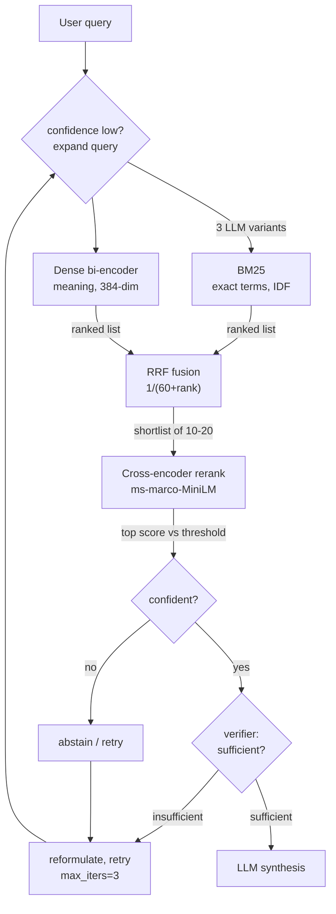

<a id="top"></a>
# Hybrid Search & Advanced Retrieval — Reading Brief

> **Read once, end to end, before the notebook.** ~15 min.
>
> **Side reference:** [`Hybrid_Search_Jargon_Card.md`](./Hybrid_Search_Jargon_Card.md).
>
> **Notebook:** `L11_and_L12_Hybrid_Search_&_Advanced_Retrieval.ipynb` — 64 cells, a direct sequel to the Agentic RAG lecture. Corpus: 20 fictional-company documents. Needs a Groq key; embeddings and reranking run locally on CPU. Five embedded MCQs with answers.

---

## 🎯 30-second TL;DR

**Last lecture the agent was the manager. This one upgrades the employee.**

In the Agentic RAG notebook the "vector tool" was a single top-k cosine lookup. Here it becomes a **stack**: BM25 for exact terms, dense embeddings for meaning, Reciprocal Rank Fusion to combine them, a cross-encoder to rerank the shortlist, a calibrated threshold for abstaining, an LLM verifier to catch off-topic retrievals, query expansion to bridge vocabulary gaps, and an iterative retry loop. The closing thesis: **retrieval in production is not a function call — it's a mini-agent that plugs into the outer agent as a tool.**

The proof is two queries that break the two retrievers in opposite directions. `INC-2847 postmortem`: BM25 nails it (4.501 vs 1.553 for the runner-up) while dense nearly ties the right document with two irrelevant postmortems (0.503 vs 0.466). Paraphrase the same intent as *"how do we stop attackers from tricking our chatbot with clever prompts"* and BM25 collapses (ranking `Access Request Procedure` third) while dense correctly surfaces Guardrail and Sentinel. **Neither alone gets both right. Fused, you get both.**

---

## 🗺️ Agenda — what the notebook teaches, in order

| § | Cells | Topic | The one idea |
|--:|------|-------|--------------|
| 0 | 0–10 | Setup + 20-document corpus | identifiers and acronyms are planted deliberately |
| 1 | 11–29 | **BM25 + dense → RRF** | fuse by *rank*, never by score |
| 2 | 30–36 | **Cross-encoder reranking** | cheap retrieve → expensive rerank |
| 2.5 | 37–40 | Head-to-head evaluation | Hit@3 and MRR on 8 labelled queries |
| 3 | 42–46 | **Query expansion** | a vocabulary bridge, gated on low confidence |
| 4 | 47–51 | **Confidence thresholds** | calibrate, then learn to say "I don't know" |
| 5 | 52–57 | **Self-correction (verifier)** | a pre-flight check before generation |
| 6 | 58–62 | **Iterative retrieval** | retrieve → verify → reformulate → retry, capped |

---

## 🧠 The big idea — Google's search box

Type an exact error code into Google and you get the pages containing that literal string, not fuzzy semantic matches. Type a rambling description and you *do* get semantic matches, because there's no exact string to latch onto. Google isn't choosing between keyword and meaning — it runs both and combines them.

That's this entire notebook. **Dense embeddings squish exact strings into fuzzy meaning**: `INC-2847` lands near other incident-shaped things, not necessarily near the one document containing it. **BM25 treats it as a rare token**, gives it a huge IDF weight, and any document containing it shoots to the top. Complementary failures, so you run both.

The second layer: retrieval gives you a *shortlist*, not an answer — a cross-encoder reading query and document **together** reranks the top 10, the same move Airbnb makes narrowing 500,000 listings to 300 candidates before a heavier ranker reorders the top 50. The third layer: a system that always returns its top-5 can never say "I don't know". The verifier is the andon cord that stops the line before the LLM confabulates.

---

## 🖼️ The picture — one diagram that holds the whole notebook

The full retrieval stack, cheap stages first:



**Reading it aloud.** Read it top to bottom as a **funnel that gets more expensive at every step**:
BM25 and the bi-encoder are milliseconds over the whole corpus, RRF is arithmetic, the cross-encoder
costs hundreds of milliseconds over *ten* documents only, and the verifier is a full LLM call over
three. That ordering is the entire architectural idea — never let an expensive stage see more than a
shortlist. The two diamonds are the parts that let the system say "I don't know": a score gate and a
semantic gate, either of which can send the query back round the loop. Note the retry arrow feeds
back into query expansion, which is why expansion is *gated* rather than always-on.

---

## 📖 Core concept primers

### 1. BM25 — rare words win

> **🪜 Mental model:** a librarian who notices unusual words. Everyone says "the"; almost nobody says "INC-2847".

BM25 scores a document by how many query terms it contains, weighted by each term's **IDF** (inverse document frequency — how rare it is corpus-wide), with a length correction so long documents don't win by sheer size.

Tokenisation matters more than it looks: `re.findall(r"[a-z0-9\-]+", text.lower())` keeps the hyphen, so `INC-2847` stays **one** token. Split it into `inc` and `2847` and you've thrown away the rarity that makes it findable — and the same tokeniser must be used for documents and queries.

**In this notebook:** for `"INC-2847 postmortem"`, BM25 scores the right document **4.501** and the next two at 1.553 — a gap driven almost entirely by the identifier's IDF. On the paraphrase it ranks `Access Request Procedure` above the relevant `Guardrail Overview`. No concept of synonymy at all.

### 2. Dense retrieval — meaning without exactness

> **🪜 Mental model:** a colleague who knows what you meant but can't remember the ticket number.

The **bi-encoder** embeds query and documents independently and compares by cosine. Document embeddings are computed once and stored, so retrieval is one query embedding plus a matrix multiply — hence it scales to millions of documents.

The cost of that independence: each document was compressed into a single vector **before the query was even known**, so exact identifiers get averaged into general "incident-ness". On `"INC-2847 postmortem"` dense scores the correct doc 0.503 against wrong postmortems at 0.466 and 0.402 — technically right, nearly a coin flip. On the paraphrase it is clearly the better retriever.

### 3. Reciprocal Rank Fusion — combine positions, not scores

> **🪜 Mental model:** an Olympic medal table. You don't add up race times across different sports; you add up finishing positions.

```
RRF(d) = Σ over rankings of  1 / (k + rank_r(d)),    k = 60
```

**In words:** for each ranked list a document appears in, add one divided by (60 plus its position in that list); sum across lists. A document at rank 1 in both lists scores 2/61 ≈ 0.0328; a document at rank 1 in one list and absent from the other scores 1/61 ≈ 0.0164.

**Why not just average the scores?** BM25 is unbounded and query-dependent (4.501 here, 400 on another corpus); cosine sits in [−1, 1]. Normalising them onto a common scale is fragile and shifts per query. **RRF sidesteps normalisation entirely** — the equation contains no reference to scores at all. That's MCQ 1's answer, and the most quotable fact in the notebook. `k = 60` is a smoothing constant compressing the gap between rank 1 and 2, so one list can't dominate the fusion.

### 4. Cross-encoder reranking — the interview, not the resume screen

> **🪜 Mental model:** the resume screener versus the interviewer.

A **bi-encoder** is the screener: it ranks resumes by embedding similarity without reading the job description closely. Fast, coarse, right for narrowing 10,000 to 50. A **cross-encoder** is the interview: query and document go into the model *together*, and it outputs one relevance score having actually attended to how they relate. Slow, precise, useless as a first-stage filter.

**Why never first-stage** (MCQ 2): bi-encoder document embeddings are precomputed, so a query costs one embedding plus a matrix multiply. A cross-encoder needs a **full forward pass per (query, document) pair** — a million documents means a million passes per query. Hence the universal pattern: cheap retriever → 20–50 candidates → expensive reranker.

**Measured latency** (shortlist → rerank time): 5 → 165 ms, 10 → 246 ms, 20 → 452 ms. Roughly linear, as predicted. Teams pick the smallest shortlist that still captures the right document.

**Watch the scores:** these are **logits**, not probabilities, and frequently negative. On `"what happened during the Kubernetes autoscaling outage"` the reranker scores `INC-3102 Postmortem` at **+5.250**, promoting it from position 2 to 1, with everything else at −2 or below. A big gap between #1 and #2 means the reranker is confident.

### 5. Query expansion — bridging vocabulary

> **🪜 Mental model:** Amazon turning "cheap laptop for kids" into several structured searches at once.

Ask the LLM for three alternative phrasings, retrieve for each, fuse with RRF. Real output from the notebook:

```
original:  how do we stop attackers from tricking our chatbot with clever prompts
variant 1: prevent prompt injection attacks on conversational AI
variant 2: mitigate adversarial prompt engineering in chatbot systems
variant 3: defense mechanisms against prompt hijacking for large language models
```

The variants speak the corpus's language. Fused results surface `Model Input Security Policy` and `Guardrail Overview`, which single-query hybrid had pushed down or missed.

**When it helps** (MCQ 3): only when user vocabulary genuinely differs from the corpus's. If the user already uses the technical terms, expansion just adds redundant queries — and it always adds latency (one LLM call plus N retrievals). Hence the production rule: **gate expansion on low confidence, don't run it blindly.**

### 6. Confidence thresholds — learning to say "I don't know"

> **🪜 Mental model:** Stack Overflow's "no results found" — a feature, not a bug.

Every retriever so far **always returns something** — ask for top-5 on a corpus with no answer and you get five confident-looking wrong documents.

Calibration: score 5 known-relevant and 5 known-irrelevant (query, document) pairs with the cross-encoder, then set a threshold between them. Measured — relevant: min −10.78, mean 2.50, max 9.46; irrelevant: min −11.48, mean −11.42, max −11.35. Threshold = (min positive + max negative) / 2 = **−11.07**.

**Why not raw cosine** (MCQ 4): bi-encoder cosine is a *relative* signal — it says which document is closer, not whether either is good. It isn't calibrated, and its range shifts with query and document length, so 0.6 can be excellent on one query and terrible on another. Cross-encoder scores separate relevant from irrelevant far better.

⚠️ **Read the actual output of this section critically** — the calibration is much shakier than the narration admits. See gotcha 2.

### 7. The verifier and the retry loop

> **🪜 Mental model:** the Toyota andon cord — stop the line before the defect moves downstream.

The verifier sits **between retrieval and generation**: given the question and the snippets, it returns `{"verdict": "sufficient" | "insufficient", "reason": "..."}`, prompted to be conservative — topically related but not directly answering ⇒ insufficient.

It works on both real tests. *"how does Guardrail handle jailbreak attempts"* → **sufficient**, citing instruction-hierarchy tagging and adversarial-suffix detection. *"our policy on employee remote work in Antarctica"* → **insufficient**, noting the snippets cover on-call rotation and model input security instead.

`iterative_retrieve` wraps it: retrieve → verify → if insufficient, pick an unused query variant and retry, up to `max_iters=3`. Exit without a sufficient verdict and the caller returns an honest "not enough information".

**The composition point:** from the outer agent's perspective the vector tool has the same interface as before — ask a question, get documents. Internally it now does hybrid, rerank, verify and retry. Both loops have iteration caps; both know how to fail honestly.

---

## 🔥 The headline experiment — read this one sceptically

Eight labelled queries, four retrievers, actual measured results:

| Retriever | Hit@3 | MRR |
|---|---|---|
| BM25 only | 1.00 | 0.938 |
| Dense only | 1.00 | 0.938 |
| Hybrid (RRF) | 1.00 | 0.938 |
| **Hybrid + Rerank** | **0.88** | **0.906** |

**The numbers do not show layers helping.** They show three retrievers tied and the fourth regressing. The prose says *"look at Hit@3 and MRR climbing as we stack layers"* — its own output does not support that. The per-query table shows why: every retriever puts the correct document at rank 1 on seven of eight queries; on the eighth (the paraphrase, target `D15`) BM25, dense and hybrid all reach rank 2, while reranking pushes it **down to rank 4**.

Three things to take from it:

1. **The eval set is too easy** — seven of eight are already solved at rank 1 by the simplest retriever, leaving no headroom to demonstrate improvement. A ceiling effect.
2. **Eight queries is far too few.** One query moving one rank swings MRR by several points.
3. **Reranking is not free.** A small cross-encoder can genuinely reorder a good shortlist for the worse.

The section's *stated* discipline is exactly right: keep a labelled eval set, run every change against it, never ship a retriever that regresses. This run caught a regression — the correct response is to widen the eval set and re-measure, not to narrate it as a win.

---

## 🧮 Formulas to memorise

**1. Reciprocal Rank Fusion**
```
RRF(d) = Σ_r  1 / (k + rank_r(d)),   k = 60
```
*In words:* for every ranked list the document appears in, take one divided by (the smoothing constant 60 plus its position in that list), and add those up. **Worked example:** a document at rank 1 in BM25 and rank 2 in dense scores 1/61 + 1/62 = 0.01639 + 0.01613 = **0.03252**. A document in only one list at rank 3 scores 1/63 = **0.01587**. Notice there is no score anywhere in the formula — that's the whole point.

**2. BM25's rare-term weighting (IDF)**
```
idf(term) ≈ log( N / df(term) )     N = total documents,  df = documents containing the term
```
*In words:* a term's weight is the log of the total document count divided by how many documents contain it — rare terms weigh heavily, ubiquitous ones almost nothing. **Worked example:** with N = 3 and "machine" in D1 and D2, df = 2, so idf ≈ log(3/2) — small. In the 20-document corpus `INC-2847` has df = 1, so idf ≈ log(20) — roughly seven times larger. That ratio is why BM25 scores the right postmortem 4.501 and everything else 1.553 or 0.

**3. Mean Reciprocal Rank**
```
MRR = (1/Q) · Σ_q  1 / rank_q      (0 if the correct document was never retrieved)
```
*In words:* for each query take one divided by the position of the correct document, then average. **Worked example:** seven queries at rank 1 and one at rank 2 gives (7×1 + 1×0.5) / 8 = **0.938** — exactly the notebook's number. Push that one query from rank 2 to rank 4 and you get (7 + 0.25)/8 = **0.906**, the reranked row.

---

## 🗺️ Notebook reading map

| Cells | What it teaches | How to read |
|---|---|---|
| 1–6 | Recap, install, Groq key, embedding model | **Skim** — but see gotcha 1 (cell 0 is the Colab badge) |
| 7–11 | The 20-document corpus | **Focus on cell 8's comment**: identifiers are planted on purpose |
| 12–20 | BM25 theory + 3-document IDF worked example | **Focus.** The manual IDF walk-through is the clearest bit here |
| 21–25 | Dense fails on identifier; BM25 fails on paraphrase | **Focus.** Compare the four score lists side by side |
| 26–30 | RRF + hybrid results + MCQ 1 | **Focus.** MCQ 1 is the most interview-quotable fact |
| 31–37 | Cross-encoder, reranking, latency, MCQ 2 | **Focus.** Scores are logits and often negative |
| 38–41 | Evaluation, Hit@3 / MRR, per-query table | **Focus — read the numbers, not the prose** |
| 43–47 | Query expansion + MCQ 3 | **Read normally.** The three variants are the lesson |
| 48–52 | Calibration, thresholds, MCQ 4 | **Read critically.** The gate doesn't fire |
| 53–58 | Deliberate-failure demo + verifier | **Focus.** The failure demo didn't actually fail |
| 59–63 | Iterative retrieval + MCQ 5 + wrap-up | **Read.** Both demos pass on iteration 1 |

---

## ⚠️ Gotchas

1. **Cell 4 used to carry a hardcoded Groq API key** (`os.environ["GROQ_API_KEY"] = "gsk_..."`). It has since been removed from the committed notebook — cell 4 now falls through to `userdata.get('GROQ_API_KEY')` with a prompt fallback. **That key still needs rotating at Groq**: it was live in a tracked file, so treat it as compromised regardless of the redaction.
2. **The confidence gate never fires.** With threshold −11.07, the nonsense query *"the company's stance on time travel research"* scores **−10.95** — above it — so the result is `status: "ok"`. The markdown claims it "triggers a low-confidence signal". It doesn't. The positive range (−10.78 to +9.46) overlaps the negative range, so 10 pairs give no clean separation. Real calibration needs far more pairs and a deliberate precision/recall trade-off.
3. **The eval table contradicts the text.** Trust the table — see the headline section above.
4. **The "deliberate failure" demo didn't fail.** Handed three off-topic documents, the model correctly said the context contains no such information. The notebook hedges ("depending on the model's mood"), but you did **not** witness the hallucination the verifier exists to prevent.
5. **The retry loop never retried.** Both queries were judged sufficient on iteration 1, so the reformulate-and-retry branch is untested — the same blind spot as the reflection loop two lectures back.
6. **Cross-encoder scores are logits; negative is normal.** A top result at −2.572 isn't a failure — read the gap to #2, not the distance from zero.
7. **Cells 17, 19 and 20 are empty.** The IDF worked example is markdown only.
8. **Query expansion is non-deterministic** — variants differ per run (compare cells 44 and 45), so your rankings won't match the notebook's exactly.
9. **Tokenise queries and documents identically**, or BM25 silently stops matching. The hyphen in the regex keeps `INC-2847` in one piece.

---

## 🏛️ Staff-engineer lens

*Rung 4. Everything below assumes the beginner material above; nothing more.*

### Where this breaks at scale

Everything in this notebook is a **linear scan**, and each one breaks at a different corpus size.
`BM25Okapi` holds the tokenised corpus in memory and scores every document per query — fine at 20,
untenable at 10 million, where you need a real inverted index (Elasticsearch/OpenSearch, Lucene) with
postings lists and skip pointers. `DOC_MATRIX @ q` is exact brute-force nearest neighbour, replaced
by an **approximate** HNSW index; note that this is a genuine accuracy trade, not a free win — ANN
recall is typically 95-99%, so you lose a little to gain sublinear search.

The cross-encoder is the one that *doesn't* break, precisely because it never sees the corpus — it
sees 10-20 candidates regardless of whether you have 20 documents or 20 million. That invariance is
the whole point of two-stage retrieval, and it's the single most transferable idea here.

What does break with scale is the **shortlist size decision**. Recall@shortlist falls as the corpus
grows, so the 10 that worked at 20 documents may need to be 50 at 10 million — and the measured
latency table says 20 candidates already costs 452 ms.

### Latency & cost budget

Measured in the notebook, plus what production adds:

| Stage | Measured | At scale |
|---|---|---|
| BM25 + dense | ~ms over 20 docs | ~10-40 ms with real indexes |
| RRF | arithmetic | free |
| **Cross-encoder rerank** | **165 / 246 / 452 ms** for 5 / 10 / 20 | **dominates; GPU-bound** |
| Verifier | 1 LLM call, ~50-200 ms | same, per request |
| Query expansion | 1 LLM call + N retrievals | only when gated on |

**Reranking dominates, and it scales linearly with shortlist size** — 5→20 candidates roughly
triples the cost. That linearity is why "20-50" is the industry range: it's the knee where recall
gain stops paying for latency. Worst case a single query costs 1 expansion call + N retrievals +
rerank + verify + retry ×3 — which is why every one of those is gated or capped, and why an
always-on version of this pipeline would be indefensible.

### The trade-off you're actually making

**Each layer buys accuracy by paying latency, and the last two buy honesty by paying latency.** The
first half is standard: hybrid costs a second retrieval, reranking costs hundreds of milliseconds,
expansion costs an LLM call. The second half is the interesting purchase — the threshold gate and the
verifier buy the ability to **say "I don't know"**, and that is the one capability none of the
retrieval improvements can provide.

Frame it the way the notebook's Stack Overflow analogy does: *"no results found"* is a product
decision about whether a confidently wrong answer is worse than no answer. In a support bot, yes,
overwhelmingly. In an exploratory search UI, showing something imperfect is better than a blank page.
**The architecture follows from that product call, not the reverse.**

### Failure modes to forecast

Ranked by how quietly they fail — and this notebook demonstrates the top two by accident:

1. **A confidence gate calibrated on too little data, that never fires.** Threshold −11.07, nonsense
   query scores −10.95, `status: "ok"`. Ten calibration pairs whose positive range (−10.78 to +9.46)
   overlaps the negative range cannot produce a separating threshold. You now have the *appearance*
   of an abstention mechanism and none of the protection — strictly worse than no gate, because you
   trust it.
2. **An eval set with no headroom.** Seven of eight queries solved at rank 1 by the simplest
   retriever, so the table cannot distinguish the retrievers and a real regression (0.88 vs 1.00)
   reads as noise. A ceiling-effect eval set silently green-lights bad changes.
3. **Tokeniser drift between index and query** — BM25 stops matching, no error, quietly worse recall.
4. **Index staleness after re-embedding with a different model**, mixing incompatible vector spaces.
5. **Query expansion adding noise on already-specific queries** — the notebook flags this, which is
   why expansion must be gated on low confidence rather than run blindly.

### Why an interviewer asks this

"Why hybrid search?" is a litmus test for **whether you understand that retrievers fail in
complementary ways** rather than one simply being better. The weak answer is "hybrid is more
accurate." The strong answer names the two failure modes — exact identifiers kill dense, vocabulary
mismatch kills sparse — and then explains why RRF fuses by rank: because BM25 scores are unbounded
and cosine is in [−1, 1], so any weighted sum needs a normalisation that is fragile and
query-dependent.

The follow-up that separates senior from staff is the two-stage question: *"why not rerank
everything?"* — answered by N forward passes versus precomputed embeddings plus one matrix multiply.
And the staff-plus probe is evaluation: *"how do you know it got better?"* This notebook is the
cautionary tale — it shipped narration that its own numbers contradict. Being able to look at a
retrieval table and say "this eval set has no headroom, I don't trust this result" is the judgement
being tested.

[🔝 Back to top](#top)

---

## ✅ Walk-away checklist

- [ ] Why BM25 wins on `INC-2847` and loses on a paraphrase — in terms of IDF.
- [ ] Why dense is the mirror image: what a bi-encoder compresses, and when.
- [ ] Why RRF fuses by rank rather than score, and what `k = 60` does.
- [ ] Why a cross-encoder can never be first-stage, and how rerank latency scales.
- [ ] Why raw cosine is a poor abstention signal and a calibrated cross-encoder score is better.
- [ ] What the verifier does that the previous lecture's reflection didn't.
- [ ] Why this notebook's own eval table shows a regression, and what that teaches.
- [ ] **(staff)** Which pipeline stage is invariant to corpus size, and why that's the point of two-stage retrieval.
- [ ] **(staff)** Why a confidence gate that never fires is worse than no gate at all.

---

## 🎯 Self-check — 5 beginner + 3 staff

1. A user searches `RFC-014`. Which retriever finds it instantly, which struggles, and what single property of the term explains both?
2. BM25 returns 4.501 for its top hit; cosine similarity is bounded in [−1, 1]. Why is averaging them a bad idea, and what does RRF do instead?
3. Your corpus has 2 million documents and you want cross-encoder accuracy. What's the architecture, and why can't you simply rerank everything?
4. Document D appears at rank 1 in BM25 and rank 2 in dense. Document E appears at rank 3 in dense only. Compute both RRF scores with k = 60 and say which wins.
5. Your reranker shows Hit@3 of 0.88 against 1.00 for plain hybrid on your 8-query eval set. Give two plausible explanations and say what you'd do next.

**Staff-level (answerable from the 🏛️ section):**

6. Your corpus goes from 20 documents to 10 million. Walk each stage of the pipeline and say what changes — including the one stage that doesn't.
7. You inherit this system. The confidence gate has never fired in production. Diagnose it, and say why the current state is worse than having no gate.
8. Your team wants to ship a reranker that improves MRR from 0.938 to 0.951 on the 8-query eval set. Do you ship it?

<details>
<summary><strong>Answers</strong></summary>

1. **BM25 finds it instantly; dense retrieval struggles.** The explanation for both is **rarity**: `RFC-014` appears in exactly one of 20 documents, so its IDF weight is large and BM25 shoots that document to the top. The same rarity is why dense fails — an embedding model compresses a document into a vector capturing general meaning, so a rare identifier gets averaged into generic "RFC-ness" and sits near the other RFCs rather than uniquely near its own document.

2. The two score scales are incomparable: BM25 is unbounded and query-dependent (4.501 on this query, a different magnitude on the next), while cosine sits in [−1, 1]. Averaging requires normalising them onto a common scale, which is fragile and shifts per query. **RRF uses only rank positions** — `Σ 1/(k + rank)` — and positions are on the same scale by definition, so no normalisation is needed at all.

3. Two stages: a cheap first-stage retriever (hybrid BM25 + dense) narrows 2 million to a **shortlist of 20–50**, then the cross-encoder reranks only those. You can't rerank everything because a cross-encoder scores query and document **jointly** — one full forward pass per pair, so 2 million forward passes per query. A bi-encoder precomputes document embeddings once, making retrieval a single query embedding plus a matrix multiply.

4. D = 1/(60+1) + 1/(60+2) = 0.01639 + 0.01613 = **0.03252**. E = 1/(60+3) = **0.01587**. D wins by roughly 2×. The lesson: appearing in *both* lists is worth far more than a slightly better position in one — which is exactly the robustness hybrid search is buying.

5. (a) **Ceiling effect and tiny sample** — seven of eight queries are already solved at rank 1 by the simplest retriever, so there's no headroom to show improvement, and with only 8 queries a single one moving by one rank swings MRR by several points. (b) **A genuine regression** — a small cross-encoder really can reorder a good shortlist for the worse on a particular query type (here it pushed the paraphrase target from rank 2 to rank 4). Next step: **widen the eval set** to include hard queries the baseline actually fails, re-measure, and inspect the per-query table to see whether the reranker's losses are systematic (a query type it's bad at) or noise. Do not ship a retriever that regresses on your eval set.

**Staff answers**

6. **BM25:** in-memory `BM25Okapi` scoring every document becomes a real inverted index (Elasticsearch/OpenSearch/Lucene) with postings lists — same algorithm, different data structure. **Dense:** `DOC_MATRIX @ q` exact brute force becomes an ANN index (HNSW via FAISS/Chroma/pgvector); note this is a real trade — you accept ~95-99% recall for sublinear search. **RRF:** unchanged, it's arithmetic over ranks. **Cross-encoder: unchanged — and this is the interesting answer.** It only ever sees the 10-20 shortlisted candidates, so its cost is invariant to corpus size; that invariance is the entire reason two-stage retrieval exists. **What you must retune:** shortlist size, because recall@k falls as the corpus grows — you may need 50 candidates instead of 10, and the latency table says that costs roughly 3×. **What you must add:** an ingestion pipeline, since nothing here updates an index incrementally.

7. **Diagnosis:** the threshold was calibrated from 10 labelled pairs whose score ranges *overlap* — relevant pairs span −10.78 to +9.46, irrelevant ones cluster at −11.48 to −11.35 — so the midpoint rule produces −11.07, a value below almost everything including genuinely irrelevant results. The notebook's own nonsense query scores −10.95 and passes. **Why it's worse than no gate:** with no gate, everyone downstream knows the retriever always returns something and treats results with appropriate suspicion. With a gate that never fires, you have a `status: "ok"` field that the rest of the system — and the humans reading dashboards — treat as a *signal*, when it's a constant. You've added false assurance, which is the most expensive kind of bug. **Fix:** calibrate on hundreds of labelled pairs across query types, choose the threshold from an explicit precision/recall trade-off rather than a midpoint, and monitor the firing rate in production — a gate that fires 0% or 100% of the time is broken by definition.

8. **No — not on that evidence.** An 8-query eval set where seven queries are already solved at rank 1 by the simplest retriever has no headroom: the entire difference between 0.938 and 0.951 is one query moving a fraction of a rank, which is indistinguishable from noise. You cannot detect a 1.3-point improvement with a sample of 8. **What I'd require first:** expand the eval set to a few hundred labelled queries that deliberately include the hard cases the baseline *fails* — identifier queries, paraphrases, vocabulary mismatches, and queries with no answer in the corpus — then re-measure with per-query rank deltas so you can see whether the reranker's wins and losses are systematic or random. This notebook is the cautionary tale in both directions: on its eval set the reranker actually *regressed* to 0.88/0.906, and the prose still described the metrics as climbing. If your eval set can't tell you which way you moved, it can't authorise a ship.

</details>

[🔝 Back to top](#top)
