# Hybrid Search & Advanced Retrieval

**Module 8 · Lectures 11–12** — from *"I don't understand hybrid search"* to *"I can design it in production."*

> **Source notebook:** [`L11_and_L12_Hybrid_Search_&_Advanced_Retrieval.ipynb`](./L11_and_L12_Hybrid_Search_%26_Advanced_Retrieval.ipynb)
> **Diagrams:** [`images/`](./images/) — 17 figures built specifically for these notes.

**The one-line story:** last class the agent was the *manager*; today we upgrade the *employee*. The vector tool stops being a single top-k lookup and becomes a small system that can search two ways, fuse the results, re-rank them, judge its own output, and retry.

---

## Source of truth

Two kinds of content appear below, always labelled:

| Marker | Meaning |
|---|---|
| *(unmarked)* | **From the notebook** — concepts, code, numbers and outputs as they actually ran |
| > **⊕ Engineering context** | **Added by me** — production material the notebook did not cover |

Nothing is fabricated. Where the notebook's prose disagrees with its own recorded output, I say so and trust the output.

---

## The big picture — read this first

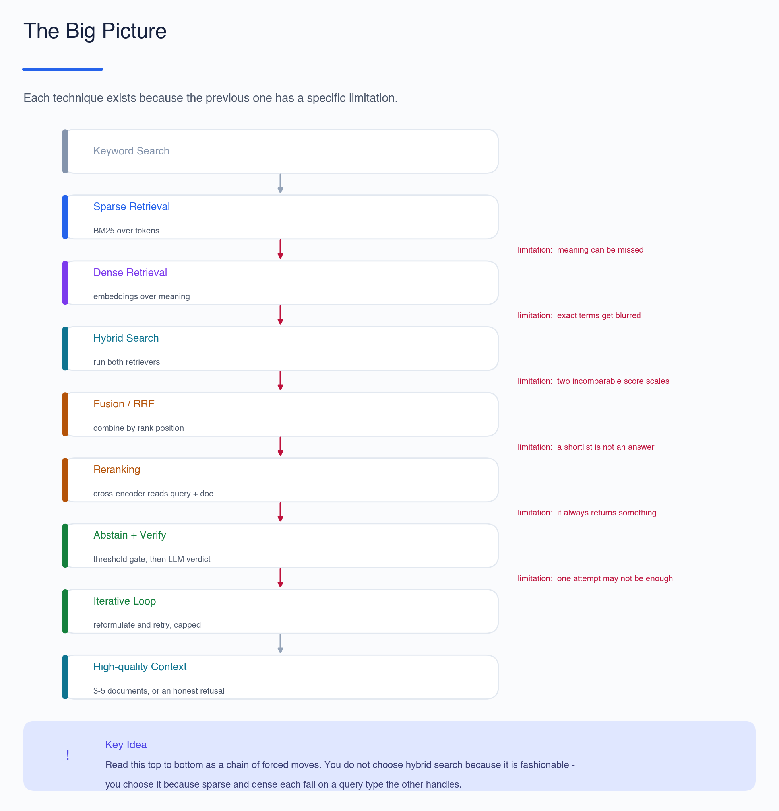

Every technique in this lesson exists because the previous one has a **specific, nameable limitation**. That chain is the whole lesson:

```text
Sparse retrieval      → misses meaning
      ↓
Dense retrieval       → blurs exact terms
      ↓
Hybrid search         → two incomparable score scales
      ↓
RRF fusion            → a shortlist is not an answer
      ↓
Reranking             → it still always returns something
      ↓
Abstain + verify      → one attempt may not be enough
      ↓
Iterative loop        → high-quality context
```

If you remember nothing else, remember that you never *choose* hybrid search because it is fashionable — you are **forced into it** by a failure you can demonstrate.

### Contents

| Part | Concept | Taught with |
|---|---|---|
| [1](#part-1) | Why one retriever is not enough | the Why-layer + a mental model |
| [2](#part-2) | Sparse retrieval / BM25 | worked IDF example |
| [3](#part-3) | Dense retrieval / embeddings | data-flow diagram + the cosine trick |
| [4](#part-4) | Sparse vs dense | comparison matrix + evidence |
| [5](#part-5) | Hybrid search | pipeline diagram |
| [6](#part-6) | Reciprocal Rank Fusion | formula → worked example → intuition |
| [7](#part-7) | Cross-encoder reranking | architecture comparison |
| [8](#part-8) | Multi-stage retrieval & latency | measured numbers |
| [9](#part-9) | Evaluation | the honest failure |
| [10](#part-10) | Query expansion | before/after |
| [11](#part-11) | Abstention & verification | two-gate diagram |
| [12](#part-12) | Iterative retrieval | state loop |
| [13](#decision-guide) | **Decision guide** | decision tree |
| [14](#production) | **Production architecture** ⊕ | system diagram |
| [15](#interview) | Interview & revision questions | 5 tiers |
| [16](#explain) | Explain it yourself | active recall |
| [17](#cheatsheet) | One-page revision | night-before cheat sheet |

---

<a id="part-1"></a>

## Part 1 — Why one retriever is not enough

### The Why layer

| | |
|---|---|
| **Problem** | A user asks a question. We must find the few documents that answer it. |
| **Naive approach** | One embedding lookup: embed the query, take the top-k nearest documents. This is what the agent's vector tool did last class. |
| **Limitation** | It collapses the moment a user types an **exact identifier**, an acronym, or a query whose **vocabulary differs** from the corpus. |
| **Solution** | Run a second, completely different retriever and combine them. |
| **Trade-off** | Two indexes to build and keep fresh, two failure modes to operate, and a fusion rule you now have to justify. |

### The mental model

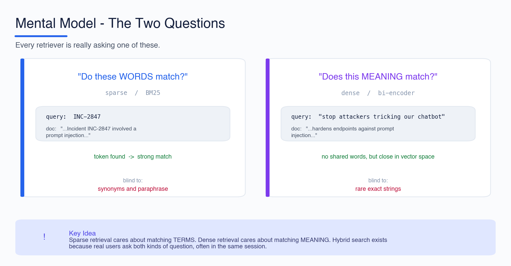

> ### 🧠 Mental Model
> **Sparse retrieval asks *"Do these WORDS match?"***
> **Dense retrieval asks *"Does this MEANING match?"***
> Real users ask both kinds of question — often in the same session.

### The corpus that makes this visible

The notebook deliberately builds a 20-document corpus for a fictional company containing **planted identifiers** (`INC-2847`, `RFC-014`, `RFC-021`) and **paraphrase-friendly** deep-dives. Last class used 6 documents, where every retriever returns roughly the same top-3 and hybrid search looks pointless.

```python
DOCUMENTS = [
    ("D01", "project",  "Guardrail Overview",
     "Project Guardrail hardens the company LLM endpoints against prompt injection and "
     "jailbreak attacks. It covers input sanitization, output filtering, and periodic red teaming."),
    ("D06", "incident", "INC-2847 Postmortem",
     "Incident INC-2847 involved a prompt injection attack against the Guardrail-protected "
     "chat endpoint... Root cause: output filter regression after the v2.3 deploy."),
    ("D15", "deepdive", "How Guardrail Handles Jailbreaks",
     "The Guardrail defense pipeline layers several techniques against jailbreak attempts: "
     "instruction hierarchy tagging, adversarial suffix detection, and periodic red-team evaluations."),
    # ... 17 more across project / incident / rfc / policy / deepdive / onboarding
]
print("Total documents:", len(DOCUMENTS))   # -> 20
```

**Documents referenced throughout these notes:**

| ID | Title | Why it matters here |
|---|---|---|
| D01 | Guardrail Overview | the paraphrase target's sibling |
| D02 | Sentinel Overview | shares vocabulary with D01 |
| D06 | **INC-2847 Postmortem** | the identifier-query target |
| D07 | INC-3102 Postmortem | Kubernetes outage — rerank example |
| D12 | Model Input Security Policy | surfaces only after query expansion |
| D15 | **How Guardrail Handles Jailbreaks** | the paraphrase-query target |

The embedding matrix everything else reuses:

```python
DOC_TEXTS  = ["{}. {}".format(d[2], d[3]) for d in DOCUMENTS]
DOC_MATRIX = embed_texts(DOC_TEXTS)
print("Embedding matrix shape:", DOC_MATRIX.shape)   # -> (20, 384)
```

> ### 🧠 Remember
> - 20 documents × 384 dimensions. One row per document; a query becomes the same shape.
> - The corpus was **designed** to contain both query shapes. Corpus design is part of experiment design.

---

<a id="part-2"></a>

## Part 2 — Sparse Retrieval (BM25)

### Level 1 · Intuition

Sparse retrieval matches **literal words**. It is called *sparse* because each document is a vector with one slot per vocabulary word, and nearly every slot is zero.

BM25's single idea:

> A word appearing in **few** documents tells you a lot when it matches. A word appearing in **every** document tells you almost nothing.

Search *"the incident report"*: **the** appears in all 20 documents (worthless), **incident** in 3 (useful), `INC-2847` in exactly 1 (**decisive**).

### Level 2 · Mechanics

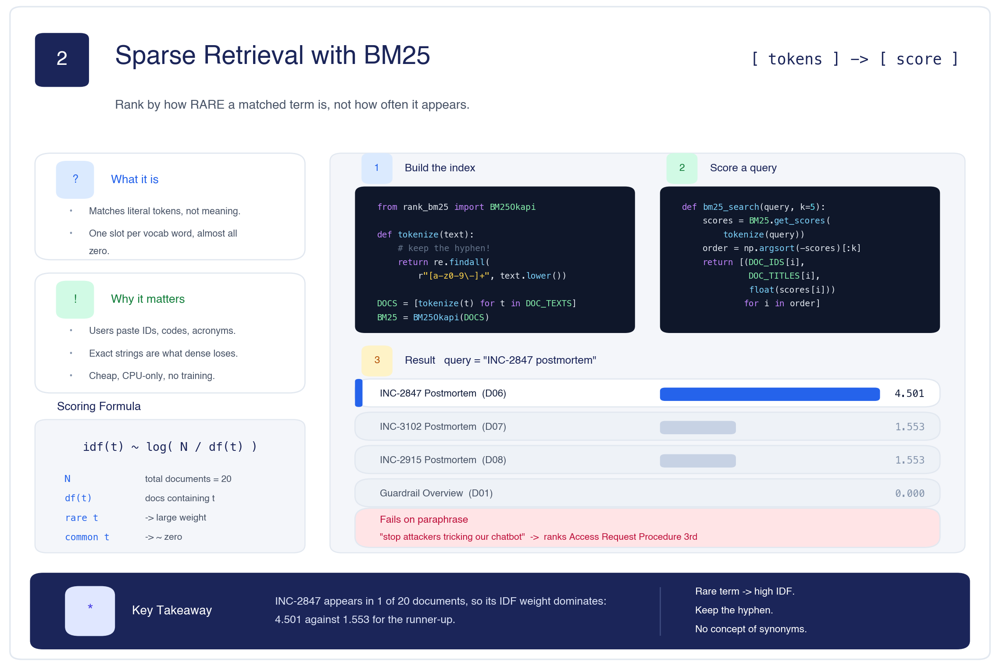

Four steps: tokenise identically → compute each term's **IDF** → sum matched terms weighted by IDF and in-document frequency → correct for document length.

**Worked IDF example** (from the notebook), corpus of `N = 3`:

| Doc | Text | Contains "machine"? |
|---|---|---|
| D1 | machine learning is powerful | ✅ |
| D2 | machine learning machine learning | ✅ |
| D3 | deep learning is useful | ❌ |

```text
df(machine) = 2
idf(term)  ~ log( N / df(term) )
```

**In words:** a term's weight is the log of the total document count divided by how many documents contain it. Rare → large weight. Everywhere → weight near zero.

### Level 3 · Implementation

```python
from rank_bm25 import BM25Okapi

def tokenize(text):
    return re.findall(r"[a-z0-9\-]+", text.lower())

TOKENIZED_DOCS = [tokenize(t) for t in DOC_TEXTS]
BM25 = BM25Okapi(TOKENIZED_DOCS)

def bm25_search(query, k=5):
    scores = BM25.get_scores(tokenize(query))
    order = np.argsort(-scores)[:k]
    return [(DOC_IDS[i], DOC_TITLES[i], float(scores[i])) for i in order]
```

**The line that matters most is the tokenizer.** `[a-z0-9\-]+` **keeps the hyphen**, so `INC-2847` survives as one token. Split it into `inc` + `2847` and you destroy exactly the rarity that made it findable.

**Result:**

```text
BM25 top-5 for "INC-2847 postmortem":
  4.501  INC-2847 Postmortem  (D06)
  1.553  INC-3102 Postmortem  (D07)
  1.553  INC-2915 Postmortem  (D08)
  0.000  Guardrail Overview  (D01)
```

#### Where 4.501 actually comes from

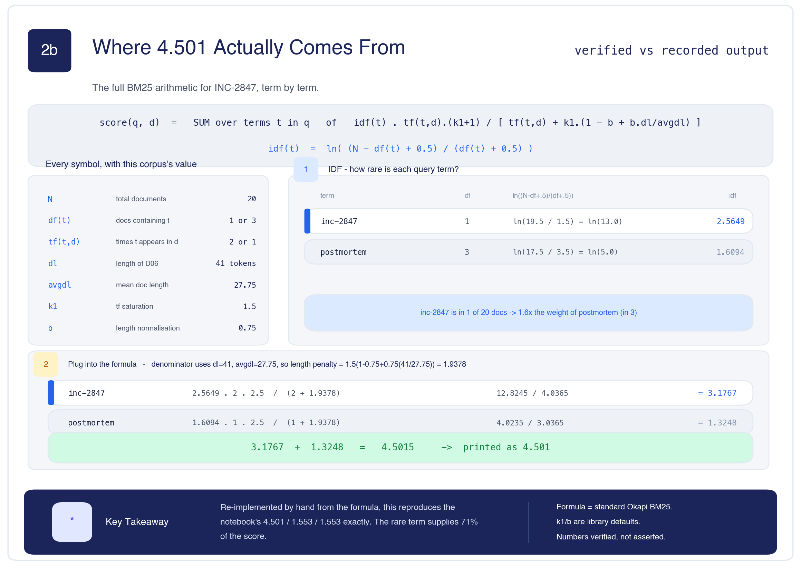

> **⊕ Engineering context.** The notebook only calls `BM25.get_scores()` — the arithmetic below is
> the library's internals, not something the notebook derives. **But it is verified, not asserted:**
> [`scripts/verify_bm25_derivation.py`](../../scripts/verify_bm25_derivation.py) re-implements Okapi
> BM25 from the published formula and reproduces the notebook's `4.501 / 1.553 / 1.553` **exactly**.

**The formula:**

```text
                                       idf(t) x tf(t,d) x (k1+1)
score(q,d) = SUM over t in q of   ---------------------------------------
                                  tf(t,d) + k1 x (1 - b + b x dl/avgdl)

idf(t)     = ln( (N - df(t) + 0.5) / (df(t) + 0.5) )
```

**Every symbol, with this corpus's value:**

| Symbol | Meaning | Value here |
|---|---|---|
| `N` | total documents | **20** |
| `df(t)` | documents containing `t` | 1 (`inc-2847`), 3 (`postmortem`) |
| `tf(t,d)` | times `t` appears in D06 | 2 (`inc-2847`), 1 (`postmortem`) |
| `dl` | length of D06 in tokens | **41** |
| `avgdl` | mean document length | **27.75** |
| `k1` | term-frequency saturation | 1.5 *(library default)* |
| `b` | length normalisation | 0.75 *(library default)* |

**Step 1 — how rare is each query term?**

| term | df | `ln((N-df+0.5)/(df+0.5))` | idf |
|---|--:|---|--:|
| `inc-2847` | 1 | ln(19.5 / 1.5) = ln(13.0) | **2.5649** |
| `postmortem` | 3 | ln(17.5 / 3.5) = ln(5.0) | **1.6094** |

**Step 2 — the length penalty**, shared by both terms:

```text
k1 x (1 - b + b x dl/avgdl) = 1.5 x (1 - 0.75 + 0.75 x 41/27.75) = 1.9378
```

**Step 3 — each term's contribution:**

| term | numerator | denominator | contributes |
|---|---|---|--:|
| `inc-2847` | 2.5649 x 2 x 2.5 = 12.8245 | 2 + 1.9378 = 4.0365 | **3.1767** |
| `postmortem` | 1.6094 x 1 x 2.5 = 4.0235 | 1 + 1.9378 = 3.0365 | **1.3248** |
| | | **total** | **4.5015 → printed 4.501** |

> 🧠 **Read the split.** `inc-2847` supplies **71%** of the score off a single extra occurrence,
> purely because its IDF is 1.6× higher. *That* is what "rarity is the signal" means numerically.

**And where it breaks** — same intent, different words:

```text
"how do we stop attackers from tricking our chatbot with clever prompts"
  2.829  Sentinel Overview  (D02)
  2.514  How Guardrail Handles Jailbreaks  (D15)
  2.514  Access Request Procedure  (D19)   ← completely irrelevant
```

### Level 4 · Engineering

**What to watch out for:** documents and queries must use the **same** tokenizer. Drift between index-build and query time makes BM25 silently stop matching — no error, just quietly worse recall. This is one of the hardest retrieval bugs to spot.

> **⊕ Engineering context.** `BM25Okapi` holds the corpus in RAM and scores **every** document per query — fine at 20, untenable at 10 million. Production uses a real **inverted index** (Lucene / Elasticsearch / OpenSearch) that stores a **postings list** per term, so a query touches only documents containing at least one query term. Sparse also needs no GPU and no training, which makes it both a strong baseline and an excellent **fallback** when the dense path is degraded. **Learned sparse** retrieval (SPLADE) sits in between: sparse vectors with learned term weights, keeping interpretability while adding some semantic matching.

> ### 🧠 Remember
> - **IDF is the whole idea.** Rarity is the signal.
> - `INC-2847` in 1 of 20 docs → **4.501 vs 1.553**. Decisive.
> - **Zero concept of synonymy.** Paraphrase kills it.
> - **Tokenizer consistency** is a silent-failure landmine.

---

<a id="part-3"></a>

## Part 3 — Dense Retrieval (Embeddings)

### The Why layer

| | |
|---|---|
| **Problem** | BM25 cannot match *"chatbot tricks"* to *"prompt injection"*. |
| **Naive approach** | Hand-build a synonym dictionary. |
| **Limitation** | Doesn't scale, never complete, and can't capture phrase-level meaning. |
| **Solution** | Learn a mapping from text → vector where **similar meanings land near each other**, then search by distance. |
| **Trade-off** | You now need a model, a vector index, and re-embedding whenever the model changes — and you lose exact-string precision. |

### Level 1 · Intuition

An **encoder** converts each document into 384 numbers — an **embedding** — arranged so texts with similar meaning point in similar directions. *Dense* because every one of the 384 numbers carries information.

### Level 2 · Mechanics

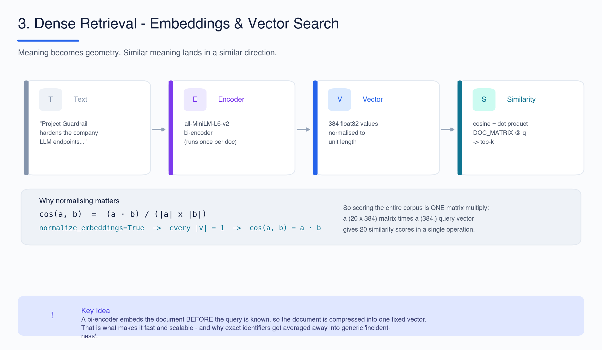

### Level 3 · Implementation

```python
def dense_search(query, k=5):
    q = embed_texts([query])[0]
    scores = DOC_MATRIX @ q
    order = np.argsort(-scores)[:k]
    return [(DOC_IDS[i], DOC_TITLES[i], float(scores[i])) for i in order]
```

Three lines, three ideas:

1. `embed_texts([query])[0]` — put the query in the **same 384-d space** as the documents.
2. `DOC_MATRIX @ q` — a (20 × 384) matrix times a (384,) vector → **all 20 scores in one operation**.
3. `np.argsort(-scores)` — NumPy sorts ascending, so negating gives descending.

**Why it's a bare dot product.** Cosine similarity is normally:

```text
cos(a, b) = (a · b) / (|a| × |b|)
```

**In words:** the dot product divided by both lengths. But `embed_texts` passes `normalize_embeddings=True`, forcing every vector to length 1 — the denominator becomes 1, and **cosine *is* the dot product**. That single flag is why the code is one `@`.

**Result — the correct doc wins, but barely:**

```text
"INC-2847 postmortem"
  0.503  INC-2847 Postmortem  (D06)
  0.466  INC-2915 Postmortem  (D08)   ← wrong incident, nearly tied
  0.402  INC-3102 Postmortem  (D07)
```

### Level 4 · Engineering

#### Where 0.503 actually comes from

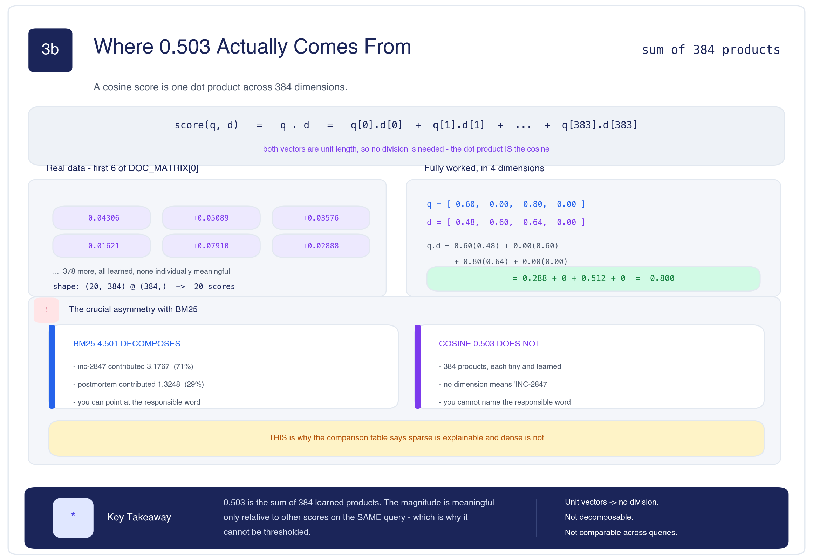

There is no clever trick here — **the score is one dot product**:

```text
score(q,d) = q . d = q[0].d[0] + q[1].d[1] + ... + q[383].d[383]
```

Because `normalize_embeddings=True` made both vectors unit length, there is no division: the dot
product *is* the cosine.

**Fully worked, in 4 dimensions** (a miniature — the real thing has 384):

```text
q = [ 0.60, 0.00, 0.80, 0.00 ]
d = [ 0.48, 0.60, 0.64, 0.00 ]

q.d = 0.60(0.48) + 0.00(0.60) + 0.80(0.64) + 0.00(0.00)
    = 0.288      + 0          + 0.512      + 0
    = 0.800
```

**The real vector** — the notebook printed `DOC_MATRIX[0]`, whose first six components are:

```text
-0.04306   +0.05089   +0.03576   -0.01621   +0.07910   +0.02888   ... 378 more
```

`0.503` is the sum of 384 such products.

> ### 🧠 The asymmetry with BM25
> **BM25's 4.501 decomposes** — `inc-2847` gave 3.1767, `postmortem` gave 1.3248. You can point at
> the word responsible.
> **Cosine's 0.503 does not.** No single dimension means "INC-2847"; the 384 numbers are learned and
> individually meaningless. You cannot name the responsible word.
>
> This is *why* the comparison table says sparse is explainable and dense is not — and why §10 cannot
> threshold a cosine score across queries.

**The root cause is structural, and worth stating precisely:** a **bi-encoder** compresses a document into one fixed vector **before the query is known**. Anything that doesn't survive that compression is gone. Rare identifiers are the first casualty.

Also: **cosine scores are not comparable across queries** (this comes back in Part 11), and **changing the embedding model invalidates the entire index** — you cannot mix two models' vectors.

> **⊕ Engineering context.** `DOC_MATRIX @ q` is exact brute-force nearest neighbour — O(N) per query, whole matrix in RAM. At scale you move to an **approximate nearest neighbour (ANN)** index, typically **HNSW** (FAISS / Qdrant / Weaviate / `pgvector`). **This is a real trade, not a free win:** ANN recall is typically **95–99%**, so you accept occasionally missing the true nearest neighbour to gain sublinear search. Memory: 10M docs × 384 dims × 4 bytes ≈ **15 GB** before index overhead; quantisation trades recall for memory. Note also that the notebook runs MiniLM **locally on CPU** — zero marginal cost and no document text crosses a network boundary, which is simultaneously the cheap option and the data-residency-compliant one.

> ### 🧠 Remember
> - **Normalise once → cosine becomes a dot product → whole corpus in one matrix multiply.**
> - The bi-encoder embeds the document **before the query exists**. That is both its speed and its blind spot.
> - `0.503` vs `0.466` on an identifier query is *nearly a coin flip*.

---

<a id="part-4"></a>

## Part 4 — Sparse vs Dense

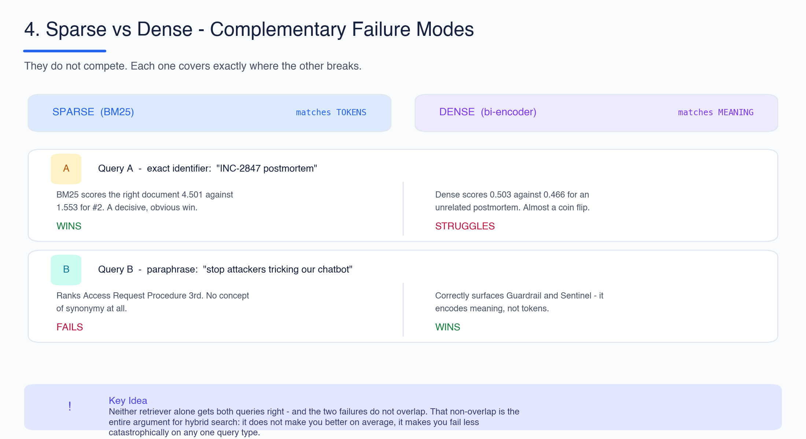

### The comparison matrix

| | **Sparse (BM25)** | **Dense (bi-encoder)** |
|---|---|---|
| Matches | tokens | meaning |
| Great at | identifiers, acronyms, error codes | paraphrase, synonyms, vague questions |
| Blind to | synonyms | rare exact strings |
| Explainable? | **yes** — point at matched terms | not really |
| Needs training? | no | pretrained model |
| Cost | cheap, CPU | model + vector index |

### The evidence, side by side

| Query | BM25 | Dense |
|---|---|---|
| `"INC-2847 postmortem"` | **4.501** vs 1.553 — decisive **win** | 0.503 vs 0.466 — near tie, **struggles** |
| `"stop attackers tricking our chatbot"` | ranks an irrelevant doc 3rd — **fails** | surfaces Guardrail + Sentinel — **wins** |

### Why this argues for hybrid

Look at the structure, not the scores: **the two failures do not overlap.** Sparse fails exactly where dense succeeds, and vice versa.

That leads to a subtler claim than "hybrid is more accurate":

> Hybrid does not make you better **on average**. It makes you **fail less catastrophically on any single query type**.

A system that is excellent on 80% of queries and catastrophic on 20% is usually worse for users than one that is merely good on 100% — because users don't experience averages, they experience *their own query*.

> ### 🧠 Remember
> Their failures are **disjoint**. That disjointness is the entire product hybrid search sells.

---

<a id="part-5"></a>

## Part 5 — Hybrid Search

### The Why layer

| | |
|---|---|
| **Problem** | Each retriever has a query type it reliably loses. |
| **Naive approach** | Average the two scores. |
| **Limitation** | BM25 is **unbounded and query-dependent** (4.501 here, a different magnitude next query); cosine is bounded in **[−1, 1]**. Averaging needs a normalisation that is fragile and shifts per query. |
| **Solution** | Combine the two ranked lists using **rank position only**. |
| **Trade-off** | You discard score *magnitude* — a crushing win and a narrow one both become "rank 1". |

### The pipeline

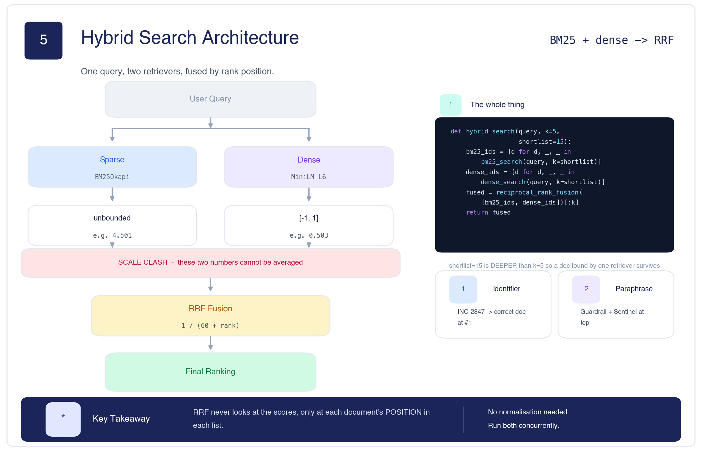

```python
def hybrid_search(query, k=5, shortlist=15):
    bm25_ids  = [d for d, _, _ in bm25_search(query,  k=shortlist)]
    dense_ids = [d for d, _, _ in dense_search(query, k=shortlist)]
    fused = reciprocal_rank_fusion([bm25_ids, dense_ids])[:k]
    id_to_title = dict(zip(DOC_IDS, DOC_TITLES))
    return [(doc_id, id_to_title[doc_id], score) for doc_id, score in fused]
```

Note `shortlist=15` — each retriever goes **deeper** than the final `k=5`, so a document found by only one retriever still has room to survive fusion.

**Hybrid wins both query shapes:**

```text
"INC-2847 postmortem"          → INC-2847 Postmortem at #1
"stop attackers tricking..."   → Sentinel + How Guardrail Handles Jailbreaks at #1–2
```

> ### 🧠 Remember
> Run the two retrievers **concurrently** — they're independent, so hybrid should cost `max(sparse, dense)`, not the sum.

---

<a id="part-6"></a>

## Part 6 — Reciprocal Rank Fusion (RRF)

### Formula → Example → Intuition

**The formula:**

$$\text{RRF}(d) = \sum_{r \in \text{rankings}} \frac{1}{k + \text{rank}_r(d)} \qquad k = 60$$

**In words:** for every ranked list a document appears in, take one divided by (60 + its position in that list), and add those up.

> **Notice the equation contains no reference to the scores. Only ranks.**

**The worked example** — watch the final ranking differ from *both* inputs:

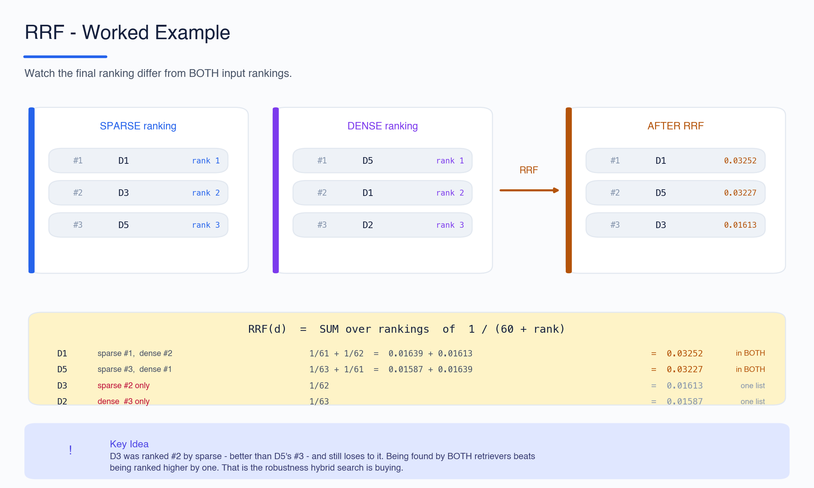

```text
SPARSE:  D1 #1,  D3 #2,  D5 #3
DENSE:   D5 #1,  D1 #2,  D2 #3

D1  in BOTH   → 1/61 + 1/62 = 0.01639 + 0.01613 = 0.03252   ← final #1
D5  in BOTH   → 1/63 + 1/61 = 0.01587 + 0.01639 = 0.03227   ← final #2
D3  one list  → 1/62                            = 0.01613   ← final #3
D2  one list  → 1/63                            = 0.01587
```

**The intuition:** D3 was ranked **#2 by sparse** — better than D5's **#3** — and still finishes *below* D5. **Being found by both retrievers beats being ranked higher by one.** That is exactly the robustness we wanted from Part 4: a document only has to be found by *one* retriever to survive, and being found by *both* promotes it.

```python
def reciprocal_rank_fusion(rankings, k=60):
    fused = {}
    for ranking in rankings:
        for rank, doc_id in enumerate(ranking, start=1):
            fused[doc_id] = fused.get(doc_id, 0.0) + 1.0 / (k + rank)
    return sorted(fused.items(), key=lambda p: -p[1])
```

**What `k = 60` does:** it compresses the gap between rank 1 and rank 2, so one list cannot dominate the fusion. It is a convention, not a derived constant.

> **⊕ Engineering context.** **Weighted RRF** — `w / (k + rank)` with a per-retriever weight — is the usual middle ground when you trust one retriever more for your query distribution. Note also that RRF generalises to **N** lists, which is exactly how query expansion reuses it in Part 10.

> ### 🧠 Mental Model
> RRF is an **Olympic medal table**. You don't add race times across different sports — you add finishing positions. *Position is universal; scores are not.*

---

<a id="part-7"></a>

## Part 7 — Cross-Encoder Reranking

### The Why layer

| | |
|---|---|
| **Problem** | Hybrid gives a good shortlist, but the best document isn't always at #1. |
| **Naive approach** | Trust the fused ranking. |
| **Limitation** | Both retrievers scored the document **without ever looking at query and document together**. |
| **Solution** | A heavier model that reads the pair jointly and re-scores the shortlist. |
| **Trade-off** | 165–452 ms, and it can only reorder what the shortlist already contains. |

### The two architectures

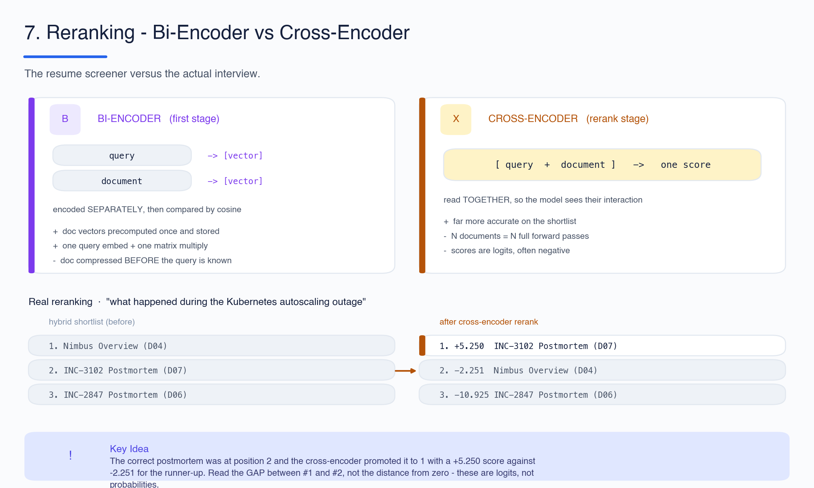

| | **Bi-encoder** | **Cross-encoder** |
|---|---|---|
| Input | query and doc **separately** | query **and** doc as **one input** |
| Precompute? | yes — vectors stored once | **no** |
| Cost per query | 1 embedding + 1 matmul | **N forward passes for N docs** |
| Role | stage 1, whole corpus | stage 2, shortlist only |

> ### 🧠 Mental Model
> The bi-encoder is the **resume screener** — fast, coarse, narrows 10,000 to 50.
> The cross-encoder is the **interview** — reads the resume *alongside* the job description. Slow, precise, useless as a first filter.

```python
RERANKER = CrossEncoder("cross-encoder/ms-marco-MiniLM-L-6-v2")

def rerank(query, doc_ids, top_k=5):
    id_to_text  = dict(zip(DOC_IDS, DOC_TEXTS))
    id_to_title = dict(zip(DOC_IDS, DOC_TITLES))
    pairs  = [(query, id_to_text[d]) for d in doc_ids]
    scores = RERANKER.predict(pairs)                      # N forward passes
    reranked = sorted(zip(doc_ids, scores), key=lambda p: -p[1])[:top_k]
    return [(d, id_to_title[d], float(s)) for d, s in reranked]
```

**It works** — `"what happened during the Kubernetes autoscaling outage"`:

| | Before (hybrid) | After rerank |
|---|---|---|
| 1 | Nimbus Overview (D04) | **+5.250  INC-3102 Postmortem (D07)** |
| 2 | INC-3102 Postmortem (D07) | −2.251  Nimbus Overview (D04) |

> ⚠️ **Scores are logits, not probabilities, and negative is normal.** Read the **gap** between #1 and #2, not the distance from zero. `+5.250` vs `−2.251` is a confident reranker.

**The constraint that never goes away:** reranking can only reorder the shortlist. **If the right document isn't in it, nothing downstream can rescue it.** Recall is permanently stage 1's job.

> ### 🧠 Remember
> Cross-encoder cost is **invariant to corpus size** — it only ever sees the shortlist. That invariance is the entire reason two-stage retrieval exists.

---

<a id="part-8"></a>

## Part 8 — Multi-Stage Retrieval & Latency

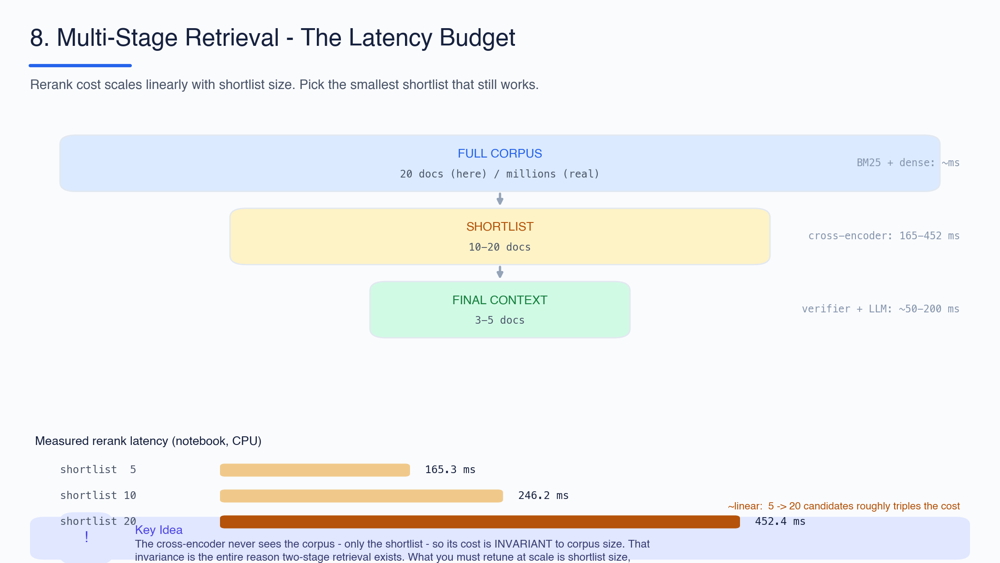

**Measured in the notebook:**

| Shortlist size | Rerank latency |
|---:|---:|
| 5 | 165.3 ms |
| 10 | 246.2 ms |
| 20 | 452.4 ms |

**Roughly linear.** 5 → 20 candidates roughly triples the cost.

### The shortlist trade

- **Too small** → the right document may not be in it; reranking cannot recover it. Recall lost permanently.
- **Too large** → latency grows linearly, paying to rerank documents that were never plausible.

Production values sit between **20 and 50**. Nicely, the notebook's own corpus contains `RFC-014`, which independently recommends a shortlist of **20** and estimates 40–90 ms.

**How to choose principledly:** measure **recall@shortlist** on a labelled set and pick the smallest size where recall plateaus. Everything past the plateau is pure latency.

> **⊕ Engineering context — a worked latency budget** for a ~1 s interactive target:
>
> | Stage | Budget |
> |---|---|
> | Sparse + dense (concurrent) | 10–40 ms |
> | Fusion | <1 ms |
> | Rerank (shortlist 20) | ~450 ms CPU, far less on GPU |
> | Verifier | 50–200 ms |
>
> **Worst case matters more than average.** A query that triggers expansion *and* three retry iterations costs many multiples of the happy path — which is exactly why both are gated. Track **p95/p99**, not the mean.

---

<a id="part-9"></a>

## Part 9 — Evaluation (and an honest failure)

> 🎵 Spotify's recommendation team does not ship a ranking model on vibes. They keep a **golden set** with known-good outcomes, and any candidate must beat production on it.

| Metric | Definition |
|---|---|
| **Hit@3** | fraction of queries where the correct doc is in the top 3 |
| **MRR** | average of `1/rank`; rank 1 → 1.0, rank 2 → 0.5, rank 4 → 0.25, miss → 0 |

**The measured result on 8 labelled queries:**

| Retriever | Hit@3 | MRR |
|---|---:|---:|
| BM25 only | 1.00 | 0.938 |
| Dense only | 1.00 | 0.938 |
| Hybrid (RRF) | 1.00 | 0.938 |
| **Hybrid + Rerank** | **0.88** | **0.906** |

> ⚠️ **The notebook's prose says metrics "climb as we stack layers." Its own output shows the opposite.** Three retrievers tie; reranking **regresses**, pushing the paraphrase target (D15) from rank 2 to rank 4. **Trust the table.**

**Three lessons, more valuable than the intended one:**

1. **No headroom.** 7 of 8 queries are already solved at rank 1 by the simplest retriever — a ceiling effect.
2. **8 queries is far too few.** One rank change swings MRR by several points.
3. **Reranking is not free.** A small general-purpose cross-encoder can reorder a good shortlist for the worse.

The section's *stated* discipline is exactly right: **maintain a labelled eval set, run every change against it, never ship a regression.** This run caught one.

> **⊕ Engineering context.** **Split the metrics by stage.** Stage 1 is judged on **recall@k** (did we lose the answer?), stage 2 on **MRR / nDCG** (did we order what we kept?). One number for the whole pipeline hides which stage regressed. Build the golden set from **real query logs**, click/feedback signals and SME labels — and deliberately include queries the current system **fails**.

> ### 🧠 Remember
> An eval set your baseline already aces **cannot authorise a ship**. If you score 1.00, the experiment tells you nothing.

---

<a id="part-10"></a>

## Part 10 — Query Expansion

### The Why layer

| | |
|---|---|
| **Problem** | The user's words and the corpus's words differ. |
| **Naive approach** | Assume the user's query is the query. |
| **Limitation** | Both retrievers under-recall when vocabulary doesn't overlap. |
| **Solution** | Ask an LLM for paraphrases, retrieve for each, fuse with RRF. |
| **Trade-off** | One LLM call + N retrievals, and on specific queries it adds noise. |

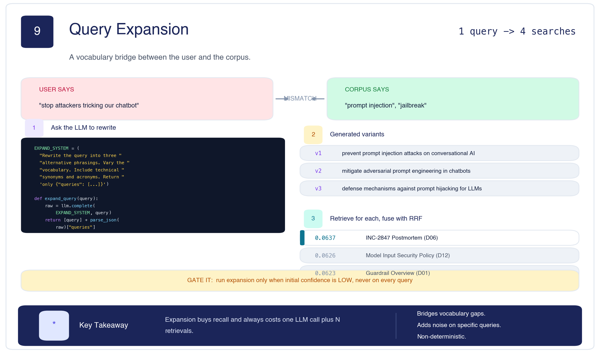

**The variants it actually generated:**

```text
  - how do we stop attackers from tricking our chatbot with clever prompts   ← original
  - prevent prompt injection attacks on conversational AI
  - mitigate adversarial prompt engineering in chatbot systems
  - defense mechanisms against prompt hijacking for large language models
```

The user said *"tricking our chatbot"*; the variants say **prompt injection**, **adversarial prompt engineering**, **prompt hijacking** — the corpus's own language.

```python
def multi_query_retrieval(query, k=5, shortlist=10):
    variants = expand_query(query)
    all_rankings = [[d for d, _, _ in hybrid_search(v, k=shortlist)] for v in variants]
    fused = reciprocal_rank_fusion(all_rankings)[:k]      # RRF again, now over 4 lists
    id_to_title = dict(zip(DOC_IDS, DOC_TITLES))
    return variants, [(d, id_to_title[d], score) for d, score in fused]
```

**Effect:** `Model Input Security Policy` (D12) and `Guardrail Overview` (D01) rise into the top 3; fused scores roughly double because each document can now appear in four rankings instead of two.

**The production rule the notebook states:**

> Run query expansion when the initial retrieval's **confidence is low**, not blindly on every query.

> ### 🧠 Remember
> Expansion is a **vocabulary bridge**. It buys recall and always costs latency — so **gate it**.

---

<a id="part-11"></a>

## Part 11 — Abstention & Verification

### The Why layer

| | |
|---|---|
| **Problem** | Every retriever built so far **always returns something**, even when the corpus has no answer. |
| **Naive approach** | Hand the top-5 to the LLM regardless. |
| **Limitation** | LLMs are compliant — given irrelevant context they often produce a confident, plausible, wrong answer users can't distinguish from a real one. |
| **Solution** | Two gates: a **calibrated score threshold**, and an **LLM verifier** that rules on sufficiency. |
| **Trade-off** | One extra LLM call, plus the risk of a *badly calibrated* gate. |

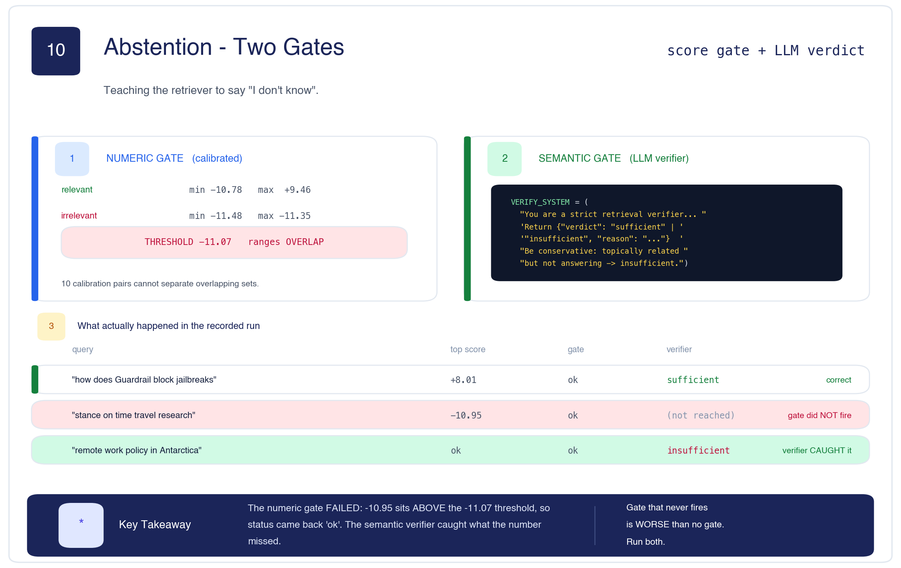

> 🛑 **Stack Overflow's "no results found" is not a bug — it's a UX decision.**

### Gate 1 — the numeric threshold (and why it failed)

```python
THRESHOLD = (min(pos) + max(neg)) / 2
```

```text
Relevant pair scores:   min=-10.78  mean=2.50   max=9.46
Irrelevant pair scores: min=-11.48  mean=-11.42 max=-11.35
Chosen confidence threshold: -11.07
```

```text
Query: what is the company's stance on time travel research
  Status: ok                                ← the gate did NOT fire
  Top result: -10.95  Sentinel Overview
```

> ⚠️ **−10.95 sits *above* the −11.07 threshold.** The notebook's prose says this "triggers a low-confidence signal" — it did not. **Ten calibration pairs with overlapping ranges cannot produce a separating threshold.**
>
> And the deeper point: **a gate you trust that never fires is worse than no gate**, because downstream consumers read `status: "ok"` as a signal when it is a constant.

### Gate 2 — the LLM verifier (which did work)

```python
VERIFY_SYSTEM = (
    "You are a strict retrieval verifier... Return only JSON of the form "
    '{"verdict": "sufficient" | "insufficient", "reason": "..."} ... '
    "Be conservative: if the snippets are topically related but do not directly address "
    "the question, return insufficient."
)
```

Two design choices worth stealing: **conservative by instruction**, and a **structured verdict with a reason** — so the pipeline can branch reliably and a human can read *why*.

```text
"how does Guardrail handle jailbreak attempts"     → sufficient
"our policy on employee remote work in Antarctica" → insufficient
   reason: snippets discuss on-call rotation, model input security, and a technical
           RFC, none of which address remote work policies or Antarctica.
```

> ### 🧠 Mental Model
> **The Toyota andon cord.** Any worker can stop the line when they see a defect, **before it propagates downstream**. The verifier stops the pipeline before the LLM synthesises from garbage.

**Note which gate caught it:** both queries returned `status: ok` from retrieval. It was the **semantic** check, not the numeric one, that caught Antarctica. The two gates have different blind spots — which is why you run both.

> **⊕ Engineering context.** Calibrate on **hundreds** of pairs, not ten; pick the threshold from an explicit precision/recall trade-off rather than a midpoint; **re-calibrate whenever the reranker changes** (the scale is model-specific); and **alarm on the firing rate** — a gate firing 0% or 100% of the time is broken by definition. This is the single most useful retrieval alarm you can add.

---

<a id="part-12"></a>

## Part 12 — Iterative Retrieval

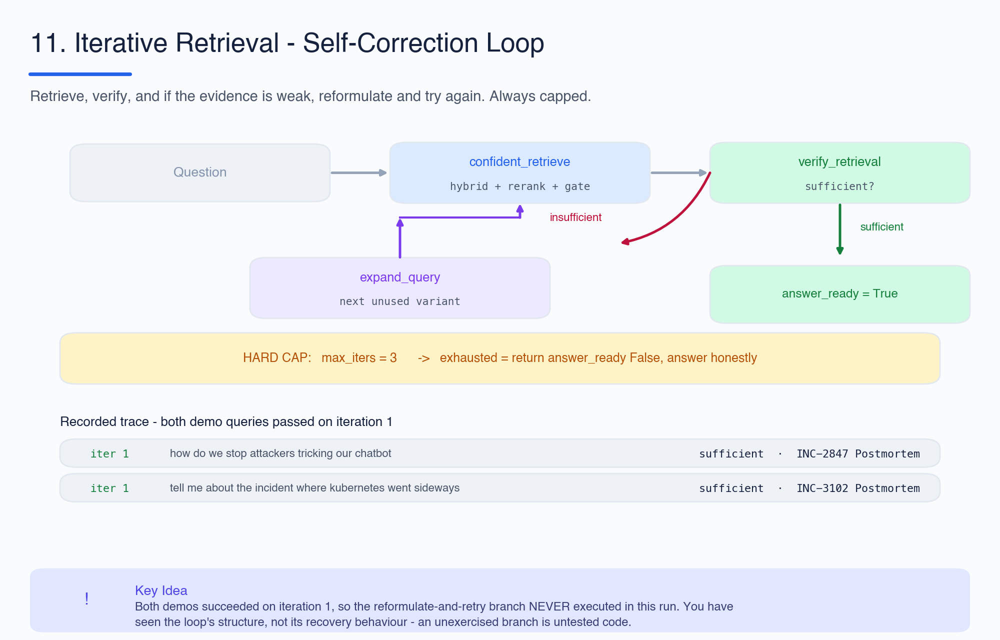

```python
def iterative_retrieve(question, max_iters=3, top_k=3):
    query, trace = question, []
    for iteration in range(1, max_iters + 1):
        result  = confident_retrieve(query, top_k=top_k)
        verdict = verify_retrieval(question, result["docs"]) if result["docs"] else None
        trace.append({"iteration": iteration, "query": query,
                      "status": result["status"],
                      "verdict": (verdict or {}).get("verdict")})
        if verdict and verdict.get("verdict") == "sufficient":
            return {"answer_ready": True, "docs": result["docs"], "trace": trace}
        if iteration < max_iters:
            variants = expand_query(question)
            used = {t["query"] for t in trace}
            next_variant = next((v for v in variants if v not in used), None)
            if next_variant is None:
                break
            query = next_variant
    return {"answer_ready": False, "docs": [], "trace": trace}
```

**Recorded trace:**

```text
"how do we stop attackers tricking our chatbot"     → iter 1, sufficient
"tell me about the incident where kubernetes..."    → iter 1, sufficient
```

> 📝 **Both demos passed on iteration 1**, so the reformulate-and-retry branch **never executed**. You've seen the loop's structure, not its recovery behaviour — **an unexercised branch is untested code.**

> **⊕ Engineering context.** Prefer a **wall-clock budget** over a raw iteration count ("stop after 800 ms, whichever iteration you're on"). Emit the trace as structured telemetry: **iteration count is a leading indicator of corpus drift** — if p90 climbs, your corpus no longer covers what users ask. And test the recovery path deliberately in CI, by injecting queries known to fail first-pass.

> ### 🧠 Remember
> Every loop needs a cap. `max_iters=3` here; `max_round` in the agent last class. **Unbounded loops are how retrieval systems become billing incidents.**

---

<a id="decision-guide"></a>

## Decision Guide — which retriever?

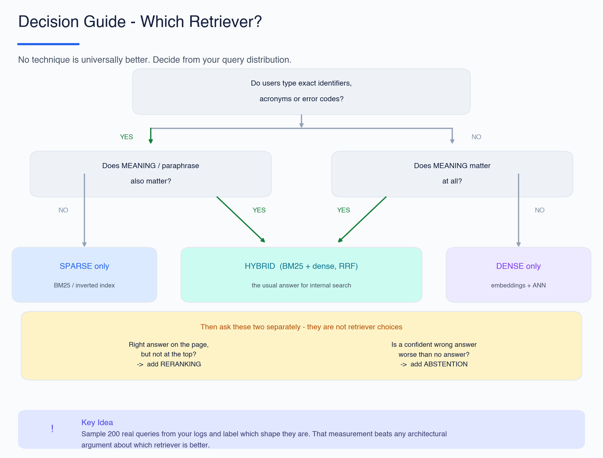

```text
Do users type exact identifiers, acronyms, error codes?
   ├── YES → sparse is required
   │          └── Does meaning/paraphrase ALSO matter?
   │                 ├── YES → HYBRID          ← usual answer
   │                 └── NO  → SPARSE only
   └── NO  → Does meaning matter at all?
              ├── YES → DENSE only
              └── NO  → revisit your assumptions

Then, separately:
   Right answer on the page but not at the top?   → add RERANKING
   Is a confident wrong answer worse than none?   → add ABSTENTION
```

**Do not present one technique as universally superior.** The cheapest way to settle it empirically: **sample 200 real queries from your logs and label which shape they are.** That measurement beats any architectural argument.

---

<a id="production"></a>

## Production Architecture ⊕

> **⊕ Engineering context — this entire section is beyond the notebook.** The notebook runs every stage in a single process.

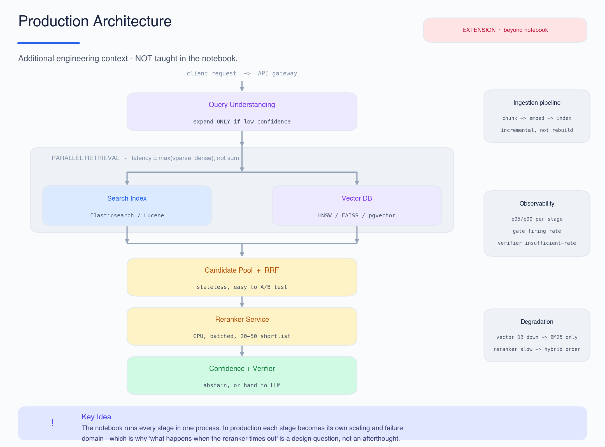

Each stage becomes its own scaling and failure domain:

| Stage | Component | Scaling axis | If it fails |
|---|---|---|---|
| Sparse | inverted index | shard by doc count | fall back to dense only |
| Dense | ANN index (HNSW) | memory-bound | fall back to BM25 only |
| Fusion | stateless code | trivially horizontal | — |
| Rerank | GPU service, batched | throughput | return the hybrid order |
| Verify | LLM provider | rate limit / cost | skip, flag lower confidence |

**The two decisions that dominate the design:** where the **shortlist boundary** sits, and **what happens when a stage fails**. A reranker timing out should degrade to hybrid-only results, not fail the request. Hybrid's redundancy is an **availability** asset, not just a quality one.

---

<a id="interview"></a>

# Interview & Revision Questions

---

## 🟢 Beginner

**1. Why do we need retrieval at all?**
> An LLM's knowledge is frozen at training time and it has never seen your private documents. Retrieval supplies relevant text at question time so answers can be current and grounded.

**2. What is sparse retrieval?**
> Matching on literal **tokens**. Each document is a vector with one slot per vocabulary word, nearly all zero — hence *sparse*. BM25 is the standard ranking function.

**3. What is dense retrieval?**
> Matching on **meaning**. An encoder maps text to an embedding (384 numbers here) so similar meanings land close together; retrieval finds the nearest vectors.

**4. What is hybrid search?**
> Running sparse and dense on the same query and merging their ranked lists, so the system handles both exact identifiers and paraphrases.

**5. What is reranking?**
> Re-ordering a shortlist with a slower, more accurate model — a cross-encoder — that reads the query and each document *together*.

**6. Why does BM25 find `INC-2847` so easily?**
> Because it's **rare** — in 1 of 20 documents. Its IDF weight is large, so the containing document jumps to the top (4.501 vs 1.553).

---

## 🔵 Intermediate

**7. How does BM25 rank documents?**
> Tokenise query and docs identically → compute each term's IDF (`~ log(N/df)`, rarer = higher) → sum matched terms weighted by IDF and in-document frequency → correct for document length.

**8. How does dense retrieval differ from keyword retrieval, mechanically?**
> Keyword compares token overlap. Dense maps both into one 384-d space and compares by cosine. Consequence: dense handles synonyms but blurs rare exact strings; keyword does the reverse.

**9. Why is the similarity computation just `DOC_MATRIX @ q`?**
> `normalize_embeddings=True` forces every vector to length 1, so cosine's `/(|a|×|b|)` denominator becomes 1 and cosine reduces to a dot product. One matmul scores the whole corpus.

**10. How does RRF work?**
> `RRF(d) = Σ 1/(k + rank)` with `k=60`. For each list a doc appears in, add one over (60 + its position). **Only positions, never scores.**

**11. Compute RRF for a doc at sparse #1 / dense #3, and one at sparse #2 only.**
> First: `1/61 + 1/63 = 0.03226`. Second: `1/62 = 0.01613`. The first wins by ~2× — **being in both lists beats a better position in one**.

**12. Bi-encoder vs cross-encoder?**
> Bi-encoder embeds query and doc **separately**, so doc vectors precompute and store. Cross-encoder feeds them in **together** and outputs one score — nothing precomputes, so every pair costs a forward pass.

**13. Why must documents and queries share a tokenizer?**
> Matching is on exact tokens. If the index keeps `INC-2847` whole but the query splits it, they never match — and the failure is **silent**: no error, just worse recall.

**14. What do Hit@3 and MRR measure?**
> Hit@3: fraction of queries with the correct doc in the top 3 — blunt, yes/no. MRR: average `1/rank` — sensitive to *how high* it landed.

---

## 🟠 Advanced

**15. Why might sparse outperform dense for some queries?**
> *Testing:* whether you understand what a bi-encoder structurally discards.
> **Answer:** a bi-encoder compresses a document into one fixed vector **before the query is known**, so detail that doesn't survive compression is lost — rare identifiers first. BM25 does the opposite: rarity *is* its signal via IDF. Hence 4.501 vs 1.553 for BM25, against a near-random 0.503 vs 0.466 for dense.

**16. What happens when sparse and dense return very different candidates?**
> *Testing:* whether you treat disagreement as a bug or as the design.
> **Answer:** disagreement is the expected case and the reason hybrid exists. Under RRF a doc found by one retriever still scores ~`1/(60+rank)`; found by both, roughly double. So the **union is preserved and the intersection is promoted**. The risk is a short shortlist dropping a doc found by only one retriever — which is why the pre-fusion shortlist (15) is deeper than the final k (5).

**17. Why not just average BM25 and cosine scores?**
> BM25 is unbounded and query-dependent; cosine is bounded in [−1, 1]. Averaging needs a normalisation that is fragile and shifts per query, so weights tuned on one distribution stop working on another. RRF avoids normalisation entirely by using ranks.

**18. Where should reranking occur, and why never first?**
> After a cheap retriever produces a 20–50 shortlist. Never first: a cross-encoder needs one forward pass per (query, doc) pair — a million docs means a million passes **per query**.

**19. What are the latency implications of multi-stage retrieval?**
> Rerank dominates and scales **linearly** with shortlist size: 165 / 246 / 452 ms at 5 / 10 / 20. Worst case compounds — expansion + rerank + verify + up to 3 retries — which is why expansion is gated and the loop capped.

**20. This notebook's reranker scored Hit@3 0.88 vs 1.00 for plain hybrid. Explain.**
> *Testing:* can you separate a measurement problem from a model problem?
> **Answer:** two causes. **(a) Ceiling effect + tiny sample** — 7 of 8 queries already solved at rank 1, and with 8 queries one rank change swings MRR by several points. **(b) A genuine regression** — the small MS MARCO cross-encoder pushed D15 from rank 2 to 4. Either way the process conclusion is the same: **this eval set cannot authorise a ship in either direction** and must be widened with hard queries the baseline actually fails.

**21. Reranking can only reorder the shortlist. What follows?**
> Recall is permanently stage 1's job. Measure **recall@shortlist** for stage 1 and MRR/nDCG for stage 2 — one number for the whole pipeline hides which stage regressed.

---

## 🔴 Senior

**22. When would you introduce reranking — and when would you not?**
> *Testing:* whether you diagnose before adding components.
> **Answer:** introduce it when **recall is good but precision@1 is poor** — users say the right answer is "on the page but not at the top". Don't, when users say the answer **isn't there at all** (a recall problem reranking can't fix), when the latency budget can't absorb 150–450 ms, or **before you have an eval set that could detect whether it helped** — as Part 9 shows, a reranker can silently make things worse.

**23. How would you debug poor retrieval quality?**
> *Testing:* do you localise before changing anything?
> **Answer:** **inspect the retrieved documents, not the answer.** Absent from the candidate set → **stage-1 recall** problem (tokenizer consistency, chunking, embedding fit, shortlist depth). Present but ranked low → **stage-2 ordering** problem (reranker, domain fit). Then classify the failing query: identifier failures point at the sparse path, paraphrase failures at the dense path or vocabulary mismatch. Finally, **add the failing query to the eval set** so the fix is measurable.

**24. How would you balance quality, latency and cost?**
> Rerank dominates both latency and GPU cost, so **shortlist size is the primary dial** — pick the smallest size where recall@shortlist plateaus. Then make expensive paths **conditional**: gate expansion on low confidence, cap retries, cache variants by hash. Run sparse and dense concurrently so stage 1 costs `max`, not `sum`. Set a wall-clock budget and track **p95/p99**.

**25. How would you monitor retrieval quality in production?**
> *Testing:* do you pick signals that move *before* users complain?
> **Answer:** **gate firing rate** (0% or 100% means broken — Part 11's gate silently never fired); **verifier insufficient-rate over time** (rising = corpus/query drift); **iteration-count distribution** (climbing p90 = corpus gaps); **recall@k on a golden set replayed on a schedule**; **p95/p99 per stage**. Plus product signals: top-result click-through, thumbs-down rate, escalation-to-human.

---

## 🟣 Staff / System Design

**26. Design a production retrieval system for a large document corpus. Discuss quality, latency, cost, scaling, evaluation and failure modes.**

> *What the interviewer is testing:* whether you can name the component per stage, state which property changes with scale and which doesn't, and volunteer failure handling without being asked.
>
> *Expected reasoning:* start from the two-stage invariant, then attach one concern per stage rather than describing a monolith.
>
> **Strong answer:**
> **Stage 1, run concurrently:** an inverted index (Elasticsearch/Lucene) for sparse so a query touches only documents containing query terms; an **ANN** index (HNSW) for dense — explicitly accepting ~95–99% recall for sublinear search. Fuse with **RRF** in stateless application code.
> **Stage 2:** a **batched GPU cross-encoder** over a 20–50 shortlist.
> **The key property:** rerank cost is **invariant to corpus size**; what must be retuned is shortlist size, because recall@k degrades as the corpus grows.
> **Quality/latency/cost:** shortlist size is the main dial; gate expansion on low confidence; cap the retry loop; budget ~10–40 ms stage 1, ~450 ms rerank (far less on GPU), 50–200 ms verify.
> **Evaluation:** recall@k for stage 1, MRR/nDCG for stage 2, on a golden set built from real query logs that **includes queries the baseline fails**; never ship a regression.
> **Failure modes:** vector DB down → BM25 only; reranker timeout → return hybrid order; gate miscalibrated → alarm on firing rate. Plus an **ingestion pipeline**, since nothing in the notebook updates an index.

**27. Your confidence gate has never fired in production. Diagnose it, and explain why that's worse than having no gate.**

> *What the interviewer is testing:* can you separate a calibration defect from its organisational consequence?
>
> **Strong answer:** the threshold was calibrated from too few pairs whose ranges **overlap** — relevant −10.78 to +9.46, irrelevant −11.48 to −11.35 — so the midpoint (−11.07) sits below almost everything, including irrelevant results scoring −10.95. **No single threshold can separate overlapping sets.**
> **Why worse than no gate:** with no gate, everyone downstream knows the retriever always returns something and treats results with suspicion. With a gate that never fires, `status: "ok"` is read as a **signal** when it's a **constant** — false assurance, the most expensive kind of bug.
> **Fix:** calibrate on hundreds of pairs across query types, choose the threshold from an explicit precision/recall trade-off, re-calibrate when the reranker changes, and alarm on firing rate.

**28. How does this retrieval layer fit into a larger RAG / agentic architecture?**

> **Strong answer:** it becomes **one tool behind an unchanged interface**. The outer agent's plan says "call the vector tool" and gets documents back. Internally that tool now does hybrid retrieval, fusion, reranking, confidence gating, verification and possibly retries — and the outer agent needs to know none of it. **The outer agent decides *which* tool to use; the inner tool decides *how hard to work*.** Both loops have iteration caps and both fail honestly, so a failure at either level degrades rather than cascades.

---

<a id="explain"></a>

# Explain It Yourself

Active recall. Close the notes and answer out loud — these are harder than they look.

1. **Explain hybrid search without using the words "sparse" or "dense."**
2. **Draw the hybrid search pipeline from memory**, then check against Part 5's diagram.
3. **Explain RRF to a junior engineer in 60 seconds**, including why you don't just average the scores.
4. **Explain why a production system retrieves *then* reranks**, rather than doing one accurate pass.
5. **Explain, with a number, why `INC-2847` is easy for one retriever and hard for the other.**
6. **Describe a query your system would answer confidently and wrongly**, and which gate should have stopped it.
7. **Justify a shortlist size of 20** to someone who wants 200.
8. **Explain why this lecture's eval table shows reranking making things worse** — and why that isn't necessarily a reason to drop reranking.

---

<a id="cheatsheet"></a>

# One-Page Revision

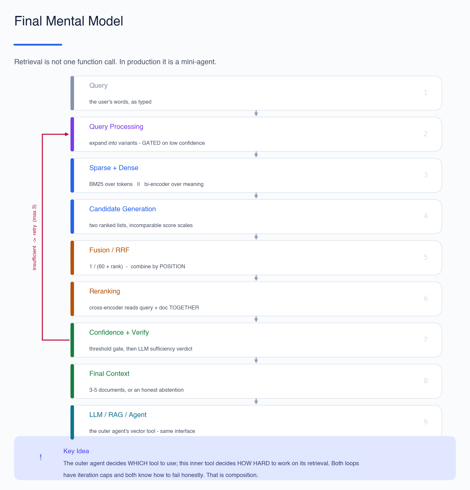

## Core concepts

| Concept | One line |
|---|---|
| Sparse / BM25 | matches tokens; rarity (IDF) is the signal |
| Dense / bi-encoder | matches meaning; compresses docs before the query exists |
| Hybrid | run both; their failures are **disjoint** |
| RRF | fuse by **rank**, never by score |
| Cross-encoder | reads query + doc **together**; shortlist only |
| Abstention | a calibrated threshold + an LLM verifier |
| Iterative retrieval | retrieve → verify → reformulate → retry, **capped** |

## Formulas

```text
idf(term) ~ log( N / df(term) )              rare terms weigh more
cos(a,b)  = (a·b) / (|a|·|b|)  → a·b         when vectors are normalised
RRF(d)    = Σ 1 / (60 + rank_r(d))           positions only
MRR       = mean( 1 / rank_of_correct_doc )  rank 2 → 0.5
```

## The numbers worth memorising

| Fact | Value |
|---|---|
| Corpus | 20 docs × 384 dims |
| BM25 on `INC-2847` | **4.501** vs 1.553 |
| Dense on `INC-2847` | 0.503 vs 0.466 (near tie) |
| RRF `k` | **60** |
| Rerank latency | 165 / 246 / 452 ms at shortlist 5 / 10 / 20 |
| Production shortlist | **20–50** |
| Calibrated threshold | −11.07 (and it **never fired**) |
| Retry cap | `max_iters = 3` |

## Architecture

```text
Query → [expand if low confidence] → BM25 ∥ Dense → RRF → Rerank
      → threshold gate → LLM verifier → Final context (or abstain)
      └────────────── insufficient: reformulate, retry ×3 ───────┘
```

## Trade-offs

| Add this | You buy | You pay |
|---|---|---|
| Dense | synonym/paraphrase matching | a model + vector index; exact-string precision |
| Hybrid | robustness across query types | two indexes, a fusion rule |
| RRF | no normalisation needed | score magnitude discarded |
| Reranking | precision@1 | 165–452 ms; can't fix recall |
| Expansion | recall on vocabulary gaps | 1 LLM call + N retrievals; noise on specific queries |
| Abstention | honesty | calibration effort; a bad gate is worse than none |

## Common failure modes

1. **Tokenizer drift** — BM25 silently stops matching.
2. **Shortlist too small** — reranking can never recover a lost document.
3. **Eval set with no headroom** — cannot detect improvement *or* regression.
4. **Gate that never fires** — false assurance.
5. **Untested retry branch** — an unexercised branch is untested code.
6. **Stale index** — confidently answering from last month's corpus.

## The five sentences

1. Sparse matches tokens, dense matches meaning, and **their failures don't overlap**.
2. **RRF fuses by position, never by score** — which is why incomparable scales combine cleanly.
3. **Every stage costs more per document than the last, so every stage sees fewer** — and the cross-encoder's cost is invariant to corpus size.
4. **A retriever that always returns something can never say "I don't know"** — and a gate that never fires is worse than no gate.
5. **Retrieval in production is not a function call; it's a mini-agent** with its own capped loops and its own honest failure mode.

---

## Related notes

- 📖 [Hybrid Search — Reading Brief](./Hybrid_Search_Reading_Brief.md) · 📚 [Jargon Card](./Hybrid_Search_Jargon_Card.md)
- 🧭 [Agentic AI Systems — Visual Study Deck](../Agentic_AI_Systems_Visual_Deck.html)
- ⬅️ Previous: [11. Agentic RAG & GraphRAG](../11.%20Agentic%20RAG%20%26%20GraphRAG/)
