# Parsing Complex Documents

**Module 8 · Lecture 13** — from *"how do I get text out of a PDF"* to *"I can design a document ingestion pipeline that fails honestly."*

> **Source notebook:** [`L13_Parsing_Complex_Documents.ipynb`](./L13_Parsing_Complex_Documents.ipynb)
> **Diagrams:** [`images/`](./images/) — 12 figures built specifically for these notes.

**The one-line story:** you are building **FinBot 2.0**, an invoice intelligence pipeline. A folder of messy documents — native PDFs, scans, handwriting, tables — becomes structured, chunked, indexed knowledge that an AI agent can query in natural language. The lesson is not *"here is how to call a parser."* It is **where information gets lost, and what that costs you four stages later.**

---

## Source of truth

| Marker | Meaning |
|---|---|
| *(unmarked)* | **From the notebook** — concepts, code, numbers and outputs as they actually ran |
| > **⊕ Engineering context** | **Added** — production material the notebook did not cover |

Where the notebook's prose disagrees with its own recorded output, I say so and trust the output. That happens once here, and it is the most valuable thing in the lesson — see [§5b](#part-5b).

---

## The big picture

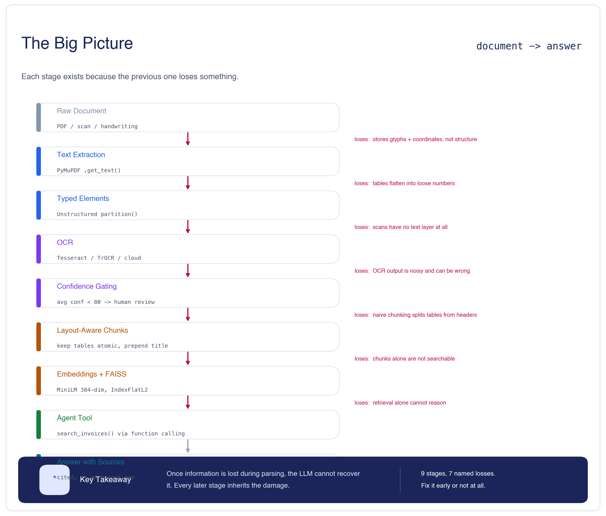

Every stage exists because the previous one **loses something**:

```text
Raw document          → stores glyphs + coordinates, not structure
Text extraction       → tables flatten into loose numbers
Typed elements        → scans have no text layer at all
OCR                   → output is noisy and can be silently wrong
Confidence gating     → naive chunking splits tables from headers
Layout-aware chunks   → chunks alone are not searchable
Embeddings + FAISS    → retrieval alone cannot reason
Agent tool            → answer, with sources
```

> ### 🧠 Remember
> **Once information is lost during parsing, the LLM cannot recover it.** Every later stage inherits the damage — and none of them raise an error.

### Contents

| Part | Concept | Taught with |
|---|---|---|
| [1](#part-1) | Why PDFs are hard | the human-vs-parser contrast |
| [2](#part-2) | The parser ecosystem | three-tier comparison |
| [3](#part-3) | Same invoice, three parsers | side-by-side real output |
| [4](#part-4) | Batch processing | the recorded 5-file run |
| [5](#part-5) | OCR as a capability | tier map + confidence gating |
| [5b](#part-5b) | **One bad OCR call, traced** | the failure chain |
| [6](#part-6) | Layout-aware chunking | naive vs layout-aware |
| [7](#part-7) | Chunks → searchable knowledge | FAISS + real retrievals |
| [8](#part-8) | Wiring it into an agent | tool schema + real trace |
| [9](#decision-guide) | **Decision guide** | decision tree |
| [10](#production) | **Production** ⊕ | pitfalls and scaling |
| [11](#interview) | Interview & revision questions | 5 tiers |
| [12](#cheatsheet) | One-page revision | cheat sheet |

---

<a id="part-1"></a>

## Part 1 — Why PDFs Are Hard for AI

### The Why layer

| | |
|---|---|
| **Problem** | An LLM needs the *content* of a document. |
| **Naive approach** | Open the PDF and read the text out. |
| **Limitation** | A PDF stores **instructions for drawing a page** — glyphs and coordinates — not what the page *means*. Structure has to be inferred. |
| **Solution** | A parser that reconstructs structure: types, tables, reading order. |
| **Trade-off** | Every parser reconstructs *differently*, and gets it wrong in its own way. |

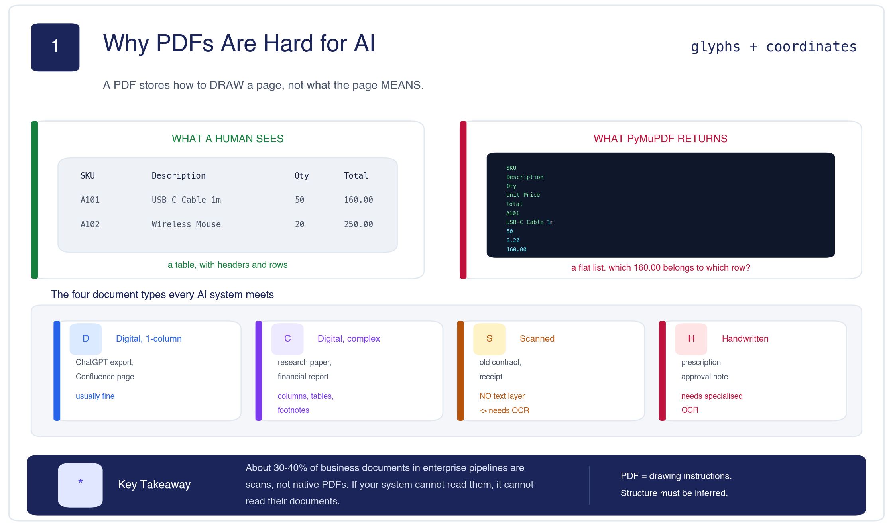

### The contrast that makes it concrete

A human sees a table. `PyMuPDF` returns this:

```text
SKU
Description
Qty
Unit Price
Total
A101
USB-C Cable 1m
50
3.20
160.00
```

Which `160.00` belongs to which row? The rows are gone. For a RAG system asked *"what was the total for the Wireless Mouse line?"*, this is fragile.

### The four document types

| Type | Example | Main challenge |
|---|---|---|
| Digital, single-column | ChatGPT export, Confluence page | usually straightforward |
| Digital, complex layout | research paper, financial report | multiple columns, tables, footnotes |
| **Scanned** | old contracts, receipts | **no text layer — requires OCR** |
| **Handwritten** | prescriptions, approval notes | **specialised OCR** |

> ### 🧠 Remember
> **30–40%** of business documents in enterprise pipelines are scans, not native PDFs. If your system can't read them, it can't read their documents.

---

<a id="part-2"></a>

## Part 2 — The Parser Ecosystem

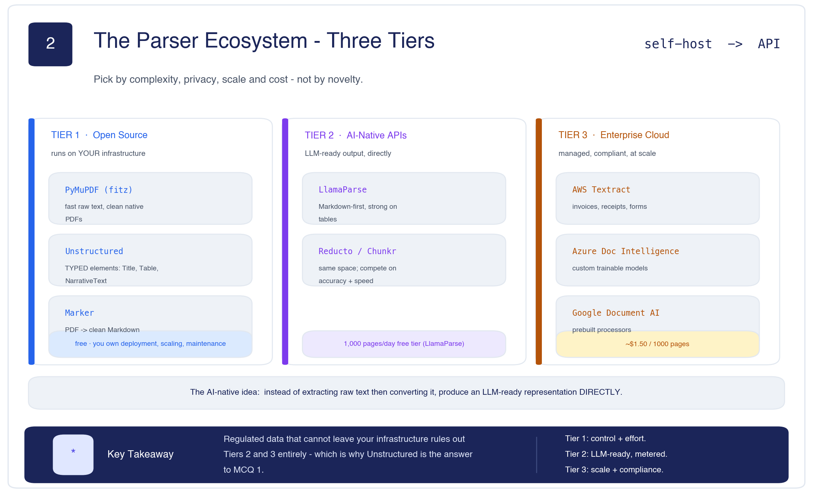

### The three tiers

| Tier | Tools | You get | You pay |
|---|---|---|---|
| **1 · Open source** | PyMuPDF, **Unstructured**, Marker | control, privacy, zero licence cost | deployment, scaling, maintenance |
| **2 · AI-native APIs** | **LlamaParse**, Reducto, Chunkr | LLM-ready output directly | per-page metering, data leaves your network |
| **3 · Enterprise cloud** | AWS Textract, Azure Document Intelligence, Google Document AI | managed scale, compliance, prebuilt processors | ~$1.50 / 1,000 pages |

**The AI-native idea, stated plainly:**

> Instead of extracting raw text and then converting it into an LLM-friendly format, **produce an LLM-ready representation directly.**

### MCQ 1 — from the notebook

> **Regulated healthcare company. All data must stay on-premises. You need structured output (titles, tables, narrative text) for high-quality chunking. Which tool?**
>
> ✅ **C. Unstructured.** It runs locally, is open-source, and produces typed elements. Textract and LlamaParse are cloud APIs and fail the on-prem requirement; PyPDF2 extracts text but gives no typed structure.

> ### 🧠 Remember
> Privacy and residency constraints eliminate whole tiers before accuracy is even discussed.

---

<a id="part-3"></a>

## Part 3 — Same Invoice, Three Parsers

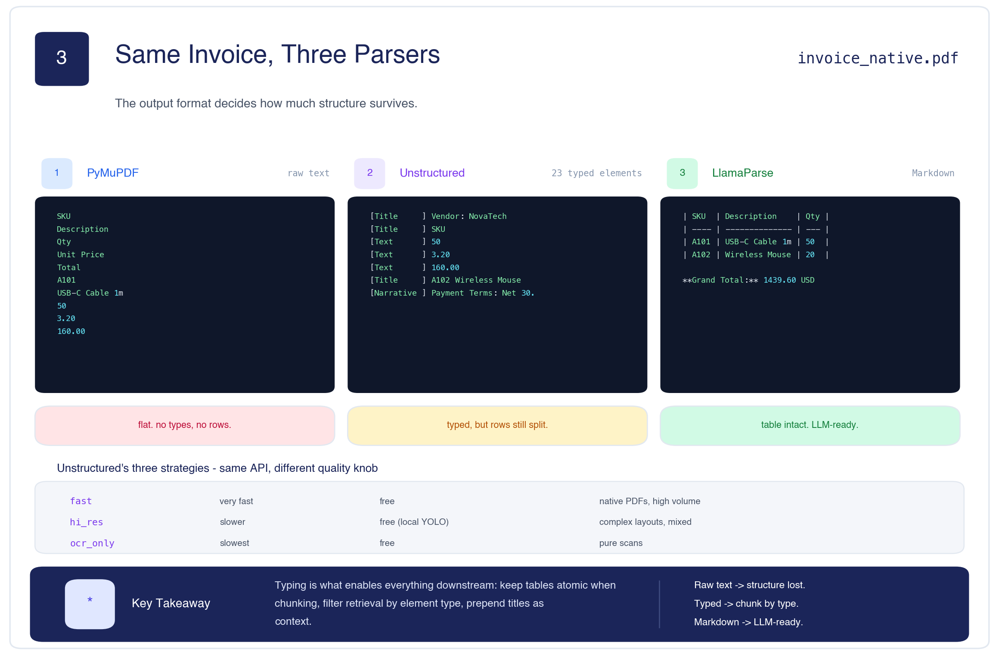

### The comparison, on `invoice_native.pdf`

**PyMuPDF** — flat text, no types (see Part 1).

**Unstructured** — `partition_pdf()` returns **23 typed elements**:

```python
from unstructured.partition.pdf import partition_pdf

elements = partition_pdf('invoices/invoice_native.pdf', strategy='fast')
for el in elements:
    print(f'[{type(el).__name__:16s}] {str(el)[:75]}')
```

```text
23 elements returned

[Title           ] Vendor: NovaTech Supplies Pvt Ltd
[Title           ] SKU
[Text            ] 50
[Text            ] 3.20
[Text            ] 160.00
[Title           ] A102 Wireless Mouse
[NarrativeText   ] Payment Terms: Net 30. Late fees apply after due date.
```

**LlamaParse** — Markdown, table intact:

```md
| SKU  | Description           | Qty | Unit Price | Total  |
| ---- | --------------------- | --- | ---------- | ------ |
| A101 | USB-C Cable 1m        | 50  | 3.20       | 160.00 |
| A102 | Wireless Mouse        | 20  | 12.50      | 250.00 |
```

> 📝 **Read the Unstructured output honestly.** The notebook's prose says *"`Table` for the line-item table (as one atomic unit, not shredded)"* — but the recorded output contains **no `Table` element at all**. With `strategy='fast'` the rows are still split into separate `Title` and `Text` elements. Typed ≠ perfectly structured. You'd need `hi_res` to get real table detection.

### The three strategies

| Strategy | Speed | Cost | Best for |
|---|---|---|---|
| `fast` | very fast | free | native PDFs, high volume |
| `hi_res` | slower | free (local YOLO model) | complex layouts, mixed content |
| `ocr_only` | slowest | free | pure scans |

Same API, different quality knob. Benchmark all three on a sample of your corpus and pick **per document type**.

### MCQ 2 — from the notebook

> **What does `partition_pdf()` return?**
> ✅ **B. A list of typed element objects** (`Title`, `NarrativeText`, `Table`, `ListItem`, `Image`, `FigureCaption`) — with metadata like page number and coordinates.

> ### 🧠 Remember
> Typing is what enables everything downstream: **chunk by type**, **filter retrieval by type**, **prepend titles as context**.

---

<a id="part-4"></a>

## Part 4 — Batch Document Processing

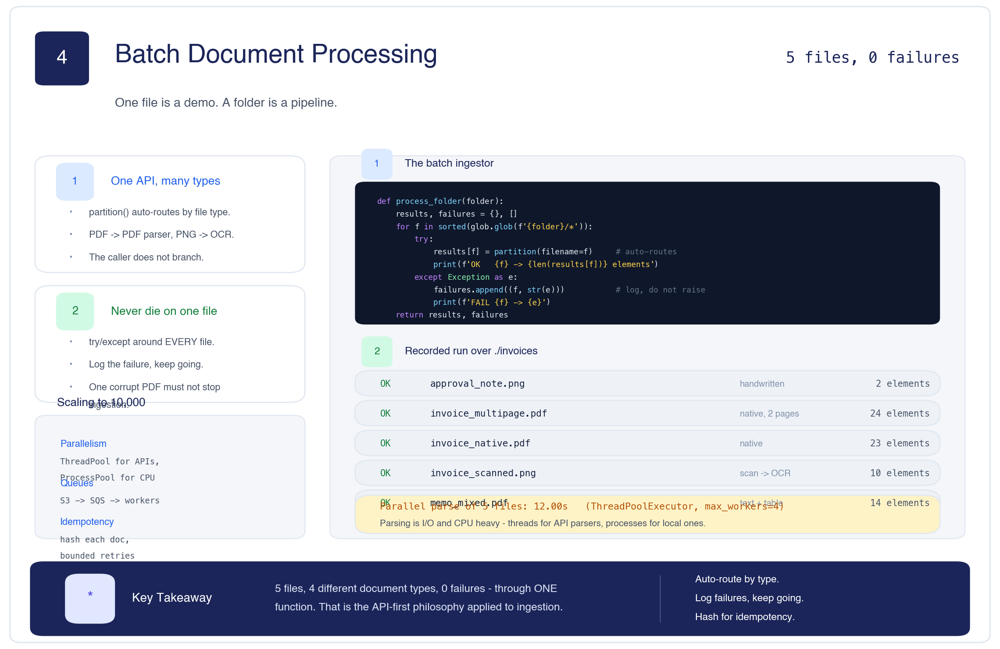

```python
def process_folder(folder):
    results, failures = {}, []
    for f in sorted(glob.glob(f'{folder}/*')):
        try:
            results[f] = partition(filename=f)          # auto-routes by type
            print(f'OK   {os.path.basename(f):30s} -> {len(results[f])} elements')
        except Exception as e:
            failures.append((f, str(e)))                # log, never raise
            print(f'FAIL {os.path.basename(f):30s} -> {e}')
    return results, failures
```

**The recorded run:**

| File | Type | Elements |
|---|---|--:|
| `approval_note.png` | handwritten | 2 |
| `invoice_multipage.pdf` | native, 2 pages | 24 |
| `invoice_native.pdf` | native | 23 |
| `invoice_scanned.png` | scan → OCR | 10 |
| `memo_mixed.pdf` | text + table | 14 |
| | **5 files, 0 failures** | |

Two patterns to steal:

1. **`partition()` auto-routes.** PDFs go through PDF parsing, images through OCR, DOCX through DOCX parsing. **One API, many document types** — the caller never branches.
2. **`try/except` around every file.** In production this is non-negotiable: one corrupt PDF must never take down your ingestion pipeline.

**Parallel parsing** — `ThreadPoolExecutor(max_workers=4)` over the same 5 files: **12.00s**.

> **⊕ Engineering context — scaling to 10,000 documents.** Three things change. **Parallelism:** threads for API-based parsers (they wait on network), *processes* for CPU-heavy local ones like Unstructured `hi_res`. **Queue architecture:** documents land in S3/Blob, a queue (SQS, Pub/Sub) notifies workers, workers write results to a database — this decouples upload from processing. **Idempotency:** hash every document so re-runs don't duplicate work, and give failures bounded retries with backoff.

> ### 🧠 Remember
> 5 files, 4 document types, 0 failures, through **one function**. That's the API-first philosophy applied to ingestion.

---

<a id="part-5"></a>

## Part 5 — OCR Is Something You Call, Not Build

### The Why layer

| | |
|---|---|
| **Problem** | A scan is an image. There is no text to extract. |
| **Naive approach** | Assume documents have a text layer. |
| **Limitation** | 30–40% of enterprise documents don't — the parser returns nothing useful. |
| **Solution** | OCR: convert pixels to characters, then rejoin the normal pipeline. |
| **Trade-off** | OCR output is **noisy**, and its errors are silent. |

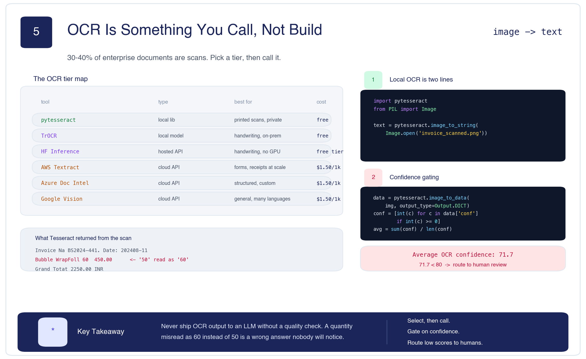

### The tier map

| Tool | Type | Best for | Cost |
|---|---|---|---|
| `pytesseract` | local library | printed scans, private data | free |
| TrOCR | local model | handwriting, on-prem | free |
| HF Inference API | hosted | handwriting without a GPU | free tier |
| AWS Textract | cloud | forms, receipts at scale | ~$1.50/1k pages |
| Azure Document Intelligence | cloud | structured docs, custom training | ~$1.50/1k pages |
| Google Vision AI | cloud | general OCR, many languages | ~$1.50/1k pages |

**Local OCR is two lines:**

```python
import pytesseract
from PIL import Image

scanned_text = pytesseract.image_to_string(Image.open('invoices/invoice_scanned.png'))
```

### Confidence gating — the production move

```python
data = pytesseract.image_to_data(Image.open('invoices/invoice_scanned.png'),
                                 output_type=pytesseract.Output.DICT)
confidences = [int(c) for c in data['conf'] if int(c) >= 0]
avg_conf = sum(confidences) / len(confidences)
print(f'Average OCR confidence: {avg_conf:.1f}')
print('Route to human review?', avg_conf < 80)
```

```text
Average OCR confidence: 71.7
Route to human review? True
```

**And look at what the OCR actually got wrong** on that scan:

```text
Invoice Na BS2024-441. Date: 202408-11        ← "No" → "Na", dashes lost
Bubble WrapFoll 60      450.00                ← quantity 50 read as 60
Grand Totat 2250.00 INR                       ← "Total" → "Totat"
```

A quantity misread as **60 instead of 50** is a wrong answer nobody will notice.

### MCQ 3 — from the notebook

> **Millions of scanned invoices, US bank, data cannot leave your infrastructure. Which OCR?**
> ✅ **B. Tesseract self-hosted, with TrOCR as a handwriting fallback.** Cloud OCR fails data residency; manual transcription doesn't scale; skipping OCR leaves scans unusable.

> ### 🧠 Remember
> **Never ship OCR output to an LLM without a quality check.** Tesseract returns per-word confidence — gate on it and route low scores to human review.

---

<a id="part-5b"></a>

## Part 5b — One Bad OCR Call, Traced to a Hallucination

This is the most important section in the lesson, and it is built entirely from the notebook's own recorded outputs.

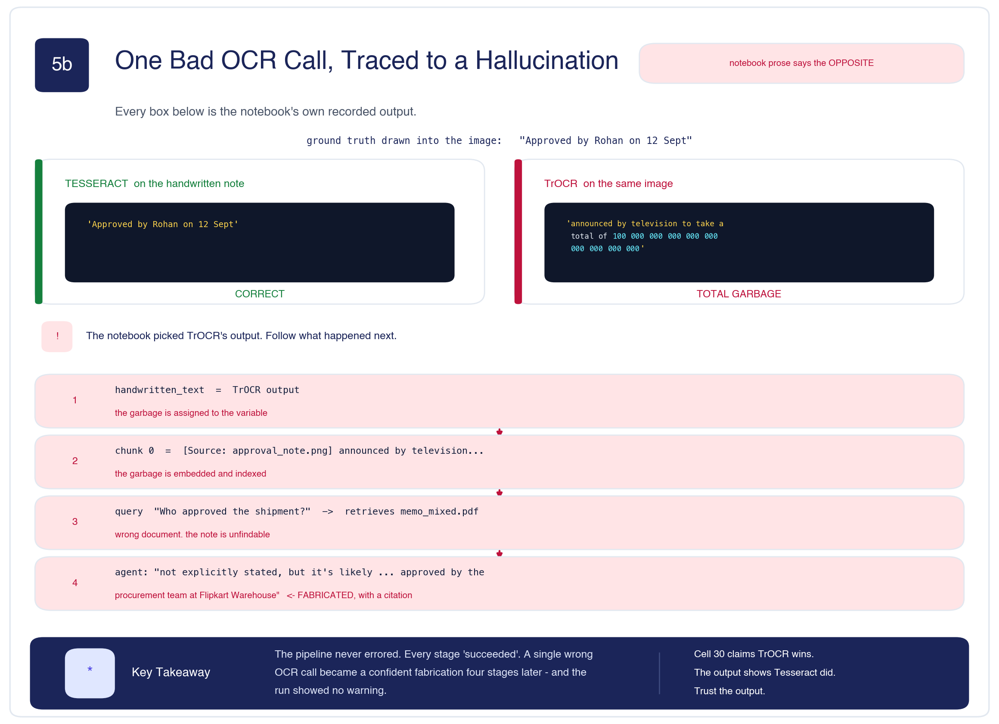

> ⚠️ **The notebook's prose says the opposite of what it recorded.** Cell 31 states: *"Tesseract gives garbled output. TrOCR gets it right."* Here is what actually ran.

**Ground truth** — the text drawn into `approval_note.png` by cell 6:

```text
Approved by Rohan on 12 Sept
```

**The two OCR results:**

| Engine | Recorded output | Verdict |
|---|---|---|
| **Tesseract** | `'‘Approved by Rohan on 12 Sept\n\x0c'` | ✅ **correct** (one stray quote) |
| **TrOCR** | `announced by television to take a total of 100 000 000 000 000 000 000 000 000 000` | ❌ **total garbage** |

**The notebook then assigns TrOCR's output to `handwritten_text`** — and here is the chain:

| # | What happened | Consequence |
|---|---|---|
| 1 | `handwritten_text = <TrOCR garbage>` | the garbage enters the corpus |
| 2 | `chunk 0 = [Source: approval_note.png] announced by television…` | the garbage is **embedded and indexed** |
| 3 | query *"Who approved the shipment?"* → retrieves `memo_mixed.pdf` | **wrong document** — the note is unfindable |
| 4 | agent: *"not explicitly stated, but it's likely … approved by the procurement team at Flipkart Warehouse"* | **fabricated**, and delivered with a citation |

**The pipeline never errored.** Every stage "succeeded". One wrong OCR call became a confident fabrication four stages later, with no warning anywhere in the run.

> ### 🧠 Mental Model
> **Garbage in, garbage *everywhere*.** Parsing errors don't announce themselves — they propagate silently and surface as a plausible wrong answer at the very end, where they're hardest to trace back.

> **⊕ Engineering context.** This is exactly the failure that **confidence gating** (Part 5) exists to catch — and the notebook gates the *scanned* invoice but **not** the handwritten note. In production you gate every OCR path, and you'd also assert on output sanity: a handwriting model returning 30 digits for a 5-word note should trip an alarm before it ever reaches the index.

---

<a id="part-6"></a>

## Part 6 — Layout-Aware Chunking

### The Why layer

| | |
|---|---|
| **Problem** | Parsed content must be split into embeddable chunks. |
| **Naive approach** | Split every N characters. |
| **Limitation** | A 200-char split lands mid-table. The row loses its headers *and* its value. |
| **Solution** | Respect element types: keep tables atomic, prepend the section title and source. |
| **Trade-off** | Chunk sizes become uneven, and you depend on the parser's typing being right. |

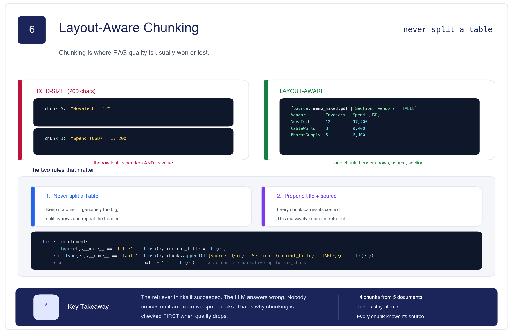

### The failure, concretely

```text
Vendor          Invoices    Spend (USD)
NovaTech        12          17,200
```

A fixed-size chunker splits after *"NovaTech 12"*. Query *"how much did we spend on NovaTech?"* retrieves `"NovaTech 12"`. The `17,200` is in a different chunk.

> **The retriever thinks it succeeded. The LLM answers wrong. Nobody notices until an executive spot-checks.**

### The three strategies

| Strategy | How | When |
|---|---|---|
| Fixed-size | split every N chars | baseline, generic prose |
| Sentence/paragraph | split on boundaries | prose-heavy documents |
| **Layout-aware** | respect element types | **mixed documents, tables, RAG** |

### The two rules that matter

1. **Never split a `Table`.** Keep it atomic. If it's genuinely too big, split by rows and **repeat the header** on each part.
2. **Prepend the section title and source to every chunk.** This gives each chunk *context* and massively improves retrieval.

```python
for el in elements:
    t = type(el).__name__
    if t == 'Title':
        flush(); current_title = str(el)
    elif t == 'Table':
        flush()
        chunks.append(f'[Source: {src} | Section: {current_title} | TABLE]\n' + str(el))
    else:
        buf += ' ' + str(el)          # accumulate narrative up to max_chars
```

**Result: 14 chunks**, each carrying its provenance:

```text
[Source: invoice_native.pdf | Section: A101 USB-C Cable 1m]
50 3.20 160.00
```

### MCQ 4 — from the notebook

> **Why does layout-aware chunking beat fixed-size for "How much did we spend on NovaTech?"**
> ✅ **B.** The whole table stays as one chunk, so the row, its column headers and the source metadata are retrieved **together**.

> ### 🧠 Remember
> When retrieval quality drops, **look at your chunks first**. It is the most common silent bug in RAG.

---

<a id="part-7"></a>

## Part 7 — Chunks to Searchable Knowledge

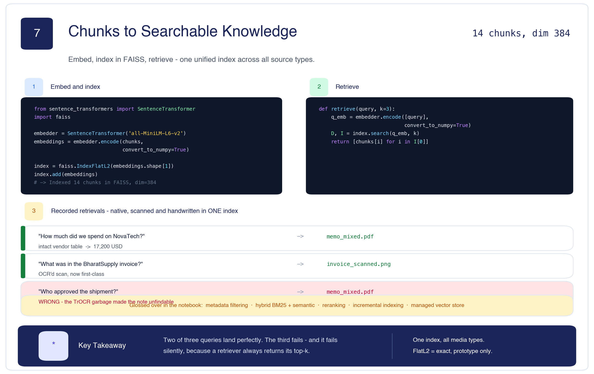

```python
from sentence_transformers import SentenceTransformer
import faiss

embedder = SentenceTransformer('all-MiniLM-L6-v2')
embeddings = embedder.encode(chunks, convert_to_numpy=True)

index = faiss.IndexFlatL2(embeddings.shape[1])
index.add(embeddings)
# -> Indexed 14 chunks in FAISS, dim=384
```

**The recorded retrievals** — native, scanned and handwritten are all in one index:

| Query | Retrieved | Outcome |
|---|---|---|
| *"How much did we spend on NovaTech?"* | `memo_mixed.pdf` — the intact vendor table | ✅ 17,200 USD |
| *"What was in the BharatSupply invoice?"* | `invoice_scanned.png` — the OCR'd scan | ✅ scans are first-class |
| *"Who approved the shipment?"* | `memo_mixed.pdf` | ❌ **wrong** — see [§5b](#part-5b) |

Two of three land. The third fails **silently**, because a retriever always returns its top-k.

> **⊕ Engineering context — what the notebook glossed over.** Metadata filtering (store `source`, `date`, `vendor` so you can filter before ranking) · **hybrid search** (BM25 + semantic, for rare tokens like SKU codes — see [Lecture 12](../12.%20%20Hybrid%20Search%20%26%20Advanced%20Retrieval/L11_and_L12_Hybrid_Search_%26_Advanced_Retrieval.md)) · **reranking** (retrieve 20, cross-encode to top 3) · **incremental indexing** (don't re-embed the corpus per invoice) · **managed vector store** beyond a few hundred thousand chunks.

> ### 🧠 Remember
> `IndexFlatL2` is **exact brute-force** search — correct, and prototype-only. It scans every vector per query.

---

<a id="part-8"></a>

## Part 8 — Wiring It Into an AI Agent

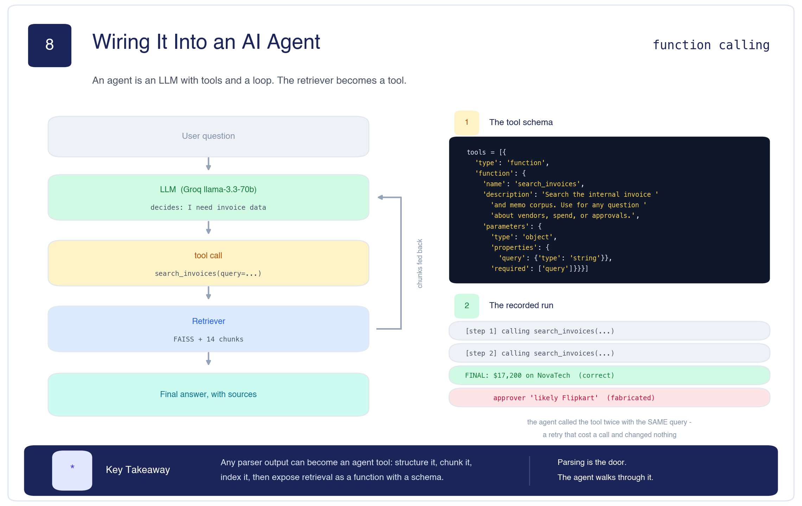

> **An agent is an LLM with tools and a loop.** The retriever becomes a tool.

```python
tools = [{
    'type': 'function',
    'function': {
        'name': 'search_invoices',
        'description': 'Search the internal invoice and memo corpus. Use this for any '
                       'question about vendors, spend, invoice numbers, approvals, '
                       'or procurement data.',
        'parameters': {
            'type': 'object',
            'properties': {'query': {'type': 'string'}},
            'required': ['query']
        }
    }
}]
```

**The recorded run** for *"How much did we spend on NovaTech in Q3, and who approved the recent shipment?"*:

```text
[Agent step 1] calling search_invoices({'query': 'NovaTech Q3 spend and recent shipment approval'})
[Agent step 2] calling search_invoices({'query': 'NovaTech Q3 spend and recent shipment approval'})
FINAL ANSWER:
We spent $17,200 on NovaTech in Q3. According to the available invoices, the approval
for the recent shipment is not explicitly stated, but it's likely that the shipment was
approved by the procurement team at Flipkart Warehouse, Bengaluru.
```

Two things worth noticing, neither flagged in the notebook:

- **The agent called the tool twice with the identical query.** A retry that cost a call and changed nothing — the `max_steps=4` cap is what stopped it going further.
- **The second half of the answer is fabricated.** Traced in [§5b](#part-5b).

> ### 🧠 Remember
> **Any parser output can become an agent tool.** Structure it, chunk it, index it, then expose retrieval as a function with a schema. *Parsing is the door; the agent walks through it.*

---

<a id="decision-guide"></a>

## Decision Guide

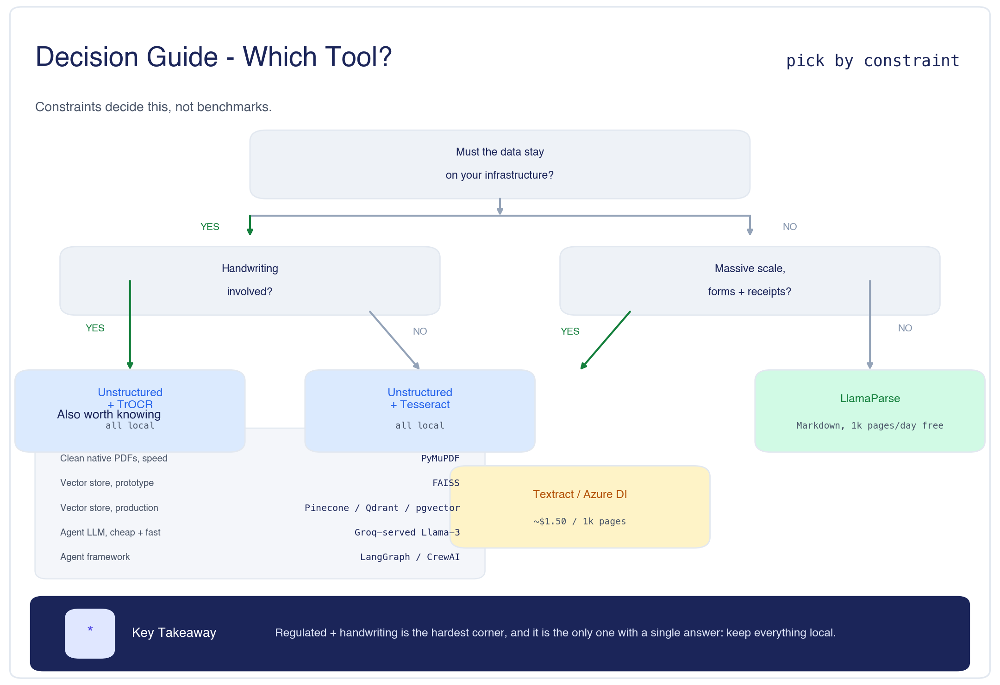

```text
Must the data stay on your infrastructure?
   ├── YES → Handwriting involved?
   │            ├── YES → Unstructured + TrOCR      (all local)
   │            └── NO  → Unstructured + Tesseract  (all local)
   └── NO  → Massive scale, forms + receipts?
                ├── YES → Textract / Azure Doc Intelligence
                └── NO  → LlamaParse                (Markdown, 1k pages/day free)
```

| Also | Reach for |
|---|---|
| Clean native PDFs, speed matters | PyMuPDF |
| Vector store, prototyping | FAISS |
| Vector store, production | Pinecone, Weaviate, Qdrant, pgvector |
| Agent LLM, cheap and fast | Groq-served Llama-3 |
| Agent framework | LangGraph, CrewAI, LlamaIndex Agents |

---

<a id="production"></a>

## Production Pitfalls

From the notebook's own wrap-up, with the failure chain from §5b as evidence for the first two:

1. **Silent chunking bugs.** If retrieval quality drops, look at your chunks first.
2. **No confidence gating on OCR.** Garbage in, garbage everywhere.
3. **Re-embedding on every deploy.** Version your embeddings.
4. **Only semantic search.** Add BM25 for rare tokens (SKU codes, invoice IDs).
5. **No metadata filtering.** Filter by source, date, vendor *before* ranking.

> **⊕ Engineering context.** Add a sixth: **no output sanity checks**. §5b would have been caught by asserting that a handwriting OCR result is plausible for its input — length, character class, confidence. Cheap to add, and it's the difference between a caught bug and a fabricated answer.

---

<a id="interview"></a>

# Interview & Revision Questions

## 🟢 Beginner

**1. What is document ingestion?**
> Turning raw documents (PDFs, scans, images) into structured, chunked, embedded content an AI system can search. It's the stage before RAG or an agent can do anything.

**2. Why is a PDF hard for an AI system to read?**
> A PDF stores instructions for **drawing** a page — glyphs and coordinates — not what the page means. Structure like tables and reading order must be inferred.

**3. What is OCR, and when do you need it?**
> Optical Character Recognition converts pixels to characters. You need it whenever a document has no text layer — scans, photos, handwriting. That's 30–40% of enterprise documents.

**4. What does `partition_pdf()` return?**
> A list of **typed elements** — `Title`, `NarrativeText`, `Table`, `ListItem`, `Image` — each with metadata like page number.

**5. What is chunking, and why does it matter?**
> Splitting parsed content into pieces small enough to embed. It matters because chunks are the **atoms of retrieval** — if the answer is split across two chunks, no retriever can reassemble it.

**6. What makes a parser "AI-native"?**
> It produces LLM-ready output directly — Markdown, structured JSON — instead of raw text you then have to convert.

---

## 🔵 Intermediate

**7. Compare PyMuPDF, Unstructured and LlamaParse.**
> **PyMuPDF**: fast raw text, no types — good for clean native PDFs and a cheap baseline. **Unstructured**: typed elements, runs locally, open-source — the choice when data can't leave your infrastructure. **LlamaParse**: Markdown-first via a vision-language model, strong on complex tables — the choice when you want LLM-ready output and can send data to an API.

**8. What are Unstructured's three strategies and when do you use each?**
> `fast` (native PDFs, high volume), `hi_res` (complex layouts — runs a local YOLO layout model), `ocr_only` (pure scans). Same API, different quality/speed knob. Production teams benchmark all three per document type.

**9. Why does layout-aware chunking beat fixed-size?**
> Fixed-size can split a table mid-row, separating values from their column headers. Layout-aware keeps tables atomic and prepends the section title and source, so the retrieved chunk carries everything needed to answer.

**10. How does confidence gating work?**
> `pytesseract.image_to_data()` returns per-word confidence. Average it, and if it falls below a threshold (80 in the notebook — the scan scored **71.7**) route the page to human review or a stronger model instead of into the index.

**11. How does a retriever become an agent tool?**
> Wrap it in a function, describe it in a JSON schema (name, description, parameters), pass the schema to the LLM with `tool_choice='auto'`. The LLM decides when to call it; you execute and feed results back.

**12. Why does `partition()` matter more than `partition_pdf()` for batch work?**
> `partition()` **auto-routes** by file type — PDFs to PDF parsing, images to OCR, DOCX to DOCX parsing. One call handles a mixed folder, so the caller never branches on extension.

---

## 🟠 Advanced

**13. Trace how a single OCR error becomes a hallucinated answer.**
> *Testing:* do you understand that parsing errors propagate silently?
> **Answer:** TrOCR misread `"Approved by Rohan on 12 Sept"` as `"announced by television to take a total of 100 000…"`. That string was assigned to `handwritten_text` → became chunk 0 → was embedded and indexed → the query *"Who approved the shipment?"* retrieved the wrong document because the note was now unfindable → the agent, lacking evidence, fabricated *"likely approved by the procurement team at Flipkart Warehouse"* and cited it. **No stage raised an error.** Four stages, one root cause, zero warnings.

**14. The notebook claims TrOCR beat Tesseract on handwriting. Its output shows the reverse. What does that teach?**
> That you must **read recorded output, not narration** — including your own. It also shows that a specialised model is not automatically better on a specific input: TrOCR is trained on cursive handwriting, and the note was rendered in an italic *printed* font, which is exactly Tesseract's strength. Model choice depends on the actual input distribution, not the label on the tin.

**15. Unstructured returned 23 typed elements but no `Table`. Why, and what breaks?**
> `strategy='fast'` does text extraction with type inference, not layout detection — real table detection needs `hi_res` and its layout model. What breaks is the chunker: the `elif t == 'Table'` branch never fires, so the "keep tables atomic" rule silently never applies, and rows get chunked as ordinary text.

**16. You have 10,000 PDFs. What changes?**
> **Parallelism** — threads for API-based parsers (network-bound), processes for CPU-heavy local ones. **Queue architecture** — S3/Blob + SQS/Pub-Sub + workers, decoupling upload from processing. **Idempotency** — hash each document so re-runs don't duplicate, with bounded retries and backoff. And **per-type strategy selection**, since `hi_res` on 10,000 native PDFs is wasted compute.

**17. Why is `IndexFlatL2` fine here and wrong in production?**
> It's exact brute-force: every query scans all vectors. At 14 chunks that's instant and perfectly accurate. At millions it's O(N) per query with the whole index in RAM — you'd move to an ANN index (HNSW via FAISS, Qdrant, pgvector), accepting ~95–99% recall for sublinear search.

**18. The agent called the same tool twice with an identical query. Diagnose it.**
> The first call returned chunks that didn't answer the *approval* half of the compound question, so the model retried rather than concluding. It's wasted cost with no new information. Fixes: detect repeat calls and short-circuit; instruct the model to reformulate rather than repeat; or split compound questions into sub-queries. `max_steps=4` is what stopped it — that cap is load-bearing.

---

## 🔴 Senior

**19. How would you design document ingestion for a regulated enterprise?**
> *Testing:* do constraints drive your architecture, or do benchmarks?
> **Answer:** residency first — everything on-prem, so **Unstructured** for parsing, **Tesseract** for printed scans, **TrOCR** for handwriting, a self-hosted vector store. Then the pipeline: queue-based ingestion (object storage → queue → workers), per-document-type strategy selection, `try/except` with logged failures, document hashing for idempotency, confidence gating with a human-review queue, layout-aware chunking with source metadata, and audit logging of every parse so an answer can be traced back to a page.

**20. Retrieval quality has dropped. How do you debug it?**
> Work **backwards up the pipeline**, because every stage inherits the last one's errors. **First inspect the chunks** — are tables intact, is metadata present, did chunk count change? **Then the parse** — did a library upgrade change element typing? **Then OCR confidence** — is average confidence trending down (new scanner, worse source documents)? **Then the index** — was it rebuilt with a different embedding model? Only after all of that look at the retriever. The notebook's own failure was three stages upstream of where it appeared.

**21. Where do you put quality gates?**
> At least three. **After OCR** — confidence threshold plus an output sanity check (length and character class plausible for the input). **After chunking** — assert no chunk is empty, tables are intact, every chunk has source metadata. **After retrieval** — a sufficiency check before generation, so the LLM never synthesises from irrelevant context (the verifier pattern from Lecture 12). §5b would have been caught by the first of these.

---

## 🟣 Staff / System Design

**22. Design a document intelligence platform ingesting 1M documents/month across mixed types and tenants.**

> *What the interviewer is testing:* can you separate the control plane from the data plane, and do you volunteer failure handling and cost without being asked?
>
> *Expected reasoning:* treat parsing as a fan-out of independent jobs over a durable queue, and route by document type rather than using one parser everywhere.
>
> **Strong answer:**
> **Ingestion** — documents land in object storage; an event notifies a queue. Workers are stateless and horizontally scaled; every job is keyed by content hash for idempotency.
> **Routing** — classify first (native / complex / scan / handwriting), then route: PyMuPDF for clean native (cheap), Unstructured `hi_res` for complex, OCR path for scans. Don't pay `hi_res` prices for a one-column memo.
> **Quality** — confidence gating with a human-review queue; sanity assertions on output; sample-based golden-set evaluation of parse quality over time.
> **Storage** — parsed elements in a document store, chunks + embeddings in a vector store, both versioned so you can re-chunk without re-parsing and re-embed without re-chunking. This layering is what makes a model upgrade affordable.
> **Multi-tenancy** — tenant ID in every chunk's metadata, enforced as a filter at query time, not as a post-filter.
> **Cost** — parsing dominates at this volume; the biggest lever is routing cheap documents to cheap parsers. Per-page cloud OCR at ~$1.50/1k means 1M pages ≈ $1,500/month, which is usually what justifies self-hosting.
> **Failure modes** — poison-pill documents (cap retries, dead-letter queue), silent OCR degradation (monitor confidence distribution, not just averages), and index drift after an embedding model change (version and backfill).

**23. What is the single highest-leverage investment in a document AI pipeline, and why?**

> **Strong answer:** **observability over the parse and chunk stages**, because that's where information is lost and it's the only place errors are still cheap to detect. §5b is the argument: a wrong OCR call produced a fabricated customer-facing answer four stages later, and nothing in the run signalled a problem. Concretely: log OCR confidence distributions per document type, assert chunk invariants (non-empty, tables intact, metadata present), keep a golden set of documents whose expected parse output is known, and re-run it on every dependency upgrade. That costs days; discovering the failure through an executive spot-check costs trust.

---

<a id="cheatsheet"></a>

# One-Page Revision

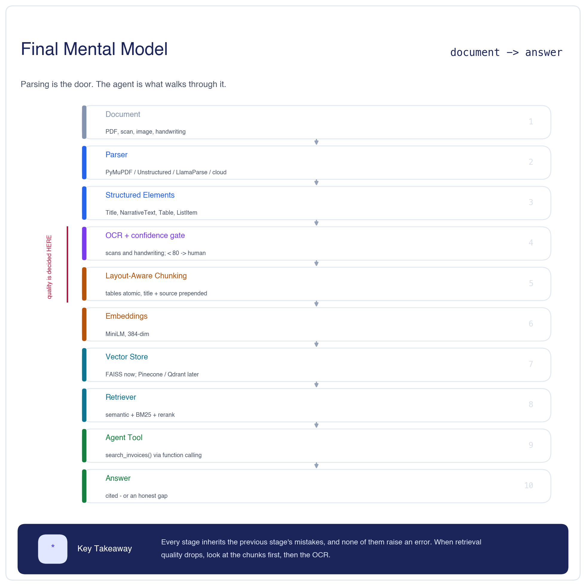

## The pipeline

```text
Document → Parser → Structured Elements → OCR + gate → Layout-aware chunks
         → Embeddings → Vector store → Retriever → Agent tool → Answer
```

## Tools, by constraint

| Constraint | Reach for |
|---|---|
| Clean native PDFs, speed | PyMuPDF |
| Typed elements, on-prem | Unstructured |
| LLM-ready Markdown | LlamaParse |
| Printed scans, private | Tesseract |
| Handwriting, private | TrOCR (but **verify** — see §5b) |
| Forms at scale | Textract / Azure DI / Google Doc AI |
| Vector store | FAISS (proto) → Pinecone/Qdrant/pgvector (prod) |

## The numbers

| Fact | Value |
|---|---|
| Enterprise docs that are scans | **30–40%** |
| Corpus parsed | 5 files, 4 types, **0 failures** |
| Elements returned (`invoice_native.pdf`) | **23** |
| Parallel parse, 5 files, 4 workers | **12.00s** |
| OCR average confidence (scan) | **71.7** → below 80 → human review |
| Chunks produced | **14** |
| Embedding dimension | **384** (MiniLM) |
| Cloud OCR cost | ~**$1.50 / 1,000 pages** |

## Chunking rules

1. **Never split a `Table`.** Too big? Split by rows, repeat the header.
2. **Prepend section title + source** to every chunk.

## Failure modes

1. Silent chunking bugs — **check chunks first** when quality drops
2. No OCR confidence gating — garbage in, garbage everywhere
3. **No output sanity check** — §5b's root cause
4. Re-embedding on every deploy — version your embeddings
5. Only semantic search — add BM25 for SKUs and IDs
6. No metadata filtering — filter before ranking

## The five sentences

1. **A PDF stores how to draw a page, not what it means** — structure is always inferred, and inference fails differently per parser.
2. **Typing is what enables everything downstream** — chunk by type, filter by type, prepend titles.
3. **OCR is something you call, not build** — but never ship its output ungated.
4. **Chunking is where RAG quality is won or lost** — keep tables atomic, carry the source.
5. **Errors propagate silently** — one bad OCR call became a fabricated answer four stages later, and nothing raised an error.

---

## Related notes

- ⬅️ Previous: [12. Hybrid Search & Advanced Retrieval](../12.%20%20Hybrid%20Search%20%26%20Advanced%20Retrieval/L11_and_L12_Hybrid_Search_%26_Advanced_Retrieval.md) — the retrieval layer this pipeline feeds
- 🏠 [Module 8 index](../)
