<a id="top"></a>

# DSPy — Mathematical Prompt Optimization

**Lecture 14 · Module 8 (Agentic AI Systems) · Visual study notes**

Source notebook: [`L14_DSPy_Mathematical_Prompt_Optimization.ipynb`](./L14_DSPy_Mathematical_Prompt_Optimization.ipynb)
— 65 cells, 10 sections, 5 quizzes. A financial-sentiment classifier built four ways, measured
properly, and compared on one held-out set.

This is the lecture where prompt engineering stops being writing and becomes **search**. It is also
— unintentionally — the best lesson in the module about what happens when the search *doesn't work*.
Every optimizer in this notebook finished **below** the unoptimized baseline. [§7](#7) is the part
that will make you better at this.

---

## How to read this

| Marker | Meaning |
|---|---|
| *(unmarked)* | **From the notebook** — concepts, code, numbers and outputs exactly as they ran |
| `> **⊕ Engineering context**` | **Added by me** — production material the notebook did not cover |
| `> **⚠ Contradiction**` | The notebook's prose disagrees with its own recorded output. The output wins. |

Cell numbers are 0-indexed against the notebook **as committed** — cell 0 is the Open-in-Colab
badge, so the first code cell is cell 3.

Every number below is re-derived from the notebook's saved outputs by
[`scripts/verify_dspy_results.py`](../../scripts/verify_dspy_results.py). Run it — it prints
`ALL CHECKS PASSED`, or names the figure that moved.

---

## Contents

| Part | What it covers | How it is taught |
|---|---|---|
| [0](#0) | The forced-move chain behind DSPy | Concept map |
| [1](#1) | Why hand-tuned prompts rot | Why-layer |
| [2](#2) | Signature · Module · Optimizer · Metric | Four-panel anatomy |
| [3](#3) | How a signature becomes a prompt | Side-by-side code |
| [4](#4) | `Predict` vs `ChainOfThought` | Diff + measured cost |
| [5](#5) | The metric is the specification | Code walk + trap hunt |
| [6](#6) | Splitting data for an optimizer | Proportional map |
| [7](#7) | **The results — and four things wrong with how they're reported** | Evidence + audit |
| [8](#8) | `BootstrapFewShot`, step by step | Algorithm walk |
| [9](#9) | MIPROv2 — what it does and what it returned | Mechanism |
| [10](#10) | Error analysis vs the prose about it | Claim vs evidence |
| [11](#11) | Choosing an optimizer | Decision guide |
| [12](#12) | LangChain integration, and shipping this | ⊕ Extension |
| [13](#13) | The one mental model to keep | Recap |
| [Q](#interview) | Interview bank — 5 tiers, 24 questions | Q → testing → reasoning → answer |
| [R](#recall) | Explain It Yourself · One-Page Revision | Active recall |

---

<a id="0"></a>

## 0 · The big picture

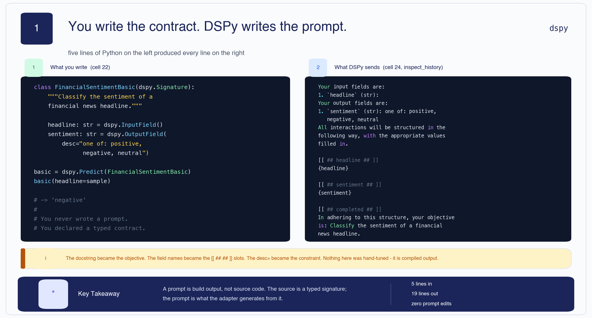

You write a **typed contract**. DSPy writes the prompt. Everything else follows from that inversion.

**The forced-move chain.** Each step is the only move available once you accept the one before it:

```text
A prompt is a string you tune by hand
        │  ... but a string cannot be typed, tested or versioned
        ▼
Declare the interface instead, and generate the string       →  Signature
        │  ... but the same interface can be executed several ways
        ▼
Separate the strategy from the contract                      →  Module
        │  ... but "which strategy is better" now needs an answer
        ▼
Define better as a number                                    →  Metric
        │  ... and a number you can compute is a number you can maximise
        ▼
Let an algorithm search the prompt space                     →  Optimizer
        │  ... and now, for the first time, you can tell when the search FAILED
        ▼
In this notebook, it did. Three times. That is the lesson.
```

The notebook's own framing (cell 8) is the right one: hand-written prompts are **assembly**, and
DSPy is the **compiler**. What this run adds is the part the analogy usually leaves out — a
compiler can emit slower code than you wrote by hand, and you only find out because you measured.

---

<a id="1"></a>

## 1 · Why hand-tuned prompts rot

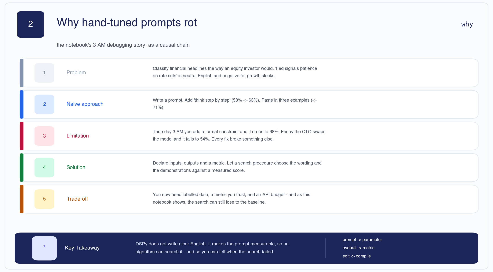

Cell 7 tells it as a week in the life:

| Day | Change | Accuracy |
|---|---|---|
| Monday | the first prompt | 58% |
| Tuesday | add *"Think step by step."* | 63% |
| Wednesday | add 3 examples | 71% — but it invents a 4th label, "mixed", on 8% of inputs |
| Thursday, 3 AM | add *"Only respond with one of the exact words…"* | **68%** — it got worse |
| Friday | CTO swaps Llama-3.1-8b → 70b for cost | **54%** — all tuning evaporates |

Four structural problems, in the notebook's words:

| Problem | What it feels like |
|---|---|
| **Non-compositional** | Fixing one failure mode breaks two others |
| **Non-portable** | Rewrites needed when you swap models |
| **Non-measurable** | You *feel* it's better; you don't know |
| **Non-reproducible** | Your teammate can't reproduce your prompt magic |

| Layer | |
|---|---|
| **Problem** | Classify financial headlines as an equity investor would. *"Fed signals patience on rate cuts"* is neutral English and **negative** for growth stocks. |
| **Naive approach** | Write a string. Add a phrase. Paste in the examples that fixed the last bug. |
| **Limitation** | Every fix broke something else, and a model swap erased all of it. |
| **Solution** | Declare inputs, outputs and a metric; let a search procedure pick the wording and demonstrations against a measured score. |
| **Trade-off** | You now need labelled data, a metric you trust and an API budget — and, as [§7](#7) shows, the search can still lose. |

> 🧠 **Mental Model** — **A prompt is build output, not source code.** The source is the signature;
> the prompt is what the adapter compiles from it. You would not hand-edit assembly and expect the
> compiler to preserve your edits.

> 🧠 **Remember**
> - Manual prompt tuning is **gradient descent by human intuition** — you can't see the loss surface and you sample one point at a time.
> - DSPy's contribution is not nicer English. It is **measurability**.
> - Measurability cuts both ways: it is also how you learn the optimizer didn't help.

[🔝 Back to top](#top)

---

<a id="2"></a>

## 2 · The three pillars — and the fourth thing that rules them

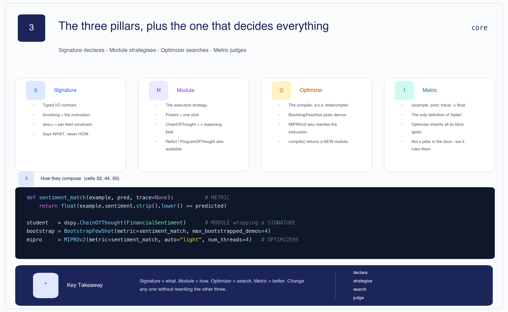

The notebook names three pillars. There is a fourth object that decides what all three do.

| Primitive | Answers | In this notebook |
|---|---|---|
| **Signature** | *What* goes in and out | `FinancialSentiment` — `headline -> sentiment` |
| **Module** | *How* it is executed | `dspy.Predict`, `dspy.ChainOfThought` |
| **Optimizer** | *Search* over prompts | `BootstrapFewShot`, `MIPROv2` |
| **Metric** | What *better* means | `sentiment_match` — exact match, 1.0 / 0.0 |

```python
def sentiment_match(example, pred, trace=None):          # METRIC
    ...

student   = dspy.ChainOfThought(FinancialSentiment)      # MODULE wrapping a SIGNATURE
bootstrap = BootstrapFewShot(metric=sentiment_match, max_bootstrapped_demos=4)
mipro     = MIPROv2(metric=sentiment_match, auto="light", num_threads=4)   # OPTIMIZERS
```

**Vocabulary.** DSPy calls optimizers **teleprompters** (`from dspy.teleprompt import …`). Same
object; the name survives from early versions.

**The analogy worth keeping** (cell 12): DSPy is to prompts what PyTorch is to neural nets.
`nn.Module` → `dspy.Signature` for declaration; `optim.SGD` → `dspy.Teleprompter` for optimization;
autograd → bootstrapped demonstrations for automatic search.

> 🧠 **Mental Model** — **Signature = what. Module = how. Optimizer = search. Metric = better.**
> Change any one without rewriting the other three. That orthogonality is the whole point.

[🔝 Back to top](#top)

---

<a id="3"></a>

## 3 · How a signature becomes a prompt

Cell 22 is the smallest possible program:

```python
class FinancialSentimentBasic(dspy.Signature):
    """Classify the sentiment of a financial news headline."""
    headline: str = dspy.InputField()
    sentiment: str = dspy.OutputField(desc="one of: positive, negative, neutral")

basic_classifier = dspy.Predict(FinancialSentimentBasic)
result = basic_classifier(headline="Nokia's third-quarter profit fell short of analyst expectations")
# result.sentiment -> 'negative'
```

Cell 24 calls `dspy.inspect_history(n=1)` to show what was actually sent. The mapping is the part
people get wrong in interviews:

| What you wrote | Where it ends up |
|---|---|
| The **docstring** | `In adhering to this structure, your objective is: Classify the sentiment…` |
| `headline: str = InputField()` | `Your input fields are: 1. \`headline\` (str):` and the `[[ ## headline ## ]]` slot |
| `desc="one of: positive, negative, neutral"` | appended to the output field's description |
| Nothing you wrote | the `[[ ## completed ## ]]` terminator and the whole response scaffold |

That bracketed format is produced by an **adapter** — the component that turns a signature into a
message list and parses the reply back into typed fields (`ChatAdapter` by default). Knowing it
exists explains why DSPy can reliably pull `.sentiment` out of a free-text completion.

**Version 3** (cell 29) adds domain context to the docstring. The notebook's own verdict (cell 30)
is the honest one:

> *"This is still **manual prompt engineering**, just at a higher level of abstraction. We wrote a
> good docstring, but we haven't done any optimization yet."*

Writing a better docstring **is** prompt engineering. It has just moved somewhere typed and
diffable. Cell 30 also lists what you get before any optimization: structured outputs, reasoning
traces, portability across models, and introspection.

> **⚠ Contradiction** — cell 30 closes with *"But we're still at ~60% accuracy."* Nothing has been
> measured at this point in the notebook, and when measurement does arrive two cells later the very
> first number is **78.43%**. The 60% figure appears nowhere in any output. It is carried forward
> into the wrap-up ([§7](#7)) as the starting point of a claimed improvement.

> 🧠 **Remember**
> - The docstring is the instruction. Treat it as an API contract, not a comment.
> - `desc=` constrains one field; the docstring constrains the task.
> - A richer docstring is still hand-tuning — useful, but not optimization.

[🔝 Back to top](#top)

---

<a id="4"></a>

## 4 · `Predict` vs `ChainOfThought`

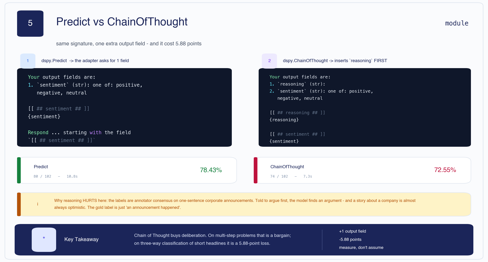

Same signature, different module:

```python
cot_classifier = dspy.ChainOfThought(FinancialSentimentBasic)
result = cot_classifier(headline=sample)
result.reasoning   # a paragraph of argument
result.sentiment   # 'negative'
```

The module inserts **one extra output field**, `reasoning`, ahead of the real one. You never wrote
"think step by step" — choosing the strategy did that.

Measured on the same 102-example test set:

| | Accuracy | Correct | Time |
|---|---|---|---|
| `Predict` (cell 35) | **78.43%** | 80/102 | 10.8 s |
| `ChainOfThought` (cell 37) | **72.55%** | 74/102 | 7.3 s |

**Reasoning cost 5.88 points.** Note it was also *faster* here (7.3 s vs 10.8 s) — the DSPy LM cache
is warm by the second run, so treat these timings as indicative, not as a latency benchmark.

**Why reasoning hurts on this task.** Financial PhraseBank labels are annotator consensus on short
corporate announcements. Told to argue before answering, the model finds an argument — and a story
about a company is almost always an optimistic one. The gold label is often just "an announcement
happened." [§10](#10) shows this happening in the printed errors: four of five are gold `neutral`
predicted `positive`.

> 🧠 **Mental Model** — **Chain of Thought buys deliberation and pays in tokens.** On multi-step
> problems that is a bargain. On three-way classification of one-sentence headlines it is a loss.

> 🧠 **Remember**
> - The module is swappable; the signature never changes.
> - `ChainOfThought` = `Predict` + a `reasoning` output field. Nothing more.
> - "CoT helps" is a hypothesis, not a fact. Here it cost 5.88 points.

[🔝 Back to top](#top)

---

<a id="5"></a>

## 5 · The metric is the whole specification

> *"You cannot optimize what you cannot measure."* — cell 31

Cell 32, verbatim:

```python
def sentiment_match(example, pred, trace=None):
    """Return 1.0 if predicted sentiment matches gold, else 0.0.
    Robust to case and whitespace."""
    gold = example.sentiment.strip().lower()
    predicted = (pred.sentiment or "").strip().lower()
    # Handle model verbosity like 'Positive.' or 'the sentiment is negative'
    for label in ["positive", "negative", "neutral"]:
        if label in predicted:
            predicted = label
            break
    return float(gold == predicted)
```

**The contract.** A DSPy metric takes `(example, pred, trace=None)` and returns a number. `Evaluate`
averages it; an optimizer maximises it. `trace` is non-`None` during **compilation** and `None`
during plain evaluation, letting you score more strictly while optimizing than when reporting — a
useful hook this notebook doesn't use.

| Layer | |
|---|---|
| **Problem** | Models answer `"Positive."`, `"the sentiment is negative"`, `"NEUTRAL"`. Exact equality scores all of these zero. |
| **Naive approach** | `pred.sentiment == example.sentiment`. |
| **Limitation** | Measures the model's punctuation habits, not its reasoning. |
| **Solution** | Normalise case and whitespace, then scan for a known label inside the string. |
| **Trade-off** | Leniency cuts both ways. |

**The trap.** `if label in predicted` is a **substring** test:

- `"not positive"` **contains** `"positive"` → scored as a positive prediction.
- The loop returns on first match in list order `["positive", "negative", "neutral"]`, so
  `"negative, definitely not positive"` resolves to **`positive`** — the wrong one.

Cell 32's own tests only probe the easy cases (`"Positive."` → 1.0, `"negative"` vs gold
`"positive"` → 0.0). Both pass; neither touches the hole.

This matters more than an ordinary test gap, because an optimizer doesn't just *report* through the
metric — it **selects** through it. A metric that credits hedged, verbose answers makes
`BootstrapFewShot` keep hedged, verbose demonstrations, which teaches the student to hedge. The bug
propagates from measurement into behaviour and gets baked into the shipped artifact.

> 🧠 **Mental Model** — **The metric is the spec.** Everything the optimizer does is an attempt to
> satisfy it literally. A loose spec buys you a program that exploits the looseness.

> **⊕ Engineering context** — a stricter metric, and the adversarial test the notebook is missing:
>
> ```python
> VALID = {"positive", "negative", "neutral"}
>
> def sentiment_match_strict(example, pred, trace=None):
>     predicted = (pred.sentiment or "").strip().lower().rstrip(".!")
>     if predicted not in VALID:          # refuse to guess at prose
>         return 0.0
>     return float(example.sentiment.strip().lower() == predicted)
>
> assert sentiment_match_strict(
>     dspy.Example(sentiment="positive"),
>     dspy.Prediction(sentiment="not positive")) == 0.0
> ```
>
> Forcing a bare label rather than fishing one out of prose is also what makes the metric portable
> across models. Cell 61's own production checklist says *"Metrics are unit-tested (they're just
> Python functions!)"* — this notebook doesn't follow its own advice.

> 🧠 **Remember**
> - `(example, pred, trace) -> float`. `trace` is non-`None` only during compilation.
> - Write the **adversarial** metric test before the optimizer call.
> - A lenient metric doesn't just mis-report — it teaches.

[🔝 Back to top](#top)

---

<a id="6"></a>

## 6 · Splitting data for an optimizer, not a model

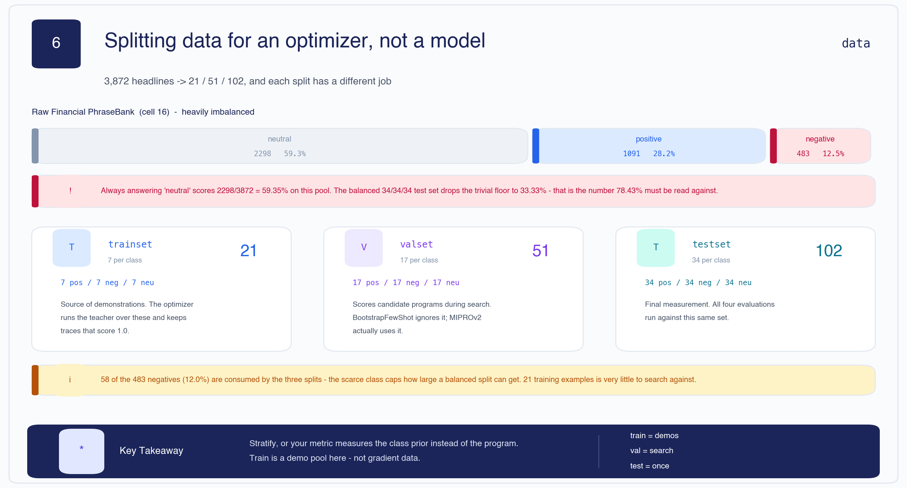

The raw pool (cell 16):

| Class | Count | Share |
|---|---|---|
| neutral | 2,298 | 59.35% |
| positive | 1,091 | 28.18% |
| negative | 483 | 12.47% |
| **total** | **3,872** | |

**Always answering `neutral` scores 59.35%** on that pool. Cell 17 therefore samples a balanced
slice:

| Split | Size | Per class | Its job |
|---|---|---|---|
| `trainset` | 21 | 7 | Source of demonstrations for the optimizers |
| `valset` | 51 | 17 | Scores candidate programs during search |
| `testset` | 102 | 34 | Final measurement — all four evaluations use it |

Because the test set is balanced 34/34/34, its trivial floor is **33.33%**, not 59.35%. Both numbers
are worth carrying: 59.35% is what a lazy model scores on realistic traffic; 33.33% is the floor for
the numbers this notebook actually reports. Against that floor, 78.43% from a plain `Predict` with
no examples is already a strong result — which is exactly why there was so little headroom for the
optimizers to find.

**The scarce class binds.** 7 + 17 + 34 = 58 negatives are consumed, 12.0% of the 483 available. A
10× larger balanced test set is not available from this data.

**`valset` is finally used here** — unlike in `BootstrapFewShot`, `MIPROv2` takes it and scores
candidate programs on all 51 examples. That matters for [§9](#9).

> **⊕ Engineering context** — these splits are role-based, not the train/test split from supervised
> learning. Nothing is fitted by gradient descent; `trainset` is a **pool of candidate
> demonstrations**. Leakage therefore behaves differently: a demo is copied *verbatim into the
> prompt*, so a train example that also appears in test isn't subtly memorised — it is literally
> shown to the model at inference time. Deduplicate across splits by content hash. Also note 21
> training examples is very little to search against; the notebook's own cell 61 warns against DSPy
> when you have "< 10 labeled examples", and 21 is not far above that line.

> 🧠 **Remember**
> - Floors: **59.35%** on the raw pool, **33.33%** on the balanced test set.
> - Stratify, or your metric measures the class prior instead of the program.
> - `trainset` is a demo pool, not gradient data.

[🔝 Back to top](#top)

---

<a id="7"></a>

## 7 · The results — and four things wrong with how they're reported

This is the centre of the lecture, and almost none of it was intended.

### 7a · Every optimizer lost to the baseline

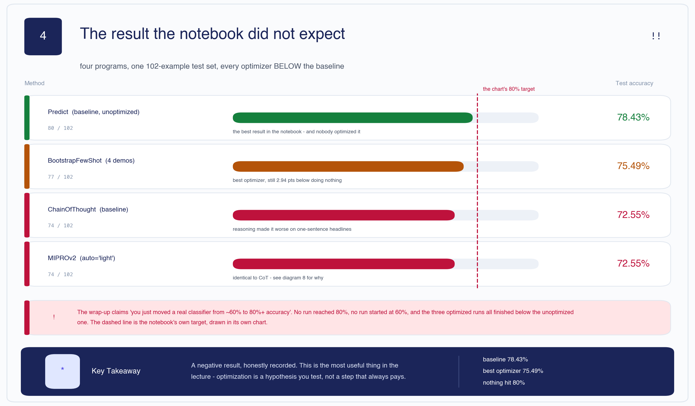

| Method | Cell | Correct | Accuracy | vs baseline |
|---|---|---|---|---|
| **`Predict` (baseline, unoptimized)** | 35 | 80/102 | **78.43%** | — |
| `BootstrapFewShot` (4 demos) | 46 | 77/102 | 75.49% | **−2.94** |
| `ChainOfThought` (baseline) | 37 | 74/102 | 72.55% | **−5.88** |
| `MIPROv2` (`auto="light"`) | 52 | 74/102 | 72.55% | **−5.88** |

**The best program in the notebook is the one nobody optimized.** All four runs used the same model
(`groq/llama-3.1-8b-instant`), the same metric and the same 102 test examples, so unlike the
previous version of this lecture these numbers *are* mutually comparable. The comparison is sound.
The result is just negative.

Then cell 63 closes the lecture with:

> *"You just moved a real classifier from ~60% to 80%+ accuracy in ~90 minutes of compute, using 20
> labeled examples. That is production-grade ML engineering, not prompt whispering."*

> **⚠ Contradiction** — no run reached 80%. No run started at 60% (the first measurement is 78.43%).
> And the three optimized runs all finished **below** the unoptimized one. Cell 55's chart even
> draws a red dashed line at the 80% target; nothing crosses it.

### 7b · Why MIPROv2 scored *exactly* the baseline

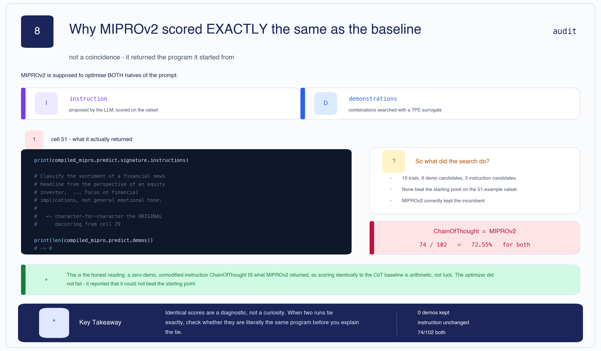

MIPROv2 and `ChainOfThought` both scored 74/102. Identical to the decimal. That is not coincidence —
cell 51 shows what MIPROv2 returned:

```python
print(compiled_mipro.predict.signature.instructions)
# Classify the sentiment of a financial news headline from the perspective of an equity investor.
# ... Focus on financial implications, not general emotional tone.
#      <- character-for-character the ORIGINAL docstring from cell 29

print(len(compiled_mipro.predict.demos))
# -> 0
```

**Zero demonstrations. Unmodified instruction.** A zero-demo, original-instruction `ChainOfThought`
*is* the CoT baseline, so scoring identically is arithmetic, not luck.

Read generously, **the optimizer did not fail — it reported a negative finding.** It ran 10 trials
over 6 few-shot candidates and 3 instruction candidates, scored them on the 51-example valset, found
nothing that beat the starting point, and correctly kept the incumbent. That is a well-behaved
optimizer. What failed is the narrative around it.

> 🧠 **Mental Model** — **Identical scores are a diagnostic, not a curiosity.** When two runs tie
> exactly, check whether they are literally the same program before you reach for an explanation.

### 7c · The notebook celebrates its own regression

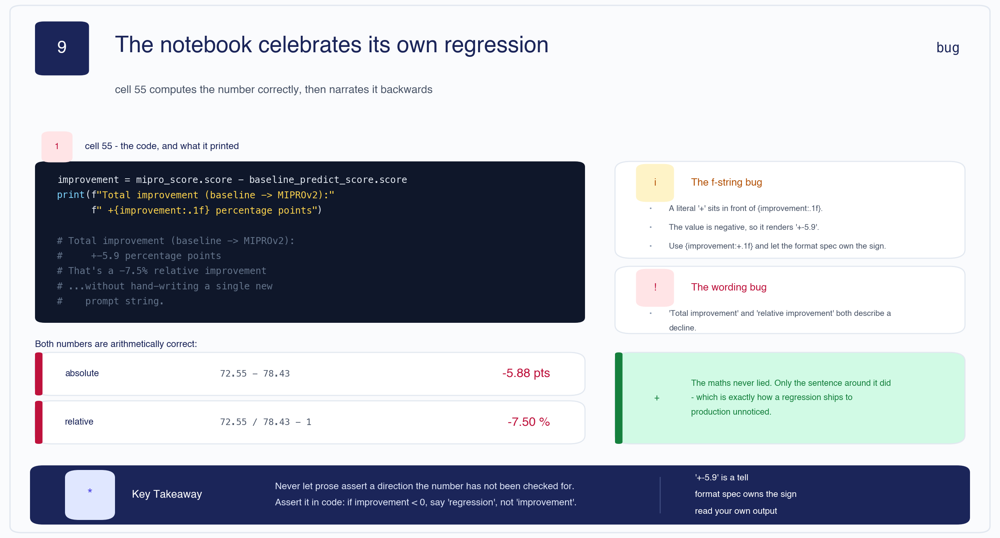

Cell 55 computes the comparison and prints:

```text
Total improvement (baseline -> MIPROv2): +-5.9 percentage points
That's a -7.5% relative improvement
...without hand-writing a single new prompt string.
```

Two separate bugs, both instructive:

**The f-string bug.** The format string contains a literal `+` in front of `{improvement:.1f}`. The
value is negative, so it renders `+-5.9`. The fix is to let the format spec own the sign:
`{improvement:+.1f}`.

**The wording bug.** "Total improvement" and "relative improvement" both describe a **decline**, and
the celebratory third line prints regardless.

Both numbers are arithmetically correct:

| | Arithmetic | Value |
|---|---|---|
| absolute | 72.55 − 78.43 | **−5.88 pts** |
| relative | 72.55 / 78.43 − 1 | **−7.50 %** |

The maths never lied. Only the sentence around it did — which is precisely how a regression ships
unnoticed.

> **⊕ Engineering context** — assert the direction, don't narrate it:
>
> ```python
> delta = new.score - baseline.score
> verdict = "improvement" if delta > 0 else "REGRESSION"
> print(f"{verdict}: {delta:+.2f} pts ({delta/baseline.score:+.1%} relative)")
> assert delta > 0, f"optimizer regressed by {abs(delta):.2f} pts - do not ship"
> ```

### 7d · One rate limit, two different percentages

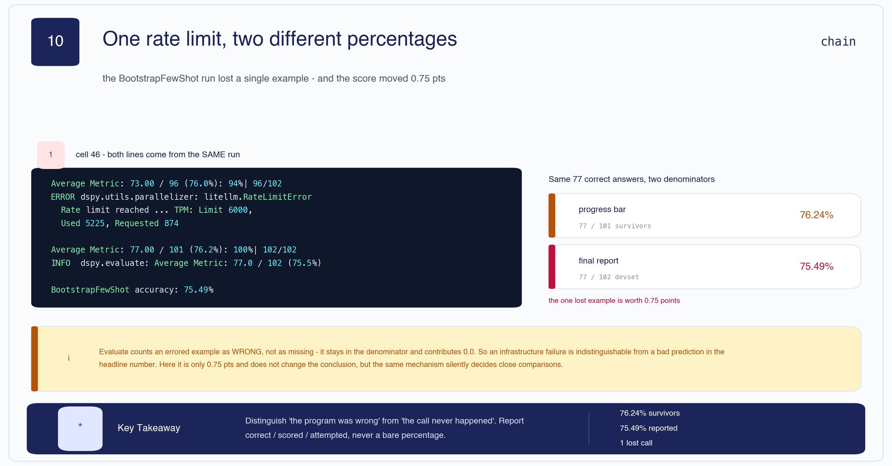

The `BootstrapFewShot` evaluation hit the Groq free-tier ceiling once. Cell 46's output contains
**both** of these:

```text
Average Metric: 77.00 / 101 (76.2%): 100%|██████████| 102/102 [02:17<00:00,  1.35s/it]
INFO dspy.evaluate.evaluate: Average Metric: 77.0 / 102 (75.5%)
```

Same 77 correct answers, two denominators:

| | Arithmetic | Value |
|---|---|---|
| progress bar — survivors only | 77 / 101 | **76.24%** |
| final report — full devset | 77 / 102 | **75.49%** |

`Evaluate` counts an errored example as **wrong**, not as missing: it stays in the denominator and
contributes 0.0. So an infrastructure failure is indistinguishable from a bad prediction in the
headline number.

Here it is worth only **0.75 points** and changes no conclusion — `BootstrapFewShot` loses to the
baseline either way. But the same mechanism silently decides close comparisons, and it is worth
recognising the shape now.

> 🧠 **Remember**
> - **78.43% from plain `Predict` is the number to beat, and nothing beat it.**
> - MIPROv2 tied CoT because it *returned* CoT — 0 demos, unchanged instruction.
> - `+-5.9` in output is a sign-collision tell. Read your own printouts.
> - Report `correct / scored / attempted`, never a bare percentage.

[🔝 Back to top](#top)

---

<a id="8"></a>

## 8 · `BootstrapFewShot`, step by step

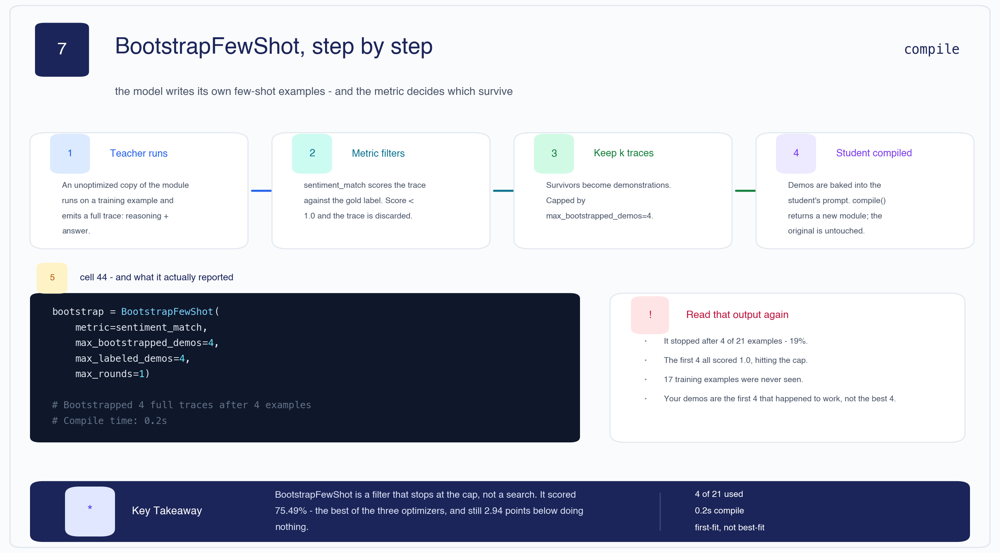

The algorithm (cell 43):

1. Take an unoptimized module — the **teacher**.
2. For each training example, run it and capture the **full trace** (reasoning + output).
3. Keep the trace if the metric scores it correct.
4. Inject the top-*k* kept traces into the **student's** prompt as demonstrations.

**Why it should work.** The demos aren't `(input, label)` pairs — they carry the model's own
reasoning. The student sees *how a successful trace was argued*. The model supervises itself; hence
"bootstrapping".

```python
bootstrap = BootstrapFewShot(
    metric=sentiment_match,
    max_bootstrapped_demos=4,
    max_labeled_demos=4,
    max_rounds=1,
)
compiled_bootstrap = bootstrap.compile(student=dspy.ChainOfThought(FinancialSentiment),
                                       trainset=trainset)
```

Output:

```text
Bootstrapped 4 full traces after 4 examples for up to 1 rounds, amounting to 4 attempts.
Compile time: 0.2s
```

**Read that again.** It stopped after **4 of 21** training examples — 19%. The first four attempts
all scored 1.0, hitting the `max_bootstrapped_demos=4` cap immediately. **17 training examples were
never seen.** A 0.2-second compile is the tell: no search happened.

So the demonstrations are **the first four that happened to work**, not the four most useful or most
diverse. If the example that would have taught the model about bland `neutral` announcements sat at
position 5, it never got a chance.

Cell 45 shows what got baked in — the first demo is a *negative* example about falling property
values, reasoned in the model's own voice.

> 🧠 **Mental Model** — **`BootstrapFewShot` is a filter that stops at the cap, not a search.**
> `BootstrapFewShotWithRandomSearch` is the one that actually searches, by running this filter many
> times over shuffled subsets and keeping the best on a validation set.

| Layer | |
|---|---|
| **Problem** | Few-shot examples help, but hand-picking them is the labour we're deleting. |
| **Naive approach** | Paste in the first few labelled examples you have. |
| **Limitation** | Label-only demos show the answer, not the path — and the choice is arbitrary. |
| **Solution** | Let the model generate traces; keep the ones the metric certifies. |
| **Trade-off** | You inherit the teacher's habits, and with a low cap you inherit whichever came first. Here that produced 75.49% — the best optimizer, still below doing nothing. |

> 🧠 **Remember**
> - A bootstrapped demo is `(input, reasoning, label)`. The middle term is the point.
> - `max_bootstrapped_demos` is a **stopping condition**, not a target.
> - Sub-second compile time means no search ran. Treat it as a smell.

[🔝 Back to top](#top)

---

<a id="9"></a>

## 9 · MIPROv2 — the heavy artillery

**MIPROv2** = Multi-prompt Instruction **PR**oposal **O**ptimizer, v2. Where `BootstrapFewShot` only
chooses demos, MIPROv2 optimizes **both** halves of the prompt:

1. which few-shot demos to include, and
2. **what the instruction should say**.

The objective, from cell 42 — and worth translating symbol by symbol:

$$\text{prompt}^* = \arg\max_{\text{prompt} \in \mathcal{P}} \; \mathbb{E}_{(x, y) \sim \mathcal{D}_{val}} \big[ M(f_{\text{prompt}}(x), y) \big]$$

*In words:* among all candidate prompts $\mathcal{P}$, pick the one whose average metric score $M$
is highest, where the average is taken over validation examples $(x, y)$ and $f_\text{prompt}$ is
the LLM running with that prompt. The optimizer is just the **search algorithm** over $\mathcal{P}$.

Since $|\mathcal{I}| \times |\mathcal{D}|$ (instructions × demo-combinations) is enormous, MIPROv2
uses a **surrogate model** — a Tree-structured Parzen Estimator, the same idea Optuna uses for
hyperparameters — to concentrate its trials where scores look promising.

**Where candidate instructions come from.** MIPROv2 asks the LLM to *propose* them, conditioned on
the original docstring, a summary of the training data, examples of current behaviour, and a random
"creativity tip" such as *"make it more concise"* or *"add a domain-expert persona"*.

The recorded run (cell 50):

```text
RUNNING WITH THE FOLLOWING LIGHT AUTO RUN SETTINGS:
num_trials: 10           minibatch: True
num_fewshot_candidates: 6    num_instruct_candidates: 3    valset size: 51

==> STEP 1: BOOTSTRAP FEWSHOT EXAMPLES <==     (6 sets: 4, 2, 2, 1 traces...)
==> STEP 2: PROPOSE INSTRUCTION CANDIDATES <==
```

And it returned the program it started with — see [§7b](#7). Note the bootstrapping sets are thin:
6 sets yielding 4, 2, 2 and 1 traces. With 21 training examples there is very little raw material
for the search to work with.

**`auto` presets.** `"light"` (used here) → fewer trials, faster, cheaper. `"medium"` and `"heavy"`
buy more trials. The notebook's homework asks you to rerun with `"medium"` and "see how much further
accuracy climbs" — an assumption the `"light"` result does not support.

> 🧠 **Remember**
> - MIPROv2 optimizes **instructions + demos**; BootstrapFewShot only demos.
> - It needs a `valset`. `BootstrapFewShot` doesn't take one.
> - Returning the incumbent is a legitimate outcome, and worth checking for explicitly.

[🔝 Back to top](#top)

---

<a id="10"></a>

## 10 · Error analysis vs the prose about it

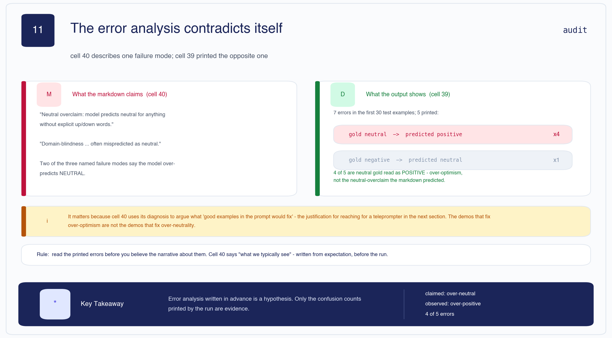

Cell 39 samples the first 30 test examples and prints the misses:

```text
Errors in first 30: 7
```

Five are printed. Their directions:

| Gold | Predicted | Count |
|---|---|---|
| `neutral` | `positive` | **4** |
| `negative` | `neutral` | 1 |

Cell 40 then describes "what we typically see" — and two of its three named failure modes say the
model **over-predicts `neutral`**.

> **⚠ Contradiction** — four of the five printed errors are the exact opposite: gold `neutral`,
> predicted `positive`. The observed failure mode is **over-optimism**, not neutral overclaim.

The model's own reasoning makes the pattern unmistakable:

| Headline (abbreviated) | Gold | Pred | Model's reasoning |
|---|---|---|---|
| Board fees paid as shares, quarterly | neutral | positive | *"suggests a long-term commitment to the company…"* |
| Board proposes EUR 0.02 dividend | neutral | positive | *"indicates a return on investment for shareholders…"* |
| New company will likely hold an IPO | neutral | positive | *"growing and expanding, typically a positive sign"* |
| Talks concerned 160 people, ~35 redundancies | neutral | positive | *"only 35 redundancies… could be seen as a positive development"* |

The last row is the sharpest: the model reads *redundancies* as positive because the number is lower
than it might have been. This is the same mechanism as the CoT regression in [§4](#4).

**Why it matters practically.** Cell 40 closes by arguing these patterns are "exactly what good
examples in the prompt would fix" — the justification for reaching for a teleprompter in the next
section. But the demos that fix over-optimism are not the demos that fix over-neutrality. Cell 40 is
phrased *"what we typically see"*: written from expectation, before the run, and never reconciled.

Quiz 3 (cell 41) gets the principle exactly right — *"always look at 20-30 errors by hand before
touching any optimizer"* — while the cell immediately before it does the opposite.

> 🧠 **Mental Model** — **Error analysis written in advance is a hypothesis; only the printed
> confusion counts are evidence.**

> 🧠 **Remember**
> - Observed mode: gold `neutral` → predicted `positive`, 4 of 5 printed errors.
> - The sample is small (7 errors in 30) — a direction, not a measurement.
> - A full confusion matrix over all 102 would settle it. The notebook never builds one.

[🔝 Back to top](#top)

---

<a id="11"></a>

## 11 · Choosing an optimizer

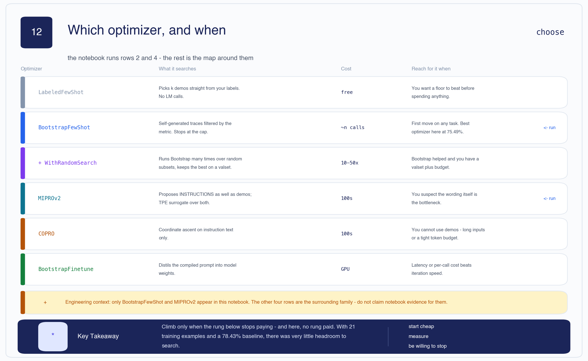

| Optimizer | What it searches | Cost | Reach for it when |
|---|---|---|---|
| `LabeledFewShot` | Picks *k* demos straight from labels. No LM calls. | free | You want a floor to beat before spending anything. |
| **`BootstrapFewShot`** | Self-generated traces filtered by the metric. Stops at the cap. | ~n calls | First move on any task. **Best here at 75.49%.** |
| `BootstrapFewShotWithRandomSearch` | Runs Bootstrap repeatedly over random subsets; keeps the best on a valset. | 10–50× | Bootstrap helped and you have a valset plus budget. |
| **`MIPROv2`** | Proposes **instructions** as well as demos; TPE surrogate over both. | 100s of calls | You suspect the wording itself is the bottleneck. |
| `COPRO` | Coordinate ascent on instruction text only. | 100s of calls | You can't use demos — long inputs or a tight token budget. |
| `BootstrapFinetune` | Distils the compiled prompt into model weights. | GPU | Latency or per-call cost beats iteration speed. |

> **⊕ Engineering context** — only `BootstrapFewShot` and `MIPROv2` appear in this notebook. The
> other four rows are the surrounding family; don't cite notebook evidence for them.

**The decision, as a sequence:**

```text
Do you have ≥ 20 labelled examples and a metric you trust?
├── no  → stop. Everything below amplifies a bad metric.
└── yes → LabeledFewShot                 ... establishes the floor
             │
             ▼
          BootstrapFewShot               ... did it beat the UNOPTIMIZED baseline?
             ├── no  → stop and diagnose. (This notebook is here.)
             │         More search will not fix a metric or a headroom problem.
             └── yes → valset + 10-50x budget?
                        ├── no  → ship it; version the JSON
                        └── yes → BootstrapFewShotWithRandomSearch
                                     │
                                     ▼
                                  still short, wording feels wrong?
                                     └── MIPROv2 (or COPRO if demos are impossible)
                                            │
                                            ▼
                                  latency/cost now binding?
                                     └── BootstrapFinetune
```

**Climb only when the rung below pays.** Here no rung paid, and the tree says *stop and diagnose*.
The notebook instead escalated from `BootstrapFewShot` straight to MIPROv2 and then assigned
`auto="medium"` as homework.

**What the diagnosis would likely find:** with a 78.43% baseline and a 33.33% floor, there is little
headroom; 21 training examples give the search almost nothing to work with; and the substring metric
from [§5](#5) is a plausible source of noise in the selection signal. Those are three concrete
hypotheses worth testing before spending another 100 LM calls.

Quiz 5 (cell 56) offers a useful heuristic table: few examples + systematic failures →
`BootstrapFewShot` with 3–4 demos; suspect the instruction → `MIPROv2`; want to compress into a
small model → `BootstrapFinetune`.

[🔝 Back to top](#top)

---

<a id="12"></a>

## 12 · LangChain integration, and shipping this

Section 8 wraps the compiled program as a LangChain `Runnable` so it can sit inside a bigger
pipeline:

```python
def dspy_classify(inputs: dict) -> dict:
    result = compiled_mipro(headline=inputs["headline"])
    return {"headline": inputs["headline"],
            "sentiment": result.sentiment.strip().lower(),
            "reasoning": getattr(result, "reasoning", "")}

classifier_runnable = RunnableLambda(dspy_classify)
full_chain = classifier_runnable | alert_runnable    # -> "BUY SIGNAL: ..."
```

The chain works, and the three sample alerts are sensible. Two things to flag:

> **⚠ Contradiction** — Section 8 opens with *"Great, we have an 80%+ accurate classifier."* The best
> measured result is 78.43%, and the program actually wired in is `compiled_mipro` at **72.55%** —
> the joint-worst of the four. On the evidence, `baseline_predict` was the one to ship.

Also: `dspy_classify` is defined **twice**, in cells 58 and 59 — cell 59 repeats cell 58 verbatim
before extending it with the alert chain. Harmless, but if you re-run out of order you will wonder
which definition is live.

> **⊕ Engineering context** — what shipping this properly looks like:
>
> **The artifact.** `compiled_mipro.save("financial_sentiment_compiled.json")` (cell 62) writes
> `{"predict": ..., "metadata": ...}` — a module plus its demos and instruction. **Not weights.**
> Check it into version control, tagged with the LM name, metric version and the test score it
> earned. Compile offline in CI; the serving path should never call `compile()`.
>
> **Cost.** Compilation is one-off; inference is forever. Four demos plus a reasoning field is
> easily 4–6× the tokens of a bare `Predict` on **every request**. Here that multiplier would buy
> you a 2.94-point *loss* — a rare case where the cheapest option is also the most accurate.
>
> **Caching.** DSPy caches LM calls by default. In development that saves money; during evaluation
> it is a hazard, and it is the most likely reason CoT timed *faster* than `Predict` in [§4](#4).
> Clear the cache before any measurement you intend to quote.
>
> **Monitoring.** Track label distribution drift (over-optimism shows up as a rising `positive`
> share), parse-failure rate, 429 rate, p95 latency, and score on a frozen golden set. Re-compile on
> LM version change or golden-set drop — not on a cron, and not on every deploy.

Cell 61's own production checklist is good and worth lifting verbatim: signatures in a
version-controlled module, unit-tested metrics, saved compiled programs, seed-pinned splits,
re-compile in the model-swap runbook, and monitoring val-vs-production drift.

**When not to use DSPy** (cell 61): one-off scripts; no evaluation data; subjective tasks with no
numeric metric; ultra-low-latency budgets; fewer than ~10 labelled examples. To that list this run
adds a sixth: **when the baseline is already strong and your labelled set is tiny**, the search may
have nowhere to go.

[🔝 Back to top](#top)

---

<a id="13"></a>

## 13 · The one mental model to keep

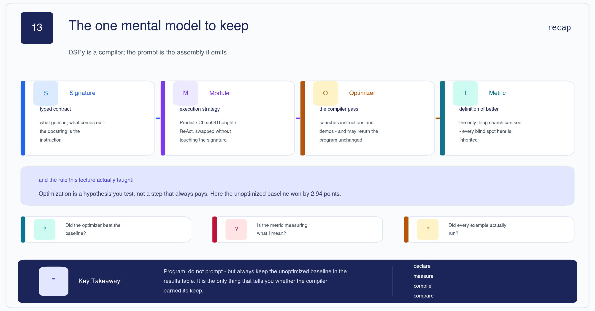

**DSPy is a compiler. The prompt is the assembly it emits.**

```text
Signature  →  Module  →  Optimizer  →  Metric
  what        how         search       better
```

And the rule this particular run actually taught:

> **Optimization is a hypothesis you test, not a step that always pays.**
> Here the unoptimized baseline won by 2.94 points.

Three questions to ask of any compiled program:

1. **Did the optimizer beat the unoptimized baseline?** → [§7a](#7)
2. **Is the metric measuring what I mean?** → [§5](#5)
3. **Did every example actually run?** → [§7d](#7)

Keep the baseline row in every results table you publish. It is the only thing that tells you
whether the compiler earned its keep.

[🔝 Back to top](#top)

---

<a id="interview"></a>

## Interview bank

Twenty-four questions, all answerable from the notes above. 🟠 / 🔴 / 🟣 use the four-line format.

### 🟢 Beginner

**1. What is a DSPy Signature?**
A typed declaration of a task's inputs and outputs. The docstring becomes the instruction, each
field's `desc=` becomes a per-field constraint, and DSPy generates the prompt from it. You declare
*what*, never *how*.

**2. Signature vs Module — what's the difference?**
The signature is the contract (`headline -> sentiment`). The module is the execution strategy:
`Predict` answers in one shot, `ChainOfThought` reasons first. One signature runs under any module
without modification.

**3. What does `dspy.ChainOfThought` actually change?**
It inserts one extra output field, `reasoning`, ahead of the real output, so the model must argue
before committing. Nothing else.

**4. What are the three arguments to a DSPy metric?**
`(example, prediction, trace=None)`, returning a float. `trace` is non-`None` during compilation and
`None` during evaluation, so you can score more strictly while optimizing.

**5. What does `compile()` return, and what does it not touch?**
A new module with demonstrations and possibly a new instruction baked into its prompt. It never
modifies the language model's weights.

### 🔵 Intermediate

**6. Why stratify the splits instead of sampling randomly?**
The raw pool is 59.35% neutral, so always answering "neutral" scores 59.35%. A balanced 34/34/34
test set drops the trivial floor to 33.33%, making the reported accuracy a measure of the program
rather than the class prior.

**7. `BootstrapFewShot` reported "4 full traces after 4 examples" out of 21. What does that tell you?**
The `max_bootstrapped_demos=4` cap was hit on the first four attempts, so 17 training examples were
never seen. The demos are the first four that worked, not the best four. The 0.2 s compile time
confirms no search happened.

**8. Why are bootstrapped demonstrations better than plain labelled ones?**
A labelled example is `(input, label)` and shows only the answer. A bootstrapped demo is
`(input, reasoning, label)` and shows the path — the student sees how a successful trace was argued.

**9. What does MIPROv2 optimize that `BootstrapFewShot` doesn't?**
The instruction. `BootstrapFewShot` only selects demonstrations; MIPROv2 jointly searches
instructions *and* demo combinations, using an LLM to propose instruction candidates and a TPE
surrogate to focus the search.

**10. `Predict` scored 78.43% and `ChainOfThought` 72.55%. Is reasoning bad for this task?**
On this task, yes — it cost 5.88 points. Financial PhraseBank labels are annotator consensus on
short corporate announcements; told to reason first, the model talks itself into "positive" when the
gold label is the flat "neutral".

**11. Cell 32's metric does `if label in predicted`. What breaks?**
It's a substring test, so `"not positive"` contains `"positive"` and scores as positive. The loop
also returns on first match in list order, so `"negative, not positive"` resolves to `positive`.

### 🟠 Advanced

**12. MIPROv2 and the CoT baseline both scored exactly 72.55%. Explain.**

- *What the interviewer is testing:* whether you investigate an exact tie or hand-wave it.
- *Expected reasoning:* an exact tie across 102 examples is implausible by chance, so suspect the programs are identical.
- *Strong answer:* Cell 51 shows MIPROv2 returned the original docstring character-for-character and **zero** demonstrations. A zero-demo, unmodified-instruction `ChainOfThought` *is* the CoT baseline, so the identical score is arithmetic, not luck. Read generously, MIPROv2 didn't fail — it ran 10 trials over 6 demo and 3 instruction candidates, found nothing that beat the incumbent on the 51-example valset, and correctly kept it. That's a well-behaved optimizer reporting a negative result.

**13. Every optimizer scored below the unoptimized baseline. Is the experiment broken?**

- *What the interviewer is testing:* whether you can distinguish a broken experiment from an unwelcome result.
- *Expected reasoning:* check comparability first, then interpret.
- *Strong answer:* It's not broken — and that's what makes it useful. All four runs used the same model, the same metric and the same 102 test examples, so they're genuinely comparable. The result is simply negative: 78.43% for plain `Predict` against 75.49% for the best optimizer. The likely causes are little headroom (78.43% against a 33.33% floor), only 21 training examples to search with, and a lenient metric adding noise to the selection signal. The correct next step is diagnosis, not a bigger optimizer.

**14. The notebook printed `+-5.9 percentage points`. What happened, and why does it matter?**

- *What the interviewer is testing:* whether you read your own program's output.
- *Expected reasoning:* recognise the sign collision, then the larger reporting failure.
- *Strong answer:* A literal `+` sits in front of `{improvement:.1f}` in the f-string; the value is negative, so it renders `+-5.9`. Fix it with `{improvement:+.1f}`. The real problem is the sentence: "Total improvement" and "-7.5% relative improvement" both describe a decline, and the celebratory line prints regardless. The arithmetic was always right; only the narration was wrong — which is exactly how a regression ships unnoticed. Assert the direction in code rather than asserting it in prose.

**15. The metric has a substring bug. Why is that worse than an ordinary test gap?**

- *What the interviewer is testing:* whether you see a metric as a selection mechanism, not just a report.
- *Expected reasoning:* trace the bug from measurement into optimizer behaviour.
- *Strong answer:* An ordinary bug gives you a wrong number. This one changes the program. `BootstrapFewShot` *selects* demonstrations by metric score, so a metric that credits hedged answers keeps hedged demos, which teaches the student to hedge. It propagates from measurement into behaviour and gets baked into the shipped artifact. The notebook's own production checklist says metrics should be unit-tested; its tests only cover the easy cases.

**16. Cell 40 claims the model over-predicts `neutral`. The output shows the opposite. Why does it matter?**

- *What the interviewer is testing:* whether you validate claims against evidence, including your own.
- *Expected reasoning:* connect the diagnosis to the remedy it justifies.
- *Strong answer:* Four of five printed errors are gold `neutral` predicted `positive` — over-optimism, not neutral overclaim. It matters because cell 40 uses its diagnosis to argue what "good examples in the prompt would fix", which is the rationale for reaching for a teleprompter. The demos that fix over-optimism differ from those that fix over-neutrality, so a wrong diagnosis aims the optimizer at a failure mode the model doesn't have. Quiz 3 states the right principle — look at 20–30 errors by hand first — while the cell before it does the opposite.

**17. One evaluation printed both `77/101` and `77/102`. Which do you quote?**

- *What the interviewer is testing:* understanding of how partial failure is accounted for.
- *Expected reasoning:* identify that the numerator is identical, so the denominator is the variable.
- *Strong answer:* The progress bar divides by the 101 examples that returned; the final report divides by the full 102-example devset, counting the rate-limited example as 0.0. Quote 75.49% — the full-devset figure — but report it as `77 correct / 101 scored / 102 attempted, 1 error` so the reader can see the difference. Here it's worth 0.75 points and changes nothing, but the same mechanism silently decides close comparisons.

### 🔴 Senior

**18. Design an evaluation harness so a negative result can't be mis-reported.**

- *What the interviewer is testing:* whether you build systems that surface unwelcome truths; correctness instincts under partial failure.
- *Expected reasoning:* make the baseline mandatory and the direction machine-checked.
- *Strong answer:* Three rules. First, the baseline is a required row — no comparison table renders without the unoptimized program in it. Second, the delta is computed and *classified* in code: `verdict = "improvement" if delta > 0 else "REGRESSION"`, with an assertion that blocks promotion on a negative delta. Third, every result is `{correct, scored, attempted, errors, model, metric_version, sha}`, never a bare float, and the comparison function refuses to diff two runs with different `attempted`. Separately, infrastructure errors get retried with backoff and abort the run if exhausted, rather than silently scoring 0.0. A weak answer just adds retries and still prints a percentage.

**19. You have this result. What do you actually do on Monday?**

- *What the interviewer is testing:* whether you diagnose or escalate.
- *Expected reasoning:* form testable hypotheses from the evidence already in hand.
- *Strong answer:* Not `auto="medium"`. Three hypotheses first. (a) Headroom: 78.43% against a 33.33% floor may be near this model's ceiling on this data — check the label noise by hand-auditing 30 gold labels. (b) Data: 21 training examples is very little; expand the trainset and re-run `BootstrapFewShot`, since it only consumed 4 of them anyway. (c) Metric: replace the substring match with a strict one and re-run, because the selection signal may be noisy. Only if the baseline is genuinely beatable does more search make sense. Escalating the optimizer is the most expensive way to not learn any of this.

**20. Your compiled program's accuracy drops after the provider upgrades the model. Diagnose.**

- *What the interviewer is testing:* understanding that the artifact is coupled to the model that produced it.
- *Expected reasoning:* recall that demos were selected by the old model's traces.
- *Strong answer:* The demonstrations were chosen because the *old* model produced those traces and the metric certified them; they encode its style. First check the parse-failure rate — a changed output format looks like an accuracy drop but is a different bug. Then re-compile against the new model on the frozen trainset and compare on the golden set. This is why the artifact should carry its model ID and why re-compilation on LM change is policy, not judgement. It's also the portability claim DSPy makes: you recompile instead of rewriting.

**21. Would you adopt DSPy after seeing this result? Argue both sides.**

- *What the interviewer is testing:* architectural judgement, and whether you can argue against a tool you just learned.
- *Expected reasoning:* separate the optimization benefit from the engineering-process benefit.
- *Strong answer:* For — even with every optimizer losing, the run delivered structured outputs, introspection via `inspect_history`, a versionable artifact, and a *measured* comparison that told us optimization doesn't help here. You cannot get that last fact from hand-tuning at all. Against — you inherit a compiler you can't see through, debugging moves a layer from the actual string, and none of it works without labelled data and a trustworthy metric. I'd adopt it for the measurement discipline and treat the optimizers as optional. The framework earned its keep here precisely by producing a clean negative result.

### 🟣 Staff / System design

**22. Design a prompt-optimization platform for 40 teams sharing one model budget.**

- *What the interviewer is testing:* system design under a shared, contended resource; seeing the organisational failure modes, not just technical ones.
- *Expected reasoning:* compilation is bursty and expensive, serving is steady; they must not share a quota.
- *Strong answer:* Separate the planes. Compilation is an offline batch job on its own quota with per-team budgets, admission control and hard token ceilings — never the serving pool, because a compile burst that throttles production is the §7d failure at company scale. Artifacts land in a registry keyed by `(signature, model, metric_version, dataset_snapshot)` with the score attached, so identical compiles dedupe across teams. Serving loads by ID; no `compile()` on the serving path. Centralise golden sets and metrics — if 40 teams each write their own `sentiment_match`, you get 40 substring bugs and no comparability. Publish a leaderboard per task **with the unoptimized baseline as a pinned row**, so a team cannot report a win that isn't one. The hardest part isn't infrastructure: a metric is a specification, so metric review needs the same rigour as API review.

**23. When is prompt optimization the wrong tool entirely?**

- *What the interviewer is testing:* knowing the boundary; resisting the pull of a tool just taught.
- *Expected reasoning:* identify what optimization assumes, then find where the assumption fails.
- *Strong answer:* It assumes a trustworthy metric over representative labelled data, and that the bottleneck is the *prompt* rather than capability or information. It's wrong when the metric can't be automated without an unvalidated LLM judge; when labels are scarcer than ~20 per class; when the model lacks the knowledge, where retrieval beats any prompt; when outputs are open-ended and "better" isn't scalar; and when a silently-changing prompt is unacceptable for compliance. This notebook adds one more: when the baseline is already strong relative to the achievable ceiling, there may be no headroom to search — which is exactly what its own numbers show.

**24. A staff engineer says "this proves DSPy is overhyped — just use a bigger model." Respond.**

- *What the interviewer is testing:* whether you defend a position on evidence rather than enthusiasm or defensiveness.
- *Expected reasoning:* concede what the evidence supports, then separate the two claims being conflated.
- *Strong answer:* On this task, with this data, they're right that the optimizers didn't pay — and I wouldn't ship one. But "the optimizers didn't help" and "the framework is overhyped" are different claims. The framework is what *told us* they didn't help: one metric, one test set, four comparable numbers, in an afternoon. Hand-tuning gives you no way to establish that. And a bigger model changes the cost curve on every request forever, whereas compilation is one-off. The honest position: use the smallest model that clears your bar, keep DSPy for the structure and the measurement, and treat every optimizer as a hypothesis with a baseline row next to it.

[🔝 Back to top](#top)

---

<a id="recall"></a>

## Explain It Yourself

Cover the notes. Say each answer out loud. If you stall, the section is linked.

1. Explain what DSPy compiles, and what it explicitly does **not** compile. → [§1](#1), [§12](#12)
2. Walk through how a five-line `Signature` becomes the prompt in cell 24. → [§3](#3)
3. State all four measured results from memory, and say which one you'd ship. → [§7a](#7)
4. Explain why MIPROv2 and the CoT baseline tied to the decimal. → [§7b](#7)
5. Describe `BootstrapFewShot` in four steps, then say why "4 traces after 4 examples" is a warning. → [§8](#8)
6. Find the bug in `sentiment_match` and explain why it's worse than an ordinary test gap. → [§5](#5)
7. Justify 59.35% and 33.33%, and say which one 78.43% should be read against. → [§6](#6)
8. Given this result, argue for and against escalating to `auto="medium"`. → [§11](#11)

[🔝 Back to top](#top)

---

## One-Page Revision

### Core

| | |
|---|---|
| **Signature** | typed contract. Docstring = instruction, `desc=` = field constraint. Says *what*. |
| **Module** | execution strategy. `Predict` = one shot; `ChainOfThought` = + a `reasoning` field. |
| **Optimizer** | search over demos (and, for MIPROv2, instructions). a.k.a. teleprompter. |
| **Metric** | `(example, pred, trace) -> float`. `trace` non-`None` only during compile. The spec. |
| **Artifact** | a module + demos + instruction, saved as JSON. **Never weights.** |

### The numbers

| Number | Meaning |
|---|---|
| **78.43%** | `Predict` baseline, 80/102 — **the best result in the notebook** |
| **75.49%** | `BootstrapFewShot`, 77/102 — best optimizer, −2.94 vs baseline |
| **72.55%** | `ChainOfThought` **and** MIPROv2, 74/102 each — −5.88 vs baseline |
| **59.35%** | always-`neutral` on the raw 3,872 pool |
| **33.33%** | random floor on the balanced 102-example test set |
| **−5.88 / −7.50%** | the absolute and relative "improvement" cell 55 printed |
| **4 of 21** | training examples `BootstrapFewShot` actually used (19%), in 0.2 s |
| **0 demos** | what MIPROv2 kept — hence the exact tie with CoT |
| **77/101 vs 77/102** | survivors vs devset on the one rate-limited run (0.75 pts) |

### The optimizer ladder

```text
LabeledFewShot → BootstrapFewShot → +WithRandomSearch → MIPROv2 / COPRO → BootstrapFinetune
    free              ~n calls           10-50x            100s calls           GPU
```
Climb only when the rung below pays. Here none did — that means **diagnose**, not escalate.

### Failure modes seen in this notebook

1. **Optimization that didn't pay** — all three optimizers below the unoptimized baseline.
2. **An exact tie with a mechanical cause** — MIPROv2 returned 0 demos and the original instruction.
3. **A celebrated regression** — `+-5.9` printed as "Total improvement".
4. **Unsupported headline claims** — "~60% to 80%+", "80%+ accurate classifier". Neither is in any output.
5. **Prose vs output** — cell 40 claims over-`neutral`; the errors show over-`positive`, 4 of 5.
6. **Silent denominator** — one rate-limited example scored 0.0, moving the number 0.75 pts.
7. **Lenient metric** — substring matching credits `"not positive"` as positive.
8. **Duplicated cell** — `dspy_classify` defined twice (cells 58, 59).

### The rule

> **Optimization is a hypothesis you test, not a step that always pays.**
> Keep the unoptimized baseline in every results table. It is the only thing that tells you whether
> the compiler earned its keep.

[🔝 Back to top](#top)

---

## Companion files

- Notebook — [`L14_DSPy_Mathematical_Prompt_Optimization.ipynb`](./L14_DSPy_Mathematical_Prompt_Optimization.ipynb)
- Slides — [`DSPy.pdf`](./DSPy.pdf)
- Results verification — [`scripts/verify_dspy_results.py`](../../scripts/verify_dspy_results.py)
- Diagram source — [`scripts/_build_l14_diagrams.py`](../../scripts/_build_l14_diagrams.py)
- Previous lecture — [L13 · Parsing Complex Documents](../13.%20Parsing%20Complex%20Documents/L13_Parsing_Complex_Documents.md)
- Recipe these notes follow — [`.claude/VISUAL_STUDY_NOTES.md`](../../.claude/VISUAL_STUDY_NOTES.md)

[🔝 Back to top](#top)
