<a id="top"></a>

# DSPy — Mathematical Prompt Optimization

**Lecture 14 · Module 8 (Agentic AI Systems) · Visual study notes**

Source notebook: [`DSPY_liveclass.ipynb`](./DSPY_liveclass.ipynb) — 36 cells, a financial-sentiment
classifier built four times over, each time letting the framework do more of the prompt writing.

This lecture is where prompt engineering stops being writing and starts being **search**. The
notebook builds a classifier on the Financial PhraseBank dataset, measures it, then hands the
prompt over to an optimizer and measures again.

It is also the notebook where the measurement itself falls apart — and that failure turns out to be
the most instructive thing in the file. Sections [§11](#11) and [§8](#8) are the parts that will
make you better at this, so do not skip them.

---

## How to read this

| Marker | Meaning |
|---|---|
| *(unmarked)* | **From the notebook** — concepts, code, numbers and outputs exactly as they ran |
| `> **⊕ Engineering context**` | **Added by me** — production material the notebook did not cover |
| `> **⚠ Contradiction**` | The notebook's prose disagrees with its own recorded output. The output wins. |

Cell numbers are 0-indexed against the notebook **as committed** — cell 0 is the Open-in-Colab
badge, so the first code cell is cell 2.

Every number quoted here is re-derived from the notebook's saved outputs by
[`scripts/verify_dspy_eval_arithmetic.py`](../../scripts/verify_dspy_eval_arithmetic.py).
Run it — it prints `ALL CHECKS PASSED` or tells you which figure moved.

---

## Contents

| Part | What it covers | How it is taught |
|---|---|---|
| [0](#0) | The forced-move chain behind DSPy | Concept map |
| [1](#1) | Why hand-tuned prompts rot | Why-layer |
| [2](#2) | Signature · Module · Metric · Optimizer | Four-panel anatomy |
| [3](#3) | How a signature becomes a prompt | Side-by-side code |
| [4](#4) | `Predict` vs `ChainOfThought` | Diff + measured cost |
| [5](#5) | The metric is the specification | Code walk + trap hunt |
| [6](#6) | Splitting data for an optimizer | Proportional map |
| [7](#7) | Establishing the baseline | Measured evidence |
| [8](#8) | Error analysis — and a contradiction | Claim vs evidence |
| [9](#9) | `BootstrapFewShot`, step by step | Algorithm walk |
| [10](#10) | What compilation actually produced | Artifact inspection |
| [11](#11) | **The evaluation that broke** | Failure-chain trace |
| [12](#12) | Choosing an optimizer | Decision guide |
| [13](#13) | Running this in production | ⊕ Extension |
| [14](#14) | The one mental model to keep | Recap |
| [Q](#interview) | Interview bank — 5 tiers, 24 questions | Q → testing → reasoning → answer |
| [R](#recall) | Explain It Yourself · One-Page Revision | Active recall |

---

<a id="0"></a>

## 0 · The big picture

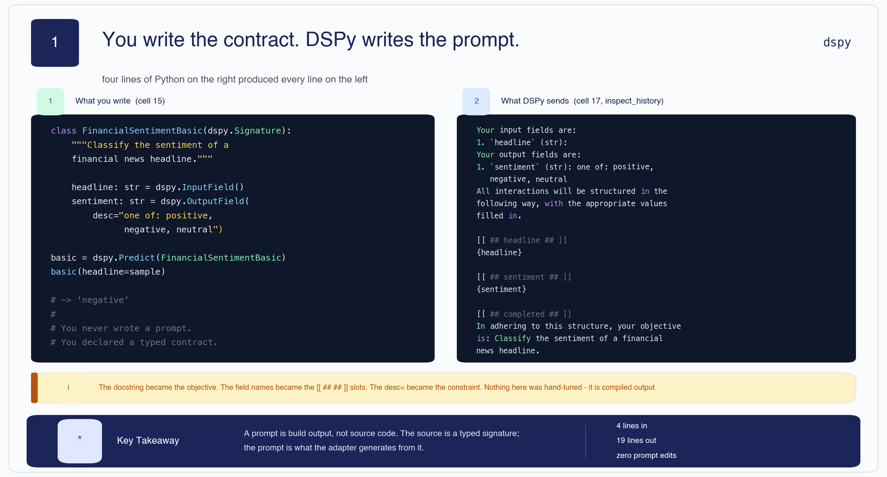

You write a **typed contract**. DSPy writes the prompt. That single inversion is the whole idea, and
everything else in the lecture is a consequence of it.

**The forced-move chain.** Each step here is not a design preference — it is the only move available
once you accept the step before it:

```text
A prompt is a string you tune by hand
        │  ... but a string cannot be tested, typed or versioned
        ▼
Declare the interface instead, and generate the string       →  Signature
        │  ... but the same interface can be executed in several ways
        ▼
Separate the strategy from the contract                      →  Module
        │  ... but now "which strategy is better" needs an answer
        ▼
Define better as a number                                    →  Metric
        │  ... and a number you can compute is a number you can maximise
        ▼
Let an algorithm search the prompt space                     →  Optimizer
        │  ... and the search is only ever as good as the number
        ▼
So the metric — and the set of examples it actually scored — is the real subject of this lecture
```

That last line is not a flourish. The notebook's three evaluations disagree precisely because the
examples they scored were not the same set, and nothing in the framework warned anybody.

---

<a id="1"></a>

## 1 · Why hand-tuned prompts rot

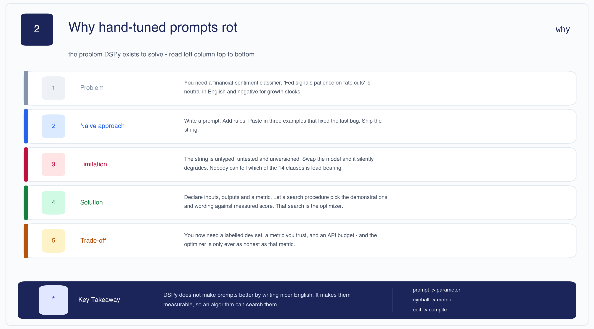

**The task is genuinely hard.** The notebook (cell 7) makes the case with three headlines:

| Headline | Reads as | Actually is | Why |
|---|---|---|---|
| *"Fed signals patience on rate cuts"* | neutral | **negative** | higher rates for longer hurts growth stocks |
| *"Company X beats Q3 earnings by $0.02"* | positive | **negative** | analysts expected a $0.10 beat |
| *"Regulator opens preliminary inquiry into X"* | negative | **neutral** | inquiries rarely lead anywhere, so it is priced in |

A generic sentiment model fails all three because it lacks **domain semantics** — it reads English,
not markets. You could encode these rules by hand. The point of the lecture is that you should not
have to.

| Layer | |
|---|---|
| **Problem** | Classify financial headlines the way an equity investor would, not the way a dictionary would. |
| **Naive approach** | Write a prompt. Add rules. Paste in the three examples that fixed the last bug. Ship the string. |
| **Limitation** | The string is untyped, untested and unversioned. Swap models and it silently degrades. Nobody can say which of its fourteen clauses is load-bearing. |
| **Solution** | Declare inputs, outputs and a metric. Let a search procedure choose the demonstrations and wording by measured score. |
| **Trade-off** | You now need labelled data, a metric you trust, and an API budget — and the optimizer is only ever as honest as that metric. |

> 🧠 **Mental Model** — **A prompt is build output, not source code.** The source is the signature;
> the prompt is what the adapter compiles it into. You would not hand-edit assembly and then expect
> the compiler to preserve your changes.

> 🧠 **Remember**
> - DSPy does not write *nicer English*. It makes prompts **measurable**, so an algorithm can search them.
> - The cost of that is real: labelled examples, a trustworthy metric, and LM calls.

[🔝 Back to top](#top)

---

<a id="2"></a>

## 2 · The four primitives

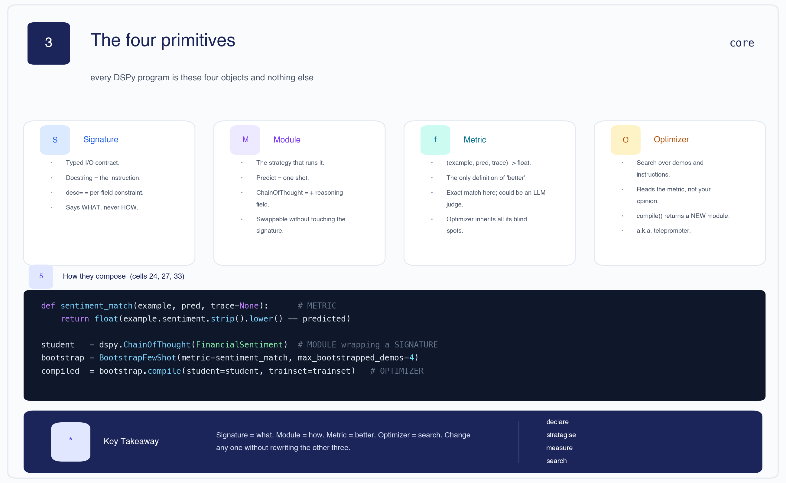

Every DSPy program is these four objects. Learn the division of labour and the API stops being
surprising.

| Primitive | Answers | In this notebook |
|---|---|---|
| **Signature** | *What* goes in and out | `FinancialSentiment` — `headline -> sentiment` |
| **Module** | *How* it is executed | `dspy.Predict`, `dspy.ChainOfThought` |
| **Metric** | What *better* means | `sentiment_match` — exact match, 1.0 / 0.0 |
| **Optimizer** | *Search* over prompts | `BootstrapFewShot` |

The composition, drawn from cells 24, 27 and 33:

```python
def sentiment_match(example, pred, trace=None):          # METRIC
    ...

student   = dspy.ChainOfThought(FinancialSentiment)      # MODULE wrapping a SIGNATURE
bootstrap = BootstrapFewShot(metric=sentiment_match,     # OPTIMIZER
                             max_bootstrapped_demos=4)
compiled  = bootstrap.compile(student=student, trainset=trainset)
```

> 🧠 **Mental Model** — **Signature = what. Module = how. Metric = better. Optimizer = search.**
> You can change any one of the four without rewriting the other three. That orthogonality is the
> entire reason the framework exists.

**A note on vocabulary.** DSPy calls optimizers **teleprompters** in older code and docs
(`from dspy.teleprompt import BootstrapFewShot`, as in cell 33). Same thing. The name comes from the
idea of prompting the model the way a teleprompter prompts a presenter.

[🔝 Back to top](#top)

---

<a id="3"></a>

## 3 · How a signature becomes a prompt

Cell 15 defines the simplest possible signature:

```python
class FinancialSentimentBasic(dspy.Signature):
    """Classify the sentiment of a financial news headline."""
    headline: str = dspy.InputField()
    sentiment: str = dspy.OutputField(desc="one of: positive, negative, neutral")

basic_classifier = dspy.Predict(FinancialSentimentBasic)
result = basic_classifier(headline="Nokia's third-quarter profit fell short of analyst expectations")
# result.sentiment -> 'negative'
```

Cell 17 then calls `dspy.inspect_history(n=1)` to show what was actually sent. Read the mapping
carefully, because this is the part people get wrong in interviews:

| What you wrote | Where it ends up |
|---|---|
| The **docstring** | `In adhering to this structure, your objective is: Classify the sentiment…` |
| `headline: str = InputField()` | `Your input fields are: 1. \`headline\` (str):` and the `[[ ## headline ## ]]` slot |
| `desc="one of: positive, negative, neutral"` | appended to the output field's description line |
| Nothing you wrote | the `[[ ## completed ## ]]` terminator and the whole structured-response scaffold |

That bracketed `[[ ## field ## ]]` format is the work of an **adapter** — the component that turns a
signature into a message list and parses the reply back into typed fields (`ChatAdapter` by default).
Knowing it exists explains why DSPy can reliably pull `.sentiment` out of a free-text completion.

**Version 3** (cell 20) shows the honest limit of this abstraction:

```python
class FinancialSentiment(dspy.Signature):
    """Classify the sentiment of a financial news headline from the perspective of an equity investor.

    Consider whether the news would likely cause the stock price of the mentioned entity
    to rise (positive), fall (negative), or remain roughly unchanged (neutral).
    Focus on financial implications, not general emotional tone.
    """
    headline: str = dspy.InputField(desc="a short financial news headline")
    sentiment: str = dspy.OutputField(desc="exactly one word: positive, negative, or neutral")
```

The notebook's own comment on this (cell 21) is the right one:

> *"This is still manual prompt engineering, just at a higher level of abstraction. We wrote a good
> docstring, but we haven't done any optimization yet."*

Writing a better docstring **is** prompt engineering — it has simply moved somewhere typed and
diffable. Optimization is [§9](#9).

> 🧠 **Remember**
> - The docstring is the instruction. Treat it as an API contract, not a comment.
> - `desc=` constrains a single field; the docstring constrains the whole task.
> - A richer signature is still hand-tuning — useful, but not what the lecture is about.

[🔝 Back to top](#top)

---

<a id="4"></a>

## 4 · `Predict` vs `ChainOfThought`

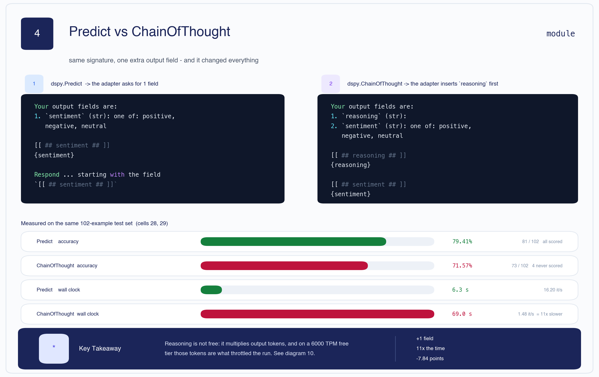

Same signature, different module:

```python
cot_classifier = dspy.ChainOfThought(FinancialSentimentBasic)
result = cot_classifier(headline=sample)
result.reasoning   # a paragraph of argument
result.sentiment   # 'negative'
```

Structurally the module inserts **one extra output field** — `reasoning` — ahead of the real one,
so the model must argue before it commits. That is all. No new signature, no new metric.

The measured consequence on the same 102-example test set:

| | Accuracy | Time | Throughput |
|---|---|---|---|
| `Predict` (cell 28) | **79.41%** | 6.3 s | 16.20 it/s |
| `ChainOfThought` (cell 29) | **71.57%** | 69.0 s | 1.48 it/s |

Chain of Thought is **11× slower and 7.84 points worse**.

That result should stop you, because CoT is supposed to help on reasoning-heavy tasks. Two things
are going on, and separating them is the single most useful skill in this lecture:

1. Part of the gap is **real** — reasoning genuinely hurts here (more on why below).
2. Part of it is **not a property of the program at all** — it is a rate limit. [§11](#11) takes
   the 7.84 points apart and shows exactly how much is which.

**Why reasoning can hurt on this task.** Financial PhraseBank labels are annotator consensus on
short headlines. A model told to argue first will find an argument — and for a bland corporate
announcement that argument usually reaches "this sounds like growth, so positive," when the gold
label is the flat, unexciting `neutral`. Free-form reasoning gives the model room to talk itself out
of the boring correct answer. [§8](#8) shows this happening in the printed errors.

> 🧠 **Mental Model** — **Chain of Thought buys deliberation and pays in tokens.** On hard multi-step
> problems that is a bargain. On three-way classification of one-sentence headlines it is often a
> loss — and the token bill is what breaks the evaluation.

> 🧠 **Remember**
> - The module is swappable; the signature does not change.
> - `ChainOfThought` = `Predict` + a `reasoning` output field, nothing more.
> - Always price reasoning in tokens **and** in rate-limit headroom, not just in accuracy.

[🔝 Back to top](#top)

---

<a id="5"></a>

## 5 · The metric is the whole specification

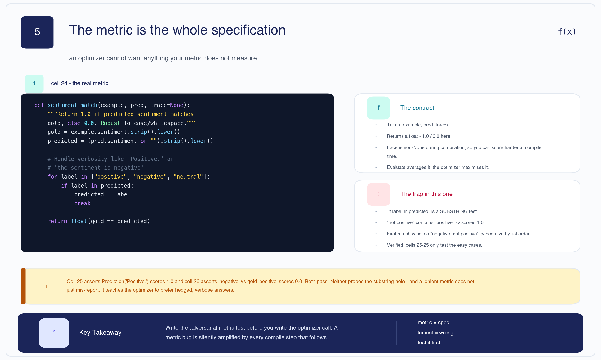

> *"You cannot optimize what you cannot measure."* — cell 22

Cell 24, verbatim:

```python
def sentiment_match(example, pred, trace=None):
    """Return 1.0 if predicted sentiment matches gold, else 0.0.
    Robust to case and whitespace."""
    gold = example.sentiment.strip().lower()
    predicted = (pred.sentiment or "").strip().lower()
    # Handle model verbosity like 'Positive.' or 'the sentiment is negative'
    for label in ["positive", "negative", "neutral"]:
        if label in predicted:
            predicted = label
            break
    return float(gold == predicted)
```

**The contract.** A DSPy metric takes `(example, pred, trace=None)` and returns a number. `Evaluate`
averages it; an optimizer maximises it. The `trace` argument is non-`None` during **compilation**
and `None` during plain evaluation, which lets you score more strictly while optimizing than when
reporting — a genuinely useful hook that this notebook does not use.

| Layer | |
|---|---|
| **Problem** | Models answer `"Positive."`, `"the sentiment is negative"`, `"NEUTRAL"`. Exact string equality would score all of these zero. |
| **Naive approach** | `pred.sentiment == example.sentiment`. |
| **Limitation** | Punishes formatting, not reasoning. Your accuracy number becomes a measure of the model's punctuation habits. |
| **Solution** | Normalise case and whitespace, then scan for a known label inside the string. |
| **Trade-off** | Leniency cuts both ways — see the trap below. |

**The trap.** `if label in predicted` is a **substring** test, and that has two consequences the
notebook never examines:

- `"not positive"` **contains** `"positive"` → scored as a positive prediction.
- The loop returns on first match in list order `["positive", "negative", "neutral"]`, so
  `"negative, definitely not positive"` resolves to `positive` — the *wrong* one — because
  `positive` is checked first.

Cells 25 and 26 do test the metric, but only on the easy cases:

```python
sentiment_match(dspy.Example(sentiment="positive"), dspy.Prediction(sentiment="Positive."))  # 1.0
sentiment_match(dspy.Example(sentiment="positive"), dspy.Prediction(sentiment="negative"))   # 0.0
```

Both pass. Neither probes the hole.

This matters more than a normal unit-test gap, because of what sits downstream. An optimizer does
not merely *report* through the metric — it **selects** through it. A metric that rewards hedged,
verbose answers will cause `BootstrapFewShot` to keep hedged, verbose demonstrations, which teaches
the student to hedge. The bug does not stay a measurement bug; it becomes a behaviour bug.

> 🧠 **Mental Model** — **The metric is the spec.** Everything the optimizer does is an attempt to
> satisfy it literally. If the spec is loose, you get a program that exploits the looseness.

> **⊕ Engineering context** — a stricter version, and the adversarial test the notebook is missing:
>
> ```python
> VALID = {"positive", "negative", "neutral"}
>
> def sentiment_match_strict(example, pred, trace=None):
>     predicted = (pred.sentiment or "").strip().lower().rstrip(".!")
>     if predicted not in VALID:          # refuse to guess at prose
>         return 0.0
>     return float(example.sentiment.strip().lower() == predicted)
>
> # the test that would have caught it
> assert sentiment_match_strict(
>     dspy.Example(sentiment="positive"),
>     dspy.Prediction(sentiment="not positive")) == 0.0
> ```
>
> Forcing the model to emit a bare label — rather than accepting prose and fishing a label out of
> it — is also what makes the metric portable across models. If you must keep leniency, at least
> check for negation and for multiple label mentions before accepting a match.

> 🧠 **Remember**
> - `(example, pred, trace) -> float`. `trace` is non-`None` only during compilation.
> - Write the **adversarial** metric test before the optimizer call, not after.
> - A lenient metric does not just mis-report — it teaches.

[🔝 Back to top](#top)

---

<a id="6"></a>

## 6 · Splitting data for an optimizer, not a model

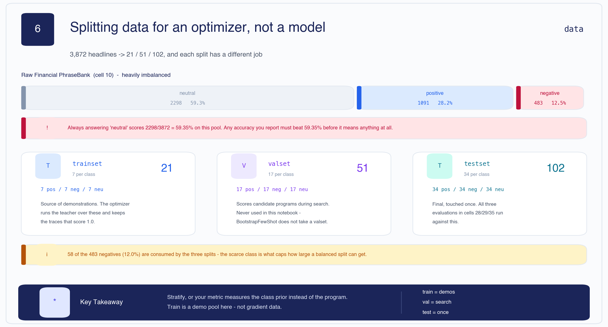

The raw pool (cell 10) is badly skewed:

| Class | Count | Share |
|---|---|---|
| neutral | 2,298 | 59.35% |
| positive | 1,091 | 28.18% |
| negative | 483 | 12.47% |
| **total** | **3,872** | |

**Always answering `neutral` scores 2,298 / 3,872 = 59.35%.** Any accuracy you quote has to beat
that before it means anything. This is the number to keep in your head for the rest of the lecture.

So cell 11 samples a **balanced** slice — equal counts per class:

| Split | Size | Per class | Its job |
|---|---|---|---|
| `trainset` | 21 | 7 | Source of demonstrations for the optimizer |
| `valset` | 51 | 17 | Scores candidate programs during search |
| `testset` | 102 | 34 | Final measurement — all three evaluations run here |

Because the splits are balanced 34/34/34, the majority-class baseline on the **test set** is 33.33%,
not 59.35%. Both numbers are worth knowing: 59.35% is what a lazy model scores on real-world
traffic; 33.33% is the floor for the number this notebook actually reports.

Two things are worth noticing about how these splits are built.

**The scarce class is the binding constraint.** 7 + 17 + 34 = 58 negatives are consumed, 12.0% of
the 483 available. Want a 10× larger test set? You cannot have one and stay balanced.

**`valset` is never used.** It is constructed, printed, and then ignored — `BootstrapFewShot` takes
only a `trainset`. The optimizer that *would* consume it is
`BootstrapFewShotWithRandomSearch` ([§12](#12)). This is not a bug, but it is a loose end worth
recognising, because "we have a validation set" and "we are validating" are different claims.

> **⊕ Engineering context** — the splits here are role-based, not the train/test split you know from
> supervised learning. Nothing is fitted to `trainset` by gradient descent; it is a **pool of
> candidate demonstrations**. The consequence is that leakage behaves differently: a demo is copied
> *verbatim into the prompt*, so a train example that also appears in test is not subtly memorised —
> it is literally shown to the model at inference time. Deduplicate across splits by content hash,
> not by object identity. The notebook's `[ex for ex in remaining_flat if ex not in val_raw]`
> compares dicts by value, which happens to work, but is O(n²) and would silently fail on a dataset
> with duplicate headlines carrying different labels.

> 🧠 **Remember**
> - Majority-class baseline on the raw pool: **59.35%**. On the balanced test set: **33.33%**.
> - Stratify, or your metric measures the class prior instead of the program.
> - `trainset` is a demo pool, not gradient data.

[🔝 Back to top](#top)

---

<a id="7"></a>

## 7 · Establishing the baseline

```python
from dspy.evaluate import Evaluate

evaluator = Evaluate(devset=testset, metric=sentiment_match,
                     num_threads=1, display_progress=True, display_table=0)

baseline_predict = dspy.Predict(FinancialSentiment)
baseline_predict_score = evaluator(baseline_predict)
print(f"Baseline Predict accuracy: {baseline_predict_score.score:.2f}%")
```

Output:

```text
Average Metric: 81.00 / 102 (79.4%): 100%|██████████| 102/102 [00:06<00:00, 16.20it/s]
Baseline Predict accuracy: 79.41%
Time: 6.3s
```

**81 / 102 = 79.41%.** Every example ran. Zero errors. This is the only completely clean measurement
in the notebook, and it is therefore the number everything else has to be judged against.

In context: 79.41% against a 33.33% balanced-random floor, from a plain `Predict` with a good
docstring and **no examples and no optimization at all**. That strong baseline is exactly what makes
the rest of the lecture hard — there is little room left above it.

> **⊕ Engineering context** — `num_threads=1` is doing real work here, and the notebook says so in
> cell 28's comment: concurrency was reduced to avoid Groq rate limits. Note the ordering problem
> this creates. Serial evaluation is *slower* but hits the per-minute token ceiling less often;
> parallel evaluation is faster but bursts. Neither setting changes your program's quality, yet both
> change the number you report. When an eval's result depends on its concurrency setting, the eval
> is measuring your infrastructure. Pin the setting, record it beside the score, and make failures
> loud — see [§11](#11).

[🔝 Back to top](#top)

---

<a id="8"></a>

## 8 · Error analysis — and the notebook's first contradiction

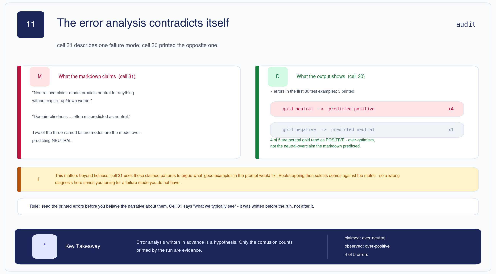

Cell 30 samples the first 30 test examples and prints the misses:

```text
Errors in first 30: 7
```

Five are printed. Their directions:

| Gold | Predicted | Count |
|---|---|---|
| `neutral` | `positive` | **4** |
| `negative` | `neutral` | 1 |

Cell 31 then describes "what we typically see":

> 1. **Neutral overclaim**: model predicts neutral for anything without explicit "up/down" words…
> 2. **Domain-blindness**: *"Operating profit narrowed…"* often mispredicted as neutral…
> 3. **Directional confusion**: *"Sales fell less than expected"*… the model sees "fell" and predicts negative.

> **⚠ Contradiction** — two of the three named failure modes say the model **over-predicts
> `neutral`**. Four of the five printed errors are the exact opposite: gold `neutral`, predicted
> `positive`. The observed failure mode is **over-optimism**, not neutral overclaim.

Look at the actual reasoning the model produced and the pattern is unmistakable:

| Headline (abbreviated) | Gold | Pred | Model's reasoning |
|---|---|---|---|
| Board fees paid as shares, transferred quarterly | neutral | positive | *"suggests a long-term commitment to the company…"* |
| Board proposes EUR 0.02 dividend | neutral | positive | *"indicates a return on investment for shareholders…"* |
| New company will likely hold an IPO | neutral | positive | *"growing and expanding, which is typically a positive sign"* |
| Talks concerned 160 people, ~35 redundancies | neutral | positive | *"only 35 redundancies… could be seen as a positive development"* |

Every one is a routine corporate announcement the model spins into good news. The last row is
sharpest: it reads *redundancies* as positive because the number is lower than it might have been.

This is the CoT mechanism from [§4](#4) again. Told to reason first, the model reasons its way into a
story, and a story about a company is almost always optimistic. The gold label is just "an
announcement happened."

**Why it matters practically.** Cell 31 closes by arguing these patterns are "exactly what good
examples in the prompt would fix" — the justification for bootstrapping in the next cell. But the
demos that fix over-optimism are not the demos that fix neutral-overclaim, so a wrong diagnosis sends
the optimizer hunting a failure mode the model does not have.

Cell 31 is phrased as *"what we typically see"* — it was written **before** the run, from general
expectation, and never reconciled against the output below it.

> 🧠 **Mental Model** — **Error analysis written in advance is a hypothesis; only the printed
> confusion counts are evidence.** Read the errors before you believe the narrative about them.

> 🧠 **Remember**
> - Observed failure mode: gold `neutral` → predicted `positive`, 4 of 5 printed errors.
> - The sample is small (7 errors in 30) — treat direction as a signal, not a measurement.
> - A full confusion matrix over all 102 would settle it. The notebook never builds one.

[🔝 Back to top](#top)

---

<a id="9"></a>

## 9 · `BootstrapFewShot`, step by step

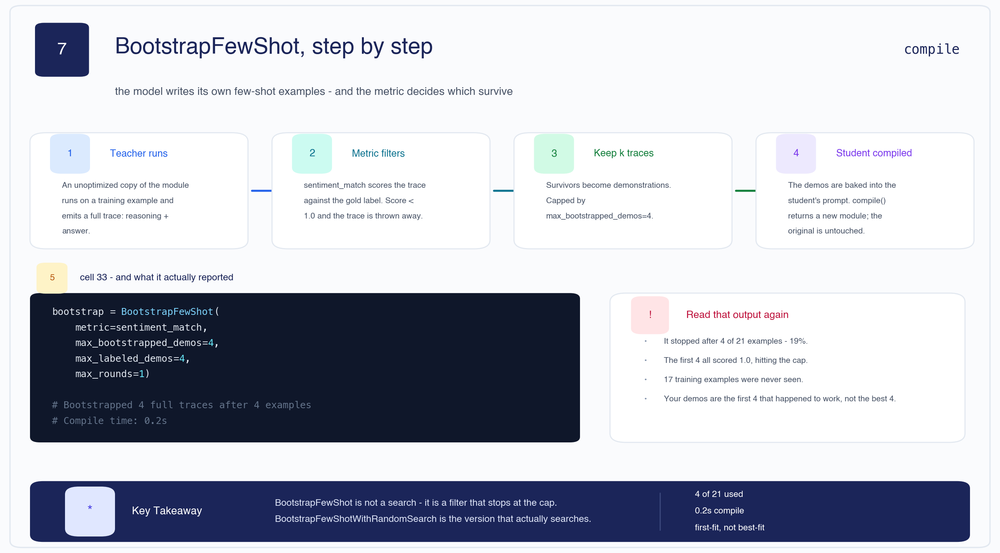

The algorithm, as cell 32 describes it:

1. Take an unoptimized module — the **teacher**.
2. For each training example, run the teacher and capture the **full trace** (reasoning + output).
3. Keep the trace if the metric scores it correct.
4. Inject the top-*k* kept traces into the **student's** prompt as demonstrations.

**Why it works.** The demos are not `(input, label)` pairs — they include the model's own reasoning.
The student is shown *how a successful trace was argued*, not just what it concluded. The model
supervises itself, which is where "bootstrapping" comes from.

```python
from dspy.teleprompt import BootstrapFewShot

bootstrap = BootstrapFewShot(
    metric=sentiment_match,
    max_bootstrapped_demos=4,   # self-generated demos to keep
    max_labeled_demos=4,        # raw labelled demos as fallback
    max_rounds=1,
)
student = dspy.ChainOfThought(FinancialSentiment)
compiled_bootstrap = bootstrap.compile(student=student, trainset=trainset)
```

Output:

```text
Bootstrapped 4 full traces after 4 examples for up to 1 rounds, amounting to 4 attempts.
Compile time: 0.2s
```

**Read that output again — it is more interesting than it looks.**

- It stopped after **4 of 21** training examples. That is 19% of the pool.
- The first four attempts all scored 1.0, so the `max_bootstrapped_demos=4` cap was hit immediately.
- **17 training examples were never seen.**
- Compile took **0.2 s**, which should tell you no search happened.

So the demonstrations baked into this program are **the first four that happened to work** — not the
four most useful, most diverse, or most representative. If example 5 was the one that would have
taught the model about `neutral` corporate announcements, it never got a chance.

> 🧠 **Mental Model** — **`BootstrapFewShot` is a filter that stops at the cap, not a search.**
> `BootstrapFewShotWithRandomSearch` is the one that actually searches, by running this filter many
> times over shuffled subsets and keeping the best-scoring result on a validation set.

| Layer | |
|---|---|
| **Problem** | Few-shot examples help, but hand-picking them is the manual labour we are trying to delete. |
| **Naive approach** | Paste in the first few labelled examples you have. |
| **Limitation** | Label-only demos show the answer, not the path; and your choice is arbitrary. |
| **Solution** | Let the model generate traces, keep the ones the metric certifies, inject those. |
| **Trade-off** | You inherit the teacher's habits — including its biases — and with a low cap you inherit whichever ones came first. |

> 🧠 **Remember**
> - A bootstrapped demo is `(input, reasoning, label)`. That middle term is the point.
> - `max_bootstrapped_demos` is a **stopping condition**, not a target to search towards.
> - Compile time under a second means no search ran. Treat it as a smell.

[🔝 Back to top](#top)

---

<a id="10"></a>

## 10 · What compilation actually produced

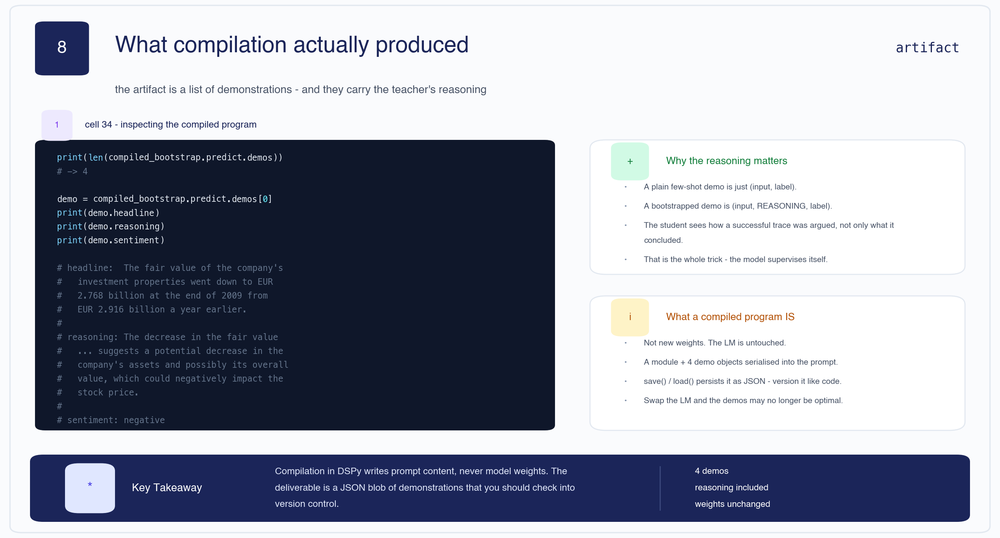

```python
print("Number of demonstrations kept:", len(compiled_bootstrap.predict.demos))   # -> 4

demo = compiled_bootstrap.predict.demos[0]
print(demo.headline)    # "The fair value of the company's investment properties went down
                        #  to EUR 2.768 billion at the end of 2009 from EUR 2.916 billion…"
print(demo.reasoning)   # "The decrease in the fair value … suggests a potential decrease in the
                        #  company's assets and possibly its overall value, which could
                        #  negatively impact the stock price."
print(demo.sentiment)   # "negative"
```

That is the entire artifact: **a module plus four demonstration objects** which get serialised into
the prompt at call time.

What compilation is **not**:

- Not new weights. The language model is untouched.
- Not a fine-tune. No gradients were computed anywhere in this notebook.
- Not model-portable. The demos were selected because *this* model reasoned that way; swap the LM
  and they may no longer be the right four.

> **⊕ Engineering context** — a compiled program is a deployment artifact and should be treated like
> one:
>
> ```python
> compiled_bootstrap.save("classifier_v3.json")     # demos + instructions, human-readable
>
> prog = dspy.ChainOfThought(FinancialSentiment)
> prog.load("classifier_v3.json")                   # no LM calls, no re-compilation
> ```
>
> Check the JSON into version control next to the code, tag it with the LM name, the metric version
> and the test score it earned, and re-compile on model upgrade rather than assuming the demos
> transfer. Recompiling on every deploy is the mistake to avoid — it burns API budget and makes your
> prompt non-deterministic across releases. Compile deliberately; load routinely.

> 🧠 **Remember**
> - Compilation writes **prompt content**, never weights.
> - The deliverable is a JSON blob of demonstrations. Version it like code.
> - Demos are model-specific. Re-compile when the LM changes.

[🔝 Back to top](#top)

---

<a id="11"></a>

## 11 · The evaluation that broke

This is the most valuable section in the lecture, and none of it was intended.

### 11a · Three numbers, three denominators

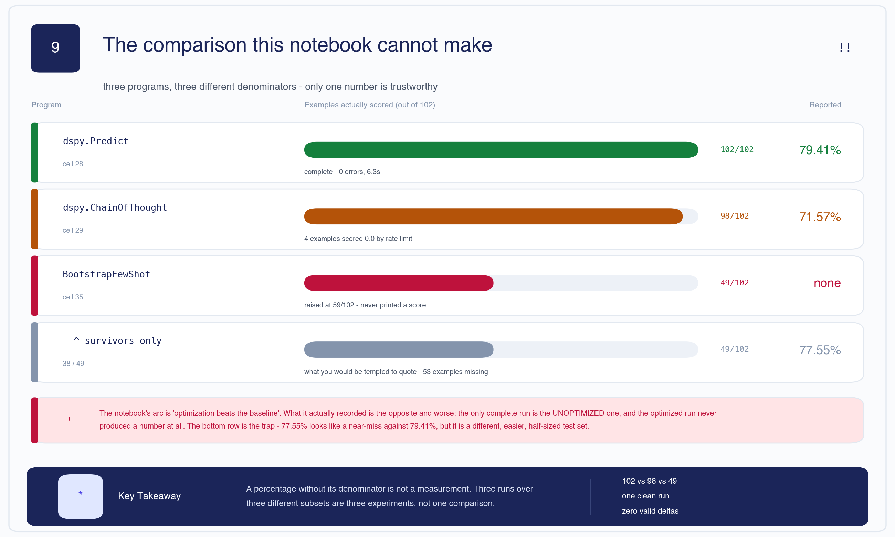

| Program | Cell | Examples scored | Reported | Status |
|---|---|---|---|---|
| `dspy.Predict` | 27 | **102 / 102** | **79.41%** | complete, 0 errors, 6.3 s |
| `dspy.ChainOfThought` | 28 | 98 / 102 | **71.57%** | 4 examples scored 0.0 by rate limit |
| `BootstrapFewShot` | 34 | 49 / 102 | **none** | raised at 59/102, never printed a score |

The notebook's narrative arc is *"optimization beats the baseline."* What it recorded is worse than a
null result:

- The **only complete run is the unoptimized one**.
- The optimized run **never produced a number at all** — cell 35's final output is an exception
  (`Exception: Execution cancelled due to errors or interruption.`), so `bootstrap_score` was never
  assigned and the `print` never executed.
- Cell 36, where the comparison would have gone, is **empty**. So is the promised "Run 2" implied by
  cell 32's heading *"Run 1: `BootstrapFewShot`"*. `matplotlib` is imported in cell 3 and never used.

**The trap is the diagram's last row.** Cell 35's progress bar reached `38.00 / 49 (77.6%)` before
dying, and it is tempting to read 77.55% as "nearly caught the baseline." It is not comparable:

- Different examples — 49 of the 102, in whatever order the dataloader produced.
- Different size — less than half the test set, so the confidence interval is roughly √2 wider.
- Selected by survival — the examples that errored are the ones that arrived when the token bucket
  was empty, which correlates with long inputs. Longer headlines are plausibly the harder ones, so
  the survivors may be a systematically *easier* subset.

A percentage without its denominator is not a measurement.

### 11b · How a rate limit became an accuracy drop

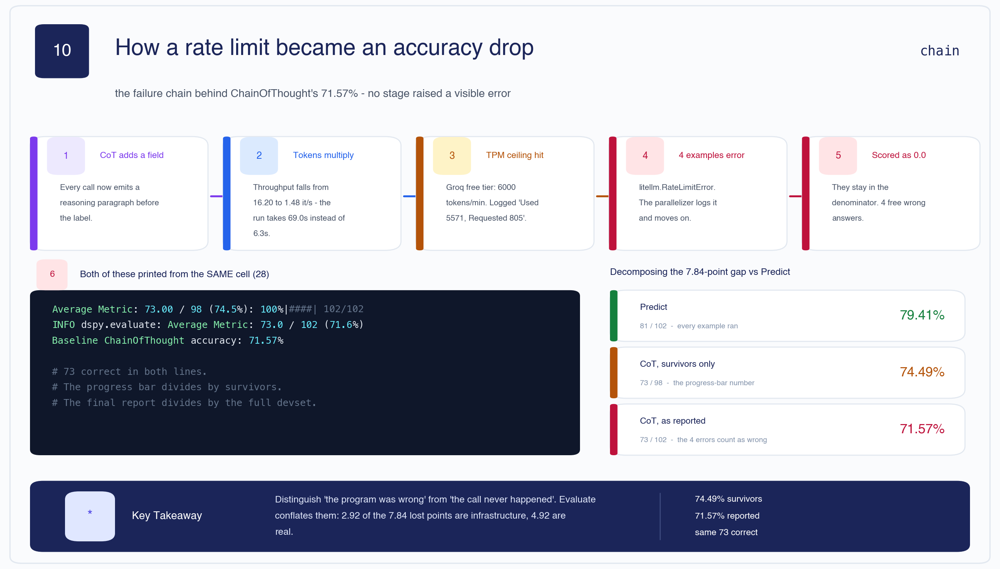

The chain, end to end, with nothing raising a visible error:

```text
ChainOfThought adds a `reasoning` output field
        ▼
every call emits a paragraph before the label → output tokens multiply
        ▼
throughput falls 16.20 → 1.48 it/s; the run takes 69.0s instead of 6.3s
        ▼
Groq free tier ceiling: 6000 tokens/min
   "Rate limit reached … TPM: Limit 6000, Used 5571, Requested 805"
        ▼
4 distinct examples raise litellm.RateLimitError
        ▼
dspy.utils.parallelizer LOGS the error and continues
        ▼
those 4 stay in the denominator and contribute 0.0
        ▼
reported accuracy 71.57% instead of the survivors' 74.49%
```

**`ChainOfThought` caused the rate limiting that then penalised `ChainOfThought`.** The extra tokens
are the mechanism for both the slowdown and the errors.

### 11c · The two numbers printed by the same cell

This is the detail worth memorising. Cell 29's output contains **both** of these:

```text
Average Metric: 73.00 / 98 (74.5%): 100%|██████████| 102/102 [01:08<00:00, 1.48it/s]
2026/08/13 17:30:30 INFO dspy.evaluate.evaluate: Average Metric: 73.0 / 102 (71.6%)
```

Same 73 correct answers. Two different denominators, three percentage points apart:

- The **progress bar** divides by examples that returned — 73 / 98 = **74.49%**.
- The **final report** divides by the full devset — 73 / 102 = **71.57%**.

Decomposing the 7.84-point gap against `Predict`:

| Quantity | Arithmetic | Value |
|---|---|---|
| `Predict` | 81 / 102 | 79.41% |
| CoT, survivors only | 73 / 98 | 74.49% |
| CoT, as reported | 73 / 102 | 71.57% |
| **Infrastructure loss** | 74.49 − 71.57 | **2.92 pts** |
| **Real CoT deficit** | 79.41 − 74.49 | **4.92 pts** |

So roughly **37% of Chain of Thought's apparent regression is not Chain of Thought** — it is a free
tier. The remaining 4.92 points are real and consistent with the over-optimism in [§8](#8).

> 🧠 **Mental Model** — **Distinguish "the program was wrong" from "the call never happened."**
> `Evaluate` conflates them, and the number you quote depends on which line of its output you read.

### 11d · A third contradiction: which model produced these numbers?

Cell 5 configures the LM:

```python
lm = dspy.LM(model="groq/openai/gpt-oss-20b", api_key=..., max_tokens=512, temperature=0.0)
```

But every rate-limit error in cells 29 and 35 names a **different model**:

```text
[llama-3.1-8b-instant] litellm.RateLimitError: … Rate limit reached for model `llama-3.1-8b-instant`
```

And the `inspect_history` timestamps span six weeks:

| Cell | Timestamp |
|---|---|
| 17 (Predict prompt) | `2026-08-13T17:29:14` |
| 28, 29, 33, 35 (all evaluations) | `2026/08/13 17:29–17:31` |
| 19 (CoT prompt) | `2026-09-24T17:13:20` |

> **⚠ Contradiction** — the evaluation numbers were all produced on 13 August by
> `llama-3.1-8b-instant`. The model declaration you read in cell 5 is `gpt-oss-20b`, and cell 19 was
> re-run on 24 September. **The code shown and the numbers shown come from different sessions and
> different models.**

The evaluations remain comparable *to each other* — they share a timestamp and an error signature.
But re-running cell 5 as written will not reproduce 79.41%, and attributing these scores to
`gpt-oss-20b` is wrong. A smaller one in the same family: cell 27's comment says *"We use
`num_threads=4` to stay safely under limits"* while the code below it sets `num_threads=1`.

> **⊕ Engineering context** — what a trustworthy evaluation harness does differently:
>
> 1. **Fail loudly on infrastructure errors.** A rate limit is not a wrong answer. Retry with
>    exponential backoff and jitter; if retries are exhausted, abort the run rather than reporting a
>    partial score.
> 2. **Report the denominator, always.** `{"correct": 73, "scored": 98, "attempted": 102, "errors": 4}`
>    — never a bare percentage.
> 3. **Refuse to compare runs with different denominators.** A three-line assertion in the comparison
>    function would have caught everything in this section.
> 4. **Stamp every result** with model ID, git SHA, metric version and timestamp. The §11d confusion
>    is impossible when the score row carries its own provenance.
> 5. **Budget before you benchmark.** 102 examples × ~800 tokens ≈ 82k tokens; at 6000 TPM that is
>    ~14 minutes of ceiling. Either throttle deliberately or buy headroom — do not discover the limit
>    through corrupted results.

> 🧠 **Remember**
> - Only **one** number in this notebook is trustworthy: 79.41% from `Predict`.
> - 2.92 of CoT's 7.84 lost points are infrastructure; 4.92 are real.
> - Survivor-only scores flatter the run that failed most.
> - The recorded scores came from `llama-3.1-8b-instant`, not the `gpt-oss-20b` in cell 5.

[🔝 Back to top](#top)

---

<a id="12"></a>

## 12 · Choosing an optimizer

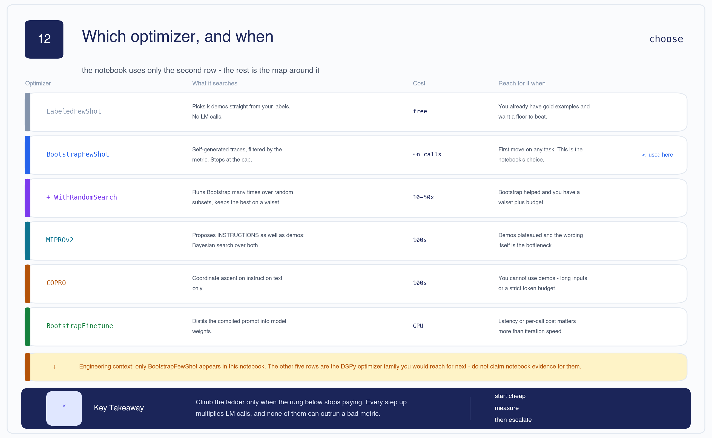

| Optimizer | What it searches | Cost | Reach for it when |
|---|---|---|---|
| `LabeledFewShot` | Picks *k* demos straight from labels. No LM calls. | free | You have gold examples and want a floor to beat. |
| **`BootstrapFewShot`** | Self-generated traces, filtered by the metric. Stops at the cap. | ~n calls | **First move on any task. The notebook's choice.** |
| `BootstrapFewShotWithRandomSearch` | Runs Bootstrap repeatedly over random subsets; keeps the best on a valset. | 10–50× | Bootstrap helped and you have a valset plus budget. |
| `MIPROv2` | Proposes **instructions** as well as demos; Bayesian search over both. | 100s of calls | Demos plateaued and the wording itself is the bottleneck. |
| `COPRO` | Coordinate ascent on instruction text only. | 100s of calls | You cannot use demos — long inputs or a strict token budget. |
| `BootstrapFinetune` | Distils the compiled prompt into model weights. | GPU | Latency or per-call cost matters more than iteration speed. |

> **⊕ Engineering context** — only `BootstrapFewShot` appears in this notebook. The other five rows
> are the surrounding family; do not cite notebook evidence for them.

**The decision, as a sequence:**

```text
Do you have ≥ 20 labelled examples and a metric you trust?
├── no  → stop. Fix that first. Everything below amplifies a bad metric.
└── yes → LabeledFewShot               ... establishes the floor
             │
             ▼
          BootstrapFewShot             ... did it beat the floor?
             ├── no  → your metric or your signature is the problem, not the demos
             └── yes → have you got a valset and 10-50x the budget?
                        ├── no  → ship it; version the JSON
                        └── yes → BootstrapFewShotWithRandomSearch
                                     │
                                     ▼
                                  still short, and the wording feels wrong?
                                     └── MIPROv2 (or COPRO if demos are impossible)
                                            │
                                            ▼
                                  is per-call latency/cost now the binding constraint?
                                     └── BootstrapFinetune
```

**Climb only when the rung below stops paying.** Every step up multiplies LM calls, and none of them
can outrun a bad metric — which is why [§5](#5) comes before this section and not after it.

Applied to this notebook: the honest next move is **not** MIPROv2. It is to re-run the existing
comparison with enough rate-limit headroom to get three complete numbers, because right now there is
no evidence that `BootstrapFewShot` did anything at all.

[🔝 Back to top](#top)

---

<a id="13"></a>

## 13 · Running this in production

> **⊕ Engineering context** — this entire section is beyond the notebook.

**Where the cost is.** Compilation is a one-off; inference is forever. Four demos plus a reasoning
field is easily 4–6× the tokens of a bare `Predict`, on **every request you ever serve**. Measure
cost per 1k predictions at your traffic, not compile time.

**Caching.** DSPy caches LM calls by default. In development that saves money; during evaluation it
is a hazard, because a cached response makes a re-run look deterministic when the model is not.
Clear it before any measurement you intend to quote.

**Deployment shape.** Compile offline in CI against a fixed dataset snapshot, commit the JSON, load
it at service start. The serving path should never call `compile()` — that buys you a reproducible
prompt, a diffable artifact and a rollback that is just `git revert`.

**What to monitor.** Prompt-optimized systems fail quietly. Track:

| Signal | Why | Trigger |
|---|---|---|
| Label distribution drift | Over-optimism ([§8](#8)) shows up as a rising `positive` share | share moves > 5 pts week-on-week |
| Parse-failure rate | Output stopped matching the signature — usually a model update | any sustained non-zero rate |
| Rate-limit / 429 rate | The [§11](#11) failure in production clothing | any non-zero rate in eval jobs |
| Latency p95 | CoT's token multiplier under load | breaches SLO |
| Score on a frozen golden set | The only true drift detector | any drop beyond noise |

**Re-compilation policy.** Re-compile when the LM version changes, the golden-set score drops, or
the input distribution shifts. Not on a cron, and not on every deploy — a prompt that silently
changes under you is worse than one that is merely suboptimal.

**The organisational point.** This framework is worth adopting not because it writes better English,
but because it turns "the prompt" from tribal knowledge in one engineer's head into a versioned
artifact with a score attached. Reviewability is what scales, not cleverness.

[🔝 Back to top](#top)

---

<a id="14"></a>

## 14 · The one mental model to keep

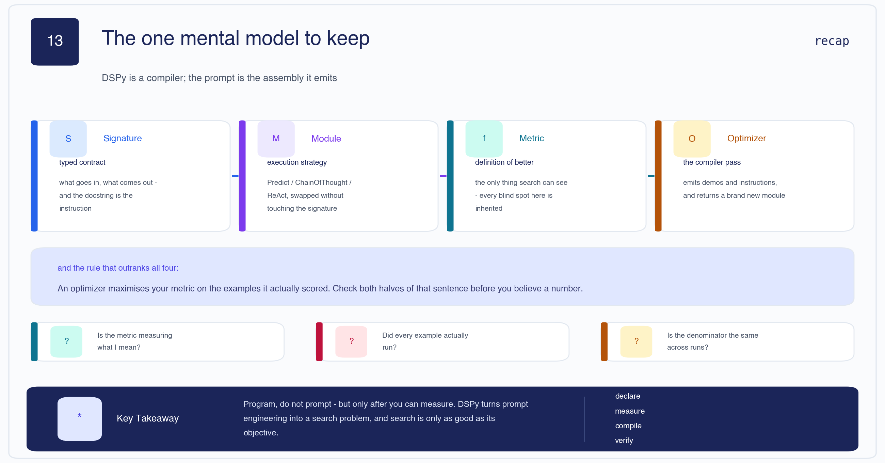

**DSPy is a compiler. The prompt is the assembly it emits.**

```text
Signature  →  Module  →  Metric  →  Optimizer
  what        how        better      search
```

And the rule that outranks all four:

> **An optimizer maximises your metric on the examples it actually scored.**

Both halves of that sentence failed in this notebook — a metric with a substring hole, and a set of
scored examples that differed between every run. Check both before you believe a number:

1. Is the metric measuring what I mean? → [§5](#5)
2. Did every example actually run? → [§11](#11)
3. Is the denominator the same across the runs I am comparing? → [§11a](#11)

[🔝 Back to top](#top)

---

<a id="interview"></a>

## Interview bank

Twenty-four questions, all answerable from the notes above. 🟠 / 🔴 / 🟣 use the four-line format.

### 🟢 Beginner

**1. What is a DSPy Signature?**
A typed declaration of a task's inputs and outputs. The docstring becomes the instruction, each
field's `desc=` becomes a per-field constraint, and DSPy generates the actual prompt from it. You
declare *what*, never *how*.

**2. What is the difference between a Signature and a Module?**
The signature is the contract — `headline -> sentiment`. The module is the execution strategy —
`Predict` answers in one shot, `ChainOfThought` reasons first. One signature can be run by any
module without modification.

**3. What does `dspy.ChainOfThought` change?**
It inserts one extra output field, `reasoning`, ahead of the real output, so the model must argue
before it commits. Nothing else changes.

**4. What are the three arguments to a DSPy metric?**
`(example, prediction, trace=None)`, returning a float. `trace` is non-`None` during compilation and
`None` during evaluation, so you can score more strictly while optimizing.

**5. What does `compile()` return?**
A new module with demonstrations baked into its prompt. The original is untouched and the language
model's weights are never modified.

### 🔵 Intermediate

**6. Why did the notebook stratify the splits instead of sampling randomly?**
The raw pool is 59.35% neutral, so a model that always says "neutral" scores 59.35%. A balanced
34/34/34 test set drops the trivial floor to 33.33%, making the reported accuracy a measure of the
program rather than the class prior.

**7. `BootstrapFewShot` reported "4 full traces after 4 examples" out of 21. What does that tell you?**
That the `max_bootstrapped_demos=4` cap was hit on the first four attempts, so 17 training examples
were never seen. The demos are the first four that worked, not the best four. The 0.2 s compile time
confirms no search happened.

**8. Why are bootstrapped demonstrations better than plain labelled examples?**
A labelled example is `(input, label)` and shows only the answer. A bootstrapped demo is
`(input, reasoning, label)` and shows the path — the student sees how a successful trace was argued.

**9. `Predict` scored 79.41% and `ChainOfThought` 71.57%. Is reasoning bad for this task?**
Partly. 2.92 of the 7.84 points are rate-limit errors scored as wrong answers; the real deficit is
4.92 points. That remainder is genuine — forced to reason about a bland corporate announcement, the
model talks itself into "positive" when the gold label is "neutral."

**10. What is a teleprompter in DSPy?**
The older name for an optimizer — `from dspy.teleprompt import BootstrapFewShot`. Same object.

**11. Cell 24's metric does `if label in predicted`. What breaks?**
It is a substring test, so `"not positive"` contains `"positive"` and scores as positive. The loop
also returns on first match in list order, so `"negative, not positive"` resolves to `positive`.

### 🟠 Advanced

**12. The same cell printed `73.00 / 98 (74.5%)` and `73.0 / 102 (71.6%)`. Explain.**

- *What the interviewer is testing:* whether you read evaluation output critically or copy the last number.
- *Expected reasoning:* identify that the numerator is identical, so the difference must be the denominator; work out what changed between them.
- *Strong answer:* Both lines report the same 73 correct predictions. The progress bar divides by the 98 examples that returned a result; the final report divides by the full 102-example devset, counting the 4 rate-limited examples as 0.0. Same program, same answers, two numbers three points apart. Which one you quote is a reporting decision the framework makes silently — and neither is wrong, but only one is comparable to a run with no errors.

**13. Why is the 77.55% from the truncated `BootstrapFewShot` run not comparable to 79.41%?**

- *What the interviewer is testing:* whether you can spot survivorship bias in your own results.
- *Expected reasoning:* different subset, different size, and non-random selection.
- *Strong answer:* It is 38/49, less than half the test set, and the missing examples were not dropped at random — they are the ones that arrived when the token bucket was empty, which correlates with longer inputs. If longer headlines are harder, the survivors are a systematically easier subset. Add a √2-wider confidence interval and the comparison has no content. The right move is to re-run with headroom, not to quote the partial.

**14. The metric has a substring bug. Why is that worse than an ordinary test gap?**

- *What the interviewer is testing:* whether you understand that a metric is a selection mechanism, not just a report.
- *Expected reasoning:* trace the bug from measurement into optimizer behaviour.
- *Strong answer:* An ordinary bug gives you a wrong number. This one changes the program. `BootstrapFewShot` *selects* demonstrations by metric score, so a metric that credits hedged, verbose answers keeps hedged, verbose demos — which then teach the student to hedge. The bug propagates from measurement into behaviour and gets baked into the artifact you ship.

**15. Cell 31 claims the model over-predicts `neutral`. The output shows the opposite. Why does it matter?**

- *What the interviewer is testing:* whether you validate claims against evidence, including your own.
- *Expected reasoning:* connect the diagnosis to the remedy it justifies.
- *Strong answer:* Four of five printed errors are gold `neutral` predicted `positive` — over-optimism, not neutral overclaim. It matters because cell 31 uses its diagnosis to argue what "good examples in the prompt would fix," which is the rationale for bootstrapping. The demos that fix over-optimism are not the demos that fix over-neutrality, so a wrong diagnosis aims the optimizer at a failure mode the model does not have. The text was written from expectation before the run and never reconciled.

**16. Cell 5 declares `gpt-oss-20b`; the errors name `llama-3.1-8b-instant`. What do you do?**

- *What the interviewer is testing:* reproducibility instincts and willingness to distrust a notebook.
- *Expected reasoning:* establish which artifacts are contemporaneous before trusting any of them.
- *Strong answer:* The `inspect_history` timestamps settle it — every evaluation carries 13 August and the `llama-3.1-8b-instant` error signature, while cell 19 was re-run on 24 September. The scores and the visible code come from different sessions and different models. The four evals are still comparable to each other, but nothing here should be attributed to `gpt-oss-20b`, and re-running as written will not reproduce 79.41%. Fix: stamp every result row with model ID, timestamp and git SHA.

**17. Compile took 0.2 s. Why is that a red flag?**

- *What the interviewer is testing:* whether you sanity-check timings against the work implied.
- *Expected reasoning:* compare elapsed time to the number of LM calls the algorithm should need.
- *Strong answer:* Bootstrapping requires a teacher call per training example, and calls take hundreds of milliseconds each. 0.2 s across a 21-example trainset means roughly four calls happened, all cached or very fast, and the cap terminated the loop. Any "optimization" that finishes faster than a single round-trip has not searched anything.

### 🔴 Senior

**18. Design an evaluation harness so the §11 failure cannot happen.**

- *What the interviewer is testing:* whether you build systems that fail loudly; correctness instincts under partial failure.
- *Expected reasoning:* separate program errors from infrastructure errors, then make the denominator a first-class part of the result.
- *Strong answer:* Two error classes with different handling. A wrong prediction scores 0.0 and continues; an infrastructure error (429, timeout, connection reset) is retried with exponential backoff and jitter, and if retries are exhausted the run **aborts** rather than scoring the example. The result object is `{correct, scored, attempted, errors, model, metric_version, sha, timestamp}` — never a bare float. The comparison function asserts equal `attempted` and zero `errors` across runs before computing a delta. Add a pre-flight token-budget check: 102 examples × ~800 tokens against a 6000 TPM ceiling is ~14 minutes, so either throttle deliberately or provision headroom. A weak answer here just adds retries and still reports a percentage.

**19. This runs at 500 req/s in production. What breaks first, and what do you change?**

- *What the interviewer is testing:* whether you can price an abstraction at scale.
- *Expected reasoning:* identify the per-request cost multiplier introduced by the compiled prompt.
- *Strong answer:* Tokens break first. Four demos plus a reasoning field is 4–6× the tokens of a bare `Predict`, on every request forever — and the notebook already showed the throughput cost, 16.20 → 1.48 it/s. At 500 req/s you are buying that multiplier 43 million times a day. Options in order: drop to `Predict` if the measured accuracy delta does not justify the spend; cut `max_bootstrapped_demos` and re-measure; cache aggressively on normalised input; and if latency is still binding, `BootstrapFinetune` to distil the prompt into weights, trading compile-time GPU cost for per-call savings. Compilation cost is irrelevant at this scale — it is a rounding error against inference.

**20. Your compiled program's accuracy drops 6% after the provider upgrades the model. Diagnose.**

- *What the interviewer is testing:* understanding that the artifact is coupled to the model that produced it.
- *Expected reasoning:* recall that demos were selected by the old model's reasoning traces.
- *Strong answer:* The demonstrations were chosen because the *old* model produced those traces and the metric certified them. They encode the old model's style, and the new model may reason differently enough that they now mislead. First check the parse-failure rate — a changed output format looks like an accuracy drop but is a different bug. Then re-compile against the new model on the frozen trainset and compare on the golden set. This is why the artifact should carry its model ID, and why re-compilation on LM change is policy rather than judgement.

**21. Would you adopt DSPy on a team where nobody has used it? Argue both sides.**

- *What the interviewer is testing:* architectural judgement, and whether you can argue against a tool you just learned.
- *Expected reasoning:* weigh the abstraction's benefit against its cost honestly.
- *Strong answer:* For — prompts become versioned artifacts with scores attached, which makes prompt changes reviewable; that is an organisational win, not a technical one, and it is the thing that scales. Against — you inherit a compiler you cannot see through, debugging moves a layer away from the string actually sent, and the whole apparatus is useless without labelled data and a metric you trust. This notebook is the cautionary case: it reached for an optimizer before its evaluation harness could produce three comparable numbers. I would adopt it only after the golden set and the metric exist, and I would start with `LabeledFewShot` to establish a floor.

### 🟣 Staff / System design

**22. Design a prompt-optimization platform for 40 teams sharing a model budget.**

- *What the interviewer is testing:* system design under a shared, contended resource; whether you see the organisational failure modes, not just the technical ones.
- *Expected reasoning:* compilation is bursty and expensive, inference is steady; the two must not compete for the same quota.
- *Strong answer:* Separate the planes. Compilation is an offline batch job on its own quota, submitted to a queue with per-team budgets, admission control and hard token ceilings — never sharing the serving pool, because a compile burst that throttles production is exactly the §11 failure at company scale. Artifacts land in a registry keyed by `(signature, model, metric_version, dataset_snapshot)` with the score attached, so identical compiles are deduplicated across teams. Serving loads artifacts by ID; the serving path has no `compile()` in it at all. Centralise the golden sets and the metrics — if each team writes its own `sentiment_match`, you get forty substring bugs and no comparability. Publish a leaderboard per task with the denominator visible. The hardest part is not infrastructure: it is that a metric is a specification, so metric review needs the same rigour as API review.

**23. When is prompt optimization the wrong tool entirely?**

- *What the interviewer is testing:* knowing the boundary of the technique; resisting the pull of a tool you have just been taught.
- *Expected reasoning:* identify what optimization assumes and find the cases where the assumption fails.
- *Strong answer:* It assumes a trustworthy metric over a representative labelled set, and that the bottleneck is *prompt* rather than *capability or information*. It is wrong when the metric cannot be automated without an LLM judge you have not validated; when labels are scarcer than ~20 per class; when the model simply lacks the knowledge, where retrieval beats any prompt; when outputs are open-ended and "better" is not a scalar; and when the task is regulated and a silently-changing prompt is unacceptable. In this notebook there is a further one: with a 79.41% baseline from a plain `Predict`, the headroom may not repay the complexity — and nobody measured whether it does.

**24. A staff engineer says "just use a bigger model instead of all this." Respond.**

- *What the interviewer is testing:* trade-off reasoning; whether you defend an approach on its actual merits rather than novelty.
- *Expected reasoning:* separate the accuracy argument from the engineering-process argument.
- *Strong answer:* On accuracy alone they are often right, and this notebook does not disprove it — its only clean number came from the simplest possible configuration. But the argument misses the point of the abstraction. A bigger model changes the cost curve on every request forever; optimization is a one-off compile. More importantly, the reason to program rather than prompt is not the score — it is that the prompt becomes a typed, versioned, scored artifact that a colleague can review and a CI job can regress-test. You get that benefit even if the optimizer never buys you a point. The honest position is: use the smallest model that clears your bar, and use the framework for reviewability, not for magic.

[🔝 Back to top](#top)

---

<a id="recall"></a>

## Explain It Yourself

Cover the notes. Say each answer out loud. If you stall, the section is linked.

1. Explain what DSPy compiles, and what it explicitly does **not** compile. → [§1](#1), [§10](#10)
2. Walk through how a five-line `Signature` becomes the prompt in cell 17. → [§3](#3)
3. Explain why `ChainOfThought` was slower **and** less accurate, and split the loss into its two causes. → [§4](#4), [§11b](#11)
4. Someone shows you `74.5%` and `71.6%` from the same run. Explain the difference without looking. → [§11c](#11)
5. Describe `BootstrapFewShot` in four steps, then say why "4 traces after 4 examples" is a warning. → [§9](#9)
6. Find the bug in `sentiment_match` and explain why it is worse than an ordinary test gap. → [§5](#5)
7. Justify the 59.35% number and say why the test-set floor is a different number. → [§6](#6)
8. Given a working `BootstrapFewShot`, argue for and against escalating to MIPROv2. → [§12](#12)

[🔝 Back to top](#top)

---

## One-Page Revision

### Core

| | |
|---|---|
| **Signature** | typed contract. Docstring = instruction, `desc=` = field constraint. Says *what*. |
| **Module** | execution strategy. `Predict` = one shot; `ChainOfThought` = + a `reasoning` field. |
| **Metric** | `(example, pred, trace) -> float`. `trace` non-`None` only during compile. The spec. |
| **Optimizer** | search over demos/instructions. a.k.a. teleprompter. `compile()` → **new** module. |
| **Artifact** | a module + demo objects, serialised to JSON. Never weights. |

### Numbers worth memorising

| Number | Meaning |
|---|---|
| **59.35%** | always-`neutral` on the raw 3,872-headline pool (2298/3872) |
| **33.33%** | random floor on the balanced 102-example test set |
| **79.41%** | `Predict`, 81/102 — **the only complete, trustworthy run** |
| **71.57%** | `ChainOfThought` as reported, 73/102 (4 errors scored 0.0) |
| **74.49%** | `ChainOfThought` survivors only, 73/98 — the progress-bar figure |
| **2.92 / 4.92** | the 7.84-point CoT gap: infrastructure vs real |
| **4 of 21** | training examples `BootstrapFewShot` actually used (19%) |
| **6.3 s vs 69.0 s** | `Predict` vs `ChainOfThought` — 11× |
| **6000 TPM** | the Groq free-tier ceiling that broke the benchmark |

### Optimizer ladder

```text
LabeledFewShot → BootstrapFewShot → +WithRandomSearch → MIPROv2 / COPRO → BootstrapFinetune
    free              ~n calls           10-50x            100s calls           GPU
```
Climb only when the rung below stops paying. None of them outruns a bad metric.

### Failure modes seen in this notebook

1. **Silent denominator** — errors scored 0.0; progress bar and final report disagree by 2.92 pts.
2. **Survivorship** — a truncated run's 77.55% looks competitive and means nothing.
3. **Cap-not-search** — `BootstrapFewShot` stopped at 19% of the trainset in 0.2 s.
4. **Lenient metric** — substring matching credits `"not positive"` as positive.
5. **Prose vs output** — cell 31 claims over-`neutral`; the errors show over-`positive`.
6. **Provenance drift** — code says `gpt-oss-20b`, numbers came from `llama-3.1-8b-instant`.
7. **Self-inflicted throttling** — CoT's tokens caused the rate limit that then penalised CoT.

### The rule

> **An optimizer maximises your metric on the examples it actually scored.**
> Check the metric. Check the denominator. Then believe the number.

[🔝 Back to top](#top)

---

## Companion files

- Notebook — [`DSPY_liveclass.ipynb`](./DSPY_liveclass.ipynb)
- Slides — [`DSPy.pdf`](./DSPy.pdf)
- Arithmetic verification — [`scripts/verify_dspy_eval_arithmetic.py`](../../scripts/verify_dspy_eval_arithmetic.py)
- Diagram source — [`scripts/_build_l14_diagrams.py`](../../scripts/_build_l14_diagrams.py)
- Previous lecture — [L13 · Parsing Complex Documents](../13.%20Parsing%20Complex%20Documents/L13_Parsing_Complex_Documents.md)
- Recipe these notes follow — [`.claude/VISUAL_STUDY_NOTES.md`](../../.claude/VISUAL_STUDY_NOTES.md)

[🔝 Back to top](#top)
