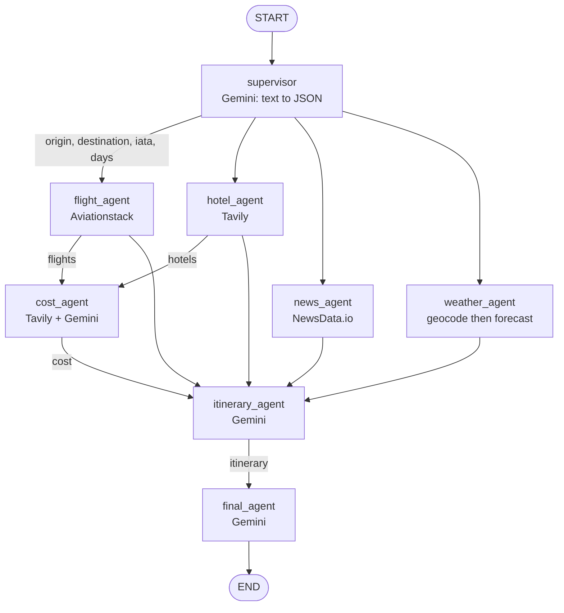

<a id="top"></a>
# Multi-Agent Systems with LangGraph — Reading Brief

> **Read this ONCE, end to end, before opening the notebook.** ~18 min. Afterwards you'll be *confirming* what you already understand instead of learning blind.
>
> **Side reference:** keep [`MultiAgent_LangGraph_Jargon_Card.md`](./MultiAgent_LangGraph_Jargon_Card.md) open in another tab for any word you don't recognise.
>
> **Notebook:** `Realtime_langgraph_multiagent_travel_planner (1).ipynb` — 32 cells, runs in Colab. Needs **five** API keys: Gemini, Aviationstack, NewsData.io, Tavily, OpenWeather. All are free-tier-able but all are required; the graph will crash on the first agent whose key is missing.

---

## 🎯 30-second TL;DR

**A "multi-agent system" is eight ordinary Python functions, one shared dictionary, and twenty lines of wiring.** There is no magic.

The notebook builds a live travel planner: you type *"Plan a 5-day trip from Delhi to Manali for 2 travelers"* in plain English, and a **supervisor** agent turns that into structured fields (`origin: Delhi`, `destination: Manali`, `days: 5`, `travelers: 2`). Four specialists then fetch **real, current** data in parallel — flights, hotels, news, weather — a cost agent researches and estimates prices, an itinerary agent writes the day-by-day plan, and a final agent assembles the answer.

The punchline is visible in the notebook's own output: the flight agent found **no direct Delhi→Manali flights**, and because every LLM prompt in the pipeline says *"Do not invent live facts"*, the final plan honestly recommends road transit instead of hallucinating a flight that doesn't exist. **Grounding beats fluency.**

---

## 🗺️ Agenda — what the notebook teaches, in order

| # | Cells | Topic | The one idea |
|--:|------|-------|--------------|
| 1 | 0–2 | Install + five API keys + LLM/Tavily clients | an agent system is mostly plumbing |
| 2 | 3–4 | `TravelState` — the shared dictionary | one state, every agent reads and writes it |
| 3 | 5–8 | **Supervisor agent** | free text → structured JSON fields |
| 4 | 9–12 | **Flight agent** (Aviationstack) | a non-LLM agent: pure API call |
| 5 | 13–15 | **Hotel agent** (Tavily) | LLM-native search returns clean snippets |
| 6 | 16–18 | **News agent** (NewsData.io) | surface travel-disrupting events |
| 7 | 19–21 | **Weather agent** (OpenWeather) | two-step: geocode, then forecast |
| 8 | 22–24 | **Cost agent** (Tavily + Gemini) | research *then* synthesize, never fabricate |
| 9 | 25 | **Itinerary agent** | read everything, write the plan |
| 10 | 26–27 | **Final agent** | assemble the user-facing answer |
| 11 | 28–29 | Build the graph + draw it | orchestration lives in the edges |
| 12 | 30 | Run the whole thing end to end | the real output, with a real honest gap |

Note the teaching rhythm: **every agent is defined and then immediately tested in isolation** with a hand-written mini-state. That is the single most transferable habit in this notebook — unit-test each node before wiring the graph.

---

## 🧠 The big idea — the travel agency back office

Picture a travel agency. A customer walks in and says something vague: *"We want five days somewhere in the hills, nice hotels, not too expensive."*

The **front-desk manager** (supervisor) doesn't book anything. Their job is to turn that sentence into a form: origin, destination, dates, headcount, preferences. Then they pin that form to a board.

Four **specialists** work off the same board, at the same time, without talking to each other: one phones airlines, one checks hotels, one reads the local news, one checks the forecast. None of them knows the others exist — they just read the board and write their findings back onto it.

A **finance clerk** waits until the flight and hotel notes are on the board, then prices the trip. A **planner** waits until *everything* is on the board and drafts the day-by-day itinerary. Finally the manager writes the customer-facing letter.

That board is the **shared state**. The specialists are **nodes**. The rule "the clerk waits for flights and hotels" is an **edge**. That's the whole architecture — and it's why the agents are so easy to test one at a time: each one only needs a board with the few sticky notes it actually reads.

---

## 🖼️ The picture — one diagram that holds the whole notebook



**Reading it aloud.** One arrow leaves `START` into the supervisor, which is the only node that sees
the user's raw sentence — everything downstream reads structured fields instead. The supervisor then
branches four ways, and because those four share no data they all run in the same round. `cost_agent`
has two incoming arrows and waits for both; `itinerary_agent` has five and waits for all of them,
which is where the scheduling subtlety in gotcha 1 comes from. Notice that no arrow ever connects two
specialists directly: **every arrow in this picture is really "write to the shared state, then let
the next node read it."**

---

## 📖 Core concept primers

### 1. Shared state — the board everyone writes on

> **🪜 Mental model:** a whiteboard in the middle of the office. Nobody passes notes; everybody reads and writes the board.

`TravelState` is a `TypedDict` — a description of which keys the state dictionary may hold and what type each holds (`origin: str`, `flights: Dict`, `days: int`…). It's declared with `total=False`, meaning **every key is optional**, which is essential because at the start of the run almost nothing exists yet.

The rule that makes this work: **a node returns only what it changed.** The flight agent returns `{"flights": {...}}` — not the whole state. LangGraph merges that fragment into the shared dictionary. This is why agents compose: none of them needs to know what the others write.

**Why it matters here:** because state is the only channel, you can test `hotel_agent` by handing it the two-key dictionary `{"destination": "Manali", "days": 5}` — exactly what cell 15 does.

**Careful:** `TypedDict` is *documentation*, not enforcement — Python lets a node write an undeclared key, and nothing complains until something downstream reads garbage.

### 2. The supervisor — free text in, structured fields out

> **🪜 Mental model:** the form-filling clerk. They don't solve your problem; they turn your sentence into fields the rest of the office can act on.

`supervisor_agent` sends the user's raw sentence to Gemini with a prompt that specifies the exact JSON shape to return, then parses the reply. Three details worth stealing:

1. **It demands raw JSON** — "Do not use markdown. Do not use ```json." — and then defensively strips those fences anyway, because models do it regardless.
2. **It handles two reply shapes.** Gemini may return `response.content` as a plain string *or* as a list of content blocks; the code flattens the list case before parsing. Skip this and you get an intermittent crash you can't reproduce.
3. **It refuses to guess.** "Do not invent IATA codes" — and in the real run it obeys, returning `origin_iata: "DEL"` but `destination_iata: ""` for Manali (which has no major airport). That empty string is a *correct* answer; the downstream flight agent simply omits that filter.

**In this notebook:** the test in cell 8 uses a Delhi→Goa request and gets back a clean seven-field JSON object including both IATA codes and ISO dates.

### 3. Nodes and edges — orchestration as data

> **🪜 Mental model:** a subway map. Stations are nodes, the coloured lines are edges, and the train (your request) can only travel where a line exists.

You build the graph in three moves:

```python
builder = StateGraph(TravelState)                 # declare the state schema
builder.add_node("hotel_agent", hotel_agent)      # register a function under a name
builder.add_edge("supervisor", "hotel_agent")     # after supervisor, hotel may run
graph = builder.compile()                         # freeze into an executable object
```

**Fan-out** is just several edges leaving one node: supervisor → flight, hotel, news, weather. Those four share nothing, so LangGraph can schedule them together. **Fan-in** is several edges arriving at one node: cost waits on flight + hotel; itinerary waits on all five research nodes.

**Why it matters:** every orchestration decision in this 32-cell notebook lives in ~20 lines of `add_edge`. Want the news agent to run before hotels instead? Change one line — you never touch the agent functions.

**Gotcha:** `compile()` snapshots the graph. Edit a node and forget to re-run the builder cell, and you'll be running the old graph while reading the new code. The notebook's own comment (`# IMPORTANT: compile again`) exists because someone got bitten.

### 4. Grounding — the anti-hallucination discipline

> **🪜 Mental model:** an open-book exam where the invigilator also says *"if it's not in the book, write 'not available'."*

Every LLM call in the second half of the pipeline pastes live API results into the prompt and adds explicit rules. The itinerary prompt carries seven of them: *do not invent live facts; do not claim a hotel is available unless the source says so; do not claim a flight is bookable; make the plan weather-aware; use current news to flag disruptions; keep it geographically realistic; clearly mark anything that is an estimate.*

The cost agent goes further, demanding a fixed JSON shape with `assumptions` and `source_notes` arrays, plus the instruction *"If a price is unavailable, say 'not available from retrieved sources'."*

**Where you see it pay off:** in the real run, Aviationstack returns flights to Patna, Leh, Mumbai and Varanasi — nothing useful for Manali. A fluent-but-ungrounded system would have invented a plausible DEL→Kullu flight. This one says *"no direct flights"* and pivots to road transit.

### 5. Two kinds of agent — API-only vs LLM-backed

> **🪜 Mental model:** researchers and writers. Researchers fetch; writers reason. Don't pay a writer's price for a researcher's job.

Four agents (flight, hotel, news, weather) make **zero LLM calls** — they're `requests.get()` wrapped in error handling. Four (supervisor, cost, itinerary, final) call Gemini. Recognising which is which is the practical skill: LLM calls cost money, add latency, and can hallucinate, so you use them only where *judgement or language* is required, never for fetching.

The weather agent shows a third wrinkle — a single "agent" can be **several API calls**: geocode `"Manali"` → `(32.2455, 77.1873)`, then fetch the forecast at those coordinates. The node boundary is a unit of *responsibility*, not a unit of HTTP.

### 6. Search APIs built for LLMs

> **🪜 Mental model:** the difference between being handed a library and being handed a briefing note.

`requests.get()` on a hotel site gives you HTML you'd have to parse. **Tavily** returns cleaned text snippets plus — with `include_answer=True` — a synthesized paragraph. In the cell-15 test it answers: *"Best hotels in Manali for a 5-day trip: The Himalayan, LN Grand Premium & Luxury Suites, and The Johnson's Lodge & Spa. Prices range from $30 to $400 per night."*

`search_depth="advanced"` buys more thorough crawling at higher latency and cost. Use it where quality matters (hotels, prices); use `"basic"` for cheap lookups.

---

## 🔥 The headline experiment — at a glance

The end-to-end run in cell 30, with real live data:

| Stage | What actually came back |
|---|---|
| Supervisor | `{origin: Delhi, destination: Manali, days: 5, travelers: 2, origin_iata: "DEL", destination_iata: "", start_date: "", end_date: ""}` |
| Flight (Aviationstack) | Flights from DEL — but to Patna, Leh, Mumbai, Varanasi. **No Delhi→Manali route.** |
| Hotel (Tavily) | 8 results + a synthesized answer naming three hotels, $30–$400/night |
| Weather (OpenWeather) | Manali, 17.32 °C, broken clouds, 81% humidity |
| News (NewsData.io) | 10 articles, including Himalayan flood coverage |
| Cost (Tavily + Gemini) | Hotels ₹1,600–₹7,000/night, transport ₹1,000–₹3,000/day, food ₹800–₹2,400/day |
| **Final answer** | *"Based on current flight data… there are **no direct flights** from Delhi (DEL) to Kullu/Bhuntar Airport… the most reliable, comfortable, and budget-friendly transit…"* |

**Read that last row twice.** The single most important result in this notebook is a *negative* one: the system found nothing and said so. That is the behaviour grounded prompts buy you.

---

## 🧮 Shapes to memorise

This notebook has no mathematics — but it has three **code shapes** that are worth memorising exactly, because you'll rewrite them in every LangGraph project you touch.

**1. The node contract**

```python
def my_agent(state: TravelState):
    return {"weather": {...}}          # ONLY the keys you changed
```
*In words:* a node takes the whole shared state and returns a small dictionary of just its own additions; LangGraph merges it in. Returning the entire state instead is the #1 beginner mistake — it works, but it makes every node depend on every key.

**2. The graph-building trio**

```python
builder.add_node(name, fn)     # register a worker
builder.add_edge(a, b)         # after a, b may run
graph = builder.compile()      # freeze it
```
*In words:* nodes are the *who*, edges are the *when*, compile is the *go*. Read any LangGraph file by finding these three call types and ignoring everything else.

**3. The superstep rule**

```
round N: run every node whose prerequisites are met → merge all their updates
round N+1: repeat
```
*In words:* LangGraph doesn't walk the graph one node at a time — it works in rounds, running everything that's ready, then merging. Worked example from this graph: round 1 = supervisor; round 2 = flight + hotel + news + weather (all four, together); round 3 = cost. The itinerary node is reachable both from round-2 nodes *and* from cost in round 3, and the notebook's output shows `🎯 FINAL AGENT STARTED` printed **twice** — a direct, visible consequence of that uneven fan-in. See gotcha 1.

---

## 🗺️ Notebook reading map

| Cells | What it teaches | How to read |
|---|---|---|
| 0–2 | pip install, five API keys, Gemini + Tavily clients | **Skim.** Note only that five separate keys are needed. |
| 3–4 | `TravelState` TypedDict | **Focus.** This is the contract everything else obeys. |
| 5–8 | Supervisor + its isolated test | **Focus.** The JSON-extraction prompt is the reusable bit. |
| 9–12 | Flight agent + direct API test | **Read normally.** Note it's pure `requests`, no LLM. |
| 13–15 | Hotel agent (Tavily) + test | **Read normally.** Notice `include_answer=True`. |
| 16–18 | News agent + test | **Skim** — same pattern as flights. |
| 19–21 | Weather agent + test | **Read normally** for the geocode-then-fetch two-step. |
| 22–24 | Cost agent + test | **Focus.** Best example of research-then-synthesize with anti-fabrication rules. |
| 25 | Itinerary agent | **Focus on the prompt**, not the code — the 7 grounding rules are the lesson. |
| 26–27 | Final agent | **Skim.** Same shape as itinerary. |
| 28–29 | Graph wiring + Mermaid render | **Focus.** Trace each `add_edge` onto the picture yourself. |
| 30 | Full end-to-end run | **Read the output carefully**, especially the "no direct flights" paragraph and the duplicated final-agent print. |
| 31 | *(empty)* | Skip. |

---

## ⚠️ Gotchas to watch for

1. **`🎯 FINAL AGENT STARTED` prints twice.** Not a copy-paste error in the output — the downstream path genuinely runs more than once, because `itinerary_agent` has incoming edges from nodes that finish in *different* supersteps (news/weather in round 2, cost in round 3). Uneven fan-in depth is the cause. Fix in real systems: make the join explicit, or make nodes idempotent so a repeat run is harmless (here it just costs an extra Gemini call).
2. **There's a typo in the key-loading cell.** Cell 1 reads `get_key("GOOGL\nE_API_KEY", ...)` — the environment-variable name is split across a newline. It *appears* to work only because the returned value is passed to `ChatGoogleGenerativeAI(google_api_key=GOOGLE_API_KEY)` explicitly; anything that later read `os.environ["GOOGLE_API_KEY"]` would fail with a `KeyError`.
3. **Every agent assumes its key exists.** One missing key = one crashed node = a dead graph run. Production systems wrap each node in try/except and let the graph degrade.
4. **Forgetting `compile()` after an edit** silently runs the old graph.
5. **`total=False` hides missing data.** Nodes use `state.get("days", 1)` — but a silent default of 1 day is a wrong answer, not an error. Choose deliberately between defaulting and failing loudly.
6. **Free-tier APIs bite.** Aviationstack's free tier is sparse for regional Indian routes — which is exactly why the Manali run found nothing. Sparse data is a *data* problem, not a code bug.
7. **LLM content can be a string or a list of blocks.** Copy the supervisor's flattening logic into any new LLM-backed node, or it will break intermittently.

---

## 🏛️ Staff-engineer lens

*Rung 4. Everything below assumes the beginner material above; nothing more.*

### Where this breaks at scale

**The first resource to run out is not compute — it's third-party rate limit.** One user request
fans out to five external APIs, two of which (Tavily advanced ×2) are the slow, metered ones. At 100
concurrent planning requests you are issuing 500 external calls, and Aviationstack's free tier caps
in the hundreds *per month*. The graph has no retry, no backoff, no circuit breaker and no per-node
timeout, so the failure at scale is not graceful degradation — it's a `raise_for_status()` exception
killing one node, which kills the run.

The second limit is **prompt size**. `itinerary_agent` interpolates the *entire* `flights`, `hotels`,
`weather`, `news` and `cost` objects into one prompt. The Aviationstack test alone returned 20 flight
records of deeply nested JSON. At realistic result counts this blows the context window, and the
failure is quiet: the model silently attends to the top of a huge prompt and ignores the rest.

### Latency & cost budget

Measured shape of one run, from the notebook's own trace:

| Stage | Calls | Dominates? |
|---|---|---|
| supervisor | 1 Gemini | no (~1 s) |
| 4 research agents | 4 HTTP, parallel | **critical path = slowest single API** |
| cost | 1 Tavily *advanced* + 1 Gemini | **yes** — advanced search is the expensive leg |
| itinerary + final | 2 Gemini, long prompts | yes on token cost |

Wall clock is roughly `supervisor + max(4 research) + cost + itinerary + final` — the fan-out is the
one place the design already buys you parallelism. Token cost is dominated by the last two calls,
because both paste the full accumulated state. And the notebook measurably **pays for one call it
doesn't need**: `🎯 FINAL AGENT STARTED` prints twice, so you are billed twice for the most expensive
prompt in the graph.

### The trade-off you're actually making

**You are buying per-step debuggability and parallelism by paying orchestration complexity and extra
LLM calls.** The alternative design is one Gemini call with five tools registered, letting the model
decide what to fetch — fewer moving parts, one prompt, and function-calling handles the sequencing.
What you'd lose is exactly what this notebook's structure gives you: the ability to unit-test
`hotel_agent` against a two-key dictionary, to see which stage produced a bad field, and to guarantee
the four research calls actually overlap rather than hoping the model emits them together.

Rule of thumb: **graph orchestration wins when the dependency structure is known and fixed**, as it
is here. Tool-calling wins when the required steps vary per request.

### Failure modes to forecast

Ranked by how quietly they fail, worst first:

1. **Stale data presented as live.** Nothing timestamps the API responses. A cached or hours-old
   weather reading flows into a plan that claims to be "current". No alarm fires, ever.
2. **`state.get("days", 1)` silently defaulting.** A supervisor extraction miss becomes a one-day
   itinerary for a five-day trip. A wrong answer, not an error.
3. **Duplicate node execution.** Uneven fan-in depth re-runs the final agent — double billing and,
   if a node ever mutates rather than appends, double side effects.
4. **Empty IATA silently widening the query.** `destination_iata: ""` drops the arrival filter, so
   the flight agent returns departures to *anywhere*. Here that produced the honest "no direct
   flights" answer — but the same mechanism could surface irrelevant flights as if they were matches.

### Why an interviewer asks this

"Design a multi-agent travel planner" is a litmus test for **whether you think in dependency graphs
or in scripts.** A weak answer describes agents talking to each other; the strong answer draws the
DAG, identifies which nodes are independent (the fan-out), names the join points, and immediately
asks what happens when one branch fails.

The follow-up that separates senior from staff is always partial failure: *"the hotel API is down —
what does the user see?"* This implementation has no answer, and saying so out loud — per-node
try/except returning a structured `{"ok": false}`, a timeout budget per node, degrade rather than
crash — is the answer they're listening for. The second probe is usually cost: if you can't say which
of your six model calls dominates the bill, you haven't operated the system.

[🔝 Back to top](#top)

---

## ✅ Walk-away checklist

After the notebook, you should be able to say in your own words:

- [ ] What a LangGraph **node**, **edge**, and **shared state** are — and why a node returns a *partial* update.
- [ ] What the **supervisor pattern** is, and how it differs from a router and from a debate/group-chat pattern.
- [ ] Which of the eight agents call an LLM and which are pure API calls — and why you'd want that split.
- [ ] How **fan-out** and **fan-in** are expressed, and why uneven fan-in made the final agent run twice.
- [ ] What **grounding** means concretely, and name two of the seven itinerary rules.
- [ ] Why "no direct flights found" is the *successful* outcome of this notebook, not a failure.
- [ ] **(staff)** Which stage dominates wall-clock and which dominates token cost — and why they're different stages.
- [ ] **(staff)** What a graph orchestration buys you over one LLM call with five registered tools, and when you'd choose the other one.

---

## 🎯 Self-check — 5 beginner + 3 staff

Answer these using only this Brief.

1. A node returns `{"weather": {...}}`. What happens to the other twelve keys in `TravelState`?
2. The supervisor is told "Do not invent IATA codes" and returns `destination_iata: ""`. Why is an empty string the *right* answer, and what does the flight agent do with it?
3. You want the news agent to run *after* the weather agent instead of alongside it. What exactly do you change — and what must you remember to do afterwards?
4. Why does the weather agent make two HTTP calls where the news agent makes one?
5. The final answer says there are no direct Delhi→Manali flights. Explain the full chain — from the supervisor's output to the prompt rules — that produced that honest answer instead of an invented flight number.

**Staff-level (answerable from the 🏛️ section):**

6. This runs fine for one user. Product wants 100 concurrent planning requests. What runs out first, and what do you change before you ship?
7. Your finance lead says the planner costs 3× the forecast. Where do you look first, and what's the one-line fix already visible in this notebook's output?
8. An interviewer asks: "the hotel API is down — what does the user see?" What does this implementation actually do, and what should it do?

<details>
<summary><strong>Answers</strong></summary>

1. **Nothing — they're preserved.** LangGraph *merges* the returned fragment into the shared state; it does not replace it. That merge rule is what lets each node stay ignorant of every other node's keys.

2. Manali has no major commercial airport, so there is no correct IATA code to give. The prompt forbids guessing, so the model returns an empty string rather than a plausible-looking wrong code (which would have sent the flight agent querying the wrong airport). The flight agent builds its query params conditionally — `if state.get("destination_iata"):` — so an empty value simply means that filter is omitted, and the search runs on departure airport + date alone.

3. Delete `builder.add_edge("supervisor", "news_agent")` and add `builder.add_edge("weather_agent", "news_agent")`. Nothing inside `news_agent` changes — orchestration lives entirely in the edges. Afterwards you **must re-run `builder.compile()`**, or you'll keep executing the previously compiled graph.

4. OpenWeather's forecast endpoint accepts latitude/longitude, not place names — so the agent must first call the geocoding endpoint to turn `"Manali"` into `(32.2455, 77.1873)`. NewsData.io accepts a plain text query, so one call suffices. The lesson: one agent = one *responsibility*, which may be any number of HTTP calls.

5. The supervisor extracted `origin_iata: "DEL"` and `destination_iata: ""` (refusing to invent a code). The flight agent queried Aviationstack with departure DEL only, and got back flights to Patna, Leh, Mumbai and Varanasi — nothing toward Manali. Those raw results were pasted into the itinerary and final prompts, which carry explicit rules: *"Do not invent live facts", "Do not claim a flight is bookable"*. With no supporting evidence in the prompt and an explicit ban on fabrication, the model's only available honest move was to report the absence and recommend road transit.

**Staff answers**

6. **Third-party rate limits, well before compute.** Each request fans out to five external APIs — 500 calls at 100 concurrent — and Aviationstack's free tier caps in the hundreds *per month*. Before shipping: per-node timeouts, retry with exponential backoff, a circuit breaker per API, a cache keyed on (destination, date) since weather and news are shared across users, and per-node `try/except` returning a structured failure so one dead API degrades the plan instead of killing the run.

7. **The last two Gemini calls** — `itinerary_agent` and `final_agent` — because both interpolate the *entire* accumulated state into one prompt, making them by far the largest token consumers. The one-line fix is visible in the notebook's own output: `🎯 FINAL AGENT STARTED` prints **twice**, so the most expensive prompt in the graph is billed twice per run. Fix the uneven fan-in (or make the node idempotent/memoised) and you remove a duplicate call for free. Second-order: trim what gets interpolated — the raw 20-record Aviationstack JSON doesn't need to reach the prompt.

8. **Today: the run dies.** `hotel_agent` calls `response.raise_for_status()`, the exception propagates, the node fails, and the graph run ends with no answer — even though flights, weather and news all succeeded. It should instead catch per node and write a structured `{"ok": false, "error": ...}` into state, let the itinerary prompt see "hotels: unavailable" and plan around it, and surface the gap to the user. The general principle is the one the interviewer is testing: **in a fan-out, one branch failing must not be allowed to discard the branches that succeeded.**

</details>

[🔝 Back to top](#top)
