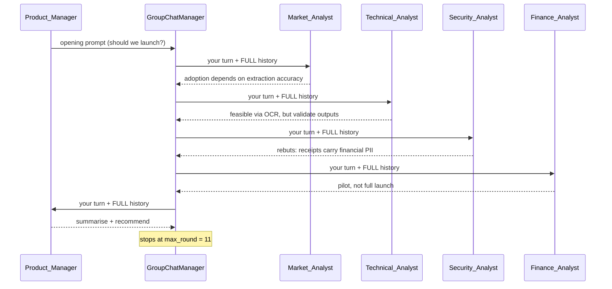

<a id="top"></a>
# AutoGen (AG2) Multi-Agent Patterns — Reading Brief

> **Read once, end to end, before the notebook.** ~12 min. Afterwards nothing in the notebook will be a new word.
>
> **Side reference:** [`AutoGen_MultiAgent_Jargon_Card.md`](./AutoGen_MultiAgent_Jargon_Card.md).
>
> **Notebook:** `FinTrack_MultiAgent_AutoGen_Gemini_Lab__1_.ipynb` — 51 cells, ~45 min. Needs **one** key (Gemini). Run top to bottom: later sections reuse the `llm_config` and the `runner` agent built early on.

---

## 🎯 30-second TL;DR

**An "agent" is an LLM call wrapped with a name, a system message, and a way to send and receive messages. A "multi-agent system" is several of those sharing messages under simple, explicit rules.** The notebook says this itself in its closing line: *"a multi-agent system is not magic."*

The lab proves it by building up from one agent answering one question, through two agents conversing, chains, reflection, tool calling and code execution, to a **five-agent GroupChat** in which a Product Manager, Market Analyst, Technical Analyst, Security Analyst and Finance Analyst debate whether fictional company FinTrack should ship an AI receipt scanner — then a human approves or rejects the verdict. The five analysts are **identical objects** given the same `llm_config`; only their `system_message` differs.

The sting in the tail: ten sections argue about building a receipt scanner. **Section 11 actually builds one** with Gemini Vision — and any extraction errors you see there are the live version of the exact risk the Technical Analyst warned about in the debate.

---

## 🗺️ Agenda — what the notebook teaches, in order

| § | Pattern | The one idea |
|--:|---------|--------------|
| 1 | Setup | pin `ag2==0.14.0`; one shared `llm_config` |
| 2 | Basic agent | agent = LLM + name + system message |
| 3 | Two-agent conversation | the critique is *generated*, not written by you |
| 4 | Sequential chain | A's reply text becomes B's input — an f-string |
| 5 | **Reflection** | draft → critique → revise |
| 6 | **Tool calling** | offload exact work (ROI math) to real code |
| 7 | **Code execution** | the agent writes Python and it actually runs |
| 8 | **GroupChat case study** | 5 agents, one shared history, round-robin |
| 9 | **Human-in-the-loop** | one `input()` gates the decision |
| 10 | **ReAct / Text2SQL** | think → act (SQL) → observe → answer |
| 11 | *(Bonus)* Vision | the only non-simulated part of the lab |

---

## 🧠 The big idea — the meeting room

Everything here is **one room and one rule about who talks next.**

Sections 2–7 are private one-on-one conversations: two people in an office, one asking, one answering. Useful, but each pair is blind to every other pair. Section 8 moves everyone into a single meeting room with a whiteboard that records every word said. Now the Security Analyst can *read* the Market Analyst's optimism and push back on it directly — which is exactly what the transcript shows.

That's the whole leap from "chained prompts" to "multi-agent system": **a shared, complete message history plus a turn-taking rule.** The `GroupChat` holds the history; the `GroupChatManager` holds the rule (`round_robin` here — a fixed rotation). Change the rule to `"auto"` and the manager's LLM picks the next speaker; change the room membership and you have a different team. The agents themselves don't change at all.

---

## 🖼️ The picture — one diagram that holds the whole notebook

The §8 GroupChat is the thing everything else builds toward. This is what one round actually looks like:



**Reading it aloud.** Every arrow into an agent carries the **entire conversation so far**, not just
the previous message — that shared history is the only mechanism that lets the Security Analyst
rebut a claim the Market Analyst made two turns earlier. The manager never contributes content; it
only decides whose turn is next, and with `round_robin` that decision is a fixed rotation. The
`Note` is the safety rail: without `max_round=11` the loop has no natural end, because no agent is
ever told the meeting is over.

---

## 📖 Core concept primers

### 1. The agent = system message

> **🪜 Mental model:** five identical actors, five different scripts.

Every agent is `AssistantAgent(name=..., system_message=..., llm_config=llm_config)`. Same model, same settings — the `system_message` alone produces the personality. The case-study messages each carry three things: **role** ("You are the Security Analyst"), **responsibilities** ("raise concerns about personal and financial information in receipts, image storage, access control, data retention"), and **stance** ("actively disagree with overly optimistic claims"). That third element is what stops five agents from politely agreeing with each other — the Product Manager is even told *"Do NOT simply agree with everyone."*

Note also the length discipline: every message ends with "Keep every message to 2–4 sentences." Without it a 5-agent × 11-round chat becomes unreadable and expensive.

### 2. Tool calling vs code execution

> **🪜 Mental model:** a vending machine versus a kitchen. The vending machine has fixed buttons; the kitchen lets you cook anything.

**Tool calling** (§6): you pre-register one safe Python function. `@tool_assistant.register_for_llm(description=...)` advertises it to the model; `@tool_executor.register_for_execution()` says who runs it. Gemini genuinely emits a call, AG2 executes `calculate_roi(revenue=150000, cost=50000)`, and the result `200.0%` returns to the model. The point: LLMs are bad at exact arithmetic, so give the arithmetic to Python.

**Code execution** (§7): the model *writes* a snippet and a `LocalCommandLineCodeExecutor` runs it as a subprocess with a 30-second timeout. More powerful, correspondingly riskier — use it when the task can't be expressed as one predefined function. And note: the `description=` string is the *only* thing the model reads when deciding whether a tool applies.

### 3. Reflection — draft, critique, revise

> **🪜 Mental model:** a first draft, a red pen, and a rewrite.

Three `initiate_chat` calls with a `runner` agent: Writer produces a confident one-sentence launch recommendation; Critic names what's missing (privacy, accuracy, cost); Writer is handed **both its own draft and the critique** and rewrites. The revised version is visibly more hedged and more complete.

No framework feature is involved — reflection is three ordinary calls and one f-string. The value is the *structure*, not the API. (Compare the ReAct/Reflection lecture, which adds an approval check and an iteration cap.)

### 4. GroupChat — shared history is the mechanism

> **🪜 Mental model:** a whiteboard nobody is allowed to erase.

```python
groupchat = GroupChat(agents=[pm, market, tech, security, finance],
                      messages=[], max_round=11,
                      speaker_selection_method="round_robin")
manager = GroupChatManager(name="chat_manager", groupchat=groupchat, llm_config=llm_config)
```

`max_round=11` is the safety cap: five agents, roughly two turns each, then stop. Set no cap and the meeting never ends. `round_robin` was chosen over `"auto"` specifically for a live class — a fixed rotation is reproducible; LLM-chosen speakers can loop or repeat.

**Why it produces real disagreement:** every agent is fed the *entire* history so far, so the Finance Analyst can quote the Technical Analyst's feasibility claim and demand it be justified against operating cost.

---

## 🔥 The headline takeaway — at a glance

| Pattern | Cost | Reach for it when |
|---|---|---|
| Single agent | 1 LLM call | one question, one answer |
| Sequential chain | N calls, fixed order | you already know the steps |
| Reflection | 3 calls | quality matters more than latency |
| Tool calling | 2–3 calls + 1 function | exact math, lookups, DB queries |
| Code execution | 2–3 calls + a subprocess | open-ended computation |
| GroupChat | up to `max_round` calls | you genuinely need multiple perspectives |
| Human-in-the-loop | 1 `input()` | the decision has real consequences |
| ReAct | 2–3 calls per question | the answer lives in a system, not the model |

Reading down that table is the real lesson: **cost climbs steeply with sophistication.** A GroupChat is roughly 11× a single agent call. Reach for the cheapest pattern that solves the problem.

---

## 🧮 Shapes to memorise

No maths in this notebook — but three code shapes you'll rewrite constantly.

**1. One agent**
```python
AssistantAgent(name="X", system_message="You are …", llm_config=llm_config)
```
*In words:* a name for the transcript, a job description for the model, and shared model settings.

**2. Tool registration (both halves required)**
```python
@tool_executor.register_for_execution()                    # who RUNS it
@tool_assistant.register_for_llm(description="…")          # who KNOWS about it
def calculate_roi(revenue: float, cost: float) -> str: ...
```
*In words:* the bottom decorator advertises the function to the model; the top one names the agent that executes it. Worked example: `revenue=150000, cost=50000` → `(150000 − 50000) / 50000 × 100 = 200.0%`.

**3. A meeting**
```python
GroupChat(agents=[...], messages=[], max_round=11, speaker_selection_method="round_robin")
```
*In words:* who's in the room, an empty transcript to fill, a hard turn limit, and the rule for who speaks next.

---

## 🗺️ Notebook reading map

| Cells | What it teaches | How to read |
|---|---|---|
| 0–6 | Install, version pin, `LLMConfig` | **Read the pin rationale** (0.x vs 1.x); skim the rest |
| 7–18 | Basic agent, two-agent chat, chain | **Skim** — short and self-evident |
| 19–23 | Reflection | **Focus.** Compare DRAFT vs REVISED side by side |
| 24–27 | Tool calling | **Focus.** The two decorators are the lesson |
| 28–30 | Code execution | **Read normally.** Note `is_termination_msg` |
| 31–36 | GroupChat case study | **Focus — this is the lab.** Find one place an agent directly rebuts another |
| 37–40 | Human-in-the-loop | **Skim.** Cell 39 waits for your typed input |
| 41–45 | ReAct / Text2SQL | **Focus.** Expected: North = 200000, South = 165000 |
| 46–49 | Vision bonus | **Read the output.** Compare against the generated receipt (GREENLEAF CAFE, 2026-08-14, total 588.00) |
| 50 | Recap table | **Read.** Maps every pattern back to the case study |

---

## ⚠️ Gotchas

1. **`pip install ag2`, `import autogen`.** Package name ≠ import name. And the version pin is load-bearing: `1.x` has a different API and every import in cell 4 would fail.
2. **Cell 39 blocks on `input()`.** "Run all" will appear to hang there. Type `approve` or `reject`.
3. **Register both decorators or nothing works.** Only `register_for_llm` → the model calls a tool nobody runs. Only `register_for_execution` → the model never knows it exists.
4. **Not every message has a `name` key.** A pure tool-call turn has only role/content/tool_calls, which is why the printing loops use `turn.get("name") or turn.get("role", "unknown")`.
5. **`max_round` is the only thing stopping a runaway meeting.** Five agents with no cap will keep talking and keep billing.
6. **Cell 47 tries a Colab file upload first.** Outside Colab it falls through to a generated sample receipt — that's expected, not a failure.
7. **Section 11 is the only real implementation.** Sections 1–10 discuss a receipt scanner that doesn't exist yet. Don't confuse the debate for the product.

---

## 🏛️ Staff-engineer lens

*Rung 4. Everything below assumes the beginner material above; nothing more.*

### Where this breaks at scale

**Context window, and it breaks quadratically.** Every agent is fed the full shared history before
generating, so with `A` agents over `R` rounds the total tokens sent is O(A·R²), not O(A·R). Five
agents × 11 rounds at 2-4 sentences each is comfortable; five agents × 60 rounds, or ten agents ×
20, is not — and the failure is quiet, because the model silently truncates or loses the middle of a
long prompt rather than erroring. This is why the system messages all end with *"Keep every message
to 2-4 sentences"*: that instruction is a **context-budget control**, not a style preference.

The second limit is `LocalCommandLineCodeExecutor`. It runs model-written Python as a local
subprocess with a 30-second timeout and no sandbox boundary — fine in a disposable Colab VM,
completely unshippable as a multi-tenant service. The production shape is a container or microVM per
execution with no network and a read-only filesystem.

### Latency & cost budget

The pattern table in the previous section is really a cost table. Concretely, per case-study run:

| Stage | Model calls | Note |
|---|---|---|
| §2 basic agent | 1 | the unit of comparison |
| §5 reflection | 3 | 3× a single answer |
| §6 tool calling | 2-3 | + one cheap Python call |
| §8 GroupChat | **up to 11** | **dominates — and each is the largest prompt** |

GroupChat is ~11× a single agent on call count *and* the priciest per call, because prompt size grows
every round. Latency is strictly serial: round-robin means no two agents ever generate concurrently,
so wall clock is the sum of 11 completions. That serialisation is a design choice you can revisit —
independent analysts (market, technical, security, finance) have no data dependency on each other in
round 1 and could be fanned out concurrently, exactly like the LangGraph lecture's four research
agents, with only the summarising PM turn forced to wait.

### The trade-off you're actually making

**You are buying genuine multi-perspective disagreement by paying quadratic token growth and fully
serial latency.** The alternative is one call with a prompt saying "consider this from market,
technical, security and finance angles" — one round trip, a fraction of the cost. What that loses is
the thing §8 actually demonstrates: a single model asked to self-critique tends to converge on one
voice, whereas separate agents with *adversarial* system messages ("actively disagree with overly
optimistic claims") hold their positions across rounds. You are paying 11× for the disagreement to
be real rather than performed.

### Failure modes to forecast

Ranked by how quietly they fail:

1. **Manufactured consensus.** If the system messages don't force dissent, five agents converge and
   produce a confident recommendation with no adversarial pressure — indistinguishable in shape from
   a well-argued one. This notebook defends against it explicitly (*"Do NOT simply agree with
   everyone"*), which is the tell that it's the known failure of the pattern.
2. **Silent context truncation** as rounds accumulate — early constraints drop out of the window and
   the final recommendation quietly ignores them.
3. **`max_round` hit mid-argument.** The loop stops on a turn count, not on a conclusion, so you can
   get a truncated debate with no PM summary. Nothing flags that the meeting was cut off.
4. **`"LGTM"`-style substring control flow** (§5's sibling pattern) and `is_termination_msg` matching
   `"DONE"` anywhere in content — a model that says "I'm not DONE yet" terminates the loop.

### Why an interviewer asks this

"Build a multi-agent system" is a litmus test for **whether you can justify the agent count.** The
weak answer adds agents because the architecture diagram looks better with five boxes. The strong
answer starts from one call and forces each additional agent to earn its 2-4× cost — and can say
precisely what §8 buys over a single well-prompted call.

The follow-up that separates senior from staff is the termination question: *"what stops it?"* Every
loop here has an explicit cap (`max_turns`, `max_round`, `max_consecutive_auto_reply`), and knowing
which cap governs which loop — and that a turn-count cap means you can terminate mid-argument — is
the operational maturity being probed. The third probe is safety: if you describe an agent that
writes and runs code and don't volunteer the sandbox boundary, that's the answer.

[🔝 Back to top](#top)

---

## ✅ Walk-away checklist

- [ ] Why five agents built from the *same* config behave differently.
- [ ] The difference between tool calling and code execution, and when each fits.
- [ ] The three steps of reflection, and why the revised answer is better.
- [ ] What a `GroupChat` actually is, mechanically (shared history + turn rule).
- [ ] Why `max_round` and `max_turns` exist, and what breaks without them.
- [ ] Why ReAct is "just tool calling applied to reasoning."
- [ ] **(staff)** Why GroupChat token cost grows quadratically with rounds, and what the 2-4 sentence rule is really controlling.
- [ ] **(staff)** What 11 calls buy you over 1, and the case for choosing the single call anyway.

---

## 🎯 Self-check — 5 beginner + 3 staff

1. You want the Security Analyst to be more aggressive. What single thing do you change?
2. The Finance Analyst needs an exact ROI figure. Why is tool calling the right answer rather than just asking the model to compute it — and which two decorators do you need?
3. In §8 the Security Analyst rebuts the Market Analyst's claim. What mechanism makes that possible?
4. Revenue $150,000, cost $50,000. What does `calculate_roi` return, and how?
5. §11's extraction gets a field wrong. Which agent from §8 predicted exactly this, and what did they recommend?

**Staff-level (answerable from the 🏛️ section):**

6. Your team wants the FinTrack debate to run 40 rounds instead of 11 for a deeper analysis. What happens to cost and to answer quality, and what would you change first?
7. A colleague proposes replacing the five-agent GroupChat with a single Gemini call prompted to "consider market, technical, security and finance angles." Make the strongest case *for* their version, then say what you'd lose.
8. You're shipping §7's code-execution agent as a customer-facing feature. What's the first thing you change, and why is the current setup fine in Colab but not in production?

<details>
<summary><strong>Answers</strong></summary>

1. **Its `system_message`** — nothing else. Same class, same `llm_config`; the system message is the only differentiator. You'd sharpen "actively disagree with overly optimistic claims" into something stronger.

2. LLMs predict text, they don't calculate; arithmetic is exactly the class of work to hand to real code. You need **both** decorators: `@tool_assistant.register_for_llm(description=...)` so Gemini knows the tool exists and what it's for, and `@tool_executor.register_for_execution()` so an agent actually runs the Python when the call is emitted.

3. **The shared message history.** Every agent in a `GroupChat` is fed the full transcript so far before generating, so the Security Analyst literally reads the Market Analyst's sentence and responds to it. In the one-on-one sections of §2–§7 that's impossible — those conversations are isolated pairs.

4. `(150000 − 50000) / 50000 × 100 = 200.0%`. Gemini decides the tool applies, emits `calculate_roi(revenue=150000, cost=50000)`, AG2 runs the real Python function, and the string `"200.0%"` is sent back into the conversation for the model to report.

5. The **Technical Analyst**, whose system message says the feature is feasible with OCR and LLM extraction *but* that receipt formats vary significantly, so **extracted data must be validated before being trusted**. §11's own closing note makes the link explicit: any mistake you see there is a live example of that risk.

**Staff answers**

6. **Cost grows quadratically, and quality likely degrades.** Each round re-sends the full history, so total tokens scale O(R²), not O(R) — 40 rounds is roughly 13× the token cost of 11, not 3.6×. Quality degrades because once the accumulated history approaches the context window, early constraints get silently truncated and the final recommendation quietly stops honouring them. First change: don't extend the rounds — **summarise**. Compact the history every N rounds into a running brief, or give the manager a termination condition based on convergence (no new argument introduced) rather than a raw turn count, so the meeting ends when it's done rather than when the counter expires.

7. **The case for them is strong:** one round trip instead of eleven, roughly a tenth the token cost, no context-growth problem, no `max_round` truncation risk, and far less code to maintain. For a low-stakes summary it's the right call and the five-agent version is over-engineering. **What you lose is that the disagreement stops being real.** A single model asked to argue with itself converges on one voice and tends to produce balanced-sounding prose rather than genuine conflict; §8's Security Analyst holds an adversarial position *across* rounds because its system message tells it to and because it can see and directly rebut what the Market Analyst actually said. You pay 11× for dissent that persists under pressure. Choose the single call unless the decision genuinely warrants adversarial review.

8. **Replace `LocalCommandLineCodeExecutor` with an isolated sandbox** — a container or microVM per execution, no network egress, read-only filesystem, strict CPU/memory caps, and a much shorter timeout. Colab is fine because the runtime is disposable, single-tenant, and already the user's own environment: model-written code can only damage a VM that's about to be discarded. In production it's arbitrary code execution on your infrastructure on behalf of an untrusted user, and the prompt is an untrusted input path straight to it. The related change is scope: prefer §6's **tool calling** — a fixed, audited set of functions — over §7's open code execution wherever the task can be expressed as a predefined function, because the attack surface is the difference between one vetted signature and the whole language.

</details>

[🔝 Back to top](#top)
