<a id="top"></a>
# Browser Automation & Web Agents — Reading Brief

> **Read once, end to end, before the notebook.** ~11 min.
>
> **Side reference:** [`Browser_Automation_Jargon_Card.md`](./Browser_Automation_Jargon_Card.md).
>
> **Notebook:** `8_sep_Browser_automation_Classroom.ipynb` — 28 cells, Colab. Setup takes 2–4 minutes and **you must restart the runtime afterwards**. One key: `GROQ_API_KEY` in Colab Secrets.

---

## 🎯 30-second TL;DR

**Playwright gives an agent eyes and hands. browser-use gives it a chauffeur that can read road signs.** That one sentence is the notebook's spine.

The first half is Playwright: how a real browser is structured (Browser → Context → Page), how to find elements robustly, why **auto-wait** means an LLM never has to reason about page-load timing, how to survive JavaScript-built pages and infinite scroll, and two ways to stay logged in. The second half hands the wheel to an LLM: `browser-use` serialises the page into a numbered list of clickable things (`[1]<button>Sign in</button>`), the model says "click element 1", and the loop repeats.

The pragmatic twist: after demoing the full autonomous agent, the notebook's two most polished examples (Hacker News, BBC) **go back to plain Playwright scraping plus one Groq structured-output call**. Deterministic scrape + LLM-for-structure is cheaper, faster and more reliable than autonomy whenever you already know the page.

---

## 🗺️ Agenda — what the notebook teaches, in order

| § | Cells | Topic | The one idea |
|--:|------|-------|--------------|
| — | 0–2 | Setup + Colab secrets | pin versions; restart the runtime |
| 1 | 3 | Why agents need a browser | most of the web isn't an API |
| 2 | 4–6 | Playwright basics | Browser → Context → Page |
| 3 | 7–9 | Locator strategies | role > text > testid > CSS > XPath |
| 4 | 11 | Auto-wait | five actionability checks, then click |
| 5 | 12–13 | SPAs + infinite scroll | wait on an element, always cap the loop |
| 6 | 14–16 | Auth pattern 1: `storage_state` | log in once, reuse the session file |
| 7 | 17–18 | Auth pattern 2: programmatic login | fill the form, then save the state |
| 8 | 20–21 | **browser-use deep dive** | DOM serialization vs vision mode |
| 9 | 23–24 | Structured output with Pydantic | scrape deterministically, structure with the LLM |
| 10 | 25–26 | Policies + BBC extraction | `message_context` is the agent's SOP |

---

## 🧠 The big idea — the chauffeur

You own a car. **Playwright is the steering wheel and pedals**: precise and mechanical — `page.click("button.add-to-cart")` clicks that button and nothing else. Perfect when you know the page.

The gap opens when you *don't*. You can't write `page.click(...)` for a site you've never seen, whose class names you don't know, which redesigns next month. **browser-use is the chauffeur who can read road signs.** You say "go to Hacker News, find the top story, tell me its title and points", and it looks at the page, identifies the interactive elements, picks one, clicks, looks again.

The key insight is *how* it looks. It doesn't hand the model raw HTML — it hands it a numbered menu:

```
[1]<button>Sign in</button>
[2]<input type="email" placeholder="Email"/>
[3]<a>Forgot password?</a>
```

The model's entire action vocabulary is "click element 1", "type into element 2", "scroll", "go back". That constraint is what makes it reliable — the model can't hallucinate a CSS selector when its only options are numbers on a list it was just shown.

And the corollary the notebook demonstrates by example: **once you know the page, fire the chauffeur and drive yourself.** Autonomy costs tokens, latency and determinism.

---

## 🖼️ The picture — one diagram that holds the whole notebook

Two ways to get data off a page. The notebook builds the left path, then quietly prefers the right:

```mermaid
flowchart TD
    subgraph AG["Full agent (browser-use)"]
        A1[Task in English] --> A2[Serialize DOM to numbered list]
        A2 --> A3["LLM picks: click element 7"]
        A3 --> A4[Playwright executes + auto-waits]
        A4 --> A2
        A4 -->|done or max_steps=8| A5[Free-text result]
    end
    subgraph SC["Scrape + structure (cells 24, 26)"]
        B1[Known selectors] --> B2["Playwright: tr.athing rows"]
        B2 --> B3[Messy text: 424 points by ... 292 comments]
        B3 --> B4[ONE Groq call, strict JSON schema]
        B4 --> B5[Pydantic-validated objects]
    end
```



**Reading it aloud.** The left path has a **cycle** — perceive, decide, act, perceive again — and
every trip round that cycle is another LLM call, which is where its cost and its non-determinism both
come from. The right path is a straight line with exactly one model call, placed at the only step
that genuinely needs judgement: turning `424 points by fnthawar2 3 hours ago | hide | 292 comments`
into typed fields. Same data, same page; the difference is whether the LLM is driving or parsing.
Choose the cycle only when you don't know the page.

---

## 📖 Core concept primers

### 1. Browser → Context → Page

> **🪜 Mental model:** the Chrome process, an incognito window, a tab.

```
Browser   = the entire Chrome process   (expensive to start — start once)
Context   = one incognito window        (own cookies, storage, identity)
Page      = one tab inside a context
```

**Why the middle layer matters:** contexts are cheap and fully isolated, so five contexts in one browser process = five simultaneous logged-in identities scraping in parallel, with no cookie bleed. That's Playwright's parallelism story — and why `storage_state` and `user_agent` are set on the **context**, not the browser or the page.

### 2. Locators — find elements the way a human would

> **🪜 Mental model:** "the blue Login button" survives a redesign; "third div, second span" does not.

| Strategy | Example | Stability |
|---|---|---|
| Role-based | `get_by_role("button", name="Add to cart")` | ✅ best |
| Text / label | `get_by_text("Forgot password?")` | ✅ good |
| `data-testid` | `locator("[data-testid='price']")` | ✅ good |
| CSS class | `locator("button.css-1xyz9q")` | ⚠️ fragile |
| XPath | `locator("xpath=/html/body/div[3]/…")` | ❌ avoid |

CSS classes on modern sites are often build-generated hashes that change on every deploy; absolute XPath breaks when anyone adds a wrapper div.

**The agent-specific reason to prefer role and text:** they match how a human — and an LLM reading the accessibility tree — *describes* a page, so the model's reasoning vocabulary and your selectors' vocabulary become the same vocabulary.

### 3. Auto-wait — why Playwright fits LLM agents

> **🪜 Mental model:** a patient assistant who waits for the lift doors to actually open before stepping in.

Before any `click`, Playwright checks five things and retries until they pass or the timeout expires: attached to the DOM, visible, stable (not animating), receiving events (not covered by an overlay), enabled.

**Why this is huge for agents:** without it the model would have to reason about timing — "has the page loaded? should I wait?" — at every step. Instead it says "click element 7" and the framework handles reality.

For more control, wait on something *specific*:
```python
await page.wait_for_selector(".results", state="visible")   # ✅ preferred
await page.wait_for_url("**/dashboard")                     # ✅ good
await page.wait_for_load_state("networkidle")               # ⚠️ usually wrong
```
`networkidle` means "no network requests for 500 ms" — a condition busy commercial sites never reach, because of analytics pings and polling. It will time out.

### 4. SPAs and infinite scroll

Most modern consumer sites ship a near-empty HTML shell and build the page with JavaScript, so `requests.get(url).text` gets you almost nothing. Playwright runs a real browser and the JS executes — but now *you* must decide when the page is done. Three patterns, best first: **wait for the specific element you need**, **intercept the underlying API call** for clean JSON, or **scroll-and-count** for infinite feeds.

The scroll loop, from cell 13:
```python
for _ in range(8):                        # ← ALWAYS cap this
    await page.mouse.wheel(0, 5000)
    await page.wait_for_timeout(1200)
    current = await page.locator(".quote").count()
    if current == previous: break         # nothing new loaded → stop
    previous = current
```
Result: 50 quotes loaded. The cap is not optional — an uncapped scroll on a truly infinite feed runs until something times out.

### 5. Two authentication patterns

> **🪜 Mental model:** `storage_state` is the "remember me on this device" checkbox; programmatic login is typing your password every time.

**Pattern 1 — `storage_state` (the production one).** Logging in from scratch every run is slow, trips anti-bot heuristics, and may trigger 2FA. Instead: log in once by hand (locally, `headless=False`), save cookies + `localStorage` to JSON, and pass `new_context(storage_state="github_state.json")` on every later run — you start already logged in.

⚠️ **That file is a credential.** Anyone holding it can act as you. `.gitignore` it; encrypt it in production.

**Pattern 2 — programmatic login.** Fill the form in code. Right for rotating accounts, service accounts, or fresh onboarding. The demo uses a practice site with published test credentials and then — the nice touch — **saves `storage_state` afterwards**, combining both patterns.

### 6. How the LLM sees the page — DOM mode vs vision mode

**Mode 1 (default): DOM serialization with element indexing.** Walk the DOM, drop invisible elements, emit a numbered list of interactive ones. Fast, token-efficient, robust, and it works with **text-only models** — which is why the notebook sets `use_vision=False` for Groq's text-only `openai/gpt-oss-120b`.

**Mode 2: vision.** Screenshot the page, draw numbered bounding boxes, send the image to a vision model. More reliable on visually complex apps (Canva, Figma) where the DOM is uninformative; considerably more expensive.

---

## 🔥 The headline comparison — at a glance

The two ways this notebook gets data off a page:

| | Full agent (browser-use) | Scrape + structure (cells 24, 26) |
|---|---|---|
| Who picks the actions | the LLM, step by step | you, in Playwright code |
| Page knowledge needed | none | you must know the selectors |
| LLM calls | one per step (`max_steps=8`) | exactly one, at the end |
| Determinism | low — different path each run | high |
| Output shape | free text | Pydantic-validated JSON |
| Use it when | the page is unknown or changing | the page is known and stable |

The Hacker News example illustrates it cleanly: Playwright deterministically pulls `tr.athing` rows and their sibling subtext (`424 points by fnthawar2 3 hours ago | hide | 292 comments`), then **one** Groq call with a strict JSON schema turns that messy string into `{title, points, url, comments}`, validated by Pydantic. The LLM does the one thing it's uniquely good at — parsing unstructured text — and nothing else.

---

## 🧮 Shapes to memorise

**1. The hierarchy**
```
Browser → Context → Page
```
*In words:* one expensive process, holding cheap isolated windows, each holding tabs. Set identity (cookies, user agent) on the **context**.

**2. The minimal Playwright script**
```python
async with async_playwright() as p:
    browser = await p.chromium.launch(headless=True)
    context = await browser.new_context()
    page    = await context.new_page()
    await page.goto(url)
    ...
    await browser.close()
```
*In words:* start the engine, open a window, open a tab, go somewhere, do things, shut down. Every example in the notebook is this shape.

**3. The scroll-until-stable loop**
```
repeat up to N times: scroll → wait → count items → stop if count unchanged
```
*In words:* keep scrolling while new things keep appearing, but never more than N times. Worked example: 8 iterations, 1.2 s wait each, `.quote` count settles at 50.

---

## 🗺️ Notebook reading map

| Cells | What it teaches | How to read |
|---|---|---|
| 0–2 | Install, `nest_asyncio`, Colab secrets | **Read the pin comments** — they document real dependency failures |
| 3 | Why agents need browsers | **Skim** (image-only) |
| 4–6 | Playwright intro, hierarchy, hello-world | **Focus on the hierarchy**; the Wikipedia fetch is trivial |
| 7–9 | Locator table + Wikipedia search demo | **Focus on the table.** Note `fulltext=1` forces a deterministic results page |
| 11 | Auto-wait + explicit waits | **Focus.** The five checks and the `networkidle` warning |
| 12–13 | SPAs + infinite scroll | **Read normally.** Note the safety cap |
| 14–16 | `storage_state` | **Focus.** Cell 16 is *expected* to print "No session file" |
| 17–18 | Programmatic login | **Read normally.** Ends by saving state — both patterns combined |
| 19 | Session break marker | Skip |
| 20–21 | browser-use deep dive + live agent | **Focus on cell 20's prose** — DOM vs vision is the core concept |
| 23–24 | Pydantic + Hacker News structured extraction | **Focus.** The scrape/structure split is the practical takeaway |
| 25–26 | `message_context` + BBC extraction | **Read normally.** Note Groq's `additionalProperties: false` requirement |

---

## ⚠️ Gotchas

1. **Restart the runtime after the install cell.** The notebook says so in a comment. Skipping it gives you `module langchain has no attribute verbose` from a stale pre-installed LangChain.
2. **Version pins are load-bearing.** The comments record the actual failure: `playwright==1.47.0` + `pydantic==2.9.2` produced `ResolutionImpossible` and nothing installed. Don't "modernise" them casually.
3. **`headless=True` is mandatory in Colab** — there's no display. The `headless=False` script in cell 15 is explicitly for running on your own laptop.
4. **Cell 16 printing "No session file at github_state.json" is correct behaviour**, not a failure. You haven't uploaded one.
5. **`networkidle` is a trap.** Wait on a specific selector or URL instead.
6. **Never commit `storage_state` JSON.** It is a live session credential.
7. **Two different models appear.** Cell 21's browser-use agent uses `qwen/qwen3.6-27b`; the structured-output cells use `openai/gpt-oss-120b`. Not an error — just don't assume one model throughout.
8. **`max_tokens=512` and `max_steps=8` are rate-limit defences**, noted in the comments. Uncapped agent loops get you throttled fast.
9. **Groq strict JSON needs `additionalProperties: false` on every object** and every field in `required`. Miss one and the call is rejected.
10. **The BBC scraper takes every `<a>` with text ≥ 15 characters.** Crude on purpose — it's the LLM's job to sort headlines from navigation chrome downstream.

---

## 🏛️ Staff-engineer lens

*Rung 4. Everything below assumes the beginner material above; nothing more.*

### Where this breaks at scale

**Memory, and it runs out fast.** A Chromium process is ~100-300 MB resident before it loads
anything; each additional context adds tens of megabytes. That is the reason the Browser → Context →
Page hierarchy is worth memorising: contexts give you isolated identities at a fraction of the cost
of a browser each, so a 4 GB worker runs perhaps 10-20 contexts and *one* browser — not 15 browsers.
Get that wrong and you OOM the box at a concurrency that looks trivially small on paper.

The second limit is the **target site**, not your infrastructure. Scaling browser automation means
scaling detectable traffic from one IP: rate limits, CAPTCHAs and IP bans arrive long before your
CPU does. The `--disable-blink-features=AutomationControlled` flag and a realistic `user_agent` in
cell 15 defeat only the naive checks.

Third: **`storage_state` files are credentials at scale.** One session file is a `.gitignore` entry.
A thousand rotating accounts is a secrets-management system with rotation, encryption at rest and an
audit trail — and a single leak means account takeover, not a data breach.

### Latency & cost budget

Compare the two paths in the diagram, per page:

| | Full agent | Scrape + structure |
|---|---|---|
| LLM calls | 1 per step, `max_steps=8` | **exactly 1** |
| Wall clock | 8 × (model + page action) | 1 page load + 1 completion |
| Determinism | different path per run | identical every run |
| Cost driver | **the loop** | the single parse |

Browser startup is the fixed floor on both — hundreds of milliseconds to seconds, which is why you
launch once and reuse contexts rather than per task. Beyond that the agent path is roughly an order
of magnitude more expensive and slower, and the notebook's own defences (`max_tokens=512`,
`max_steps=8`) exist because the uncapped version hits Groq's rate limits. Note what `use_vision`
does to this budget: a screenshot is thousands of image tokens per step, so vision mode multiplies an
already-dominant cost across the whole loop.

### The trade-off you're actually making

**The agent buys you tolerance of unknown and changing pages by paying ~10× cost, high latency and
non-determinism.** Scraping buys speed, repeatability and a tenth the cost by requiring that you know
the selectors — and accepting that a redesign silently breaks you.

The decision rule is about **change frequency, not difficulty**: automate deterministically when the
page is stable and you'll run it repeatedly (the hourly Hacker News job), use the agent when the page
is unknown, varies per user, or is a one-off. The strongest production shape is the hybrid this
notebook lands on without announcing it — deterministic extraction plus one LLM call for the parsing
step that genuinely needs judgement.

### Failure modes to forecast

Ranked by how quietly they fail:

1. **Silent selector rot.** A class hash changes on deploy, your locator matches nothing, and the
   job "succeeds" with zero rows. Nothing errors. Guard with an assertion on expected result count,
   not on exception-free completion.
2. **Partial page capture.** An SPA hasn't finished rendering; you extract 3 items instead of 40 and
   never know. This is why `networkidle` is a trap on sites that never idle — it times out or
   returns early, and either way you proceed with an incomplete DOM.
3. **Agent loop hits `max_steps` and returns a plausible partial answer** rather than reporting that
   it never finished.
4. **Session expiry.** `storage_state` silently stops being authenticated; you scrape the logged-out
   version of the page and get a valid-looking empty result.
5. **Over-broad extraction.** The BBC scraper takes every `<a>` with text ≥ 15 characters, so
   navigation chrome enters the LLM's input and can surface as a "headline".

### Why an interviewer asks this

"Scrape this site" is a litmus test for **whether you reach for the heaviest tool first.** The weak
answer launches a browser immediately. The strong answer asks whether there's an API, then whether
the content is in the initial HTML (`requests` suffices), and only then reaches for a real browser —
because each rung up that ladder costs an order of magnitude more.

The follow-up that separates senior from staff is maintenance: *"this runs nightly for two years —
what breaks?"* Selector rot, session expiry and anti-bot escalation, all of them silent. Volunteering
"I'd assert on expected row count so a zero-row success pages someone" is the answer they want,
because it shows you've operated a scraper rather than written one. The third probe is the
ethical/legal boundary — robots.txt, terms of service, PII, and rate limiting as courtesy rather than
just as evasion.

[🔝 Back to top](#top)

---

## ✅ Walk-away checklist

- [ ] The Browser → Context → Page hierarchy, and why context is the useful middle layer.
- [ ] The locator stability ranking, and why role/text locators suit LLM agents specifically.
- [ ] The five actionability checks, and why auto-wait matters more for agents than for humans.
- [ ] Why `requests.get()` fails on an SPA and Playwright doesn't.
- [ ] The two auth patterns, when each applies, and why the state file is a credential.
- [ ] DOM-serialization vs vision perception, and why this notebook uses DOM-only.
- [ ] When to use a full agent versus deterministic scrape + one structuring call.
- [ ] **(staff)** Why one browser + N contexts is the right shape, and what twelve browsers costs you.
- [ ] **(staff)** Why exception-free completion is not success, and what to assert on instead.

---

## 🎯 Self-check — 5 beginner + 3 staff

1. You need to scrape the same site as three different logged-in users, in parallel, in one script. Which layer of the hierarchy do you create three of, and why not the others?
2. A test clicking `button.css-1a2b3c` passes today and fails after a deploy, with the button visually unchanged. Diagnose it and give the fix.
3. Your agent must click a button that appears 2 seconds after page load, behind a fade-in animation. How much waiting code do you write, and why?
4. You're extracting the top 5 Hacker News stories every hour. Would you use a browser-use agent or Playwright + a structuring LLM call? Give two reasons.
5. A colleague commits `auth_state.json` so teammates can run the scraper. What's wrong, and what should they do instead?

**Staff-level (answerable from the 🏛️ section):**

6. You must extract the top 5 stories from one known site every hour for a year. Argue for the deterministic path over the agent, in cost and in maintenance terms.
7. Your nightly scraper has "succeeded" every night for three weeks but the downstream table is empty. List the three silent failures you'd check first, and the one guard that would have caught all of them.
8. A worker box has 4 GB of RAM and you need 12 concurrent logged-in scraping sessions. Lay out the object hierarchy you'd create, and say what the naive version gets wrong.

<details>
<summary><strong>Answers</strong></summary>

1. **Three contexts, inside one browser.** Contexts are cheap and fully isolated — separate cookies, storage and identity — so three logged-in sessions can't bleed into each other. Three *browsers* would work but wastes a whole Chrome process each. Three *pages* in one context would share cookies, so all three tabs would be the same user.

2. The class is a build-generated hash that changed on deploy — a fragile CSS selector, second-from-bottom of the stability ranking. Fix by targeting what the element *is* and is *called*: `page.get_by_role("button", name="Add to cart")`. If the team controls the code, adding a `data-testid` is the other durable answer.

3. **None.** Playwright's auto-wait already retries the five actionability checks — attached, visible, stable, receiving events, enabled — until they pass or the 30-second timeout expires. "Stable (not animating)" covers the fade-in specifically. Adding a manual `sleep` makes the script slower and *less* reliable. Only reach for `wait_for_selector`/`wait_for_url` when you need to wait on something other than the element you're about to act on.

4. **Playwright + one structuring call.** (a) The page is known and stable — you can write `tr.athing` once and it keeps working, so you're paying an LLM every step for a decision that never changes. (b) Determinism and cost: one LLM call per run instead of one per agent step, and the same result every time, which matters for something running hourly. An agent earns its cost only when the page is unknown or changing.

5. `auth_state.json` contains live session cookies — **anyone with the file can act as that account**, no password needed. It's an SSH key, not config. It should be `.gitignore`d, and if already committed, rotated (log out everywhere to invalidate the sessions) and purged from history. Teammates should each run the one-time local login to generate their own; in production the file belongs in a secret manager.

**Staff answers**

6. **Cost:** the agent makes up to 8 LLM calls per page (`max_steps=8`), the deterministic path makes exactly 1 — roughly an order of magnitude, multiplied by 8,760 runs a year. **Determinism:** the agent may take a different path each run, so a schema change surfaces as intermittent weirdness rather than a clean break; the scraper either works or fails the same way every time, which is far cheaper to debug. **Maintenance is the interesting part, and it's a genuine cost on the deterministic side** — `tr.athing` breaks when the site redesigns, and you'll do that fix maybe once or twice a year. That's the honest trade: a couple of hours of selector maintenance annually versus 70,000 extra LLM calls and a non-reproducible pipeline. For a known, stable page run repeatedly, the scraper wins decisively. The agent earns its cost when the page is unknown or changes per request.

7. **Three to check:** (a) **selector rot** — a build-generated class hash changed on deploy, so the locator matches nothing and the loop writes zero rows; (b) **session expiry** — the `storage_state` cookies lapsed, so you're scraping the logged-out page, which renders fine and contains none of the data; (c) **partial render** — the wait condition returns before the SPA has populated the list, so you extract an empty container. **The one guard that catches all three: assert on expected result count.** All three failures are "completed without raising", so exception-free completion proves nothing. `assert len(rows) >= MIN_EXPECTED` — or a job that pages someone when row count drops more than X% against the trailing average — converts every one of them from a silent three-week outage into a first-night alert.

8. **One `Browser`, twelve `Context`s, one `Page` each** (more pages per context if a session needs tabs). A Chromium process is ~100-300 MB resident on its own, while each additional context costs tens of megabytes — so one browser plus twelve contexts lands comfortably inside 4 GB, and each context carries its own cookies, `localStorage` and identity, which is exactly what "twelve logged-in sessions" requires. **The naive version launches twelve browsers**, paying the full process cost twelve times, blowing past 4 GB and OOM-ing the box at a concurrency that should be trivial. The other naive version goes too far the other way — twelve *pages* in one context — which fits in memory but shares one cookie jar, so all twelve tabs are the same user and the isolation requirement is silently violated. `storage_state` and `user_agent` are set per **context**, which is the API telling you where the identity boundary lives.

</details>

[🔝 Back to top](#top)
